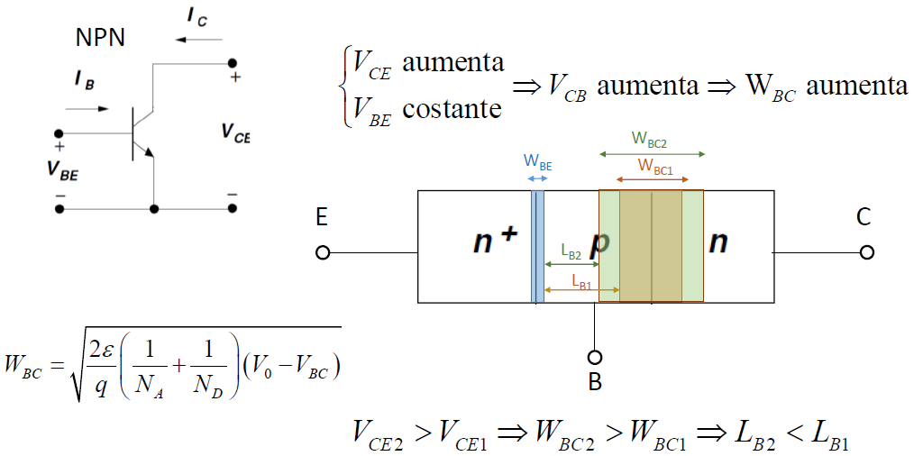
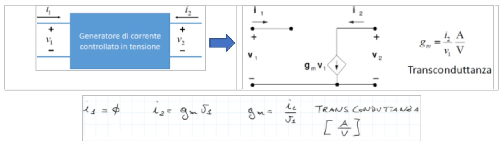
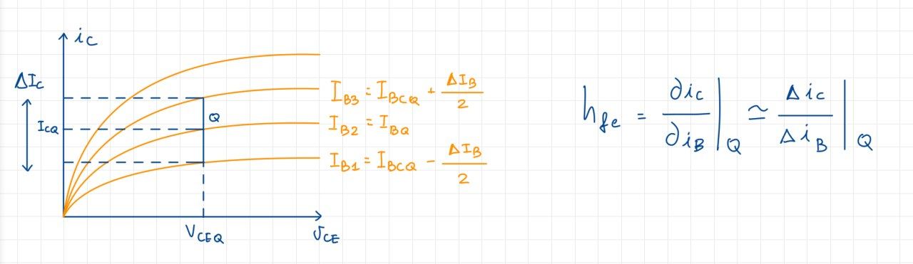
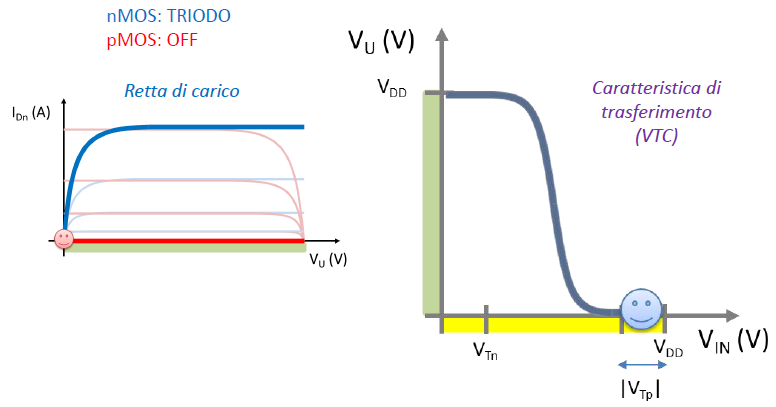
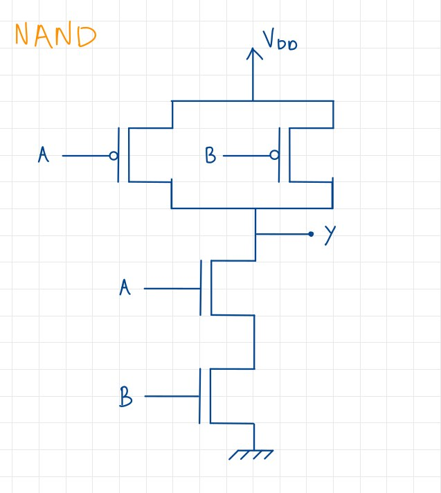
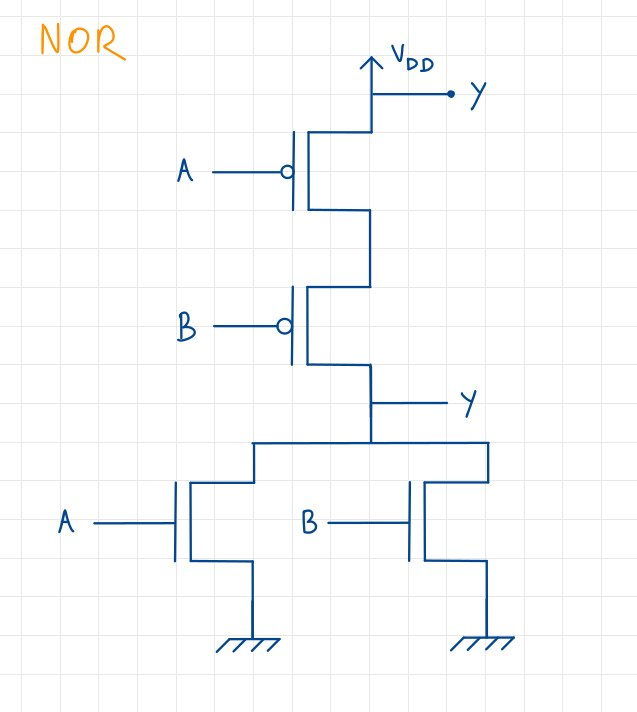
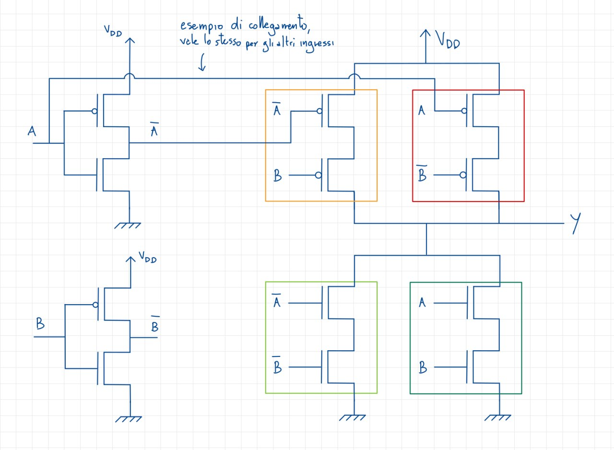
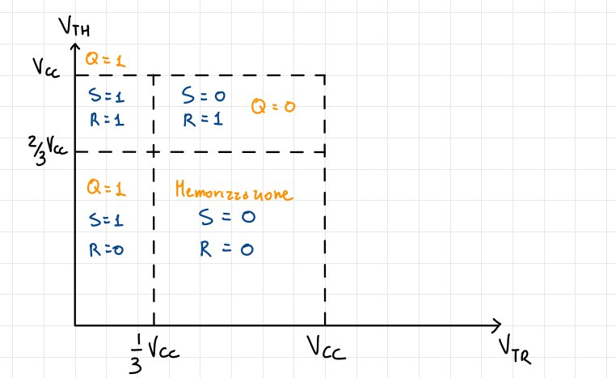
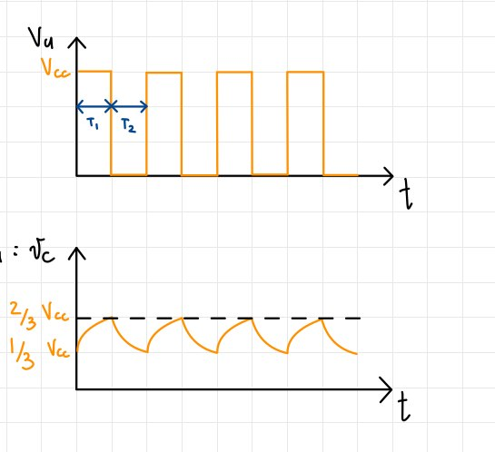

README
======

Ho scritto questi appunti basandomi sul programma 22/23 del corso di
Elettronica, ma non essendoci state variazioni sostanziali negli anni,
dovrebbero essere validi anche per gli anni precedenti e, spero, anche
per quelli successivi.

Per segnalare errori, imprecisioni o per qualsiasi altra cosa, potete
contattarmi su [Telegram](https://t.me/genricoloni): @genricoloni.

I file markdown originali, componenti il documento, sono disponibili in
[**QUESTA**](https://github.com/genricoloni/Appunti-di-Elettronica-Digitale--inginf-UniPi)
repository GitHub: per chi volesse fare direttamente delle correzioni,
può farlo tramite pull request a quella repo, e mi occuperò io di
aggiornare questo file.

In questi appunti non è presente la parte sui convertitori A/D e D/A,
perché ho ritenuto più che valide le [**note messe a disposizione dal
professore**](https://github.com/Guray00/IngegneriaInformatica/blob/master/TERZO%20ANNO/II%20SEMESTRE/Elettronica%20digitale/Dispense%20e%20manuali/note_convertitori_piotto.pdf).

Ringrazio Marco per aver messo a disposizione il suo [**tool di
compilazione**](https://github.com/Guray00/template_lectures) dei file
markdown, Alessandra, Alessandro e Lorenzo per il loro contributo alla
stesura di questi appunti, e Luca per aver condiviso con me i suoi
appunti, che sono stati una delle basi di partenza per la stesura di
questi.

Richiami di chimica
===================

Il modello atomico di Bohr
--------------------------

Il modello di Bohr prevede un nucleo centrale, di carica positiva, e
degli elettroni con carica negativa con un'orbita attorno al nucleo. La
quantità di energia di un elettrone dipende dalla sua distanza dal
nucleo, e queste quantità sono quantizzate. Il livello energetico viene
identificato dal **numero quantico principale** $n$. Viene poi
introdotto il **numero quantico angolare** $l$ che identifica la forma
dell'orbita: questo numero quantico può assumere valori da 0 a $n-1$ e
identifica la forma dell'orbita. Esistono poi il **numero quantico
magnetico** e il **numero di spin**: in particolare quest'ultimo
identifica lo spin dell'elettrone, che può assumere due valori,
$+\frac{+}{2}$ e $-\frac{1}{2}$. Grazie a questi 4 numeri quantici è
possibile identificare univocamente ogni orbita elettronica, poiché non
possono esistere elettroni facenti parte dello stesso atomo con tutti e
4 i numeri quantici uguali: tale principio è chiamato **principio di
Esclusione di Pauli**. Con l'introduzione dei primi concetti di
meccanica quantistica, alcune ipotesi del modello di Bohr non possono
essere considerate valide: in particolare si introduce il concetto di
**orbitale** in sostituzione di quello di orbita. L'orbitale infatti è
una regione di spazio in cui elettroni ad un determinato livello
energetico possono trovarsi con una certa probabilità. Continuano
tuttavia ad essere validi i 4 numeri quantici, anche se viene data una
grande importanza agli **elettroni di valenza**, ovvero gli elettroni
presenti nel livello energetico più esterno, dato che sono quelli che
andranno effettivamente a formare legami con altri atomi.

I tre tipi di legami tra atomo
------------------------------

### Legame ionico

Si verifica tra ioni di carica opposta, dovuto alla mutua attrazione
elettrostatica che si instaura tra un catione e un anione.

### Legame metallico

Si forma tra ioni metallici, tutti gli elettroni di valenza sono liberi
di muoversi nel reticolo metallico di atomi che forma il legame.

### Legame covalente

Legame nel quale ogni atomo mette in compartecipazione gli elettroni
dell'ultimo livello energetico. E' quello che verrà utilizzato per gli
scopi del corso

Proprietà di Resistenza dei materiali
-------------------------------------

Dato un certo materiale di lunghezza $l$ e sezione $s$, definisco
**Resistenza** come $R = \rho \cdot \frac{l}{s}$. L'unità di misura di
$\rho$ è $\Omega \cdot m$, e quella di $R$ è $\Omega$. Talvolta viene
usata anche la **conducibilità**, definita come
$\sigma = \frac{1}{\rho}$ Prendendo come riferimento questa proprietà,
posso dividere in tre categorie i materiali:

-   materiali **isolanti**, nel quale la corrente scorre molto
    difficilmente; hanno valori di $\rho$ maggiori di
    $10^{5} \Omega \cdot cm$;
-   materiali **conduttori**, nel quale la corrente scorre facilmente;
    hanno valori di $\rho$ minori di $10^{-2} \Omega \cdot cm$;
-   materiali **semiconduttori**, nei quali abbiamo che
    $10^{-2} \Omega \cdot cm < \rho < 10^{5} \Omega \cdot cm$.

La differenza di resistenza deriva dal tipo di legami tra gli atomo che
compongono il materiale; il vantaggio dei semiconduttori è che è
possibile variare facilmente il loro valore di $\rho$ tramite
un'operazione di drogaggio. Un esempio è quello del Silicio, che può
diventare $Si O_2$ ed essere perfettamente isolante, o invece essere un
buon conduttore se drogato con altri elementi.

### La conduzione elettrica nei metalli

Un reticolo metallico si presenta in questa forma (per semplicità
rappresentata in due dimensioni):

{width="180px"}

Se non applichiamo potenziali, non avremo alcuna corrente; gli elettroni
sono comunque liberi di muoversi, con una certa velocità detta *velocità
termica* pari a $V_{termica} \approx 10{^7}cm/s$ a temperatura ambiente.
Questo movimento è però casuale, e non corrisponde alla definizione di
**corrente**, che invece è lo **spostamento netto di carica elettrica in
un'unità di tempo**; in un movimento casuale avremo tante cariche che si
spostano in una direzione quante se ne spostano nell'altra. Di
conseguenza anche la media della velocità termica sarà **nulla**. Cosa
cambia quando si applica un campo elettrico? Schematicamente, osserviamo
che gli elettroni si muovono in direzione **opposta** a quella del campo
elettrico.

{width="50%"}

Sperimentalmente si osserva che la media tra la velocità termica e la
velocità dovuta dall'azione del campo elettrico è **non nulla**.

Modello di Drude
================

Il modello di Drude è stato introdotto nel 1900 dall'omonimo Paul Drude,
e descrive con discreta precisione il comportamento dei materiali
conduttori a livello ohmico. Si basa su alcune ipotesi semplificative:

-   l'esistenza di un *gas di elettroni* libero di muoversi,
    equiparabile ad un gas vero e proprio;
-   l'unica forza che agisce tra un urto tra un elettrone e un atomo è
    la forza del campo elettrico;
-   gli urti tra elettroni e atomi sono perfettamente anelastici.

Vengono altresì considerati seguenti parametri:

-   $\vec{E}$, il campo elettrico, è costante;
-   $a$, l'accelerazione degli elettroni, è costante;
-   $\vec{v}$, la velocità degli elettroni, è lineare.

Prendendo in considerazione un singolo elettrone, posso tracciare il
grafico $\frac{V_{elettrica}}{Tempo}$, dove $V_{elettrica}$ è la
velocità dovuta dal campo elettrico, posso fare alcune osservazioni:

{width="350px"}

Notiamo innanzitutto l'interruzione brusca del movimento degli
elettroni: ciò è dovuto agli urti degli elettroni contro gli atomo
presenti nel reticolo; essi sono completamente casuali, come è casuale
la direzione dell'elettrone dopo di esso. La velocità è lineare a causa
dell'azione del campo Elettrico $\vec{E}$ che, come detto, è costante.
Ricavando il valor medio della velocità (nel grafico la linea
orizzontale) si ottiene la **Velocità di Drift**. Essa avrà direzione
**opposta** a quella del campo elettrico e, secondo il modello di Drude,
si calcola a partire dal campo elettrico tramite la formula:
$V_{d} = \mu \cdot E$, dove $\mu$ è la **mobilità** degli elettroni.
Considerando i vettori, otterrò infine
$\vec{V_{d}} = - \mu \cdot \vec{E}$

Calcolo della corrente
----------------------

Prendiamo un considerazione un filo di lunghezza $L$ e sezione $A$.
Definiamo $N$ il numero di **elettroni liberi** e **T** il tempo
impiegato da un elettrone per attraversare il filo. Decidiamo di
osservare la sezione $A$ di filo per un tempo $T$. Per definizione
abbiamo che la velocità degli elettroni sarà $V_{d} = \frac{L}{T}$, e la
corrente sarà $I = \frac{Q}{T}$. La quantità di carica che attraversa la
sezione $Q$ è data da $Q = N \cdot q$, dove $q$ è la carica di un
elettrone ed è pari a $q = 1.6 \cdot 10 ^{-19}$. Quindi:
$I = \frac{N\cdot q}{T}$.

La *densità di corrente* sarà pari a
$J = \frac{I}{A} = \frac{N\cdot q}{T \cdot A}$, ma essendo
$T = \frac{L}{\vec{V_d}}$ otterrò infine:
$J = \frac{N\cdot q \cdot \vec{V_d}}{L \cdot A }$, dove $A\cdot L$ è il
volume del filo. Definisco dunque $n = \frac{N}{Volume}$ come
*concentrazione degli elettroni nel materiale*. Quindi posso riscrivere
la densità di corrente come:

$$J = n \cdot q \cdot \vec{V_d}$$

ottenendo quindi un legame di proporzionalità diretta tra *densità di
corrente* e *campo elettrico*. Questa è anche definita come **Legge
microscopica di Ohm**.

Posso ulteriormente riscrivere la legge di Ohm come
$J = \sigma \cdot \vec{E}$, dove $\sigma$ è la **conducibilità** del
materiale: questo valore dipende ovviamente da $n$ e da $\mu _{n}$; per
valori tipici avremo $n = 10^{21} cm^{-3}$,
$\mu_{n} = 500 \frac{cm^{2}}{V \cdot s}$ e dunque
$\sigma \approx 10^{5} [\Omega \cdot cm]^{-1}$. Prendendo in
considerazione il modello di Drude, tale approssimazione è
effettivamente corretta.

Il Silicio
==========

Il Silicio intrinseco
---------------------

Iniziamo la trattazione introducendo il concetto di materiale
**intrinseco**: un materiale è **intrinseco** se è composto unicamente
da atomi dello stesso elemento. Di conseguenza quando ci riferiremo al
**silicio intrinseco**, staremo considerando un reticolo cristallino
formato unicamente da atomi di silicio, che condividono tutti gli
elettroni dell'ultimo livello energetico in legami covalenti, come
mostrato in figura:

{width="250px"}

Per la trattazione, dovremo fare alcune ipotesi:

-   se $T = 0 K$, allora $n = 0$ e $\sigma = 0$, che sono
    rispettivamente la concentrazione di elettroni e la conducibilità;
-   a $T_{ambiente}$ alcuni elettroni hanno energia sufficiente per
    allontanarsi dai legami, diventando quindi elettroni liberi.

Chiamerò $n_{i}$ la concentrazione di elettroni liberi, e posso
calcolare questo valore come:

$$n{_i}{^2} = B \cdot T^{3} \cdot e ^{-\frac{E_{G}}{K_{B} \cdot T}}$$

dove $B$ è una costante dipendente dal materiale: nel Silicio vale
$1.08 \cdot 10^{31} K^{-3}cm^{-6}$. $E_{G}$ è detta *energia di Gap* ed
è la quantità di energia necessaria per allontanare un elettrone dal suo
legame covalente. Nel Silicio vale $1.12 eV$, mentre $K_{B}$ è la
costante di Boltzmann che vale $8.617 \cdot 10^{-5} \frac{eV}{K}$. A
$T_{ambiente}$, quindi, $n_{i} \approx 10^{10} cm^{-3}$. Notiamo come il
parametro che che fa effettivamente variare questo valore è la
Temperatura, che ha andamento esponenziale. In conclusione, sapendo che
nel Silicio ci sono $5\cdot10^{22} \frac{atomi}{cm^{3}}$, e dunque un
numero di legami covalenti pari a $2\cdot10^{23}$, a temperatura
ambiente abbiamo appena un legame rotto ogni $10^{13}$

### Il concetto di lacuna

Per effetto di un campo elettrico, un elettrone impegnato in un legame
può *saltare* da un legame all'altro, eventualmente per coprire un buco
lasciato da un elettrone che è riuscito a liberarsi dal legame. Posso
considerare il buco dovuto al legame interrotto come una **carica
positiva**, e la chiamerò **lacuna**: avrà una carica uguale ed opposta
rispetto a quella dell'elettrone, e si muoverà in direzione concorde al
campo elettrico.

{width="250px"}

La loro mobilità sarà diversa: indicando con $\mu_{n}$ la mobilità
dell'elettrone, e con $\mu_{p}$ quelle della lacuna, si osserva che
$\mu_{n} \approx 2.5 \mu_{p}$. Nel Silicio questi valori sono
rispettivamente $\mu_{n} = 1350 \frac{cm^{2}}{V\cdot s}$ e
$\mu_{p} = 480 \frac {cm^{2}}{V \cdot s}$. Introduciamo ora la **legge
di azione di massa**: essa sarà valida solo all'equilibrio
termodinamico, e afferma che $n \cdot p = n{_i}{^2}$. Utilizziamo tutti
questi dati per calcolare la conducibilità del Silicio:
$$\sigma = n\cdot q \cdot \mu_{n} + p \cdot q \cdot \mu_{p} = 3 \cdot 10^{-6} \Omega \cdot cm$$
che lo renderebbe un cattivo conduttore. Questo ci porta
all'introduzione del **Silicio drogato**.

Il Silicio drogato
------------------

Un materiale, in genere, si intende *drogato* quando sostituiamo alcuni
suoi atomi dal reticolo intrinseco, inserendo altri atomi appartenenti a
gruppi diversi. Con il Silicio è possibile effettuare due tipi di
drogaggio: sostituzione con atomi del gruppo $V$, o con atomi del gruppo
$III$.

### Drogaggio con atomi del gruppo $V$

Gli elementi più comuni con il quale viene effettuato il drogaggio sono
l'Arsenico $As$, e il Fosforo $P$. Essi posseggono 5 elettroni di
valenza, dunque uno di essi non verrà coinvolto nei legami covalenti.

{width="250px"}

Questo elettrone non coinvolto avrà bisogno di **pochissima** energia
per muoversi, e si aggiunge agli elettroni liberi generati termicamente.
Non rompendo alcun legame, questi elettroni non danno vita a nuove
lacune, sbilanciando quindi il numero di lacune ed elettroni liberi. Gli
atomi del gruppo $V$ sono detti *donatori* perché appunto 'donano' un
elettrone nel reticolo, e diventano degli ioni positivi; la loro
concentrazione viene indicata con $N_{D}$.

### Drogaggio con atomi del gruppo $III$

L'elemento più comuni con il quale viene effettuato questo tipo di
drogaggio è il Boro $B$, che possiede 3 elettroni di valenza; al
contrario del drogaggio con atomi del gruppo $V$, qui manca un legame
per raggiungere l'ottetto, creando artificialmente una lacuna.

Questa lacuna verrà colmata da un altro elettrone che romperà il suo
legame covalente. Gli atomi del gruppo $III$ sono detti *accettori*
perché appunto 'accettano' un elettrone nel reticolo, e diventano degli
ioni negativi; la loro concentrazione viene indicata con $N_{A}$.

Il drogaggio
------------

I valori tipici per $N_{D}$ e $N_{A}$ sono compresi tra
$10^{14} cm^{-3}$ e $10^{19} cm^{-3}$. Dobbiamo però considerare tra
questi atomi, quelli che effettivamente donano o ricevono un elettrone,
e si indicano con:

-   $N_{D}^{+}$: numero di atomi del gruppo $V$ che effettivamente
    donano un elettrone;
-   $N_{A}^{-}$: numero di atomi del gruppo $III$ che effettivamente
    ricevono un elettrone.

Si noti come entrambi i valori siano delle **concentrazioni**, e in
entrambi i casi il numero di elettroni liberi non è più uguale al numero
di lacune. Chiameremo quindi il drogaggio, rispettivamente:

-   **Drogaggio N**, quando $N_{D} > N_{A}$;
-   **Drogaggio P**, quando $N_{D} < N_{A}$.

Calcolo di $p$ ed $n$
---------------------

Questo calcolo è necessario per determinare la conducibilità del Silicio
drogato. Partiamo dal presupposto che la somma delle cariche positive
deve essere uguale a quella delle cariche negative, per la neutralità
dei carica:

$$ (+q)(p + N_{D}^{+}) = (+q)(n + N_{A}^{-})$$

dove $q$ è la carica dell'elettrone. Ricordiamo inoltre la legge di
azione di massa: $n \cdot p = n{_i}{^2}$

### Calcolo nel caso di drogaggio N

Per ipotesi abbiamo $N_{A} = 0$, $N_{D}^{+} = N_{D}$ e
$n \approx N_{D}$, dunque il numero di elettroni liberi è circa uguale
al numeri di quelli drogati: risulterà dunque che
$p = \frac{n{_i}{^2}}{N_{D}}$. Sapendo che
$n_{i}^{2} = 10^{20} cm^{-3}$, ottengo che $p = 10^{2} cm^{-3}$ e
$n = 10^{18} cm^{-3}$. Confrontando questo risultato con quello del
Silicio intrinseco, notiamo che la generazione termica continua
ovviamente ad essere presente, ma viene aiutata in modo significativo
dal drogaggio: ci sono molti più elettroni liberi che possono riempire
più facilmente le lacune. Gli elettroni che predominano, in questo caso
$n$, vengono detto *maggioritari*, mentre in questo caso i $p$ saranno
*minoritari*: abbiamo un semiconduttore di tipo $N$ proprio a causa
dello sbilanciamento a favore degli elettroni.

### Calcolo nel caso di drogaggio P

In questo caso la situazione è la seguente: $p \approx N_{A}$,
$n \approx \frac{n{_i}{^2}}{N_{A}}$. Tramite un esempio numerico vediamo
che $n = 10^{13} cm^{-3}$, $p = 10^{5} cm^{-3}$ e
$N_{D} = 10^{15}cm^{-3}$

Inoltre $\mu_{n} = 1320 \frac{cm^{2}}{V \cdot s}$ e
$\mu_{p} = 460 \frac{cm^{2}}{V \cdot s}$: sono valori leggermente
diversi dai precedenti a causa dell'indebolimento del reticolo dovuto
dal drogaggio.
$\sigma = nq\mu_{n} + pq\mu_{p} = 0.2 [\Omega \cdot cm]^{-1}$, e
$\rho = \frac{1}{\sigma} = 4.7 \Omega \cdot cm$\$

### Considerazioni sul drogaggio

Rispetto al caso intrinseco, la resistività è scesa di 5 ordini di
grandezza, ma quali sono le proporzioni tra gli atomi? Ho inserito
$10^{15} \frac {atomi}{cm^{3}}$, il Silicio ha
$5 \cdot 10^{22} \frac {atomi}{cm^{3}}$, dunque ho inserito un atomo
drogante ogni $10^{7}$ atomi di Silicio. Ne ricavo che il drogaggio del
Silicio ha un effetto molto potente in termini di modifica della
proprietà di resistività di un materiale, e che è possibile variare il
livello di drogaggio per ottenere caratteristiche e proprietà diverse,
adattabili al contesto di utilizzo.

Calcolo della conducibilità al variare della temperatura
--------------------------------------------------------

La formula desiderata è la seguente:
$$\sigma = nq\mu_{n} + pq\mu_{p} = f(T)$$ dove $f(T)$ è una funzione che
dipende dalla temperatura. Andiamo a considerare ogni parametro in modo
separato:

-   q: carica dell'elettrone, $q = 1.6 \cdot 10^{-19} C$, e rimane
    ovviamente identica;
-   $\mu_{n}$ e $\mu{_p}$: mobilità degli elettroni, dipende dalla
    temperatura e dal tipo di drogaggio. Questo perché a temperature
    maggiori, le oscillazioni sono più rapide, aumentando la probabilità
    e la frequenza degli urti tra elettroni e atomi. Nello specifico, la
    mobilità è inversamente proporzionale alla temperatura con un
    fattore pari a $T^{-\frac{3}{2}}$
-   $p$ ed $n$: dipendono principalmente dal tipo di drogaggio.

### Caso con Silicio intrinseco

Abbiamo che $n = p = n{_i}$; sappiamo inoltre che l'aumento della
temperatura T, e dunque l'aumento dell'energia termica, è sufficiente
per rompere alcuni legami covalenti. Ciò porta all'incremento
esponenziale di $n$ e $p$, che prevale dunque sul decremento di
$\mu_{n}$ e $\mu_{p}$: possiamo dunque affermare che $\sigma$ **aumenta
con la temperatura**.

### Caso con Silicio drogato

In questo situazione $n \not = p$.Prendendo il Silicio drogato di tipo
$P$, avremo:

-   $p = N_A = 10^{15} cm^{-3}$, che è un valore costante in quanto
    dipende solo dal tipo di drogaggio;
-   $n = \frac{n{_i}{^2}}{N_A}$, che invece aumenta, dato l'incremento
    di $n{_i}$ con la temperatura.

Ricordando che nell'ultimo caso stiamo parlando di **portatori
minoritari**, essi avranno una concentrazione, e dunque un impatto,
**trascurabile** rispetto ai portatori maggioritari $p$. In sostanza,
avremo un decremento della mobilità, ovvero $\sigma$ **diminuisce con la
temperatura**.

### Considerazioni

E' necessario monitorare i cambi di temperatura nel Silicio, in quanto
essa influisce sul comportamento dello stesso, portando a conseguenza
rilevanti sulle sue stesse proprietà. I cambiamenti di conducibilità, e
dunque della conducibilità, possono essere utilizzati per ottenere
informazioni sulla temperatura del materiale.

Corrente di diffusione
======================

Osserviamo che le cariche mobili si spostano da zone a maggior
concentrazione a quelle con concentrazione minore per agitazione
termica. Questo movimento di cariche causa quella che viene chiamata
**corrente di diffusione**, che esiste proprio a causa della presenza di
questo gradiente di concentrazione di portatori, ed è complementare a
quello della corrente di drift.

Calcolo della corrente di diffusione
------------------------------------

Tracciamo dei grafici con concentrazione come ordinata:

Ricordiamo che $n$ indica la concentrazione di elettroni liberi, e $p$
quella delle lacune, mentre $e$ sono gli elettroni e $h$ le lacune. Il
grafico rappresenta lo spostamento di elettroni e lacune lungo in
gradiente, e la corrente risultante dal fenomeno. Ricordando che $D_{N}$
rappresenta la **densità della corrente di diffusione**, calcoliamo la
corrente di diffusione per gli elettroni:

$$J_{N Diff} = (-q) D_{N} (-\frac{dn}{dx}) = q \cdot D_{N}\frac{dn}{dx} \to \text{corrente negativa}$$

che implica una $J$ negativa. Allo stesso modo, calcoliamo la corrente
di diffusione delle lacune:

$$J_{P Diff} = (+q) D_{P} (-\frac{dp}{dx}) = - q \cdot D_{P}\frac{dp}{dx} \to \text{corrente positiva}$$

### Legame tra $D_{N}$ e $D_{P}$

Assumiamo $D_{N} = 34 \frac{cm^{2}}{s}$ e $D_{P} =12 \frac{cm^{2}}{s}$,
allora vale la **Relazione di Einstein**:

$$\frac{D_{P}}{\mu_{P}} = \frac{D_{N}}{\mu_{N}} = \frac{K_{B}T}{q} = V_{T}$$

$V_{T}$ è **Thermal Voltage**, ovvero la tensione che si genera ad una
data temperatura; a 300K, $V_{T} = 0.0259 V$.

Corrente di diffusione totale
-----------------------------

La corrente di diffusione totale è la somma delle correnti di diffusione
degli elettroni e delle lacune:

$$J_{Diff} = J_{N Diff} + J_{P Diff} = q \cdot D_{N}\frac{dn}{dx} + q \cdot D_{P}\frac{dp}{dx}$$

### Densità di corrente totale

La densità di corrente totale è la somma delle correnti di drift e di
diffusione:

$$J_{Tot} = J_{Drift} + J_{Diff} = q \cdot D_{N}\frac{dn}{dx} - q \cdot D_{P}\frac{dp}{dx} + q\mu_{n}nE + q\mu{P}pE$$

La Giunzione PN
===============

Definizione
-----------

La Giunzione PN è un dispositivo formato da due parti di Silicio
drogato, una di tipo $P$ e l'altra di tipo $N$. Mettendo all'estremo del
dispositivo dei contatti andremo a formare un **diodo**

E' un dispositivo di importanza rilevante perché è *unidirezionale*,
ovvero permetto lo scorrere della corrente **solo in una direzione**, da
anodo ('lato' $P$) a catodo ('lato' $N$).

Analisi senza sollecitazioni esterne
------------------------------------

Analizziamo $V_{AK}$ e $I_{AK}$, ovvero la tensione e la corrente che
scorrono tra anodo e catodo. Senza sollecitazioni esterne, questo non
possono che essere **nulle**. Verifichiamo la correttezza di questa
ipotesi: consideriamo di essere a temperatura a ambiente, che
$N_{A} = P_{p} = 10^{17} cm^{-3}$, $n_{p} = 10^{3} cm^{-3}$,
$n{_N} = 10^{16}cm^{3}$ e $P_{n} = 10^{4} cm^{-3}$.

{width="60%"}

Per diffusione, le lacune $h$ tenderanno a spostarsi dalla zona $P$ alla
zona $N$, mentre gli elettroni avranno comportamento opposto, risultando
comunque in **due correnti con stessa direzione e stesso verso**. Queste
correnti sono però entrambe positive, e farebbero risultare una corrente
interna al dispositivo senza alcuna sollecitazione esterna, il che è
ovviamente **impossibile**. Deve dunque esistere un'altra corrente che
si oppone alla corrente di drift: un'ipotesi è che possa esistere
all'interno della giunzione un **campo elettrico** che possa causare
un'ulteriore corrente che annulli quella di drift. Il campo dovrebbe
essere **necessariamente interno**, in virtù dell'ipotesi di equilibrio
termodinamico che abbiamo fatto.

### Studio del campo elettrico interno alla Giunzione

Ingrandiamo la zona di congiunzione tra la parte P e la parte N:

{width="50%"}

Al momento dell'unione tra le parti P ed N, le lacune come detto si
dirigono verso la parte N, e gli elettroni verso la zona P, per
diffusione, combinandosi gli uni con le altre. Dopo l'unione, il
dispositivo si presenterà in questa forma:

{width="50%"}

La zona $W$ sarà detta **zona di svuotamento**, e ha la peculiarità di
essere composta unicamente da cariche **fisse**, senza alcuna carica
mobile: saranno dunque due zone con **carica netta** positiva e
negativa, in una situazione analoga a quella di un condensatore; di
conseguenza, esisterà un campo elettrico. La zona di svuotamento **NON**
può essere di lunghezza infinita, perché la stessa forma una barriera
energetica che si oppone alla diffusione di cariche libere tra i due
semiconduttori: esse inizieranno a diffondersi, ma arrivati ad un
equilibrio tra la diffusione e tale barriera, il processo di crescita
della zona di svuotamento verrà limitato dato dal fatto che le cariche
non riusciranno ad attraversare tale barriera.

{width="30%"}

Passando ai calcoli, troveremo:

$$Q^{+} = (qN_{D}x_{k}) = Q^{-} = (qN_{A}x_{p})$$

e dunque

$$N_{D}x_{k} = N_{A}x_{p}$$

con $W = x_{k} + x_{p}$. In caso di drogaggi differenti, anche le zone
appariranno differenti, ma la loro area sarà uguale.

### Il potenziale interno

Dalle equazioni dell'elettrostatica, ricordiamo che
$\frac{dE}{dx} = \frac{\rho(x)}{\epsilon}$, quindi l'esistenza del campo
elettrico è garantita. Inoltre, $E = -\frac{d\phi(x)}{dx}$. Guardando il
grafico:

{width="40%"}

Si ricava che esiste una **differenza di potenziale** $V_{0}$ ai capi
della zona di svuotamento, chiamato **potenziale interno**, o **di
built-in**. Questo potenziale è quello che impedisce al processo di
diffusione di continuare in modo indefinito: le lacune si spostano da
$P$ verso $N$, e gli elettroni da $N$ verso $P$, ma entrambi vengono
contrastati nel loro movimento dal campo elettrico. Di fatto, **le
correnti di diffusione vengono contrastate dalle rispettive correnti di
drift**: tramite questa affermazione, dimostriamo il perché la corrente
risulti nulla. Il potenziale interno è calcolabile tramite la seguente
formula:

$$V_{0} = \frac{kT}{q}\cdot ln(\frac{N_{A}N_{D}}{n_{i}^{2}})$$

ed ha un valore generalmente compreso tra $0.6 \div 0.8 V$.

### La barriera di potenziale

Quando una lacuna vuole passare, per diffusione, dalla zona $P$ alla
zona $N$, deve superare una barriera di potenziale, che è la differenza
di potenziale tra la zona $P$ e la zona $N$.

Tuttavia non tutte le lacune hanno abbastanza energia potenziale per
superarla; sono invece favorite in questo processo le **cariche
minoritarie della zona $N$**, ovverosia le lacune generate termicamente
vicino alla zona di svuotamento nella parte $N$, poiché il campo
elettrico è loro favorevole e non le respinge, **generando una piccola
corrente di drift**. Tale corrente di drift deve contrastare una
corrente di diffusione anch'essa piccola, perché la barriera respinge la
maggior parte delle lacune che invece vorrebbe passare. In conclusione,
avremo una corrente di drift che tende a compensare la corrente di
diffusione, e quindi una corrente totale nulla.

Vale invece il discorso opposto per gli elettroni che da $N$ vogliono
passare a $P$: alcuni elettroni che hanno sufficiente energia per
passare la barriera, e alcuni minoritari generati termicamente. La
conclusione è però la medesima: la corrente di drift e quella di
diffusione si equivalgono in verso opposto, risultando in una corrente
nulla. Di conseguenza, annullate tra di loro correnti di drift e di
diffusione per la parte $P$ e la parte $N$, la corrente totale sarà
nulla come da ipotesi.

### Potenziale ai capi del Diodo

Rimane ancora una domanda al quale rispondere: perché la tensione ai
capi del diodo è nulla nonostante abbiamo dimostrato l'esistenza di un
potenziale interno al materiale? Essa risulterà compensata dai
potenziali che si formano al contatto dei semiconduttori e i diodi
metallici esterni, e saranno tali che la somma di questi potenziali sia
nulla.

I principi della termodinamica mi dicono che ai capi del diodo non ho
una differenza di potenziale, perché se così fosse saremmo stati in
grado di ottenere una tensione da un oggetto in equilibrio
termodinamico, potendo quindi ottenere energia senza applicare un
lavoro; ciò è ovviamente impossibile perché violerebbe il secondo
principio della termodinamica. Quindi quello che accade è che il
potenziale $V_{0}$ è solo un potenziale interno al materiale che esso
stesso si è costruito, da cui il nome *built-in*, che è presente
internamente: esso influisce sul comportamento del materiale stesso, e
non è rilevabile dall'esterno. Questo perché anche provando a misurarlo,
avremmo bisogno di contatti, che genererebbero a loro volta zone di
svuotamento quando unite al nostro semiconduttore, che avrebbero a loro
volta cadute di potenziale di segno tale da andare a compensare
esattamente $V_{0}$.

Analisi della Giunzione Polarizzata
-----------------------------------

Applichiamo una tensione, tramite ad esempio un generatore, ai capi dei
contatti metallici del diodo: essa non andrà a modificare le zone
neutre, ma si limiterà a modificare la barriera di potenziale analizzata
in precedenza.

{width="40%"}

A seconda del valore della tensione applicata, in particolare al segno
della stessa, avremo un comportamento diverso del valore della tensione
di *built-in*, come visibile qualitativamente anche dal grafico.

### Potenziale positivo

In questo caso il potenziale tra $P$ ed $N$ **diminuirà**, e con esso
anche la barriera di potenziale. Questo farà sì che la corrente di
diffusione **aumenterà in modo esponenziale**. Possiamo affermare ciò in
virtù del fatto che le lacune che possono andare da $P$ verso $N$
aumenteranno in numero, e così faranno anche gli elettroni che vanno da
$N$ verso $P$; la corrente di drift rimarrà **invariata** perche, anche
se l'intensità del campo elettrico aumentasse, i portatori coinvolti
resterebbero nello stesso, esiguo, numero, a patto di considerare
costante il numero di portatori minoritari generati termicamente, e la
temperatura stessa. Quindi la corrente di diffusione aumenterà, mentre
quella di drift rimarrà uguale. Dunque, avremo che la corrente totale
**non sarà più nulla**: essa **scorrerà da $P$ verso $N$** e varierà
esponenzialmente in base a $V_{0}$

### Potenziale negativo

La situazione è logicamente inversa rispetto al caso precedente: il
potenziale $V_{0}$ andrà ad aumentare, e così farà anche la barriera di
potenziale. Troveremo una diminuzione esponenziale della corrente di
diffusione, che tenderà a 0, mentre la corrente di drift rimane
invariata. La corrente totale risultante avrà un valore compreso tra
$10^{-18}$ e $10^{-9}$, con direzione da $N$ verso $P$.

### La giunzione come oggetto rettificante

Dopo aver considerato il comportamento della giunzione nei casi di
tensione positiva e negativa, possiamo affermare che essa è un **oggetto
rettificante**, in quanto solo quando viene applicata una tensione
positiva avrò una corrente da $P$ ad $N$, dovuta ai portatori
maggioritari; nel caso di tensione negativa risulta infatti una corrente
piccola che scorre da $N$ verso $P$, dovuta ai portatori minoritari. Un
circuito è detto **rettificatore**, o *raddrizzatore* quando trasforma
un segnale alternato in uno unidirezionale, sempre positivo o negativo

### La zona di svuotamento

Anche la zona di svuotamento subisce l'influenza della tensione
applicata ai capi del diodo: la sua larghezza **aumenta in
polarizzazione inversa**, e **diminuisce in polarizzazione diretta**.
Infatti, la barriera di potenziale aumenta perché il campo elettrico è
più intenso, e ciò è dovuto al maggior numero di cariche fisse nella
zona di svuotamento, che non sono più compensate dalle cariche mobili
che si spostano per l'aumento della zona stessa. In generale
l'espressione della larghezza della zona di svuotamento dipende dal
drogaggio e dal potenziale di *built-in*, ed è la seguente:

$$ W = \sqrt{\frac{2\epsilon}{q}\cdot (\frac{1}{N_A} + \frac{1}{N_D})\cdot (V_0 - V_D)}$$

Riassumendo:

-   $V > 0$ : la barriera di potenziale **diminuisce**, e $W$ con essa;
-   $V < 0$ : la barriera di potenziale **aumenta**, e $W$ con essa.

### L'equazione di Shockley per la corrente

La corrente che scorre nel diodo è detta $I_{AK}$, viene scelta in verso
positivo da P verso N, ed è data dall'equazione del **Modello di
Shockley**:

$$I_{AK} = I_S ( e^{\frac{V_D}{\eta V_T}})$$

dove:

-   $V_T = \frac{kT}{q} \approx 26mV @300K$, è la tensione termica ai
    terminali del diodo;
-   $I_S \in [10^{-18} \div10^{-9}]$, è la corrente inversa di
    saturazione;
-   $\eta\in [1 \div2]$, è il fattore di idealità dipendente dai
    materiali.

In conclusione,possiamo affermare che la corrente scorre nel dispositivo
in quantità non trascurabile solo se viene applicato ad esso un
**potenziale positivo** tra Anodo e Catodo, tale da far abbassare la
barriera energetica; quando gli viene applicato un potenziale negativo,
invece, la corrente è si diversa da zero, ma sarà costante e negativa,
in valore trascurabile. Alcuni valori tipici sono riassunti nei seguenti
schemi:

Zone di funzionamento
---------------------

Le **zone di funzionamento** individuano valori di tensione e corrente
tipici che risultano in comportamenti differenti del dispositivo.

Nella giunzione PN, le principali zone di funzionamento sono:

-   **polarizzazione inversa**: $V_D < 0$, il fattore $-1$
    nell'equazione è predominante rispetto all'esponenziale, che risulta
    in $I_D \approx -I_S$. La corrente che scorre è dovuta solamente
    alle componenti di drift e dunque ai minoritari, il che ci fa capire
    che essa sia molto piccola;
-   **polarizzazione nulla**: $V_D = 0$, la corrente è nulla. Grazie a
    ciò ricordiamo che l'equazione del modello di Shockley passa per lo
    0;
-   **polarizzazione diretta**: $V_D > 0$, la corrente è data
    dall'esponenziale, che è predominante rispetto al fattore $-1$.

Riassumendo, abbiamo questi comportamenti:

{width="50%"}

Il fenomeno del Breakdown
=========================

Tra le zone di comportamento elencate precedentemente ne abbiamo escluso
una, che è quella della **forte inversione**: si verifica quando
$V_D << 0$, e la corrente inversa aumenta in modo repentino; solitamente
si verifica per $V_D < 70 V$. Quando il diodo è polarizzato in inversa,
abbiamo già visto come la zona $W$ aumenti, coì come aumenta il campo
elettrico ai capi della stessa e la barriera di potenziale: i portatori
non possono più passare così facilmente la barriera, mentre le correnti
di drift restano piccole. Questo perché solo i portatori minoritari
possono passare la giunzione metallurgica, sfruttando il campo elettrico
favorevole, ma abbiamo il solito limite che i portatori minoritari sono
pochi, e quindi la corrente è piccola. Quindi, per tensioni elevate,
deve esistere un fenomeno che **aumenti il passaggio di portatori
attraverso la giunzione**. Questo fenomeno è chiamato **breakdown**, e
si compone di due fenomeni separati.

Effetto Zener
-------------

In questo caso l'aumento di portatori è legato all'aumento
dell'intensità del campo elettrico. Esso infatti diventa tale da
**rompere alcuni legami covalenti** all'interno della zona di
svuotamento. Si generano dunque nuovi elettroni liberi e lacune che,
trovando un campo elettrico favorevole al passaggio, determineranno un
aumento della corrente.

### Influenza della temperatura sull'effetto Zener

Una temperatura maggiore implica maggiore energia degli elettroni, per
cui è più semplice rompere i legami covalenti. In sostanza, alte
temperature amplificano l'effetto Zener. A parità di corrente, dunque,
la $V_{Br}$, ovvero la **tensione di Breakdown**, diminuisce.

Effetto a valanga
-----------------

Questo effetto implica che alcuni portatori minoritari acquisiscano,
tramite l'elevato campo elettrico, un'energia tale da rompere un legame
covalente quando essi si scontrano contro un atomo, portando alla
formazione di nuove coppie *elettrone-lacuna*. Tale processo si chiama
**processo di ionizzazione dell'atomo**. Il nome deriva dal fatto che,
dopo un urto e la formazione di una coppia *elettrone-lacuna*, entrambi
questi elementi vengono accelerati: essi urteranno altri atomo, formando
a loro volta nuove coppie *elettrone-lacune*,e così via; questo fenomeno
viene anche alimentato dalla forte intensità del campo elettrico.

{width="50%"}

### Influenza della temperatura sull'effetto a valanga

All'aumentare della temperatura, i portatori hanno un'energia minore
dopo un urto, per cui diventa più difficile per loro rompere altri
legami. Tuttavia, aumentando la temperatura, aumenteranno anche le
vibrazioni degli atomi, per cui la frequenza di urti tra elettroni e
atomi aumenterà. Quindi a parità di corrente, la $V_{Br}$ deve
aumentare.

Considerazioni in relazione alla generazione termica
----------------------------------------------------

I due effetti sopra presentati si vanno a sommare alla generazione
termica già presente, la quale diventa trascurabile rispetto ad essi; in
generale il breakdown aumenta all'aumentare della tensione, fino al
punto in cui le correnti inverse **non sono più trascurabili**. Infine,
non è generalmente possibile sapere quale dei due effetti è
preponderante in confronto all'altro.

I diodi Zener
=============

Nei diodi visti fino ad ora, il fenomeno del breakdown si presentava
solamente per tensioni inverse particolarmente elevate; esiste tuttavia
una categoria specifica di diodi che permette che questo fenomeno si
verifichi anche a tensioni con modulo molto basso, nell'ordine di una
decina di Volt. Questi dispositivi sono chiamati **diodi Zener**, e in
essi si verificano entrambi i fenomeni del breakdown visti in
precedenza, ma a **tensioni diverse**:

-   nei diodi con $|V_{Br}| > 7V$, predomina **la moltiplicazione a
    valanga**;
-   nei diodi con $|V_{Br}| < 5V$, predomina **l'effetto Zener**;
-   nei diodi in cui $5V < |V_{Br}| < 7V$, **si verificano entrambi i
    fenomeni**.

Caso di correnti elevate
------------------------

C'è un'ulteriore zona di funzionamento che dovremo considerare: quella
in cui $V_{D} \gg 0$; in questo caso avremo delle correnti **molto
elevate**, tali da non poter più trascurare gli effetti delle resistenze
in serie.

Durante la trattazione delle giunzioni PN, abbiamo giustamente
ipotizzato che tutta la tensione applicata dall'esterno **cadesse ai
capi della zona di svuotamento**, e abbiamo trascurato le cadute di
potenziale nelle zone neutre; in realtà esse hanno una certa resistenza,
minore di $1\Omega$, che diventa non trascurabile quando in esse scorre
una corrente abbastanza elevata. Di conseguenza, la tensione efficace
che vediamo applicata alla barriera di potenziale è **più piccola** di
quella che abbiamo applicato all'esterno; essa sarà $V_D$ **meno** la
caduta di potenziale sulle resistenze delle zone neutre.

{width="60%"}

Ciò vuol dire che all'aumentare della tensione, la corrente aumenta
ancora meno di quanto ci aspettassimo. Se per valori di tensione
trascurabili il modello di Shockley rappresenta correttamente
l'andamento della tensione, ciò non è vero per tensioni non più
trascurabili:

Simboli circuitali dei diodi Zener
----------------------------------

I diodi Zener sono rappresentati con un simbolo specifico, che è una
variante del simbolo dei diodi normali:

{width="50%"}

Metodi risolutivi per circuiti con diodi
========================================

Per la risoluzione dei circuiti con diodi dovremmo scegliere dei modelli
che presentano delle assunzioni e delle semplificazioni: in questo
paragrafo verranno illustrati ed eventualmente dimostrati.

Assunzione della tensione
-------------------------

La caratteristica che andremo ad utilizzare nelle nostre applicazioni è
rappresentata nel seguente grafico:

{width="50%"}

Non andremo mai a prendere in considerazione l'effetto delle alte
correnti, mentre terremo a mente le tensioni di breakdown: questo perché
non saranno rari i circuiti in cui sono presenti anche **Diodi Zener**.

La caratteristica è **molto verticale**, dunque ne prenderemo una di
riferimento pari a $V_{\gamma} = 0.7V$: se la tensione del diodo sarà
inferiore a tale valore, assumeremo che non vi passerà alcuna corrente;
di contro se dovesse essere superiore allora la corrente vi scorrerà.
Ovviamente si tratta di una **ipotesi semplificativa**, in quanto anche
per tensioni minori del nostro valore di riferimento ci sarà della
corrente che scorre, ma ciò non influisce sulle nostre considerazioni.

Anche considerare la caratteristica come *verticale* è
un'approssimazione: durante le considerazioni che faremo sui circuiti
questa ipotesi può essere assunta senza ledere la generalità della
trattazione, ma è opportuno ricordare come questa sia una convenzione
che potrebbe non aderire sempre alla realtà.

Il modello matematico
---------------------

E' opportuno notare come il diodo abbia generalmente il legame tra
correnti e tensione **non lineare**. Cosa implica ciò? Proviamo a
vederlo risolvendo un circuito molto semplice.

### Risoluzione guidata di un circuito

Il circuito preso in considerazione è il seguente:

{width="50%"}

Come suggerisce la figura, **le leggi di Kirchhoff continuano a valere
anche in presenza di elementi non lineari**. Scrivo dunque le equazioni
alla maglia costruisco il mio sistema le cui incognite sono $I_D$ e
$V_D$. Tuttavia è possibile solo una **risoluzione numerica** dello
stesso, perché mi trovo di fronte ad equazioni trascendenti. Infatti,
sostituendo la $f(V_D)$ con l'equazione di Shockley, ottengo:

$$V_{AA} = RI_S \cdot (e^{\frac{V_D}{V_T}} - 1) + V_D$$

L'equazione non è di per sè sbagliata, ma è **trascendente** e quindi
non è possibile risolverla analiticamente. Per risolvere il circuito,
dovremmo quindi ricorrere a un metodo iterativo.

Metodo grafico
--------------

Posso pensare di risolvere il medesimo circuito utilizzando un metodo
grafico. visto che conosco la caratteristica del diodo. Inoltre conosco
$V_A$ ed $R$, dunque posso disegnare l'equazione alla maglia sullo
stesso grafico. Scrivo $I_D$ in funzione di $V_D$, ottenendo dunque una
retta a pendenza negativa che interseca rispettivamente l'asse delle
ascisse in $V_A$, e l'asse delle ordinate in $\frac{V_A}{R}$. Questa
retta prende il nome di **retta di carico**, perché dipende dal carico
sul diodo, composto da elementi circuitali esterni allo stesso, come ad
esempio generatori di tensione o resistenze del circuito. In effetti
questa equazione dipende **unicamente** dalla prima equazione di
Kirchhoff.

{width="80%"}

In rosso abbiamo l'equazione trascendente oggetto di studio:
l'intersezione tra tale curva e la nostra retta di carico è formata
dalle soluzioni del nostro problema, è il **punto Q**, detto anche punto
**di lavoro** o **di riposo**, le cui coordinate sono $I_{DQ}$ e
$V_{DQ}$. Esse costituiscono rispettivamente la corrente che scorre
attraverso il diodo, e la tensione ai suoi capi in quelle specifiche
condizioni di lavoro.

Questo metodo **non è approssimato**, ed è molto utile in quanto ci
permette di visualizzare come si comporta il diodo al variare di alcuni
parametri. Ad esempio, se la resistenza del circuito precedente avesse
assunto valori differenti:

{width="55%"}

Allo stesso modo, se a variare fosse stata la tensione:

{width="60%"}

Questo metodo porta però con sè anche degli svantaggi: come mi comporto
in presenza di più diodi? Il metodo diventerebbe inattuabile. Inoltre il
metodo funziona solo per quel particolare diodo con quelle specifiche
caratteristiche: prendendo due dispositivi nominalmente identici ottengo
comunque caratteristiche diverse. Giungiamo quindi alla conclusione che
il metodo grafico è inutilizzabile dal punto di vista pratico: è
sicuramente utile per visualizzare semplici situazioni e dal punto di
vista didattico, ma è impraticabile per ottenere funzioni più o meno
precise di tensioni e correnti ai capi del diodo.

I modelli per grandi segnali
----------------------------

Sono metodi di analisi che sfruttano un **modello approssimato** del
diodo; rinunciando ad avere un risultato **esatto**, avremo un'analisi
veloce e con errori molto piccoli.

### Modello a caduta di tensione costante

Consiste nell'approssimare la caratteristica del diodo con una retta
perfettamente verticale, che intercetta l'asse delle ascisse in un punto
chiamato $V\gamma$: considererò la corrente come **nulla** per
polarizzazioni, anche positive, minori di questo valore $V\gamma$. Posso
dunque sostituire il mio diodo, durante lo studio del circuito, con:

-   un **generatore di tensione** di valore $V\gamma$, se
    $V \ge V\gamma$;
-   un **circuito aperto**, se $V < V\gamma$.

Il valore di $V\gamma$ è, per convenzione, $0.7 V$.

{width="50%"}

### Modello del diodo ideale

Questo modello riprende parte di quello precedente, ma inserisce
un'ulteriore semplificazione: il diodo verrà considerato come un
**interruttore**, aperto o chiuso.

{width="70%"}

Questo perché il modello considera come **trascurabile** la tensione del
diodo, che per le nostre assunzioni vale $V\gamma = 0.7V$, rispetto a
tutte le altre tensioni impiegate nel circuito. L'interruttore, come il
diodo, consente lo scorrere della corrente **in un solo verso**, da
Anodo verso Catodo.

### Modello lineare a tratti

Questo modello è in realtà il meno approssimato tra quelli per i grandi
segnali: innanzitutto la caratteristica non viene più considerata
verticale, ma sarà una retta con una certa pendenza. Dal punto di vista
circuitale, posso sostituire il diodo con un **circuito aperto**, o come
una **resistenza in serie ad un generatore di tensione**.

{width="70%"}

Questo modello complica il circuito, anche perché non è noto il valore
di $R_f$ e $V_f$, che vengono approssimati rispettivamente a $20\Omega$
e $0.65V$. In virtù delle difficoltà che inserisce nell'analisi del
circuito, questo modello non viene usato poiché altri modelli ottengono
risultati molto simili a questo, ma con uno sforzo computazionale
sicuramente minore.

Esempio di analisi di un circuito con diodi
-------------------------------------------

Utilizzeremo uno alla volta tutti i modelli per grandi segnali, in modo
da poter apprezzare le differenze tra di essi, seguendo una procedura
comune.

### Procedura per la risoluzione di circuiti con il modello per grandi segnali

-   Ipotizzo lo stato di ciascun diodo, che può essere in **conduzione**
    o in **interdizione**;
-   Sostituisco ciascun diodo con il modello corrispondente;
-   Risolvo il circuito semplificato;
-   Verifico la correttezza delle ipotesi iniziali per **ciascun
    diodo**:
    -   se tutte sono verificate, allora ho ottenuto una soluzione
        corretta;
    -   se anche solo una delle ipotesi è errata, allora bisogna
        cambiare l'ipotesi, risolvere nuovamente il circuito ne
        ri-verificare la correttezza della nuova ipotesi, fino ad
        ottenere un risultato accettabile

Sto inserendo nel circuito un'importante semplificazione, dunque devo
**dimostrare** la sua correttezza ad ogni utilizzo, dopo la risoluzione
dello stesso. Una volta dimostrata la correttezza delle ipotesi, allora
sarò certo anche della correttezza del risultato ottenuto: il diodo ha
un'espressione **non lineare** e **monotona**, e l'Analisi Matematica ci
dice che in presenza di un sistema con un'equazione come quella del
diodo, allora esiste una soluzione dello stesso, ed è unica. Con
*correttezza delle ipotesi* si intende che, se il diodo fosse il
conduzione, allora avrei una corrente che scorre su di esso. Di contro,
se il diodo fosse interdetto, dovrei verificare che il diodo sia
polarizzato in inversa. Può essere utile, per la verificare delle
ipotesi, ricordare questo schema:

### Risoluzione con modello a caduta di tensione costante

{width="60%"}

E' importante effettuare la **verifica** dell'ipotesi del modello: in
questo caso devo verificare che la corrente che scorre sul diodo sia
**positiva**. Abbiamo ottenuto un valore di $I_D = 4.3 mA$, che verifica
l'ipotesi.

### Risoluzione con modello del diodo ideale

Anche in questo caso l'ipotesi è verificata, anche se il valore ottenuto
è differente rispetto a quello ottenuto con il modello precedente:
$I_D = 5mA$

{width="60%"}

### Risoluzione con modello lineare a tratti

E' opportuno ricordare che la tensione $V_D$ ai capi del diodo sia
$V_{AK}$, e non $V_\gamma$ vista la presenza della resistenza.

{width="60%"}

Anche in questo caso, l'ipotesi è verificata in quanto ottengo un valore
di $I_D = 4.265mA$.

Considerazioni sull'efficacia sui modelli
-----------------------------------------

Nella tabella seguente abbiamo un riassunto con tutti i risultati
ottenuti dai vari metodi:

Ovviamente consideriamo il metodo esponenziale come **risultato
corretto** e di riferimento:

-   il **metodo grafico** produce dei buoni risultati, ma deve
    necessariamente disporre delle caratteristiche del dispositivo;
-   il **modello a caduta costante** presenta una buona approssimazione
    generale;
-   il **modello del diodo ideale** ha un risultato più approssimato, ma
    comunque accettabile se $V_\gamma$ è effettivamente trascurabile;
-   il **modello lineare a tratti** è il più preciso, ma presenta
    un'analisi più complicata che non compensa il grado di precisione,
    anche in confronto ad altri metodi.

In conclusione, determiniamo che il **modello a caduta costante** sia il
miglior compromesso tra semplicità dello stesso e accuratezza del
risultato prodotto.

Circuiti con diodi
==================

Esistono una serie di circuiti che sfruttano i diodi per operazioni
particolari, come ad esempio ottenere una tensione continua partendo da
quella alternata. Procederemo con l'analisi di q+alcuni di essi tramite
i modelli per grandi segnali visti nel capitolo precedente.

Circuito rettificatore
----------------------

Viene chiamato anche **circuiti a raddrizzatore di singola semi-onda**:
è un circuito che **blocca** la tensione negativa.

La tensione di rete ha un valore efficace di circa $230V$, con un valore
massimo pari a $V_M = 230\cdot \sqrt{2} \approx 300 V$, rispetto al
quale una tensione di $0.7V$ è del tutto trascurabile: possiamo dunque
utilizzare anche il modello del diodo ideale.

### Circuito rettificatore con il modello del diodo ideale

{width="90%"}

Utilizzando tale modello, verifichiamo il comportamento di $V_{AK}$,
ovvero la tensione ai capi del diodo, all'interno di ogni semi-periodo.
Nel primo la tensione $V_S$ è positiva, dunque l'anodo è collegato ad
una tensione positiva, quindi posso ipotizzare che il diodo sia in
conduzione, sostituendolo dunque con un cortocircuito.

In queste condizioni otteniamo che la caduta ai capi della resistenza è
$V_S$, e la corrente $I_D$ che scorre tra Anodo e Catodo è positiva.
Siamo in grado di dire ciò perché sia $V_S$ che $R_L$ sono positive, e
dunque il loro rapporto non può che essere positivo, dunque la nostra
ipotesi iniziale è verificata. Notiamo inoltre che la tensione in
ingresso è uguale alla tensione in uscita.

Nel secondo periodo la situazione è molto diversa:

Il periodo considerato va da $t_1$ a $t_2$, nel quale la $V_S$ è
negativa: è legittimo pensare che il nostro diodo sia in interdizione, e
che possiamo dunque sostituirlo con un circuito aperto. Verifichiamo la
nostra ipotesi verificando che $V_{AK} = V_S - V_U < 0$. La tensione in
uscita è quindi nulla: riassumiamo il comportamento per $T_!$ e $T_2$ in
questo grafico:

### Circuito rettificatore con il modello a caduta di tensione costante

{width="70%"}

C'è una differenza sostanziale tra i due modelli nel primo semi-periodo:
vediamo quale. Ipotizziamo nuovamente che il diodo sia in conduzione, e
sostituiamolo con un generatore di tensione: notiamo subito che la
tensione in uscita differisce da quella in entrata per una quantità
uguale a quella del generatore inserito al posto del diodo. Questa
differenza può essere più o meno impattante a seconda della tensione
nella rete: nell'ordine del centinaio di Volt è sicuramente
trascurabile, al contrario se ne valesse pochi, l'errore sarebbe enorme.
Esiste anche un'altra differenza: l'ipotesi di conduzione è valida se e
solo se $V_S \ge V_{\gamma}$. Questo porta ad una differenza anche nella
forma d'onda, in quanto ci sarà un **ritardo** tra il momento in cui la
tensione in ingresso risulta maggiore di zero e quello in cui il diodo
inizierà a condurre: in questo tempo la tensione in ingresso non supera
$V_{\gamma}$, non entrando dunque in conduzione. Questo fenomeno si
presenta anche alla fine del periodo, cioè se il diodo smette di
condurre prima.

{width="50%"}

L'analisi nel secondo semi-periodo è identica a quella del modello
precedente, pertanto non verrà discussa. In conclusione, affermiamo che
con questo modello c'è comunque una rettificazione, ma viene tagliata
anche una parte dell'onda positiva. Posso anche calcolare il ritardo con
il quale il diodo entra in conduzione con questa formula:

$$t^* = \frac{1}{\omega} \cdot asin (\frac{V_{\gamma}}{V_M})$$

Dopo aver calcolato $t^{*}$, in base al valore che ottengo potrò poi
dire se è un tempo accettabile: se lo è allora la trattazione con il
diodo ideale può andar bene, altrimenti vuol dire che è meglio usare il
modello caduta costante; dipende quindi dal tipo di applicazione.

Il PIV
------

Questo circuito, come i successivi che analizzeremo, funziona
correttamente solo se il diodo rimane effettivamente **interdetto** per
tutto l'intervallo di non conduzione. Seppur vero che se abbiamo una
tensione negativa, allora il diodo è interdetto, è altrettanto vero che
se la tensione inversa supera un certo valore, allora il diodo **può
andare in breakdown**, e condurre una corrente non più trascurabile.
Devo dunque scegliere diodi che abbiano una tensione di breakdown
maggiore della massima tensione inversa al quale il diodo può essere
sottoposto. Il parametro che tiene conto di questo fenomeno è il **PIV**
(Peak Inverse Voltage), ed è appunto la tensione inversa massima che
verrà applicata al diodo. Nel caso di un circuito rettificatore come
quello precedente, $PIV = V_M$.

Rivelatore di picco ideale
--------------------------

Si basa sul circuito del paragrafo precedente, ma sostituisce la
resistenza con un **condensatore**:

{width="80%"}

Ipotizziamo che all'istante $t_0$ il condensatore sia scarico e che il
diodo sia in conduzione: useremo il modello del **diodo ideale**, quindi
il diodo diventerà un cortocircuito, con $V_U = V_S$. Notiamo però che,
una volta arrivato al valore di picco, il diodo **smette di essere in
conduzione**. occorre spiegare questo fenomeno. La corrente che scorre
nel diodo deve necessariamente essere positiva, ma essa è la stessa che
scorre nel condensatore. Dato che $i_C = C \frac{dV_U}{dt}$ devo
verificare che la derivata di $V_U$ per verificare l'ipotesi. Essa però
è uguale a $V_S$ poiché al posto del diodo c'è un cortocircuito: essa
sale, raggiunge il picco ed inizia a diminuire. Dal momento in cui
inizia la discesa, la derivata inizia ad essere negativa, e dunque
l'ipotesi non sarebbe più verificata. Esiste una spiegazione circuitale
a questo avvenimento: il condensatore è un dispositivo che immagazzina
carica elettrica, per cui esso inizierà a caricarlo fino a raggiungere
il valore di picco. Una volta avvenuto ciò, esso dovrebbe iniziare a
scaricarsi 'rilasciando' la carica in **direzione opposta.** Questo non
accade a causa del diodo, che **vieta lo scorrere della corrente** in
direzione opposta, quindi la carica rimane nel condensatore, facendolo
rimanere fino al valore massimo. Quando raggiungiamo il massimo della
carica, il diodo **entra in interdizione**, diventando di fatto un
circuito **aperto**; il condensatore non è in grado di scaricarsi perché
non è presente un carico sul quale può farlo, mantenendo quindi la
carica fino al valore di picco con una differenza di potenziale pari a
$V_S$. Il diodo tornerà in conduzione quando la tensione all'Anodo sarà
maggiore di quella al Catodo: in questo caso ciò non può avvenire perché
la tensione al catodo rimarrà costante a pari proprio a $V_S$.
Analizziamo brevemente il **PIV**: il caso peggiore è quando
$V_S = - V_M$, dove avremo $V_A = - V_M$, mentre $V_K$ rimarrà fissa
grazie al condensatore.

Il dispositivo di fatto è in grado di generare una tensione continua,
tuttavia è inutilizzabile nella pratica perché, nel caso reale, vorrei
sfruttare questa tensione su un carico. Un circuito con un carico verrà
analizzato nel prossimo paragrafo.

Circuito rettificatore con filtro RC
------------------------------------

Limitiamoci ad aggiungere una resistenza in parallelo al condensatore,
per simulare un carico:

Quando è in conduzione, il diodo è in cortocircuito, quindi $V_U$ è pari
a $V_S$. Una volta che il picco viene raggiunto, il diodo entrerà in
interdizione, ma a differenza del caso precedente, il condensatore è in
grado di scaricarsi sulla resistenza: la tensione $V_U$ non rimarrà pari
a $V_M$, ma diminuirà **esponenzialmente** in funzione di
$e^{-\frac{t}{RC}}$.

Il diodo tornerà in conduzione quando la tensione sull'Anodo tornerà
maggiore della tensione sul catodo, che ricordiamo sta diminuendo
esponenzialmente: il generatore di tensione riprenderà a caricare il
condensatore fino a che, nuovamente, non tornerà al picco quando il
diodo entrerà nuovamente in interdizione, e così via. Tolto l'istante
iniziale, una volta andato a regime, il diodo condurrà solo in
brevissimi intervalli di tempo, in cui il generatore rifornisce il
condensatore della carica che ha perso.

Alcune osservazioni: il condensatore è ora in grado di scaricarsi
proprio perché il diodo è spento, se il diodo non si interdicesse la
curva blu andrebbe a seguire la curva rossa, quindi in questo circuito è
**necessaria** la presenza del diodo; inoltre è vero che la curva non è
costante, ma ci si avvicina molto. La sua oscillazione si chiama
**ripple**, ed è appunto data dalla differenza tra la tensione di picco
e quella minima al condensatore. In questo caso, il **PIV** non è
esattamente $2V_M$, ma viene comunque approssimato a quel valore.

Il circuito ideale è senza dubbio migliore, ma è inutilizzabile nella
pratica proprio a causa dell'assenza di carico. Se il condensatore è
molto grande rispetto a $R$, la scarica risulterà molto lenta e dunque
trascurabile. Questo circuito, essendo molto economico, è spesso
utilizzato in applicazioni a basso costo dove non è necessario un'alta
qualità.

Circuiti con trasformatori
==========================

Introduzione: il trasformatore
------------------------------

Il trasformatore è il dispositivo che andremo ad utilizzare per
collegarci alla rete elettrica; questo collegamento avviene tramite
isolamento galvanico per questioni di sicurezza, in modo da non avere il
resto del circuito secondario direttamente collegato alla rete
elettrica.

Il trasformatore è un dispositivo che permette di trasformare una
tensione in un'altra, mantenendo la stessa corrente. Questo è possibile
grazie alla legge di Faraday, che ci dice che la variazione di un campo
magnetico genera una variazione di tensione elettrica. Per convenzione
si considerano le correnti$I_1$ e $I_2$, entranti nel contrassegno, come
positive.

Il segno negativo implica che se $I_1$ è entrante, allora la $I_2$ deve
essere uscente; si ha inoltre $\frac{V_2}{V_1} = \frac{N_2}{N_1}$.

Raddrizzatore a doppia semi-onda
--------------------------------

Il raddrizzatore a doppia semi-onda è un circuito che permette
*invertire* il lobo negativo della tensione sinusoidale, ottenendone uno
**positivo**. Il suo circuito varia leggermente a seconda degli elementi
circuitali utilizzati, e così farà anche l'andamento della tensione
invertita.

### Raddrizzatore a doppia semi-onda con trasformatore a presa centrale

In questa tipologia il **condensatore è assente**, e si basa sul
trasformatore **a presa centrale**: si tratta di un trasformatore con un
circuito primario e **due secondari**. Dal punto di vista pratico, sono
presenti due avvolgimenti con lo stesso numero di spire, tale che la
tensione agli stessi sia uguale tra di loro,; sono inoltri presenti due
diodi e una resistenza.

Sappiamo che $V_1$ è una **tensione sinusoidale**, e ciò implica che
anche $V_A$ e $V_B$ lo sono.

#### Primo semi-periodo

Nel **primo semi-periodo** le due tensioni $V_A$ e $V_B$ sono
**positive**: $D_1$ ha l'Anodo collegato al polo positivo di $V_A$,
dunque è ragionevole ipotizzare che $D_1$ sia in **conduzione**. Di
contro, $D_2$ ha l'Anodo collegato al polo negativo di $V_B$, dunque
sarà **interdetto**. Sostituiamo $D_1$ e $D_2$ rispettivamente con un
cortocircuito e un circuito aperto; la tensione in uscita sarà dunque
$V_U = V_A > 0$.

Verifichiamo brevemente le ipotesi: $I_{AK1} = \frac{V_U}{R_L}$, ma
essendo $V_A>0$, allora $I_{D1}>0$.Per quanto riguarda $D_2$, avrò una
tensione pari a $-V_B < 0$, che conferma la bontà dell'ipotesi.

#### Secondo semi-periodo

Ora osserviamo che sia $V_A$ che $V_B$ sono **negative**; si presenta
una situazione speculare rispetto al primo semi-periodo, in cui $D_1$ è
interdetto e $D_2$ è in conduzione. Sostituiamo $D_1$ e $D_2$
rispettivamente con un circuito aperto e un cortocircuito; la tensione
in uscita sarà dunque $V_U = V_B > 0$.

La verifica delle ipotesi è analoga a quella del primo semi-periodo:
$I_{AK2} = \frac{V_U}{R_L}$, ma essendo $V_B>0$, allora $I_{D2}>0$. Per
quanto riguarda $D_1$, avrò una tensione pari a $V_A < 0$, che conferma
la bontà dell'ipotesi, in quanto $V_A$ è ora negativa.

#### Considerazioni

Sia nel primo che nel secondo semi-periodo abbiamo una $PIV = 2V_M$,
poiché somma di due tensioni che al massimo valgono $V_M$; inoltre sulla
resistenza scorrerà una corrente che avrà sempre lo **stesso verso**.
L'andamento della tensione in uscita è indicato nel grafico:

{width="40%"}

### Raddrizzatore a doppia semi-onda con condensatore

Stavolta il condensatore è presente, ed è in parallelo con la resistenza
di carico. Il circuito è il seguente:

{width="60%"}

#### Funzionamento

Il comportamento del circuito è del tutto **identico** a quello del
primo semi-periodo del raddrizzatore a doppia semi-onda con
trasformatore a presa centrale, ipotizzando che il comportamento dei
diodi rimanga invariato per tutto il semi-periodo. La prima differenza
si manifesta subito dopo l'arrivo del picco di tensione, ovvero quando
la tensione sul condensatore è maggiore di $V_A$. Quest'ultima inizierà
a diminuire, e contemporaneamente il condensatore inizierà a scaricarsi
sulla resistenza di carico. Potremo pensare che il processo di scarica
sia identico a quello del circuito rettificatore, ma in realtà qualcosa
cambia: il periodo di scarica **dura la metà**, perché il condensatore
riprende a caricarsi nel semi-periodo successivo. Questo implica che, a
parità di parità di parametri del filtro $RC$, la **tensione di ripple
sarà minore**. Essa avrà dunque questo andamento:

#### Osservazioni

-   La tensione $PIV$ continua a valere $2V_M$, dunque risulta essere
    indipendente dalla presenza del condensatore o dalla sua capacità;
-   questi dispositivi sono genere più cari;
-   questa tipologia di dispositivi è molto ingombrante, e quindi non è
    adatto per applicazioni mobili.

Raddrizzatore a ponte di Graetz
-------------------------------

E' un dispositivo che raddrizza la tensione alternata senza bisogno del
doppio circuito secondario; il suo schema circuitale è il seguente:

### Analisi del circuito senza condensatore

Per semplicità non considereremo il condensatore durante l'analisi, per
il fatto che introdurrà lo stesso effetto di **livellamento** della
tensione già osservato in precedenza.

Ipotizziamo che durante la semi-onda positiva di $V_2$ i diodi $D_1$ e
$D_3$ siano in conduzione, mentre $D_2$ e $D_4$ siano interdetti, e
sostituiamo con corti e aperti dove necessario. Otterremo:

Si noti come sia in $D_1$ che $D_3$ vi scorra corrente positiva, e come
la tensione ai capi di $D_2$ e $D_4$ sia pari alla tensione in uscita
dal trasformatore, ma cambiata di segno: essendo questa originariamente
positiva, allora la tensione ai capi dei diodi sarà negativa,
confermando l'ipotesi di interdizione e conduzione.

Analogamente, possiamo analizzare e giustificare la situazione per la
semi-onda negativa di $V_2$:

L'ipotesi è che stavolta $D_1$ e $D_3$ siano interdetti, mentre $D_2$ e
$D_4$ siano in conduzione: la corrente ai capi dei primi due è
esattamente $V_S$ che in questo frangente è negativa; la corrente in
$D_2$ e $D_4$ vale $-\frac{V_S}{R_L}$, e risulterà positiva, confermando
l'ipotesi di conduzione.

In conclusione, abbiamo dimostrato come questo circuito sia
effettivamente in grado di raddrizzare la tensione in entrata.

### Analisi del circuito con condensatore

Il condensatore ha lo stesso effetto visto nel raddrizzatore a presa
centrale: si carica fino a raggiungere il picco della prima semi-onda,
inizia a scaricarsi fino a che non vedrà nuovamente una tensione
maggiore, e così via, come descritto evidenziato nel grafico:

### Pregi e difetti del ponte di Graetz

Il ponte di Graetz ha diversi pregi:

-   richiede un condensatore più piccolo rispetto a quello a presa
    centrale;
-   $PIV = V_M$, più basso rispetto al raddrizzatore a presa centrale;
-   viene molto spesso fornito come circuito integrato.

Bisogna anche considerare i seguenti difetti:

-   sono richiesti 4 diodi invece che 2, anche se ciò viene compensato
    dal $PIV$ minore;
-   ci sono 2 diodi in serie, il che renderebbe l'ipotesi di $V_U = V_D$
    non valida, perché andrebbe tenuta in considerazione la caduta sui
    diodi. Ciò comporta un ritardo di reazione $\Delta t$, e una
    tensione in uscita pari a $V_M - 2\cdot V_{\gamma}$.

I regolatori di tensione
========================

Immaginando un percorso che porta la tensione dai valori di rete, dunque
$220V @ 50Hz$, a valori costanti, manca un dispositivo fondamentale: il
**regolatore di tensione**:

I regolatori di tensione rendono costante la corrente, eliminano i
ripple e permettono di applicare filtri alla tensione.

Regolatori di tensione Zener
----------------------------

Analizziamo brevemente un circuito che utilizza un diodo Zener per
regolare la tensione:

{width="50%"}

Notiamo subito come il diodo sia stato montato al contrario: esso potrà
quindi essere o spento o in breakdown.

Ipotizziamo che sia in *breakdown*, e andiamo a sostituirlo con un
generatore di generatore costante di valore $V_Z$: il $+$ è collegato
all'Anodo, e il $-$ è collegato al catodo. Scegliamo $I_D$ in modo che
scorra da Anodo a Catodo, in modo che $V_S = I_D R - V_D$. Utilizziamo i
dati della figura precedente, e otteniamo:

{width="50%"}

Abbiamo verificato l'ipotesi e siamo sicuri che il risultato sia
attendibile perché in linea con quello ottenuto per via grafica,
rappresentato nella **figura 10.2**.

In generale, tutti i diodi hanno un limite di funzionamento oltre i
quali essi smettono di funzionare; visto che la tensione non può essere
limitata, limiteremo la corrente aggiungendo, per esempio, una
resistenza o, ancor meglio, utilizzando generatore di corrente costante.

Dato che la caratteristica di un diodo Zener non è mai perfettamente
verticale, aggiungeremo in serie una resistenza in serie al generatore
$V_Z$, per renderlo un dispositivo reale.

Si potrebbe inoltre definire una $I_{ZK}$ oltre la quale la risposta
risulterebbe perfettamente verticale, ma per i nostri scopi la
ignoreremo e la porremmo uguale a $0$.

Circuito regolatore Zener
-------------------------

Questo circuito è molto simile al ponte di Graetz, ma viene aggiunto un
diodo Zener e una resistenza:

La peculiarità è che se il diodo funziona in breakdown, allora la sua
caratteristica è verticale, e dunque la tensione ai suoi estremi è
costante.

Un regolatore di tensione è un dispositivo che in ingresso ha una
tensione assimilabile ad una costante con qualche variazione, come
quella in uscita da un ponte di Graetz, e in uscita ha una tensione
costante.

### Analisi del circuito

Ipotizziamo i versi di $I_R, I_Z$ e $I_L$: se verifichiamo che
$I_Z > 0$, ovvero se il diodo sta funzionando in breakdown, allora la
tensione ai suoi capi è $V_Z$ che è anche uguale a $V_U$, indipendente
dal valore di $V_A$ e di $R_L$.

Procediamo con il calcolo dei limiti di funzionamento:

$$I_R = \frac{V_A - V_Z}{R_L}, I_L = \frac{V_Z}{R_L}$$

Le equazioni al nodo ci dicono che $I_Z = I_R - I_L$ e quindi:

$$I_Z = \frac{V_A - V_Z}{R_L} - \frac{V_Z}{R_L} > 0$$

In pratica il diodo Zener **assorbe le variazioni di corrente, per
mantenere $I_L$ costante**. Affinché ciò accada devo fare in modo che
$I_Z$ rimanga sempre positiva, il che mi impone limiti sul carico $R_L$,
che altrimenti renderebbe $I_L$ troppo grande.

#### Limiti di funzionamento di corrente

Ipotizziamo $V_A$ costante, allora anche $I_R$ è costante, e andrà in
parte sul diodo Zener, e in parte sul carico $R_L$. Se però diminuissi
il carico $R_L$, avrei un incremento di $I_L$ e contemporaneamente un
decremento di $I_Z$. Diminuendo ulteriormente $R_L$ arriverei al limite
per il quale la $I_Z$ si annulla totalmente: questo è il limite oltre il
quale il diodo Zener smette di funzionare correttamente. Di conseguenza
non potrò diminuire troppo il carico $R_L$, pena il rischio di far
smettere di funzionare il diodo Zener. Individuo questo limite anche dal
punto di vista matematico:

$$I_Z = 0 \rightarrow I_{LMax} = \frac{V_A - V_Z}{R_L}$$

#### Limiti di funzionamento di Potenza

Il diodo può sopportare un valore massimo di potenza sopportabile, oltre
il quale può bruciare e quindi rompersi. Questo valore dipende
direttamente dalla corrente che vi scorre:

$$P_{ZMax} = I_{ZMax} V_Z = V_Z\frac{V_A - V_Z}{R_L}$$

Risulta ovvio che il dispositivo non può erogare tensioni troppo elevate
altrimenti, quando il carico non è collegato, tutta la corrente
passerebbe nel diodo, bruciandolo. Di fatto, il limite è proprio la
potenza dissipabile dal diodo.

La logica a diodi
=================

La logica a diodi ha come obbiettivo il realizzare **circuiti digitali**
tramite i diodi. Scegliamo una tensione di riferimento, soltitamente
$5V$, e la indichiamo con $V_{DD}$: assegnamo il valore logico $1$ ai
valori di tensione pari a $V_{DD}$, con una certa tolleranza pari a
$V_{LMin}$, e di assegnare il valore logico $0$ alla tensione 0, più una
certa tolleranza $V_{LMax}$.

Circuiti logici
---------------

Utilizziamo ora questa scala di valori per analizzare alcuni circuiti,
utilizzando l'ipotesi del diodo ideale.

### Il circuito per la porta AND

{width="55%"}

### Il circuito per la porta OR

{width="55%"}

Le problematiche della logica a diodi
-------------------------------------

Innanzitutto è necessaria molta corrente per alimentare i circuiti
quando i diodi sono in conduzione, quando invece andrebbe limitata il
più possibile. L'altro problema è la degradazione dei livelli logici
quando vengono messi in cascata più circuiti logici, e ciò è dovuto alla
non idealità dei diodi, ovvero $V_{\gamma}\not = 0$. Potrei addirittura
avere dei casi in cui un $1$ diventa un $0$. L'ultimo problema è che non
è possibile costruire la porta NOT con i diodi. Quindi dovremo trovare
altre tecnologie per realizzare i circuiti digitali.

Il modello per i piccoli segnali
================================

Immaginiamo di trattare un circuito in presenza di due valori di
tensione, uno grande e costante e uno piccolo e variabile. In questo
caso le sollecitazione sui diodi è fatta attraverso due generatori di
tensione, uno grande e costante e uno piccolo e variabile, e il valore
complessivo è dato dalla somma dei due segnali. A tal proposito
introduciamo una convenzione per indicare e riconoscere questi segnali:

-   **Valori costanti**: simbolo **maiuscolo** e pedice **maiuscolo**,
    ad esempio $V_{CC}$;
-   **Valori variabili**: simbolo **minuscolo** e pedice **minuscolo**,
    ad esempio $v_{be}$;
-   **valori istantanei o complessivi**: simbolo **minuscolo** e pedice
    **Maiuscolo**, ad esempio $v_{BE}$.

Risolvendo graficamente un circuito di questo tipo circuito, otteniamo
che il punto di riposo varierà lungo la caratteristica, e anche una
piccola variazione del segnale di ingresso può portare a una variazione
del punto di riposo. I metodi precedentemente utilizzati per risolvere
circuiti non sono più validi, e ovviamente non possiamo utilizzare
nemmeno il principio di sovrapposizione degli effetti. Andrò quindi a
cercare valori **nell'intorno** del punto di riposo. Andrò ad
approssimare l'esponenziale con una retta: un elemento circuitale con
caratteristica uguale ad una retta è la resistenza, quindi posso pensare
di utilizzarla per risolvere il circuito. In particolare utilizzerò la
**resistenza differenziale**: il nome deriva dal fatto che lo andrò a
calcolare come il differenziale nell'interno del punto di riposo. Si
indica come $r_d$, quindi per la nostra convenzione è un valore
**variabile** e assumerà il valore della pendenza della retta
nell'interno di Q.

$$\qquad$$ $$\qquad$$

Risoluzione del primo circuito
------------------------------

Dovrò di fatto risolvere due circuiti, uno in cui ho solo il generatore
di tensione che mi determina il punto di lavoro, e uno in cui, una volta
noto Q, calcolo la resistenza differenziale, sostituendola al posto del
diodo, senza il generatore costante.

{width="70%"}

Risulterà dunque $i_d = T_D + i_d(t)$

Si noti come con un segnale variabile, le rette varieranno nel tempo ma
mantenendo la stessa pendenza. Scrivo ora le equazioni per risolvere il
circuito:

$$
\begin{cases}
E + v_s(t) = Ri_d + v_d \\
i_d = f(v_D)
\end{cases}
$$

$$\qquad$$

Posso ora scrivere: $$
\begin{cases}
i_D = T_{DQ} + i_d \\
v_D = V_{DQ} + v_d
\end{cases}
$$

Inoltre sappiamo che, se $v_D = 0$, allora il circuito si riduce a:

che posso trasformare, grazie al modello a caduta costante, in:

Svolgendo calcoli e semplificazioni ottengo infine:

$$v_s = Ri_d + v_d$$

che equivale ad un circuito con una resistenza, un generatore e un diodo
con tensione $v_d$.

In questo circuito ho solo generatori di segnali non costanti, ma ho una
sola equazione per due incognite. Ci serve un'equazione che ci fornisca
il legame tra $i_d$ e $v_d$. Non posso utilizzare l'equazione del
modello di Shockley perché sto studiando il problema intorno al punto Q
e non allo zero. Se $|v_s| \ll |E|$ posso approssimare tramite lo
sviluppo in serie attorno al punto di lavoro:

$$i_d = I_{DQ} + i_d = f(v_d) + \frac{d f}{d v_d} |_{Q} + \frac{1}{2}\frac{{d^2 f}}{dv_d^2}|_Q v_d^2$$

In questo caso posso fermarmi al primo ordine e ottenere:

$$i_D = \frac{df}{dv_D}|_Q v_d$$

Abbiamo ottenuto quindi una relazione tra $i_d$ e $v_D$ che stavamo
cercando. Definiamo poi la **conduttanza differenziale** come:

$$g_d = \frac{df}{dv_D}|_Q$$

che ci permette di definire la **resistenza differenziale** come:

$$r_d = \frac{1}{g_d}$$

Notiamo come la derivata vada calcolata nel punto di lavoro Q, e quindi
cambierà tra un punto di lavoro e l'altro.

In prima approssimazione avremo un circuito lineare, che sappiamo
risolvere:

{width="70%"}

Ovviamente tutti i calcoli sono corretti se e solo se possiamo fermarci
al primo termine dell'espansione in serie, ovvero se:

$$\frac{d f}{dv_D}|_Q >> \frac{1}{2}\frac{d^2 f}{dv_D^2}|_Q v_D^2$$

$$v_d << 2\eta V_T \approx 52mV$$

In conclusione, per applicar il modello dei piccoli segnali è necessario
che la tensione ai capi del diodo sia molto inferiore a $52mV$.

I BJT - Transistor a giunzione bipolare
=======================================

Prima di discutere del BJT, è necessario introdurre i generatori di
corrente controllati in corrente, che ci saranno utili durante l'analisi
dei BJT, essendo loro stessi degli elementi assimilabili a dei
generatori di corrente.

I generatori di corrente controllati in corrente
------------------------------------------------

{width="50%"}

Immediatamente ricaviamo che $i_2 = A_i i_1$, e dunque
$A_i = \frac{i_2}{i_1}$; $A_i$ è detto **guadagno di corrente** e, in
particolare:

-   **amplificatore di corrente** se $A_i > 1$
-   **attenuatore di corrente** se $A_i < 1$

Ora possiamo ricavare la relazione tra le tensioni e le correnti
generate dal generatore. Le equazioni del sistema sono:

$$
\begin{cases}
v_2 = -R_L i_2 = -R_LA_ii_1 \\
i_1 = \frac{v_s}{R}
\end{cases}
\to v_2 = \frac{R_LA_iv_s}{R}
$$

Definiamo quindi $A_v = \frac{v_2}{v_s}$ come il **guadagno di
tensione**. Similarmente a quanto fatto per il guadagno di corrente,
possiamo dire che:

-   **amplificatore di tensione** se $A_v > 1$
-   **attenuatore di tensione** se $A_v < 1$

Infine definiamo il **guadagno di potenza** come:

$$A_p = \frac{\text{Potenza sul carico}}{\text{Potenza in ingresso}} = -\frac{v_2i_2}{v_si_1} = -A_vA_i$$

Sviluppando ulteriormente la relazione, troviamo un risultato
interessante:

$$A_p = -(-\frac{R_L}{R}A_i)A_i = A_i^2 \frac{R_L}{R}$$

ovvero che il guadagno di potenza è **sempre positivo**. Anche in questo
caso avremo un'ulteriore specificazione:

-   **amplificatore di potenza** se $A_p > 1$, il che implica che
    l'elemento circuitale sia **attivo**;
-   **attenuatore di potenza** se $A_p < 1$, che invece implica che
    l'elemento circuitale sia **passivo**

### Caratteristiche del circuito

Partiamo innanzitutto con le definizioni di **caratteristiche del
circuito**:

-   **di ingresso**: è la rappresentazione del comportamento del
    dispositivo sul piano $i_1, v_1$. La corrente in ingresso viene
    rappresentata solitamente come una funzione di $v_1$ e una delle
    componenti in uscita (quindi $i_2$ o $v_2$)
-   **di uscita**: è la rappresentazione del comportamento del
    dispositivo sul piano $i_2, v_2$. La corrente in uscita viene
    rappresentata solitamente come una funzione di $v_2$ e una delle
    componenti in ingresso (quindi $i_1$ o $v_1$)

Nel circuito presentato precedentemente notiamo come la caratteristica
in ingresso non abbia alcuna dipendenza con quella di uscita, e non può
dunque essere rappresentata graficamente, mentre invece la corrente in
uscita è legata a quella di ingresso, vista la relazione
$i_2 = A_i i_1$. Questo ci permette di definire le caratteristiche di
uscita come un fascio di rette parallele all'asse delle ascisse.

Il BTJ
------

### Introduzione

Il transistore bipolare è, dal punto di vista fisico, un dispositivo con
due giunzioni PN poste una di seguito all'altra, ma **orientate in senso
opposto**: a seconda di come lo costruiamo, potremo avere dunque due
tipi di transitori bipolari: **PNP** e **NPN**.

Il transistor, per funzionare, necessita che una delle due estremità
abbia un drogaggio maggiore rispetto all'altra, e questo viene indicato
tramite un $^+$ sull'estremità maggiormente drogata. Il dispositivo ha
tre terminali, chiamati:

-   **emettitore**, che corrisponde all'estremo maggiormente drogato;
-   **collettore**, che corrisponde all'estremo meno drogato;
-   **base**, che corrisponde all'estremo intermedio, a comune tra i due
    dispositivi.

Il simbolo circuitale di un BJT è il seguente:

dove la freccia indica l'emettitore, che cambia tra **PNP** e **NPN**.

### Zona di funzionamento in Zona Attiva Diretta

Abbiamo 2 giunzioni, le quali possono essere polarizzate in diretta o in
inversa, e quindi possiamo avere 4 zone di funzionamento. Ci
concentreremo maggiormente su quella maggiormente utilizzata in ambito
analogico, ovvero quella detta **polarizzazione in zona attiva
diretta**: la giunzione Base-Emettitore è polarizzata in **diretta**,
mentre quella Base-Collettore è polarizzata in **inversa**. Gli
spostamenti di lacune ed elettroni sono schematizzati di seguito:

La barriera di potenziale tra Base ed Emettitore è stata abbassata dalla
polarizzazione diretta, per cui assisterò ad un'iniezione di lacune da
$P^+$ verso N, e una diffusione di elettroni da $N$ verso $P^+$. Dato
che però il transistore è progettato in modo che il drogaggio
dell'Emettitore sia **molto maggiore** di quello della Base, allora la
quantità di elettroni che vengono iniettati dalla Base verso
l'Emettitore per effetto della polarizzazione è **trascurabile**
rispetto all'iniezione di lacune da $P^+$ verso N; questa condizione è
**molto importante** per il funzionamento dell'intero dispositivo.

Dobbiamo fare un'ipotesi semplificativa, ovvero assumeremo che **il
campo elettrico nelle zone neutre sia piccolo**, e dunque tale che lo
spostamento delle cariche nelle zone neutre avvenga solo per
**diffusione**.

Tornando alle lacune iniettate da $P^+$ verso N, esse si ritrovano in un
semiconduttore drogato N, dunque con una grande disponibilità di
elettroni. Questo implica che la **probabilità che queste lacune si
ricombinino con gli elettroni è molto alta**; tuttavia la costruzione
del dispositivo mi impone che la **larghezza della Base sia piccola**.
Questo mi implica che la percentuale di lacune che si ricombinano con
gli elettroni è **molto bassa**, e la maggior parte di esse arriverà al
bordo della zona di svuotamento della giunzione Base-Collettore,
chiamata $W_{CB}$. All'interno della zona di svuotamento esiste un campo
elettrico favorevole, grazie al quale le lacune vengono trascinate nel
Collettore, ottenendo una transizione di portatori, in questo caso
lacune, da Emettitore a Collettore, attraverso la Base.

Le condizioni per far funzionare correttamente il BJT in ZAD sono il
**drogaggio** e dimensione della Base, che deve essere **piccola e
stretta**, in modo che la percentuale di portatori ricombinati in base
sia piccola.

Un'altra ipotesi che viene fatta è che la giunzione inversa
Base-Collettore sia tale che la corrente che vi scorre sia
**trascurabile**. Considerando l'altra ipotesi preliminare, ovvero che i
portatori, nella zona neutra, si muovano solo per diffusione, allora
otteniamo una **corrente che scorre dall'Emettitore al Collettore**.
Questa corrente risulta essere costante, perché considerando che la
*corrente di ricombinamento* risulta essere costante, in quanto data
dalla ricombinazione dei portatori attraverso la zona $LB$ di dimensioni
finite, allora la quantità di lacune che arriva alla giunzione
Base-Collettore è costante. Siamo in grado di controllare questa
corrente tramite quella di Base, che è la grandezza pilota del sistema.

La corrente di base ha l'importante compito di **rifornire la base B di
elettroni**. Infatti, abbiamo visto che in essa gli elettroni vengono
persi per via del fenomeno della ricombinazione: questi elettroni persi
devono essere riforniti, altrimenti questa zona della base non rimarrà
neutra. Se la base dovesse iniziare a caricarsi positivamente,
l'**iniezione di lacune verrebbe ostacolata**.

Inoltre, dobbiamo compensare anche gli elettroni che dalla base vengono
iniettati nell'emettitore (per diffusione), perché anche questi vengono
persi, sebbene siano in numero minor: in questo bilancio di cariche,
**guadagnamo un po' di elettroni** dal fatto che alcuni vengono
iniettati dal collettore verso la base.

In conclusione, se la ricombinazione è piccola, la corrente di base sarà
piccola rispetto alla corrente di emettitore e collettore, perché deve
solo rifornire i pochi elettroni che vengono persi dalla ricombinazione
che avviene in quella zona, che in una situazione stazionaria sono una
percentuale fissa.

L'altra cosa da capire è: **perché se aumentiamo la corrente di base,
aumenta anche la corrente che transita dall'emettitore al collettore**?
Sostanzialmente, se consideriamo il fatto che la percentuale di lacune
perse nella ricombinazione è fissa, aumentando la corrente di base,
possiamo iniettare un maggior quantitativo di lacune verso la base, che
poi transiteranno al collettore. Allo stesso modo, se diminuiamo la
corrente di base, la corrente che arriva al collettore diminuirà.

Ciò è dovuto al fatto che il rapporto tra lacune che passano ed
elettroni iniettati in base deve rimanere costante. Pertanto, se
modifichiamo la quantità di elettroni iniettati, **il passaggio di
alcune aumenterà o diminuirà automaticamente**, poiché troveranno una
maggiore o minore ricombinazione.

La corrente di base è in grado di controllare il flusso principale.
Inoltre, teniamo presente che la corrente di ricombinazione è piccola,
quindi siamo nella situazione in cui la corrente di base è molto piccola
rispetto a quella controllata, abbiamo quindi le condizioni per
affermare che il BJT è un amplificatore di corrente.

### Modello di Ebers-Moll

Per evitare la trattazione matematica, utilizzeremo il **modello di
Ebers-Moll per grandi segnali** del transistore. Questo modello è in
grado di descrivere tutte le zone di funzionamento del transistore che
andremo a trattare.

Analizziamo un BJT in configurazione PNP, iniziando da suo circuito
equivalente:

{width="50%"}

In polarizzazione diretta le lacune che riesco a passare dall'emettitore
al collettore sono date dal generatore controllato $\alpha_FI_{ED}$. Con
$\alpha_F$ indichiamo la **frazione di corrente diretta**, ovvero la
frazione di portatori iniettati dall'Emettitore in Base che riescono ad
arrivare al Collettore. Il valore di $\alpha_F$ è compreso tra $0.98$ e
$0.998$: la parte mancante per arrivare ad 1 è dovuta ai portatori che
si ricombinano in base e che dunque non riescono ad arrivare al
Collettore, Il generatore controllato va inserito quindi alla base del
Collettore, perché costituisce la parte di lacune che dalla base
arrivano al collettore, in quanto non sono riuscite a ricombinarsi in
base; il generatore controllato ha come verso lo stesso della corrente
$I_{ED}$, che va dall'Emettitore alla base, da cui deriva la $_F$ che
sta per *forward*.

Il transistor può lavorare anche in polarizzazione inversa, vale a dire
che posso decidere di polarizzare la giunzione Base-Collettore in
diretta, e quella Base-Emettitore in inversa: in questo caso avrei una
corrente $I_{CD}$ che va dal Collettore alla Base. Questo comportamento
è identificato dall'altro generatore $\alpha_RI_{CD}$, con $\alpha_R$
definito come **frazione di corrente inversa**, la cui $_R$ indica
*reverse*. Questo comportamento è meno efficiente del precedente, e
infatti si osserva che $\alpha_R$ è molto minore rispetto a $\alpha_F$
($0.4 \le \alpha_R \le 0.8$); questo funzionamento dipende dai drogaggi,
ricordiamo infatti come l'Emettitore è molto più drogato del collettore,
oltre a presentare anche differenze geometriche. Il BJT infatti **non è
simmetrico**, quindi Emettitore e Collettore **non sono
intercambiabili**. Per convenzione, quando si utilizza il modello di
Ebers-Moll, i versi delle correnti esterne, che sono $I_E$, $I_C$ e
$I_B$, sono tutti **entranti** nel dispositivo.

#### Equazioni di Ebers-Moll

Scriveremo sia le equazioni interne che quelle esterne, e dunque
entranti, nel dispositivo. Iniziamo con quelle esterne:

Il valore di $I_{ED}$ è quello di una corrente che **attraversa il
diodo**, espressa dal modello di Shockley, nel quale $V_{EB}$ è la
tensione tra Emettitore e Base. Il valore di $I_{CD}$ è invece il valore
della corrente che passa nell'altro diodo, dato sempre dal modello di
Shockley, nel quale $V_{CB}$ è la tensione tra Collettore e Base.
Aggiungiamo a questo punto una **regola di reciprocità**:

$$\alpha_F I_{ES} = \alpha_R I_{CS}$$

che utilizzeremo, assieme alle altre equazioni, per trovare quelle
relative alle correnti interne:

{width="60%"}

#### Riepilogo

Le quattro zone di funzionamento del BJT sono riassunte in questa
tabella:

Nella zona attiva diretta il BJT è utilizzato come **amplificatore**, in
quanto la piccola corrente di Base riesce a controllare la corrente di
Collettore, che è molto più grande.

Nella **zona attiva inversa** il BJT è ancora utilizzato come
amplificatore, ma ho **prestazioni molto degradate** rispetto al
funzionamento in attiva diretta (ricordiamo i valori di $\alpha_F$ e
$\alpha_R$).

Nella zona di **interdizione**, quindi con entrambe le giunzioni
polarizzate in inversa, la corrente che scorre è praticamente nulla e il
BJT è assimilabile ad un **interruttore aperto**.

Nella zona di **saturazione** invece abbiamo entrambe le giunzioni in
diretta, entrambe iniettano portatori in Base, rendendo di fatto il BJT
un **interruttore chiuso**.

### Struttura fisica del BJT PNP

{width="50%"}

Come detto, il dispositivo non è simmetrico e riusciamo ad apprezzare
meglio questa asimmetria con la figura; inoltre notiamo anche che
l'emettitore è più piccolo e molto più drogato del collettore, che è più
grande oltre ad avere un drogaggio minore.

BJT NPN
-------

Abbiamo introdotto dei componenti elettronici chiamati generatori di
corrente controllati in corrente, che possono essere descritti come
quadripoli. Per rendere il nostro transistor un dispositivo con una
porta di ingresso e una porta di uscita, dobbiamo collegare uno dei suoi
tre terminali in comune tra ingresso e uscita. Ci sono tre modi per
farlo: emettitore comune, base comune e collettore comune. Tuttavia, ci
concentreremo solo sulla configurazione a emettitore comune, poiché è
quella che ci interessa per i nostri scopi.

Nella configurazione a emettitore comune, il terminale dell'emettitore è
collegato in comune tra ingresso e uscita. In questo modo, abbiamo una
porta di ingresso tra base ed emettitore e una porta di uscita tra
collettore ed emettitore. Per il nostro studio, considereremo solo il
transistor NPN, in cui gli elettroni si muovono dall'emettitore al
collettore e le lacune si muovono dalla base all'emettitore. In questo
modo, avremo una corrente che scorre dal collettore all'emettitore e un
flusso di lacune nella base.

{width="50%"}

Il nostro dispositivo ha delle specifiche di ingresso che sono
rappresentate dalla corrente di base $I_B$ in funzione della tensione
$V_{BE}$ e $V_{CE}$. Ciò significa che le specifiche di ingresso saranno
tracciate su un grafico bidimensionale che mostra IB in funzione di
$V_{BE}$ e $V_{CE}$. D'altra parte, le specifiche di uscita sono
rappresentate dalla corrente di collettore IC in funzione di $V_{CE}$ e
$I_B$. Queste specifiche di uscita saranno tracciate su un grafico
bidimensionale che mostra $I_{C}$ in funzione di $V_{CE}$, con $I_B$
come parametro di ingresso. Solitamente, la corrente di base $I_B$ viene
utilizzata come parametro di ingresso per tracciare le caratteristiche
di uscita.

### Modello di Ebers-Moll per il transistor NPN

Scriviamo le equazioni del modello per le correnti interne ed esterne,
come fatto per il BJT PNP:

Vogliamo confermare che la nostra analisi ci indica che questo
dispositivo è un generatore di corrente controllato in corrente, che è
il concetto fondamentale che ci ha portato a questo punto. Se il
dispositivo si trova nella regione attiva diretta, possiamo affermare
che $V_{BE} >> V_T$ poiché la giunzione base-emettitore è polarizzata in
diretta, mentre $V_{BC} << - V_T$ poiché la giunzione base-collettore è
polarizzata in inversa con VBC negativo. Nella polarizzazione diretta
del PNP avevamo $V_E > V_B$, ma in questo caso, invece, abbiamo
$V_B > V_E$ Se consideriamo il primo termine della corrente di
emettitore nell'equazione di Ebers-Moll, poiché $V_{BE} >> V_T$,
possiamo trascurare il valore 1 rispetto alla componente esponenziale e
quindi eliminarlo. Allo stesso modo, per il secondo termine, siccome
$V_{BC} << - V_T$ la componente esponenziale è trascurabile rispetto
alla costante 1 poiché è negativa, e quindi può essere eliminata.

{width="50%"}

Se andiamo a sostituire queste approssimazioni nelle equazioni che
abbiamo ricavato del modello otteniamo:

{width="70%"}

Notiamo che $I_{ES}$ e $I_{CS}$ sono dello stesso ordine di grandezza,
mentre $\alpha_F$ è un numero minore di 1, moltiplicato per un
esponenziale: il secondo termine sarà dunque trascurabile rispetto al
primo, dunque procederemo a eliminarlo. Nel secondo termine invece
trascuro $I_{CS}$ rispetto al primo termine.

Troviamo quindi che **la corrente di collettore è uguale a quella di
emettitore per il fattore di trasporto**, ovvero l'elemento che tiene
conto della frazione di portatori che attraversano la base senza
ricombinarsi; il segno negativo è dovuto al fatto che per convenzione
tutte le correnti sono **entranti** nel dispositivo, anche se in effetti
risulterà $I_C$ entrante nel collettore, mentre $I_E$ uscente
dall'emettitore.

Per verificare che siamo davvero in presenza di un generatore di
corrente controllato in corrente, dobbiamo verificare che la corrente di
collettore sia proporzionale alla corrente di base, come ci aspettiamo
da un generatore di corrente controllato in corrente:

{width="50%"}

E' necessario ricordare che queste equazioni sono valide solo per la
**Zona Attiva Diretta**, e non per altre zone di funzionamento.

I risultati ottenuti sono interessanti: innanzitutto la corrente di
uscita **non dipende dalla tensione**, ma da un coefficiente $\beta_F$
detto **guadagno di corrente in cortocircuito a emettitore comune**, i
cui valori tipici sono $\in [200;300]$. I valori molto alti suggeriscono
che basta una corrente di base molto piccola per controllare la
corrente, molto più grande, del collettore.

### Caratteristiche di uscita

Ci aspettiamo che la caratteristica $I_B$ sia proporzionale alla $I_C$
per un fattore $\beta_F$:

{width="50%"}

Ciò è vero solo per valori di $V_{CE}$ non troppo piccoli; se
abbassassimo troppo tale tensione le caratteristiche collasserebbero,
diminuendo infine la corrente del Collettore. Ma in che modo $V_{CE}$
influenza la caratteristica di uscita? Il dispositivo andrà in
**saturazione**:

{width="50%"}

Fin quando $V_{CE}$ è maggiore $0.7V$, allora la $V_{BC}$ è negativa,
dunque la giunzione Base-Collettore sarà polarizzata in **inversa**;
diminuendo invece $V_{CE}$, $V_{BC}$ diventa positiva, e la giunzione
Base-Collettore sarà polarizzata in **diretta**. Dunque entrambe le
giunzioni sono polarizzate diretta: siamo in zona di saturazione, che
rende il dispositivo assimilabile ad un interruttore chiuso, perdendo il
controllo sulla corrente di base. Questo fenomeno avviene per valori di
$V_{CE}$ compresi tra $[0.1V \div 0.3V]$

### Caratteristiche di ingresso

In zona attiva diretta, posso scrivere $I_B$ in funzione di $V_{BE}$:

$$I_B =(1-\alpha_F)I_{ES} \cdot e^{\frac{V_{BE}}{V_T}}$$

Vuol dire che **la corrente di base è dipendente dalla tensione in
ingresso**, mentre $I_C$ è indipendente dalla tensione di uscita
$V_{CE}$. Ne deduciamo che la caratteristica di uscita avrà un
**andamento esponenziale**.

Effetto Early
-------------

Osserviamo un BJT a caratteristiche **reali**:

{width="50%"}

Quello che accade nei BJT reali è che le caratteristiche **non sono
perfettamente orizzontali**, ma presentano una certa inclinazione, dal
quale si deduce che la corrente $I_C$ non è costante e, ancora, che
all'aumentare di $V_{CE}$ la corrente di collettore aumenta. Un altro
effetto che notiamo è detto **Effetto Early**: rappresentando le
caratteristiche in funzione di $V_{BE}$ e prolungando idealmente le
caratteristiche secondo la loro inclinazione, vedo che si incontrano
tutte ad una tensione negativa $V_A$ detta **tensione di Early**.

{width="40%"}

Dei valori tipici di $V_A$ sono compresi tra $-50V$ e $-100V$., ad
indicare che le caratteristiche in genere non sono troppo inclinate.

Ma qual è l'origine fisica dell'effetto Early? Esso non è previsto nel
modello di Ebers-Moll, quindi dobbiamo andare a cercare la sua origine
nel modello fisico nel transistore.

{width="50%"}

Abbiamo un BJT **NPN**, con la giunzione Base-Emettitore polarizzata in
**diretta**, una zona di svuotamento $W_{EB}$ più piccola a causa della
polarizzazione diretta, e la tensione ai capi della giunzione pari a
$V_{\gamma} = 0.7 V$ dunque costante. La giunzione Base-Collettore è
invece polarizzata in **inversa**, una zona di svuotamento $W_{CB}$ più
grande rispetto al corrispettivo $W_{EB}$, con un fattore di trasporto
$L_{B1}$.

Cosa succede se aumentiamo $V_{CE}$ mantenendo $V_{BE}$ costante? La
relazione che dobbiamo guardare è $V_{CE} = V_{CB} + V_{BE}$: aumentando
$V_{CE}$ allora aumenterà anche $V_{CB}$, e ciò andrà ad impattare sulla
zona di svuotamento $W_{CB}$, che diventerà più grande.
Contemporaneamente avremo un restringimento della zona neutra nella
base, che implica una minore possibilità di ricombinazione e dunque un
aumento del fattore $\alpha_F$, che a sua volta implica un aumento della
corrente di collettore. Questo nuovo comportamento della caratteristica
di uscita non è apprezzabile nel modello di Ebers-Moll, che invece
prevede $\alpha_F$, e dunque anche a caratteristica di uscita, costanti.

Ragioniamo ora sulla possibilità dell'effetto Early di influenzare anche
la caratteristica di ingresso: con una $V_{BE}$ costante, la corrente
$I_B$ rimane costante o varia al variare di $V_{CE}$? All'aumento di
quest'ultima, la zona neutra diminuisce e dunque avremo meno
ricombinazioni, dunque $I_B$ diminuisce perché dovrà rifornire una
quantità minore di elettroni ricombinati. Tracciando un grafico:

{width="50%"}

Queste caratteristiche sono molto più vicine tra loro rispetto alla
caratteristica di uscita, e potrei anche considerare $I_B$ costante.
Dunque ne concludiamo che l'effetto Early è molto più evidente nella
caratteristica di uscita rispetto a quella di ingresso.

Caratteristiche di un BJT PNP
-----------------------------

{width="80%"}

Il comportamento di un BJT PNP è analogo al transistore PN, con l'unica
differenza che i versi delle correnti e delle tensioni sono tutti
**invertiti**: la corrente di base è ora uscente, la $V_{CE}$ è negativa
e così via. Di conseguenza le caratteristiche saranno identiche, ma
espresse nel terzo quadrante (notiamo il segno negativo nell'unità di
misura delle ascisse e delle ordinate):

I MOS - Metal Oxide Semiconductor
=================================

Transistori MOSFET
------------------

I **MOSFET** sono della famiglia dei FET \[Transistori a Effetto di
Campo\], ovvero dispositivi il cui funzionamento dipende da un campo
elettrico, e sono assimilabili a **generatori di corrente controllati in
tensione**. Una differenza rispetto ai BTJ è che il suo comportamento
dipende dai **portatori maggioritari**, a differenza dei BTJ che
dipendono dai portatori minoritari immessi in base.

Un possibile schema circuitale è il seguente:

Nella maglia di ingresso c'è, oltre il terminale di controllo ovvero la
tensione $V_1$, un'impedenza infinita che viene rappresentata da un
circuito aperto, ovvero $I_1 = 0$. Per i nostri scopi infatti la
corrente assorbita dal terminale di controllo è nulla. Nell'altro
terminale c'è una corrente tale che $I_2 = g_MV_1$, dove $g_M$ è il
rapporto tra corrente di uscita e tensione in ingresso; si tratta di una
**trans-conduttanza**, in quanto il suo valore è un rapporto tra
grandezze appartenenti a maglie diverse

Condensatore MOS
----------------

Possiamo vedere questo dispositivo come una sorta di condensatore con
due **armature**, una di metallo e una di substrato, e il dielettrico
con formula chimica $SiO_2$.

Le varie parti che compongono il condensatore sono:

-   il **substrato**, ovvero del Silicio drogato P;
-   uno strato di **Ossido di Silicio**, perfettamente **isolante**;
-   un elettrodo di metallo, conduttore perfetto, che viene chiamato
    **gate**, che sarà il terminale di controllo della corrente in
    uscita.

Dal punti di vista fisico, è interessante come i millimetri dello strato
di Ossido di Silicio vengano ridotti sia per occupare meno spazio, sia
per consumare meno corrente; d'altro canto avere uno strato più sottile
di $7nm$ porterebbe il Silicio a perdere le sue caratteristiche
isolanti.

A seconda della tensione di gate $V_G$ che entra nel diodo avremo
differenti comportamenti.

### Dispositivo in accumulazione

Quando applico una tensione $V_G<0$. il gate inizierà a caricarsi
**negativamente**, accumulando elettroni liberi sul terminale, e quindi
il substrato inizierà a caricarsi positivamente.

Si genera dunque un campo elettrico tale che alcune lacune libere del
substrato si accumulino nella zona superficiale, venendo bloccate
dall'ossido isolante. La concentrazione di lacune in questa regione è
maggiore rispetto alle altre zone del substrato, e da questa
osservazione nasce il nome di **accumulazione**.

### Dispositivo in svuotamento

Questo è il caso in cui la tensione applicata al gate è positiva, ma
comunque minore di una tensione soglia $V_T$: avrò delle cariche
positive sul gate che saranno compensate, nel substrato, dalla carica
negativa causata dagli ioni accettori, che a loro volta non sono più
compensati dalle rispettive lacune, respinte lontano dalla superficie.

La tensione positiva ha generato un campo elettrico che è andato ad
allontanare le lacune di superficie del substrato, facendola diventare
una **zona di svuotamento**, nella quale la concentrazione di lacune è
minore rispetto al resto del substrato, che sarà formata dagli ioni
accettori che precedentemente erano compensati dalle lacune. A conti
fatti, la zona di svuotamento avrà una carica complessiva negativa, pari
alla carica positiva del gate.

### Dispositivo in inversione

Per valori di $VG \ge V_T$ avremo un comportamento inedito: quando il
campo elettrico aumenta di intensità, allontanerà sempre di più le
lacune, portando lo stesso ad attirare in superficie gli elettroni
liberi del substrato P, in questo caso minoritari, che si sono generati
termicamente. Gli elettroni tendono ad accumularsi in superficie quindi,
dopo un certo tempo, esisterà una regione in cui si sono accumulati
questi elettroni, tali da compensare, assieme alle cariche fisse, la
carica positiva del gate.

{width="50%"}

In pratica, avrò un'**inversione locale** della tipologia del
semiconduttore, da P ad N, limitatamente alla superficie del substrato.

MOSFET
------

Un MOSFET è formato da un condensatore MOS al quale sono affiancate due
zone di semiconduttore con drogaggio **opposto** a quello del body.
Queste zone avranno dei terminali che saranno chiamati rispettivamente
**Source** e **Drain**.

I pozzetti **devono parzialmente essere sovrapposti all'Ossido**, e la
zona interposta tra i due pozzetti viene detta **regione di canale**,
che avrà una sua larghezza e una sua lunghezza, importanti per alcuni
concetti che verranno successivamente trattati.

Il **source** è il terminale che **fornisce i portatori**, mentre
**drain** li riceve; la corrente scorrerà da Source a Drain quando
vengono rifornite lacune, mentre se vengono riforniti elettroni, la
corrente scorrerà in senso opposto, e ciò viene regolato dalla tensione
applicata su **gate**, che è il terminale di controllo del dispositivo.

Il terminale di **body** verrà messo a *ground*; schematizziamo inoltre
le giunzioni $N^+P$ come dei diodi che, per garantire il corretto
funzionamento del dispositivo, devono essere **in inversa**. Per
garantire ciò è sufficiente che la tensione in body sia **la più piccola
di tutto il circuito**, in modo da poter mettere a ground l'anodo del
diodo, avendo come unico risultato una polarizzazione **inversa**. In
questo modo tra Source e Drain non può scorrere corrente, analogamente
ad un BJT NPN in interdizione.

### MOSFET in accumulazione

Situazione in cui, applicando una $V_{GS}<0$, si accumuleranno delle
cariche positive nella superficie del substrato, impedendo il passaggio
di corrente tra Source e Drain.

### MOSFET in svuotamento

La situazione è uguale e opposta a quella precedente: ci sono cariche
fisse nella superficie del substrato che impediscono lo scorrere della
corrente, per $0<V_{GS}<V_T$. Source e Drain sono ancora **isolati**.

### MOSFET in inversione

Applicando una $V_{GS} > V_T$ la situazione cambia, infatti avrò
finalmente Source e Drain collegate: vediamo in che modo.

Il fenomeno dell'inversione visto nel condensatore MOS si verifica anche
nel MOSFET: si forma una zona di inversione nella quale sono presenti
**cariche mobili**, che vengono richiamate in superficie dal campo
elettrico creato dalla $V_{GS}$. C'è però una differenza tra il
condensatore e il MOSFET: se nel primo queste cariche libere erano gli
elettroni generati termicamente, nel secondo questa componente è una
**minima parte**, e la maggioranza delle cariche è composta dalle
cariche libere richiamate dalle regioni di Source e Drain, che fungono
come da **serbatoi di cariche**. Sulla superficie del substrato si forma
una zona con concentrazione di cariche libere, in questo caso elettroni,
**maggiore o uguale** del drogaggio del substrato. Per effetto
dell'inversione avremo che le due regioni $N^+$ sono **unite** da un
canale conduttivo di **cariche mobili**, che permettono il **passaggio
di corrente**. Essendo Source e Drain simmetrici, sono perfettamente
intercambiabili, dando vita in questo caso a un **MOSFET a canale N**.

Studio del canale di un MOSFET
------------------------------

Ipotizziamo di aver appunto creato il canale tra Source e Drain, e
quindi di avere $V_{GS}>V_T$: vediamo ora il suo comportamento quando
viene applicata una tensione ai suoi estremi.

### Caso per $V_{DS} > 0$ e piccola

Per ipotesi poniamo che Source sia alla tensione di riferimento, e che a
drain venga applicata una tensione positiva:

Applicando questa tensione ci rendiamo conto che il terminale di Drain
inizia ad **attrarre elettroni**, risultando in uno **scorrimento** di
elettroni tra Source e Drain. Questo perché Source, come suggerisce il
nome, fornisce i portatori, mentre Drain li riceve. Se
contemporaneamente aumento $V_{GS}$, mantenendo però costante $V_{DS}$,
sperimenterò un **aumento dello spessore del canale**, una diminuzione
della **resistenza di canale** e un **aumento della corrente**. La
relazione tra corrente e tensione è lineare, in quanto il canale è
**uniforme** per tensioni piccole, che era la nostre ipotesi, e segue
questo andamento:

Le ipotesi per il quale possiamo applicare questa relazione sono:

-   la corrente del terminale di Body è **nulla**;
-   la corrente di Gate è **nulla**, ovvero assumiamo che l'ossido sia
    un isolante perfetto.

Risulta ovvio che, per $V_{DS} = 0$, la corrente sarà **nulla**.

### Caso per $V_{DS} > 0$ e non trascurabile

Quando $V_{DS}$ diventa non trascurabile, il canale non è più uniforme,
persino la sua forma cambia, andando ad assottigliarsi vicino al Drain:

Quello che determina la presenza o meno del canale, ed eventualmente
quando vale la tensione in quel punto, è la differenza di potenziale tra
Source e il punto, che chiamiamo $x$: ho il canale se $V_{Gx} \geq V_T$.
Scrivo $V_{Gx}$ come $V_{Gx} = V_{GS} + V_{Sx}$, che è appunto la caduta
di potenziale tra Source e il punto $x$.

### Lo strozzamento del canale

Aumentando ulteriormente $V_{DS}$ tale che $V_{DS} = V_{GS} - V_T$, noto
che il canale si **strozza** e si **chiude**. Analiticamente ce ne
accorgiamo sostituendo nelle formule:

$$V_{Gx}(x = L) = V_{GS} - V_{DS} = V_{GS} - V_{GS} + V_T = V_T$$

che è la condizione limite per la formazione del canale.

Ricaviamo a questo punto:

$$V_{gS} = V_{GS} - V_T$$

che è la **tensione di strozzamento**, o di **pinch-off**.

Se $V_{DS} > V_{GS} - V_T$ il canale 'si chiude' in un punto
**precedente a Drain**.

Il potenziale del punto di pinch-off è così calcolato:

$$V_{xS} = V_{GS} - V_T$$

Si noti infine che per punti di pinch-off tali che la loro distanza da
Drain $\Delta L$, con $\Delta L \ll L$, la resistenza del canale rimane
sostanzialmente immutata, e vale $R = \rho \frac{L}{W}$. Nonostante però
il canale sia strozzato, la corrente **continua a scorrere in maniera
costante**: ciò è dovuto alla zona di svuotamento che, assieme al campo
elettrico, crea delle condizioni favorevoli al passaggio di elettroni,
proprio tra il punto di pinch-off e Drain. Il fatto che sia costante è
giustificato dalla resistenza immutata del canale citata
precedentemente, che assicura un flusso di cariche costante.

### Conclusioni

Abbiamo individuato due principali zone di funzionamento del MOSFET: una
per $V_{DS} < V_{GS} - V_T$, e una per $V_{DS} > V_{GS} - V_T$. La prima
zona di funzionamento viene detta **Zona triodo**, e la seconda **Zona
di saturazione**.

#### Zona triodo

In questa zona di funzionamento il canale è **sempre aperto**, e la
corrente vale:

$$i_{DS} = \mu_n \cdot C_{ox} \cdot \frac{W}{L} \cdot [(V_{GS} - V_T) \cdot V_{DS} - \frac{V_{DS}^2}{2}]$$

dove:

-   $\mu_n$ è la mobilità dei portatori negativi;
-   $C_{ox}$ è la capacità di ossido, data dal rapporto tra la costante
    dielettrica e lo spessore dell'ossido;
-   $W$ è la larghezza del canale;
-   $L$ è la lunghezza del canale.

#### Zona di saturazione

In questa zona di funzionamento il canale è **sempre chiuso**, e la
corrente vale:

$$i_{DS} = \mu_n \cdot C_{ox} \cdot \frac{W}{L} \cdot (V_{GS} - V_T)^2$$

Notiamo che le curve della corrente relative alle due zone di
funzionamento combaciano perfettamente, e siamo anche in grado di
definire una curva che possa discriminare le due zone di funzionamento:

La curva, che è in realtà una parabola, è data dall'equazione:

$$i_{DS} = k\cdot (V_{GS} - V_T)^2$$

dove $k$ è una costante di proporzionalità.

Nella realtà la curva della corrente non è perfettamente orizzontale,
questo perché non possiamo considerare $\Delta L$ trascurabile oltre una
certa soglia, e ciò da vita ad un fenomeno simile all'effetto Early:
prolungando le caratteristiche, esse si incontrano in un punto del
secondo quadrante, detto $-\frac{1}{\lambda}$.

Teniamo conto di questo effetto nella formula aggiungendo un fattore
dipendente da $\lambda$; così facendo l'equazione diventa:

$$i_{DS} = \mu_n \cdot C_{ox} \cdot \frac{W}{L} \cdot (V_{GS} - V_T)^2 \cdot (1+\lambda v_{ds})$$

#### La trans-caratteristica di un MOSFET

Se $\Delta L$ è sufficientemente piccolo, possiamo rappresentare il
MOSFET tramite una **trans-caratteristica** sul piano $I_{DS} / V_{GS}$,
tramite una curva che esprime la corrente in uscita dal Drain in
funzione della tensione tra il Gate e la Source.

{width="60%"}

Questa viene usata quando il MOSFET entra in zona di saturazione perché
sappiamo che, considerando un $\lambda$ piccolo, la relazione tra $I_D$
e $V_{GS}$ è quadratica. Questa sarà traslata in $V_T$ e sarà unica, a
patto di essere in zona di saturazione.

Transistore MOSFET a canale P
-----------------------------

A differenza degli N-MOSFET, i P-MOSFET sono caratterizzati da un
substrato di **tipo N**, mentre le diffusioni di *source* e *drain* sono
di tipo **P**. Il trasporto tra queste due zone avviene tramite
**corrente di lacune** generata a causa dell'applicazione di una
tensione negativa tra *gate* e *body*. Da ciò consegue che le
caratteristiche di un P-MOSFET sono le stesse di un N-MOSFET, ma con i
segni invertiti.

Nei P-MOSFET la condizione per la presenza del canale è che
$V_{GS} \le V_{TP}$, mentre per la saturazione
$V_{DS} \le V_{GS} - V_{TP}$.

I transistori MOS a canale P mostrano prestazioni inferiori, a parità di
caratteristiche, rispetto ai corrispondenti transistori a canale N, a
causa della mobilità ridotta delle lacune rispetto a quella degli
elettroni. Tuttavia, è possibile compensare questa ridotta mobilità
aumentando la larghezza del canale $W$, pratica comune poiché la
disponibilità di transistori MOS complementari è fondamentale nella
tecnologia CMOS.

In particolare, le prestazioni inferiori sono dovute principalmente alla
mobilità delle lacune, che è circa $\frac{1}{3}$ di quella degli
elettroni.

In definitiva, il MOSFET a canale P è più grande di un MOSFET a canale
N, a parità di prestazioni.

Cenni ai MOSFET a svuotamento
-----------------------------

I MOSFET visti in precedenza appartengono alla categoria dei **MOSFET ad
arricchimento**, poiché il canale viene costruito solo dopo
l'applicazione di una certa tensione al Gate.

Esiste tuttavia un'altra categoria di MOSFET, che non verrà trattata nel
corso, in cui il canale tra Source e Drain viene **realizzato
direttamente dal costruttore**, per cui il canale esiste anche per
$V_{GS} = 0$: essi vengono chiamati **MOSFET a svuotamento**.

Se vogliamo interdire il passaggio di corrente è necessario applicare
una tensione negativa tra *gate* e *source*, che modifica la
trans-caratteristica del MOSFET rendendo $V_T$ negativa:

{width="50%"}

Simboli circuitali di un MOSFET
-------------------------------

### MOSFET a canale N

{width="50%"}

### MOSFET a canale P

{width="50%"}

Polarizzazione di transistori BJT
=================================

Sappiamo che i transistori BJT hanno varie zone di funzionamento, e
ognuna di esse viene determinata dalla polarizzazione del dispositivo;
se ad esempio vogliamo utilizzare un BJT come **amplificatore**, dovremo
usarlo in zona **attiva diretta**, ovvero quando abbiamo la giunzione
**Base-Emettitore in diretta**, e quella **Base-Collettore in inversa**.
Dovrò poi utilizzare dei generatori costanti per determinare il punto di
riposo.

Esempio di circuito BJT
-----------------------

Il circuito più semplice che possiamo pensare di analizzare è il
seguente, con le relative equazioni:

Abbiamo due porte in ingresso e due in uscita: per far funzionare i
nostri BJT NPN in zona **attiva diretta**, dovrò avere una $V_{BE} > 0$,
e una tensione al collettore maggiore della tensione di base, in modo
che risulti una polarizzazione **inversa**, e ciò avviene quando
$V_{CE} > 0$. Per realizzare quanto descritto utilizzerò dei generatori
positivi, $V_{BB}$ e $V_{CC}$, collegati tramite una resistenza
rispettivamente a Base e Collettore. A questo punto devo risolvere le
equazioni circuitali per trovare le incognite: esse sono 4, ma abbiamo
solo 2 equazioni, quindi dovrò trovare un modo alternativo per risolvere
il sistema.

### Metodo numerico-matematico

Una possibile soluzione per risolvere il circuito potrebbe essere
utilizzare il metodo matematico basato sulle equazioni di Ebers-Moll per
caratterizzare il BJT. Tuttavia, è importante notare che queste
equazioni sono trascendenti e non consentono una soluzione analitica in
forma chiusa. Pertanto, potrebbe essere necessario utilizzare un
software di calcolo numerico per ottenere una soluzione approssimata del
circuito.

### Metodo grafico

Un'alternativa è utilizzare un approccio grafico per risolvere il
circuito. Tuttavia, questo metodo richiede la rappresentazione grafica
delle caratteristiche del dispositivo, per la quale possiamo trascurare
l'effetto Early in quella di ingresso. Traccerò quindi l'equazione
relativa alla maglia di ingresso, e troverò il punto di riposo come
l'intersezione dell'equazione trovata con la caratteristica di ingresso
del BJT.

Risulta evidente come questa soluzione dipenda dai valori di $V_{BB}$ e
$R_{BB}$ che abbiamo inserito nel circuito: modificandoli, anche la
retta di carico varierà; se avessi usato un fascio di rette per
rappresentare questi valori, implicando che potessero dunque variare,
non avrei potuto trovare i valori di $V_{BEQ}$ e $I_{BQ}$, perché avrei
avuto **più di una intersezione**. In questo caso invece, riesco a
trovare due delle quattro incognite del sistema.

Per quanto riguarda la maglia di uscita, userò la caratteristica
d'uscita del BJT, assimilabile ad una **famiglia di curve**, e uan retta
di carico. Delle curve usate per la caratteristica, andrò a scegliera
quella tale che $I_B = I_{BQ}$, ovvero la corrente trovata con il
precedente grafico:

Nella pratica questo metodo non è utilizzabile, ma è utile a livello
didattico perché ci permette di capire visivamente come funziona si
comporta il circuito e le grandezze in gioco.

### Metodo semi-grafico

Rappresenta un'alternativa al metodo grafico, introducendo delle
semplificazioni: la caratteristica d'ingresso viene considerata come se
fosse un diodo, imponendo dunque $V_{BEQ} = V_{\gamma} = 0.7V$, a patto
ovviamente che si trovi in zona attiva diretta.

Le equazioni risultanti saranno:

$$V_{BB} = R_{BB}I_{B} + V_{\gamma}$$

$$I_B = \frac{V_{BB} - V_{\gamma}}{R_B} = I_{BQ}$$

Utilizzerò questi valori stimare per la caratteristica di uscita
$I_{CQ}$ e $V_{CEQ}$.

Modello per grandi segnali di BJT
---------------------------------

Come fatto per i diodi, dobbiamo abbandonare l'idea di trovare una
soluzione precisa per il circuito, e utilizzare un metodo che bilanci
velocità di calcolo e accuratezza. Per questo motivo, userò un modello
per grandi segnali, che è un modello di primo ordine, e che si basa su
un approccio lineare.

### NPN in zona attiva diretta

Ricordiamo come in base alla zona di funzionamento in cui si trova il
BJT, posso semplificare le equazioni di Ebers-Moll: in zona **attiva
diretta** avevamo trovato che $I_C = \beta_F I_B$.

In questa fase inseriremo un generatore costante pari a $V_\gamma$ tra
Base ed Emettitore, come già ipotizzato nel metodo semi-grafico, mentre
tra Collettore ed Emettitore inseriremo un generatore di corrente
controllato in corrente di valore $\beta_F I_B$, con $I_B$ corrente di
base.

### NPN in zona di saturazione

La giunzione Base-Emettitore è ancora polarizzata in diretta, per cui
avremo ancora il generatore costante $V_\gamma$. Ricordiamo però che
stiamo lavorando vicino all'origine della caratteristiche, per cui
$V_{CE} < V_{CEsat}$: le caratteristiche collassano e sono molto simili
ad una retta verticale. L'ipotesi semplificativa è quindi che tra il
Collettore e l'Emettitore ci sia un generatore $V_{CEsat}$, che vale
$0.1-0.2V$.

### PNP in zona attiva diretta

Le considerazioni fatte per il BJT NPN si applicano anche al PNP, ma con
i segni invertiti.

Schematicamente:

### PNP in zona di saturazione

Anche in questo caso, le considerazioni fatte per il BJT NPN si
applicano anche al PNP, ma con i segni invertiti.

Schematicamente:

### I valori di $\beta_F$

Ci sono due possibilità:

-   $\beta_F$ è un valore noto, ad esempio dal data-sheet del
    dispositivo;
-   $\beta_F$ è non è noto, e in questo caso per la Zona attiva diretta
    dovrò fare delle ipotesi.

Le ipotesi sono le seguenti:

-   $V_{BE} = V_\gamma = 0.7V$;
-   $I_B << I_C$;

Se sono rispettate, il valore trovato è corretto.

Polarizzazione di un BJT
------------------------

Nella trattazione resteremo entro alcuni limiti:

-   i componenti sono discreti;
-   c'è una singola alimentazione;
-   indipendenza dalla variabilità delle caratteristiche del componente
    attivo.

Di seguito, alcuni circuiti di esempio.

### Corrente $I_B$ costante

Il circuito polarizzato in questo modo è più semplice, ma non è
consigliato: ciò è dovuto proprio al fatto che abbiamo fissato la
corrente di base $I_B$. Se assumiamo che il BJT funzioni in zona attiva
diretta, quindi con $V_{BE} \approx V_\gamma$, possiamo scrivere
direttamente l'equazione per la maglia di ingresso, ottenendo il valore
della corrente di base.

Nel modello semi-grafico avevamo ipotizzato che $V_{BEQ} = V_\gamma$, il
che implica che $I_{BQ}$ sia fissata, ma se essa fosse costante allora
la corrente di Collettore $I_{CQ}$ dipenderebbe da $\beta_F$, che è una
situazione non ideale perché cadrebbe l'ipotesi di indipendenza dal
transistor: se cambiassi il BJT con un altro con caratteristiche
diverse, il circuito non funzionerebbe più.

### Tensione $V_{BE}$ costante

Il circuito è analogo al precedente, ma presenta una resistenza in più
che collega la Base al Terminale di riferimento.

### Circuito di polarizzazione a 4 Resistenze

{width="50%"}

L'utilizzo di un'ulteriore resistenza $R_E$ è necessaria per la
**stabilizzazione del punto di riposo**, a prescindere dalle condizioni
ambientali e dalle caratteristiche del transistor.

Partiamo dall'equivalente Thevenin per poi passare all'analisi per
grandi segnali, stando sempre in zona attiva diretta:

Le equazioni che risultano da questo passaggio sono:

$$
\begin{cases}
I_{BQ} = \frac{V_{BB} - V_\gamma}{R_B + R_E(\beta_F+1)}, I_{CQ} = \beta_FI_{BQ}\\
V_{CEQ} = V_{CC} - I_{CQ}R_C - R_E(\beta_F + 1)I_{BQ}
\end{cases}
$$

Notiamo come la resistenza inserita $R_E$ sia presente sia nella magli
d'ingresso che in quella d'uscita, e nelle relative equazioni; inoltre,
se $V_{BB} \gg V_\gamma$ e $\frac{R_B}{\beta_F + 1} \ll R_E$ allora:

$$ I_{EQ} \approx \frac{V_{BB}}{{R_E}}$$

Ma possiamo ottenere queste condizioni? La prima in effetti è facile da
ottenere, poiché $V_{BB}$ è nell'ordine delle decine, mentre
$V_\gamma \approx 0.7V$. Anche la seconda condizione è facilmente
ottenibile, poiché $R_B$ è nell'ordine delle centinaia, permettendo
valori delle resistenze tali da rispettare la condizione.

Queste ipotesi implicano la stabilizzazione del punto di riposo, che
risulterà **indipendente** dalle caratteristiche del transistor, e
**indipendente** dalle condizioni ambientali:

{width="92%"}

Infatti:

-   $V_B \approx V_{CC} \frac{R_2}{R_1 + R_2}$ e $V_B \gg V_\gamma$;
-   cambiando la temperatura e aumentando $I_{CQ}$, tale che
    $I_{CQ} \to I_{CQ} + \Delta I_C$, allora $I_E = E_{EQ}+ \Delta I_E$.
    Così facendo anche $V_E$ aumenta, ma $V_B$ rimane costante; $V_{BE}$
    diminuirà, portando a sua volta ad una diminuzione di $I_C$, secondo
    le equazioni di Ebers-Moll.

In sostanza si innescherà un insieme di reazioni che riporteranno $I_C$
al suo valore iniziale: questo dipende, come già detto, dalla presenza
di $R_E$, senza la quale non sarebbe possibile compensare in alcun modo
le variazioni di $I_C$.

Polarizzazione di un MOSFET
===========================

Caso per un N-MOSFET
--------------------

Ricordiamo che un N-MOSFET è detto **ad arricchimento**, e avrà
$V_T > 0$; in particolare, per la nostra trattazione, sarà $V_T \ge 1V$.
Ipotizziamo che il nostro MOS sia in conduzione, e quindi con
$V_{GS} > V_T$, e che l'ossido presente della struttura sia un isolante
perfetto, per cui $I_G = 0$. In campo analogico la zona di saturazione è
quella più utile, per cui utilizziamo le equazioni della corrente
trovate durante l'analisi del MOSFET per disegnare lo schema equivalente
del MOS:

{width="70%"}

Logicamente, devo ricordami anche delle **ipotesi della zona di
saturazione**, ovvero che $\lambda = 0$ e che $I_G = 0$.

Caso per un P-MOSFET
--------------------

Dovremo riprendere tutte le ipotesi fatte durante l'analisi del MOSFET,
ma è importante ricordare che $V_T < 0$ per poter formare il canale.
Anche in questo caso faccio le ipotesi della zona di saturazione, uguali
a quelle del N-MOSFET, per ottenere il seguente schema equivalente:

{width="70%"}

### Verifica delle ipotesi

Questa tabella riassume le ipotesi, e le relative verifiche, per le
varie zone di funzionamento nei vari tipi di MOSFET:

{width="70%"}

Polarizzazione in circuiti discreti di un MOSFET
------------------------------------------------

### Polarizzazione a $V_{GS}$ fissa

Il nome deriva dal fatto che il valore di $V_{GS}$ è appunto fisso, e
ciò deriva dal fatto che, per ipotesi, $I_G = 0$: tale osservazione
infatti implica che $V_G = V_{CC}\frac{R_2}{R_1 + R_2} = V_{GS}$. che è
appunto costante.

{width="70%"}

Questo circuito può essere utilizzato, anche se presenta un problema.
Assumiamo di aver polarizzato correttamente in zona di saturazione il
nostro MOSFET e di aver posizionato il punto di lavoro al centro delle
caratteristiche, come abbiamo fatto per il BJT, e consideriamo la
trans-caratteristica che rappresenta la corrente di Drain in funzione di
$V_{GS}$, come mostrato nel grafico: può accadere che due dispositivi
MOSFET nominalmente uguali e con la stessa sigla, abbiano
caratteristiche diverse l'uno dall'altro. Poiché siamo in polarizzazione
a $V_{GS}$ fissa ciò implica che, come evidenziato nel grafico, possiamo
ottenere due correnti di Drain molto diverse tra loro. Quindi, questo
tipo di polarizzazione a $V_{GS}$ fissa può essere utilizzato, ma
comporta un punto di lavoro dipendente dal transistore utilizzato: per
renderlo indipendente, è possibile inserire una quarta resistenza tra
Source e Drain.

### Circuito a 4 resistenze

Facciamo l'ipotesi di essere in saturazione, e di avere $I_G = 0$.
Quest'ultima ipotesi impone che $I_S = I_D$. Nella figura vediamo lo
schema e le formule risultanti dalle ipotesi:

{width="70%"}

Prendiamo ora la trans-caratteristica:

{width="70%"}

Vediamo che se $I_D$ aumenta, aumenterà anche $V_S$. Essa porterà ad una
diminuzione di $V_{GS}$ ed infine, ad una diminuzione di $I_D$.
L'aggiunta della resistenza introduce una retroazione negativa che porta
alla **stabilizzazione del circuito**, tramite la stabilizzazione della
corrente di polarizzazione. Questo perché la retta di carico, non
essendo più verticale,avvicina i punti di lavoro in caso di utilizzo di
dispositivi differenti, infatti le correnti $I_{D1}$ e $I_{D2}$ saranno
sì diverse, ma non eccessivamente.

Risolvendo il circuito, otteniamo $V_{GS} = V_G - R_SI_D$. Se $Q$ è
saturo, allora:

$$
\begin{cases}
I_D = K(V_{GS} - V_T)^2 = K(V_G -R_SI_D-V_T)^2\\
\frac{V_G - V_{GS}}{R_S} = K(V_{GS}-V_T)^2
\end{cases}
$$ Essendo un'equazione di secondo grado, avrà due soluzioni di cui
**solo una accettabile**, visto che l'altra non soddisferà le condizioni
di conduzione o di saturazione.

I dispositivi come quadripoli
=============================

Richiami sui parametri h di un quadripolo
-----------------------------------------

Abbiamo la possibilità di analizzare un BJT come un quadripolo lineare,
che può essere definito attraverso i **parametri h**. Le equazioni che
definiscono il quadripolo sono le seguenti:

Analizziamo uno alla volta ogni parametro.

### $h_{11}$

Definito come $h_{11}=\frac{v_1}{i_1}|_{v_2=0}$ = h\_{ie}, che sta per
**e**mettitore comune in **i**nput, ed è l'impedenza d'ingresso in
cortocircuito, ovvero con $v_2 = 0$. Essendo un'impedenza, ha come unità
di misura $\Omega$.

### $h_{12}$

Definito come $h_{12}=\frac{v_1}{v_2}|_{i_1=0} = h_{re}$, che sta per
**e**mettitore comune in **r**everse, ed èil **guadagno di tensione in
circuito aperto**. Non ha unità di misura, essendo rapporto di due
tensioni.

### $h_{21}$

Definito come $h_{21} = \frac{i_2}{i_1}|_{v_2=0} = h_{fe}$, che sta per
**e**mettitore comune in **f**orward, ed è il **guadagno di corrente in
cortocircuito**. Non ha unità di misura, essendo rapporto di due
correnti. É importante ricordare che $h_{fe} \not ={h_{FE}}$.

### $h_{22}$

Definito come $h_{22} = \frac{i_2}{v_2}|_{i_1=0} = h_{oe}$, che sta per
**e**mettitore comune in **o**utput, ed è l'ammettenza di uscita in
circuito aperto, ovvero con $i_1 = 0$. Essendo un'ammettenza, ha come
unità di misura $\Omega^{-1}$.

### Perché 4 parametri?

I 4 parametri sono, dal punto di vista matematico, le derivate parziali
dello sviluppo di Taylor; esse infatti **linearizzano** le
caratteristiche del BJT nell'intorno del punto di lavoro Q.

Configurazione ad emettitore comune di un BJT
---------------------------------------------

Applichiamo quanto visto ad un BJT, partendo dal suo circuito,
analizzandolo come un quadripolo e scrivendone tutte le equazioni che lo
caratterizzano. L'obiettivo è la **linearizzazione attorno al punto di
lavoro Q**.

Le caratteristiche di ingresso ed uscita saranno due funzioni dipendenti
dalle grandezze del multipolo. In particolare la caratteristica di
ingresso sarà $i_C(t) = f (v_{CE}, i_B)$, mentre la caratteristica di
uscita sarà $i_B(t) = g_1 (v_{BE}, v_{CE})$. Iniziamo la procedura di
linearizzazione, svolgendo lo **sviluppo di Taylor** fino al primo
membro; per la caratteristica di ingresso avremo:

$$v_{BE} = V_{BEQ} + v_{be} = g(I_{BQ} + i_B, V_{CEQ} + v_{ce}) = g(I_{BQ}, V_{CEQ}) + \frac{\partial g}{\partial i_B}|_Q i_B + \frac{\partial g}{\partial v_{CE}}|_Q v_{CE} + \dots$$

Mentre per la caratteristica di uscita avremo:

$$i_C = I_{CQ} + i_c = f(I_{BQ} + i_B, V_{CEQ} + v_{CE}) = f(I_{BQ}, V_{CEQ}) + \frac{\partial f}{\partial i_B}|Qi_B + \frac{\partial f}{\partial v_{CE}}|Qv_{CE} + \dots$$

Da questi sviluppi ricaviamo un sistema di due equazioni:

$$
\begin{cases}
v_{be} \approx \frac{\partial g}{\partial i_b}|_Qi_b + \frac{\partial g}{\partial v_{CE}}|_Q v_{ce} \\
i_c \approx \frac{\partial f}{\partial i_b}|_Q i_b + \frac{\partial f}{\partial v_{CE}}|_Q v_{ce}
\end{cases}
$$

Riconosciamo i parametri h del quadripolo, che sono:

$$\begin{cases} h_{ie} = \frac{\partial v_{BE}}{{\partial i_B}}|_Q
\\
h_{re} = \frac{\partial v_{BE}}{\partial v_{CE}}|_Q
\\
h_{fe} = \frac{\partial i_C}{\partial i_B}|_Q
\\
h_{oe} = \frac{\partial i_C}{\partial v_{CE}}|_Q
\end{cases}$$

Possiamo, a questo punto, disegnare il circuito equivalente a parametri
h:

Per comprendere meglio il concetto di **linearizzazione** attorno a Q,
vediamo uno per volta il comportamento grafico di ogni parametro h.

### $h_{ie}$

{width="75%"}

### $h_{re}$

{width="75%"}

### $h_{fe}$

{width="75%"}

### $h_{oe}$

{width="75%"}

### Le ipotesi semplificative

La prima ipotesi è che prenderemo $h_{re} \approx 0$ e dunque
trascurabile: questa scelta è dettata dal fatto che questo parametro
dipende dall'effetto Early, che abbiamo deciso di trascurare, perlomeno
all'ingresso. La seconda è che prenderemo, proprio in virtù dell'effetto
Early in uscita, $h_{oe} = \frac{I_{CQ}}{|V_A| + V_{CEQ}}$, e questo
perché:

{width="50%"}

Proseguendo, prenderemo $h_{fe} \approx \beta_F$: è importante che non
ci sia l'uguale perché **non è un'uguaglianza**, ma un'approssimazione
valida solo in alcuni casi. Infine prendiamo
$h_{ie} = r_{bb'} + r_{b'e}$, dove $r_{bb'}$ è una costante, mentre
$r_{b'e}$ dipende dal punto Q, e vale
$r_{b'e} = \frac{V_T}{I_{CQ}}h_{fe}$. Questi due valori sono delle
resistenze dovute alla costruzione fisica del BJT:

{width="40%"}

Il terminale di base infatti non è direttamente collegato alla zona
interna, ma c'è una certa distanza occupata dal materiale
semiconduttore, che dal punto di vista circuitale è assimilabile ad una
resistenza costante, che è la nostra $r_{bb'}$. Inoltre, il terminale di
base è collegato all'emettitore tramite un ponte di diodi, che ha una
resistenza di uscita $r_{b'e}$.

### Il circuito equivalente dopo le ipotesi semplificative

{width="50%"}

Abbiamo due rappresentazioni possibili, del tutto equivalenti tra di
loro: la seconda è utile perché è facile trovare il valore di $g_m$, e
anche perché il MOSFET ha un modello analogo a questo per il BJT, che
permette un confronto più rapido tra i due dispositivi.

### Confronto tra BJT PNP e NPN

Svolgendo la stessa procedura per il BJT PNP, otteniamo che i modelli
sono del tutto equivalenti: essi hanno caratteristiche nel I e III
quadrante ma, dato che lavoriamo con le derivate, esse saranno uguali a
quelle del BJT NPN, senza cambiare segno.

Modello linearizzato per il MOSFET per piccoli segnali
------------------------------------------------------

L'analisi di un MOSFET risulta decisamente più semplice rispetto a
quella di un BJT, perché per esso disponiamo di un'espressione analitica
indicante la corrente. Ci interessa il solo modello in saturazione, del
quale riportiamo lo schema e alcune formule utili nella trattazione:

{width="55%"}

### Circuito equivalente

Disegnamo ora il circuito equivalente a parametri h:

{width="55%"}

La formula per la corrente $i-D$ deriva dallo sviluppo di Taylor attorno
al punto di riposo, approssimato al primo termine:

$$i_D = f(V_{GSQ}, V_{DSQ}) + \frac{\partial f}{\partial v_{GS}}|_Q v_{gs} + \frac{\partial f}{\partial v_{DS}}|_Q v_{ds} + \dots$$

Sostituendo con le equazioni trovate nella figura precedente, otteniamo:

$$i_D = \frac{\partial i_D}{\partial v_{GS}}|_Q v_{gs} + \frac{\partial i_D}{\partial v_{DS}}|_Q v_{ds} -> i_d = g_mv_{gs} + \frac{v_{ds}}{r_d}$$

Una volta trovato il punto di riposo Q, è possibile ottenere il valore
di $g_m$ e $r_d$:

$$\begin{cases} g_m = 2k(V_{GS}-V_T)(1+\lambda v_{DS})|_Q = 2\frac{i_D}{(V_{GS}-V_T)}|_Q = 2\frac{I_{DQ}}{V_{GSQ}-V_T}\\r_d^{-1} = k(v{GS}-V_T)^2\lambda|_Q = \frac{i_d}{((1+\lambda v_{DS}))}\lambda|_Q = \frac{I_{DQ}}{(1+\lambda v_{DS})}\lambda = \frac{I_{DQ}}{\frac{1}{\lambda}+V_{DSQ}}
\end{cases}$$

Per i nostri scopi $\lambda = 0$, e così sarà anche per gli esercizi,
per cui la resistenza sarà sostituita da un aperto:

$$r_d = \frac{\frac{1}{\lambda}+V_{DSQ}}{I_{DQ}}$$

Se $\frac{1}{\lambda} \gg V_{DSQ}$, allora:

$$r_d = \frac{1}{\lambda I_{DQ}}|_{\lambda\to\infty} \approx 0$$

Le formule per $i_D$ e $g_m$ possono essere riscritte come:

$$\begin{cases} i_D = k(v_{GS}-V_T)^2\\
g_m = 2k(V_{GS}-V_T)|_Q = 2k(V_{GSQ}-V_T)>0\\
\end{cases}$$

Per cui possiamo semplificare ulteriormente il nostro circuito a
parametri h:

### Considerazioni per i PMOS

Le formule proposte per l'NMOS sono valide anche per i PMOS, avendo però
l'accortezza di definire $g_m = 2k|(V_{GS}-V_T)|_Q$, modificando i
sistemi di conseguenza.

Gli amplificatori
=================

Sono dispositivi sono dispositivi aventi porta di ingresso e porta di
uscita, e sono caratterizzato da alcuni parametri, detti **di merito**.
Lo schema generale di un amplificatore è il seguente:

{width="50%"}

Mentre i parametri di merito sono i seguenti:

{width="50%"}

Circuito equivalente
--------------------

I parametri di merito sono utili per poter determinare il circuito
equivalente di un amplificatore, come nell'esempio in figura:

{width="50%"}

Analisi del circuito di un amplificatore
----------------------------------------

L'analisi si compone sostanzialmente di due parti: determinazione del
punto di riposo, e analisi del circuito equivalente sottoposto a segnali
variabili nel tempo e con frequenza variabile.

La ricerca del punto di riposo è detta anche **Analisi DC**, e si
compone delle seguenti fasi:

1.  Disattivazione dei generatori del segnale (cortocircuiti per i
    generatori di tensione, apertura per i generatori di corrente);
2.  Sostituzione di condensatori e induttori rispettivamente con
    circuiti **aperti** e **cortocircuiti**;
3.  Sostituzione dei componenti non lineari con il rispettivo modello
    per grandi segnali.

A questo punto avremo determinato il punto di lavoro Q, e potremo
passare all'analisi **a medie frequenze**, detta anche **Analisi AC**.
In questa fase, invece, dovremo:

1.  Disattivare i generatori di valore costante;
2.  sostituire di condensatori e induttori rispettivamente con circuiti
    **aperti** e **cortocircuiti**;
3.  sostituire i componenti non lineari nel rispettivo modello per
    piccole segnali, **dipendentemente dal punto di riposo Q** trovato;

A questo punto potrò determinare tutti i parametri utili
dell'amplificatore in analisi, così come guadagni, etc. Per l'analisi DC
sono fondamentali i manuali delle caratteristiche dei dispositivi, in
quanto essi contengono già molti dati utili.

Amplificatore a Emettitore Comune
---------------------------------

La configurazione di base è la seguente:

{width="50%"}

Essa però non è molto utilizzata in quanto il punto di riposo può essere
modificato, infatti disattivando il generatore, come da procedura,
andrei a cortocircuitare la base, e metterei $R_S$ in parallelo con
$R_2$: questo fa in modo che dunque il punto di riposo dipenda
direttamente da $R_S$, che è uno scenario da evitare. Posso quindi
pensare di modificare leggermente il circuito, aggiungendo due
condensatori, come nell'esempio in figura:

{width="50%"}

Il condensatore $C_1$ dovrà essere tale da poter essere assimilato ad un
cortocircuito in fase di analisi AC (il suo valore dipende dunque
direttamente dal segnale in ingresso), mentre in analisi DC verrà
normalmente considerato; la sua impedenza avrà valore
$Z_C = \frac{1}{\omega C_1}$. Il condensatore $C_2$ avrà le medesime
caratteristiche e la medesima funzione del precedente: questi due
condensatori vengono infatti chiamati **condensatori di accoppiamento**,
in quanto permettono di collegare altri dispositivi al circuito senza
che essi modifichino il punto di lavoro.

### Analisi AC

Passando all'analisi AC del circuito, ipotizzo sempre di essere in zona
attiva diretta: se ciò è vero, allora vado a ricavare i parametri h e il
circuito equivalente. In questo esempio, avrò $h_{re} = 0$,
$h_{oe} = 0$, $R_S = 0$, mentre il circuito equivalente sarà il
seguente:

{width="70%"}

Ricavo immediatamente due parametri: $A_i = \frac{i_o}{i_i} = h_{fe}$, e
$A_v = \frac{v_o}{v_i}$. Costruisco il sistema per trovare le correnti:

$$\begin{cases}
i_o = h_{fe} i_b \\
i_b = i_i
\end{cases}
\to i_o = h_{fe}i_i$$

Mentre invece per le tensioni:

$$\begin{cases}
v_u = -(R_C || R_L)(h_{fe}i_b) \\
v_s = h_{ie}i_b + R_Ei_e\\
i_e = i_b + h_{fe}i_b = (h_{fe} + 1) i_b
\end{cases} \to
\begin{cases}
v_u = (R_C || R_L)h_{fe}\frac{v_s}{h_{ie}+R_E(h_{fe}+1)} \\
v_s = h_{ie}i_b + R_E(h_{fe} + 1)i_b\\
i_b = \frac{v_s}{h_{ie} + R_E(h_{fe} + 1)}
\end{cases}$$

Da questi calcoli ricaviamo infine:

$$A_v = \frac{v_u}{v_s} = - \frac{(R_C || R_L)h_{fe}}{h_{ie} + R_E(h_{fe} + 1)}$$

#### Considerazioni

Alcune considerazioni sulle formule ricavate e utilizzate:

1.  Per $A_v$ negativo, la configurazione si dirà **invertente**, come
    ad esempio uno sfasamento di 180° di una sinusoide;
2.  Se $R_E = 0$ -\> $A_v = \frac{R_C || R_L}{h_{ie}}h_{fe} >> A_v$ con
    $R_E \not ={0}$;
3.  Se $R_E(h_{fe} + 1) >> h_{ie}$, allora
    $A_v = -\frac{R_C || R_L}{R_E}$;

La considerazione 2 significa in pratica che l'aggiunta della resistenza
$R_E$, necessaria per la stabilizzazione del circuito, ha come
controindicazione una diminuzione del guadagno. La $R_E$ è definita come
**resistenza di degenerazione di emettitore**. La considerazione 3
invece ci dice che l'amplificazione non dipende più dalle
caratteristiche del transistore, ma solo dalle resistenze che posso
scegliere a piacimento, rendendo quindi il circuito molto stabile.

### Il condensatore di bypass

Per aumentare ulteriormente il guadagno posso **inserire un
condensatore**, di simbolo $C_E$, detto **condensatore di bypass**, che
elimina $R_E$ dall'equazione di guadagno, pur mantenendo tutti gli
effetti positivi della stabilità che ha introdotto. Il circuito
equivalente sarà quindi il seguente:

{width="70%"}

Troverò $R_i \frac{v_i}{i_i} = \frac{v_s}{i_b}$ dal quale ricavo la
**regola della riflessione della resistenza**:

$$R_i = h_{ie} + R_E(h_{fe} + 1)$$

che è la resistenza sull'emettitore vista dalla base.

### La resistenza di uscita

La resistenza di uscita $R_o$ verrà calcolata come il rapporto tra la
tensione di uscita e la corrente di uscita, e quindi
$R_o = \frac{v_u}{i_o}|_{v_i = 0}$. Dato che però $v_i = 0$ implica
$i_b = 0$, e dunque un aperto al posto del generatore di valore
$h_{fe}i_b$, allora $R_o = \infty$. Possiamo apprezzare questa
osservazione col seguente disegno:

{width="50%"}

Infatti:

$$\begin{cases}
V_E = R_E(f_{fe} + 1)i_b \\
V_E = -h_{fe}i_b
\end{cases}
\to R_E(h_{fe} + 1) = h_{fe}i_b \to [R_E(h_{fe} + 1) + h_{fe}]i_b = 0$$

Ricavo quindi che, per la legge di annullamento del prodotto, $i_b = 0$,
per cui $R_V = \infty$

Amplificatore a collettore comune
---------------------------------

Questa configurazione, e relativo circuito equivalente, vengono così
rappresentati:

{width="60%"}

### Resistenze di ingresso e di uscita

Vediamo prima di tutto la resistenza in entrata:

$$R_i = \frac{V_i}{i_i} = h_{ie} + (RE||R_L)(h_{fe} + 1)$$

Inoltre $R_i' = R_1 || R_2 ||R_i$, per cui la resistenza di ingresso è
identica a quella nel caso di configurazione ad emettitore comune.

Per quanto riguarda la resistenza in uscita:

{width="60%"}

Quindi $R_o = \frac{h_{ie}}{h_{fe} + 1}$, che è differente dal caso ad
emettitore comune. Inoltre $R_o' = R_E||R_L||R_O$\$.

### Guadagno

Partiamo da $A_i = \frac{i_o}{i_i}$; inoltre sappiamo che
$i_o = -(h_{fe} + 1)i_b$, e $i_i = i_b$, per cui $A_i = -(h_{fe} + 1)$.

Proseguiamo con $A_v = \frac{v_u}{v_i}$, e mettiamo a sistema le
equazioni del circuito:

$$
\begin{cases}
v_u = (R_E||R_L)i_e \\
i_e = (h_{fe} + 1)i_b
\end{cases}
\to v_u = (R_E||R_L)(h_{fe} + 1)i_b
$$

Scriviamo ora l'equazione per $v_i$:

$$v_i = h_{ie}i_b + (R_E||R_L)(h_{fe} + 1)i_b$$

Dalla quale ricaviamo:

$$i_b = \frac{v_i}{h_{ie} + (R_E||R_L)(h_{fe} + 1)}$$

Per cui, sostituendo il tutto nell'equazione iniziale, otteniamo:

$$A_v = \frac{v_u}{v_i} = \frac{(R_E||R_L)(h_{fe} + 1)}{h_{ie} + (R_E||R_L)(h_{fe} + 1)}$$

Possiamo fare alcune osservazioni:

1.  $A_v$ è positiva, per cui i segnali in ingresso ed uscita avranno lo
    stesso segno, ed è ciò che ci aspettiamo da una configurazione **non
    invertente**;
2.  $A_v < 1$ sempre, per costruzione;
3.  Se $h_{ie} << (R_E||R_L)(h_{fe} + 1)$, allora $A_v \approx 1$.
    Questo caso è chiamato **configurazione a inseguitore di
    emettitore**, in quanto l'amplificazione è fatta con un fattore
    quasi unitario, grazie al quale l'uscita *segue* l'ingresso.

Amplificatore a source comune
-----------------------------

Questa configurazione, e relativo circuito equivalente, vengono così
rappresentati:

{width="60%"}

L'analisi in DC è tale a quella fatta per l'amplificatore a emettitore
comune, per cui non la ripeteremo. Notiamo comunque una differenza: ora
Source non è collegato a Ground, ma al terminale di riferimento, tramite
una resistenza $R_S$.

### Parametri di guadagno

Partiamo da $A_i = \frac{i_o}{i_i}$, essendo però $i_i = 0$, allora
$A_i \to \infty$, per cui non ha molto senso riportarlo.

Proseguiamo con $A_v = \frac{v_u}{v_i}$, e mettiamo a sistema le
equazioni del circuito:

$$\begin{cases}
v_u = -(r_d||R_D||R_L)(g_mv_{gs}) \\
v_{gs} = v_g - v_s = v_i
\end{cases}$$

L'ultima equazione si ricava dal fatto che $v_s = 0$, e che $v_g = v_i$,
come ravvisabile dal circuito equivalente.

Mettendo assieme le equazioni del sistema, otteniamo infine:

$$ A_v = \frac{v_u}{v_i} = -(r_d||R_D||R_L)g_m$$

Osserviamo che $A_v$ è negativa: siamo pertanto davanti ad una
configurazione **invertente**.

### Parametri di resistenza

Per quanto riguarda la resistenza di ingresso, possiamo scrivere
$R_i = \frac{v_i}{i_i} \to \infty$, perché come visto in precedenza
$i_i = 0$, e infatti avremo un circuito aperto. Inoltre,
$R'_i = R_1||R_2||R_i$.

La resistenza di uscita merita invece un'analisi un po' più
approfondita: dalla definizione ricordiamo che
$R_o = \frac{v_o}{i_o}|_{v_i = 0} \to \infty$, ma $v_i = 0$ implica
$v_{gs} = 0$, per cui
$R_o' = \frac{v_o}{i_o}|_{v_{s} = 0} = R_o||R_D = R_D$.

$$\qquad$$

### Un caso particolare: $R_S \not ={0}$ e $r_d \to \infty$

In questo caso, il circuito equivalente diventa:

{width="60%"}

Alcune formule cambiano rispetto al caso base:

$$\begin{cases}
v_u = (R_D||R_L)(-g_mv_{gs}) \\
v_s = R_S(g_m v_{gs} )
\end{cases}$$

Analizziamo e ricaviamoci $v_{gs}$:

$v_{gs} = v_g - v_s = v_g - R_S(g_m v_{gs})$, da cui
$v_{gs} = \frac{v_g}{1 + R_Sg_m}$, essendo $v_g = (1 + g_mR_S)v_{gs}$.
Sapendo che $v_g = v_i$, ottengo inoltre
$v_{gs} = \frac{v_i}{1 + R_Sg_m}$.

Sostituiamo ora $v_{gs}$ nell'equazione per $v_u$:

$$v_u = (R_D||R_L)(-g_m\frac{v_i}{1 + R_Sg_m})$$

Per cui mi ricavo $A_v$:

$$A_v = \frac{v_u}{v_i} = -(R_D||R_L)g_m\frac{1}{1 + R_Sg_m}$$

La $R_S$, detta anche **resistenza di degenerazione di source**, porta
con la sua introduzione sia una **stabilizzazione del punto di riposo**,
sia una **riduzione del guadagno**; con essa infatti la $v_{gs}$ non
sarà più uguale a $v_i$, ma sarà una sua partizione, per cui il guadagno
sarà minore. È importante notare che in presenza di una resistenza di
Source, se il guadagno di trans-conduttanza $g_mR_S >> 1$,
l'amplificazione di tensione si riduce a circa il rapporto tra la
resistenza di Drain e la resistenza di Source. Pertanto, anche in questo
caso, l'amplificazione di tensione è approssimativamente pari al
rapporto tra la resistenza di Drain e la resistenza di Source, proprio
come nel caso dello stadio a emettitore comune, per cui 'giocando' con
il valore di $R_S$ è possibile ottenere amplificazioni di tensione
differenti. Infine, possiamo pensare di limitare la perdita di guadagno
attraverso il condensatore di bypass, già visto nel caso
dell'amplificatore a emettitore comune.

Amplificatore a drain comune
----------------------------

In questa configurazione il Drain è utilizzato come terminale di
riferimento, mentre quello di Gate risulterà essere il terminale di
entrata; di conseguenza, l'uscita sarà prelevata da Source. Il circuito
sarà simile a quello del caso precedente. con la differenza che
rimuoveremo la $R_D$:

{width="75%"}

L'analisi in DC viene omessa in quanto analoga a tutte le precedenti,
per cui ci concentreremo sui parametri di uscita.

### Parametri di output

Partiamo dal calcolo della resistenza: per definizione
$R_o = \frac{v_o}{i_o}|_{v_i = 0}$. Osserviamo la figura per capire
meglio:

Scriviamo il sistema:

$$\begin{cases}
i_p = - g_mv_{gs} \\
v_g = 0 \\
v_s = v_p
\end{cases}
\to
\begin{cases}
v_{gs} = v_g - v_s = -v_p\\
i_p = g_mv_p
\end{cases}$$

Sostituendo queste equazioni nella definizione di $R_o$, otteniamo:

$$R_o = \frac{v_o}{i_o}|_{v_i = 0} = \frac{v_p}{i_p} = \frac{v_p}{g_mv_p} = \frac{1}{g_m}$$

Anche per il parametro di guadagno partiremo dalla definizione, che è
$A_o = \frac{v_u}{v_i}$. Scriviamo il nostro sistema:

$$\begin{cases}
v_u = (g_mv_{gs})((R_S||R_L))\\
v_g = v_i \\
v_s = v_u
\end{cases}
\to
\begin{cases}
v_{gs} = v_i - v_u \\
v_u = g_m(v_i - v_u)(R_S||R_L)
\end{cases}$$

Esplicitando l'equazione in funzione di $v_u$:

$$v_u = \frac{g_m((R_S||R_L))}{1+g_m((R_S||R_L))}v_i$$

Infine sostituiamo questa equazione nella definizione di $A_o$:

$$A_v = \frac{v_u}{v_i} = \frac{g_m((R_S||R_L))}{1+g_m((R_S||R_L))}$$

Notiamo come la configurazione in esame sia **non invertente**, e ciò è
ravvisabile dal segno positivo di $A_v$; sempre osservando la relazione
appena trovata ci accorgiamo che $|A_v| < 1$ per costruzione e che, nel
caso particolare in cui $g_m((R_S||R_L)) >> 1$, $A_v \approx 1$,
configurazione che prende il nome di **inseguitore di source**.

Amplificatori multistadio
-------------------------

Riuscire a soddisfare tutti i requisiti di un progetto utilizzando un
solo amplificatore può essere difficile, per cui è pratica comune
**collegare in cascata** due o più amplificatori, in modo da combinare
le loro caratteristiche nel modo più vantaggioso possibile per la rete
in oggetto. Abbiamo usato la parola *combinare* e non *moltiplicare*
perché solo in specifiche condizioni è possibile moltiplicare tra loro i
guadagni dei singoli stadi, mentre in situazioni normali dobbiamo
considerare l'interazione tra i singoli stadi, che renderanno il
guadagno minore di quanto ci si possa aspettare.

Vedendo gli amplificatori come delle scatole, la struttura di un
amplificatore multistadio può essere schematizzata come segue:

{width="60%"}

### L'interazione tra stadi

Per capire come si comportano gli stadi in cascata, prendiamo lo schema
precedente, esplicitando però i circuiti equivalenti di ogni stadio:

{width="60%"}

Notiamo visivamente come le interazioni tra i due amplificatori
influiscano sulle performance finali, quindi confermiamo queste
sensazioni dal punto di vista matematico. Vediamo dunque il guadagno
$A_v = \frac{v_u}{v_i}|_{R_L \to \infty}$:

$$\begin{cases}
v_u = A_{v2}v_{i2}\\
v_{i2} = A_{v1}v_{i1} \frac{R_{i2}}{R_{o1}+R_{i2}}\\
v_{i1} = v_s
\end{cases}
\to
A_v = A_{v1}A_{v2}\frac{R_{i2}}{R_{o1}+R_{i2}}
$$

Il valore di $A_v$ è evidentemente diverso dal semplice prodotto di
$A_{v1}$ e $A_{v2}$, vista la presenza il fattore moltiplicativo
$\frac{R_{i2}}{R_{o1}+R_{i2}}$, che è chiamato **fattore di
attenuazione**. Per costruzione non potrà mai essere negativo o maggiore
di 1, tuttavia nel caso in cui $R_{i2}\to \infty$ oppure $R_{o1} = 0$,
il fattore di attenuazione varrà 1, e quindi il guadagno sarà pari al
prodotto dei guadagni dei singoli stadi, e questo è l'unico caso in cui
ciò accade. In gergo questa situazione si dice che **lo stadio a valle
insegue lo stadio a monte**, proprio perché il guadagno finale è pari al
prodotto dei guadagni dei singoli stadi.

Risposta in frequenza
=====================

In generale, un segnale non è formato da una sola componente
sequenziale, ma da più componenti frequenziali, spesso in forma
sinusoidale: con un amplificatore è possibile amplificare tutte queste
componenti frequenziali, ma bisogna porre attenzione nell'amplificarle
tutte allo stesso modo, altrimenti mi troverei davanti ad una
**distorsione** del segnale originale, e non ad una sua **replica** come
invece mi aspetterei.

Determinazione della risposta in frequenza
------------------------------------------

Gli elementi che determinano la risposta in frequenza sono gli
**elementi reattivi**, ovvero induttori e condensatori, che rendono il
risultato del parametro $A_v$ dipendente dalla frequenza, in quanto essi
stessi dipendono dalla frequenza.

Un esempio di $A_v(f)$, utilizzando la trasformata di Laplace, è il
seguente:

$$A_v(s) = \frac{v_u(s)}{v_i(s)} = A_k \frac{(s-\omega_{z1})\cdot(s-\omega_{z2}) \dots (s - \omega_{zn})}{(s-w_{p1}) \cdot (s-\omega_{p2}) \dots (s-\omega_{pn})}$$

Dovrei quindi calcolare tutti i poli e gli zeri del circuito, per poi
passare effettivamente alla risposta in frequenza. Per far ciò dovrei
prima però portare il circuito nel dominio della frequenza:

Ogni condensatore inserisce uno zero nell'origine, perché a frequenze
nulle sono assimilabili a dei circuiti aperti, ed essendo in serie al
percorso della corrente, la annulleranno; generalmente, in un circuito,
il numero di poli è pari al numero di **elementi reattivi
indipendenti**. Ad esempio, un condensatore in serie ad un induttore non
sono due elemento reattivi indipendente, in quanto i due elementi
dipendono uno dall'altro.

Il ruolo dei condensatori
-------------------------

Questi metodi di analisi vengono chiamati **metodi ispettivi**, dei
quali daremo alcune convenzioni. Ad esempio, parlando di condensatori,
definiremo:

-   capacità **grossa** una capacità nell'ordine dei $\mu F$
    (microfarad), e sono din solito grandezze che troviamo in
    condensatori esterni, di accoppiamento o di bypass;
-   capacità **piccola** una capacità nell'ordine dei $pF$ (picofarad),
    e sono din solito grandezze che troviamo in condensatori intrinseci,
    o in caso di capacità parassite.

L'impedenza di un condensatore è pari a
$|z = \frac{1}{\omega C} = \frac{1}{2\pi fC}$: in continua sono dei
circuiti aperti, con impedenza infinita, quindi osserviamo il loro
comportamento al variare della frequenza.

$$
f = 10Hz \to
\begin{cases}
|Z_{est}| \approx 10^5 \Omega \\
|Z_{int}| \approx 10^11 \Omega
\end{cases}
\qquad
f= 1kHz
\begin{cases}
|Z_{est}| \approx 10^3 \Omega \\
|Z_{int}| \approx 10^9 \Omega
\end{cases}
\qquad
f=1MHz
\begin{cases}
|Z_{est}| \approx 1 \Omega \\
|Z_{int}| \approx 10^6 \Omega
\end{cases}$$

Notiamo che i condensatori interni hanno sempre un'impedenza molto
elevata, e comunque sempre molto maggiore rispetto a quella esterna. In
generale, durante un'analisi DC, andrò sempre a considerarli come
circuiti **aperti**, mentre nella AC a seconda delle frequenze in cui
sto operando, posso dunque fare delle assunzioni:

-   a **basse frequenze** considero i condensatori interni come circuiti
    aperti;
-   a **medie frequenze** considero i condensatori interni come circuiti
    aperti, e quelli esterni come cortocircuiti;
-   ad **alte frequenze** considero i condensatori esterni come
    cortocircuiti.

Confrontando queste assunzioni con le indicazioni che ci eravamo dati
per lo studio in AC, ci rendiamo conto come in effetti tale procedura
sia di fatto un'analisi a **medie frequenze**.

Diagramma di Bode
-----------------

Comunemente, gli amplificatori hanno un andamento nel diagramma di Bode
del tipo:

{width="60%"}

La **larghezza di banda** è definita come la distanza tra $f_L$, dove L
sta per *lower*, e $f_H$, dove H sta per *higher*, ovvero la distanza
tra i due punti che indicano rispettivamente i limiti **inferiori** e
**superiori** di banda, e sono di solito separati da circa due ordini di
grandezza, per cui posso separare i due tipi di condensatori con una
buona approssimazione. Ad alte frequenze vediamo **un'attenuazione** del
segnale: un esempio pratico è il caso in cui il segnale passa dal Gate
al Drain **senza amplificazione**. Infine, chiamiamo la $f_T$ la
frequenza di **transizione**, ovvero il valore per il quale il guadagno
di corrente in cortocircuito, nella configurazione ad emettitore comune,
diventa **unitaria**: il suo valore si può trovare nei data-sheet dei
vari componenti utilizzati nel circuito.

Alcuni usi digitali di amplificatori ed elementi attivi
-------------------------------------------------------

### Inverter

I simboli logici e circuitali sono i seguenti:

{width="70%"}

dove $V^+$ e $V^-$ sono definiti in base alla famiglia logica, e sono le
tensioni di alimentazione del circuito: l'inverter infatti è un
**elemento attivo**, e quindi ha bisogno di alimentazione. Assegnamo al
valore logico *1* il valore della tensione $V_H$, e allo *0* quello di
$V_L$, e passiamo allo studio della **caratteristica di trasferimento**,
della quale troviamo il grafico seguente:

{width="50%"}

Vediamo subito come le tensioni siano limitate tra i valori di $V^+$ e
$V^-$; la caratteristica ideale è sì verticale, ma non è necessario che
raggiunga i valori di $V^+$ e $V^-$. Il valore di tensione per il quale
c'è la transizione è $V_{ref}$: in questo caso è posizionato a metà
dell'escursione di tensione, ma ciò non è sempre vero e in generale
dipende dal dispositivo. La caratteristica reale ricorda inevitabilmente
quella ideale, ma ovviamente non è verticale e non è nemmeno una retta,
ma assume una forma più tondeggiante: più questa curva però si avvicina
a quella verticale, migliore sarà la **rigenerazione** di un segnale
degradato, ovvero la capacità di ripristinare un segnale che ha perso la
sua forma originale.

### Inverter con BJT

Lo schema circuitale prevede, ovviamente, la presenza di un BJT, ed è il
seguente:

Il comportamento del circuito dipenderà dai valori di $V_I$, $R_B$ e
$R_C$.

Nella maglia d'ingresso avremo $V_I = R_Bi_B +v_{BE}$, mentre in quella
d'uscita $V_I = R_Bi_B + v_{CE}$la quale viene ricavata tramite
l'analisi della caratteristica di entrata:

Abbiamo due casi possibili:

1.  se $V_I \ll V_\gamma$, abbiamo sia la giunzione Base-Emettitore che
    quella Base-Collettore polarizzati in inversa, per cui abbiamo un
    comportamento assimilabile ad un *interruttore in OFF*;
2.  se $V_I \gg V_\gamma$, abbiamo invece entrambe le giunzioni
    polarizzate in diretta, per cui il punto di riposo Q è in
    saturazione.

Esiste in realtà un altro funzionamento: se $V_I = V_{DD}$ e
$V_{BE} \approx V_\gamma$, si ricava
$i_B= \frac{V_{DD} - V_\gamma}{R_B}$ che equivale a $I_{B4}$ nel disegno
della caratteristica. Risulta evidente come in questo caso il punto di
lavoro dipende esplicitamente dal valore delle resistenze $R_B$ e $R_C$,
per cui è necessario modificare questi elementi circuitali per ottenere
un punto di lavoro desiderato.

#### Verifica della saturazione

Avremo necessità di varie equazioni, alcune delle quali già note per
ipotesi: la base $I_B \approx \frac{V_{DD}}{R_B}$, con
$V_\gamma \ll V_{DD}$. Per il collettore invece
$I_C \approx \frac{V_DD}{R_{CC}}$ con $V_{CE} \ll V_{DD}$.

Ricaviamo dunque che
$\frac{V_{DD}}{R_C} \ll \beta_F \frac{V_{DD}}{R_B}$, e dunque infine
$R_B \ll \beta_F R_C$.

#### Esempio implementativo con BJT

Supponiamo di avere $V_{DD} = 5V$, $\beta_F = 50$, $R_C = 1k\Omega$ e
$R_B = 10k\Omega$

É possibile notare dal grafico come si tratti di un inverter che
presenta una **forte asimmetria**, poiché il suo grafico è molto
spostato verso sinistra; è poco immune al rumore prima di arrivare a
$V_\gamma$, mentre dopo è molto più immune. Infine vediamo che a
interruttore chiuso viene dissipata **molta potenza**, a causa del
collegamento tra $V_{DD}$ e *Ground* e della resistenza nel percorso.
Questo fenomeno viene chiamato **dissipazione statica di potenza**,
poiché la potenza viene dissipata anche quando il circuito non è
effettivamente in funzione; questa problematica verrà risolta con l'uso
dei CMOS.

### Inverter con NMOS

Lo schema circuitale e la caratteristica del circuito sono i seguenti:

Riconosciamo le zone di funzionamento:

-   per $V_I = V_{GS} < V_T$, allora avremo Q **interdetto** e
    $V_O = V_{DD}$. Anche se siamo in interdizione, una piccola parte di
    corrente scorre;
-   se $V_I \gg V_T$, allora risulta Q **triodo**, e dunque $V_O$ sarà
    piccola.

#### I parametri regolatori

Per ipotesi ci troviamo in zona triodo, per cui:
$i_D \approx (\mu_n C_{OX}) \frac{W}{L}(V_{GS} - V_T )V_{DS}$, ma
$v_{DS} \ll V_{DD}$ che implica $i_D \approx \frac{V_DD}{R_D}$

Unendo le equazioni ricaviamo:

$$V_{DD} = k' \frac{W}{L} (V_I - V_T)V_L \to V_L = \frac{V_{DD}}{R_D k' \frac{W}{L}(V_I - V_T)}$$

Questo vuol dire che, essendo anch'essi parametri dell'equazione, anche
$W$ ed $L$ influenzano il punto di lavoro: in particolare potrò
modificare le **dimensioni** dei singoli transistori MOSFET.

#### Esempio implementativo con NMOS

Le ipotesi sono che $V_{DD} = 5V$, $V_T = 1V$ e $R_D = 95k\Omega$.

Risulta sicuramente un'implementazione migliore di quella col BJT, anche
se è sempre presente l'asimmetria e la dissipazione statica di potenza,
seppur minore.

$$\qquad$$ $$\qquad$$ $$\qquad$$

Teoria della reazione semplificata
----------------------------------

### Introduzione

Il principio della reazione consiste nel **riportare all'ingresso di un
sistema una porzione del segnale in uscita** dallo stesso, in modo da
modificare le proprietà del sistema stesso. Generalmente, nei casi nei
quali è necessario **mantenere una grandezza in uscita costante**, si
parla, e si realizza, una reazione **negativa**, ovvero che il segnale
riportato in ingresso ha **segno inverso** rispetto al segnale che lo ha
prodotto: così facendo ogni variazione determina un effetto in senso
opposto, che tende a contrastare la variazione stessa. Questo tipo di
reazione è quella che viene maggiormente utilizzata in campo
elettronico, visto il bisogno di generare tensioni e correnti stabili.

### Schema generale di un sistema retroazionato

{width="70%"}

La reazione vera e propria avviene all'interno del **blocco
amplificatore**: essa prende in ingresso il segnale risultante
dall'uscita della **rete sommatrice**, e produce in uscita un segnale
che passa attraverso la **rete di prelievo**. Quest'ultima recupera
quindi il segnale di uscita amplificato, lo manda alla **rete di
retroazione** che gli applicherà un **guadagno $\beta$** e lo riporterà
all'ingresso della rete sommatrice, e così via.

#### Reti di prelievo

Le reti di prelievo sono reti che **prelevano** una porzione del segnale
in uscita dal blocco amplificatore, e lo riportano all'ingresso della
rete sommatrice. Esse possono essere di due tipi: a prelievo di
**tensione** o di **corrente**.

##### Reti di prelievo di tensione

Queste tipologie di reti vengono **collegate in parallelo** alla rete di
reazione, in modo che ques'ultima sia a sua volta collegata in
**parallelo al carico**. In questo modo, la tensione in uscita dal
blocco amplificatore viene prelevata, moltiplicata per un fattore
$|\beta| < 1$ e riportata all'ingresso della rete sommatrice. Dal punto
di vista circuitale, avremo un collegamento come quello in figura:

{width="30%"}

##### Reti di prelievo di corrente

In questo caso si fa in modo che la rete di reazione sia **collegata in
serie** al carico. Nella rete di reazione scorrerà quindi la stessa
corrente del carico, alla quale verrà applicata il fattore di guadagno
della reazione $\beta$. Dal punto di vista circuitale, avremo un
collegamento come quello in figura:

{width="30%"}

### Reti sommatrici

Queste reti sono anche dette *di reinserimento*, e si occupano di
**sommare** i segnali in ingresso al blocco amplificatore con il segnale
di retroazione. Possono essere **in serie**, dove il segnale viene messo
in serie alla sorgente $V_S - R_S$, o **in parallelo**, dove il
generatore di segnale viene sostituito dal suo **equivalente Norton**, e
la rete di reazione viene collegata in parallelo, ottenendo una
sottrazione di correnti tra $I_S$ e la corrente di retroazione.

$$\qquad$$ $$\qquad$$

### Guadagno di reazione

Partiamo da alcune ipotesi semplificative che ci saranno utili nella
trattazione semplificata:

-   il blocco amplificatore è **unidirezionale**;
-   la rete di reazione è **unidirezionale**;
-   il fattore di reazione $\beta$ è indipendente dalle resistenze di
    sorgente e di carico.

La **funzione di trasferimento** del nostro sistema sarà definita come
$H = \frac{X_0}{X_S}$, dove $X_0$ è la funzione in uscita dal blocco
amplificatore, e $X_S$ è la funzione di sorgente. Conoscendo essa,
possiamo calcolare il guadagno della rete di reazione.

Avremo quindi che $A$ è il **guadagno ad anello aperto**, mentre
$\beta \cdot A$ è il **guadagno d'anello**, ed infine il **guadagno ad
anello chiuso** dato da $A_f = \frac{A}{1 + \beta \cdot A}$.

Parleremo in generale di **reazione negativa** se $|A_f| < |A|$, mentre
in caso contrario avremo una **reazione positiva**. Come anticipato,
l'elettronica fa uso quasi esclusivamente di reazioni negative, che
hanno come effetto quello di portare una diminuzione del guadagno.
Sebbene questo possa sembrare un effetto negativo, in realtà è molto
utile per **migliorare le prestazioni** del sistema. Guardiamo infatti
questo esempio:

Ci troveremo spesso a lavorare in contesti in cui $|\beta A| >> 1$, che
porta ad avere $A_f \approx -\frac{1}{\beta}$, per cui il guadagno non
dipende più dall'amplificatore ma solo dalle caratteristiche della rete
di reazione. Se ad esempio essa fosse composta esclusivamente da
resistenze, avremo un **guadagno stabile** in quanto **rapporto di
resistenze**.

Amplificatori Differenziali
===========================

Un amplificatore differenziale è un tipo di amplificatore che, dati due
segnali tramite due porte di ingresso, produce in uscita un segnale che
è l'amplificazione della differenza tra i due segnali in ingresso
moltiplicata per un fattore di amplificazione.

{width="50%"}

Definizioni
-----------

Il segnale a **modo differenziale** $v_d$ è quel segnale dato dalla
**differenza** tra i due segnali in ingresso $v_1$ e $v_2$.

Il segnale a **modo comune** $v_c$ è la **semisomma** dei due segnali in
ingresso $v_1$ e $v_2$.

Il **guadagno del modo differenziale** $A_d$ è il rapporto tra il
segnale a modo differenziale $v_d$ e il segnale in uscita $v_u$, ovvero:
$A_d = \frac{v_d}{v_u}$.

Il **guadagno del modo comune** $A_c$ è il rapporto tra il segnale in
uscita $v_u$ e li segnale a modo comune $v_c$, ovvero:
$A_c = \frac{v_u}{v_c}$.

Caso ideale e caso reale
------------------------

### Caso ideale

Nel caso ideale,abbiamo il **guadagno del modo comune** $A_c = 0$ e il
**guadagno del modo differenziale** $A_d \not = 0$. Ciò vuol dire che in
una situazione del genere, l'amplificatore differenziale amplifica solo
il segnale a modo differenziale, rendendo l'uscita $v_u$ proporzionale
alla differenza tra i due segnali in ingresso $v_1$ e $v_2$. Inoltre, il
**CMRR** (Common Mode Rejection Ratio) è infinito.

### Caso reale

Introduciamo una nuova grandezza chiamata **CMRR** (Common Mode
Rejection Ratio), ovvero il rapporto tra il guadagno del modo
differenziale e il guadagno del modo comune, ovvero:
$CMRR = \frac{A_d}{A_c}$. Nel caso reale, il **CMRR** è finito e diverso
da zero, e deve essere reso **il più grande possibile**. Dei numeri
tipici sono CMRR $= [80 \div 120]$ $dB$.

Utilità per la riduzione del rumore
-----------------------------------

Definiamo:

$$A_1 = \frac{v_u}{v_1}|_{v_2 = 0} \qquad A_2 = \frac{v_0}{v_2}_{v_1 = 0}$$

Posso quindi scrivere il sistema:

$$\begin{cases}
\frac{1}{1}v_d = \frac{1}{2}v_1 - \frac{1}{2}v_2 \\
v_c = \frac{1}{2}v_1 + \frac{1}{2}v_2
\end{cases}
\to
\begin{cases}
v_1 = v_c + \frac{v_d}{2} \\
v_2 = v_c - \frac{v_d}{2}
\end{cases}$$

Dal quale posso ricavare:

$$v_0 = A_1v_1 + A_2v_2 = A_1\left(v_c + \frac{v_d}{2}\right) + A_2\left(v_c - \frac{v_d}{2}\right) = \left(A_1 + A_2\right)v_c + \left(\frac{A_1}{2} - \frac{A_2}{2}\right)v_d$$

Avremo infine:

$$v_0 = A_c v_c + A_d v_d$$

Cosa vuol dire questo risultato in termini pratici? Se abbiamo dei
**disturbi** sui segnali in ingresso all'amplificatore, essi tenderanno
ad eliminarsi se questi sono **uguali**. In caso reale, tuttavia, è
impossibile che i due disturbi siano identici.

Amplificatori operazionali
--------------------------

Si tratta di una tipologia di amplificatori differenziali, devono il
loro nome dal al fatto che i primi amplificatori di questo tipo venivano
utilizzati per fare delle operazioni, quali somma e sottrazione, tra
segnali, all'interno di circuiti più complessi.

### Simbolo circuitale

{width="50%"}

I due ingressi sono caratterizzati dal segno $+$ o $-$, che indicano
rispettivamente l'ingresso **non invertente** e quello **invertente**.

### Caratteristiche peculiari

-   ha **un ingresso differenziale**, ovvero presenta due ingressi e,
    nal caso ideale, amplifica solo la **differenza di tensione** tra i
    due segnali;
-   nel caso ideale, ma anche in quello reale, presenta un **guadagno
    differenziale molto elevato**;
-   è **accoppiato in continua**, cioè i segnali in ingresso sono
    collegati ai circuiti interni **senza condensatori di
    accoppiamento**. Da ciò ne deriva che non esiste un limite inferiore
    di banda, per cui la frequenza può estendersi fino ad assumere
    valori nulli. É invece presente un limite superiore di banda, che è
    la banda stessa dell'amplificatore.

$$\qquad$$

#### I terminali di alimentazione

Sebbene talvolta non vengano disegnati, sono presenti altri due
terminali fondamentali per il funzionamento del dispositivo, e sono
ovviamente i terminali di alimentazione. Difatti l'amplificatore
operazionale è composto da **MOSFET** e **BJT**, che sono elementi
attivi, e quindi necessitano di una tensione di alimentazione per
funzionare. Essa funziona prendendo come terminale di riferimento quello
a comune dalle due batterie. La tensione di alimentazione è **duale**,
dunque se al terminale non invertente avrò una $V_{CC}$, a quello
invertente avrò una $V_{EE}$ tale che esse siano uguali in modulo ma
opposte in segno. Il valore della tensione di alimentazione determina
infine anche i valori massimi e minimo che il segnale in uscita può
assumere: se la tensione di alimentazione vale $V_{CC}$, allora l'uscita
$v_o$ sarà tale che $-V_{EE} \le v_o \le V_{CC}$.

{width="70%"}

### Circuito equivalente

Tra i due terminali di ingresso è presente una resistenza $R_{IN}$,
mentre il circuito di uscita è composto da un generatore di tensione
comandato in tensione, che eroga una tensione $A_{VOL}V_{IN}$, dove
$V_{IN} = (v_p - v_n)$. La tensione di uscita viene calcolata rispetto
al **terminale di alimentazione**.

{width="70%"}

É opportuno ricordare che i **terminali di ingresso non sono connessi a
ground**, e dunque non hanno *ground* come tensione di riferimento.

$$\qquad$$

### Caso ideale e reale

Nella seguente tabella sono riportate le differenze tra il caso ideale e
quello reale.

      Caso ideale             $\mu$A741
  ------------------- -------------------------
   $A_{OL} = \infty$   $A_{OL} = 10^5$ (100dB)
   $R_{IN} = \infty$     $R_{IN} = 2M\Omega$
      $R_{O} = 0$        $R_{O} = 25\Omega$
   Banda = $\infty$         Banda = 1MHz
    $CMRR = \infty$         $CMRR = 90dB$
    $PGB = \infty$          $PGB = 1MHz$

La **banda** è l'unico parametro che si discosta molto tra caso reale e
ideale, ed è piccola per motivi di stabilità; il suo valore ci indica
che il dispositivo amplificherà tutti i segnali tra 4-8 Hz, mentre per
frequenze più alte la sue risposta sarà più debole. Ciò non rappresenta
un grande problema, perché il parametro di interesse è il **Prodotto
Guadagno Banda**, o PGB: esso indica il massimo guadagno ottenibile
dall'amplificatore ad una certa frequenza. Nel caso ideale, il PGB è
infinito, mentre nel caso reale è di 1 MHz, che è un valore molto
elevato.

### Caratteristica di trasferimento

{width="70%"}

Vediamo subito come in questo caso il dispositivo si satura subito, per
tensioni di appena 150 $\mu V$, e come i valori di ingresso ed uscita
siano limitati, come già detto, dai valori di alimentazione.

### Richiamo alla teoria dei sistemi

L'immediata saturazione del dispositivo rilevata nell'analisi della
caratteristica ci suggerisce che un amplificatore operazionale verrà
difficilmente usato in loop aperto, vista appunto la saturazione causata
dall'elevato guadagno. Verrà invece usato in **loop chiuso** in un
sistema di reazione, facendo in modo di mantenere sempre piccola la
differenza di potenziale tra i due terminali in ingresso, e dunque
mantenere il funzionamento del dispositivo stesso in **zona lineare**.

{width="50%"}

Avendo $y = \frac{Ax}{1+\beta A}$, con $|\beta A| >> 1$, ricaviamo che
$y \approx \frac{A}{A\beta}x = \frac{1}{\beta}x$. In caso di $\beta$
**attenuatore**, avremo $\beta = \frac{1}{10}$: questo implica
l'inserimento di una **forte approssimazione**, ovvero che $w = 0$.

#### Attenuazione della tensione

La strategia usata in questo esempio è quella dell'introduzione di un
partitore di tensione resistivo:

{width="50%"}

Per cui unendo questo partitore al sistema reazionato otterremo:

{width="40%"}

Notiamo come $i_n = 0$ per evitare di perturbare le altre correnti in
gioco.

Il nostro sistema reazionato è quindi rappresentato dal seguente schema:

{width="70%"}

Si tratta di una **configurazione non invertente**.

Vediamo ora di ricavarci le equazioni dei segnali in gioco. Partiamo da
$V_y$:

$$V_y = \frac{1}{\beta}V_x = (1 + \frac{R_2}{R_1})V_x$$

Mentre invece $w$:

$$w = x - \beta y = x - \beta (\frac{1}{\beta}x) = 0$$

Per cui è valida l'approssimazione fatta precedentemente per la quale
$w = 0$, o perlomeno nel caso in cui $w$ sia effettivamente molto più
piccola rispetto a tutte le altre grandezze in gioco.

$$\frac{y}{x} = \frac{A}{1 + \beta A} = \frac{A}{\beta A} \cdot \frac{1}{1 + \frac{1}{\beta A}}$$

Pongo dunque $\xi = \frac{1}{\beta A}$, e faccio lo sviluppo di Taylor,
arrestandomi al primo ordine che varrà circa
$\frac{1}{\beta} (1 - \frac{1}{\beta A})$. Sostituendo con $\xi$ otterrò
che $\frac{1}{1+\xi} = 1- \xi$. Quindi otterrò infine:

$$w = x - \beta (\frac{1}{\beta} (1 - \frac{1}{\beta A}))x = \frac{x}{\beta A}$$

In realtà quindi $w$ è un segnale **molto piccolo**, trascurabile
rispetto ad altre grandezze, ma che non corrisponde esattamente ad una
tensione.

#### Il cortocircuito virtuale

Dal punto di vista elettronico avremo che:

$$w = x - \beta y \to V_N = V_x - \beta V_y = V_p - V_A \approx 0$$

{width="40%"}

Quindi $w$ rappresenta il **cortocircuito virtuale** tra $V_p$ e $V_A$,
attraverso il quale non passa corrente, importante per non perturbare il
sistema.

#### Configurazione invertente

Lo schema della configurazione invertente è il seguente:

{width="50%"}

I valori delle resistenze sono $R_1 = 10k\Omega$ e $R_2 = 100k\Omega$,
mentre le altre caratteristiche della rete sono:

$$
\begin{cases}
I = \frac{V_x}{R_1} \\
R_2I = -V_y \\
v_y = -\frac{R_2}{R_1}V_x
\end{cases}
$$

Si noti il segno negativo, che indica che il segnale in uscita è
invertito rispetto a quello in ingresso, caratteristico della
configurazione invertente.

#### Valori del circuito

{width="50%"}

La resistenza vista dall'uscita della rete è
$R_{VO} = \frac{R_O}{1 + \beta A}$. Come troviamo questo valore?
Partiamo dal fatto che $R_{VO} = \frac{v_{prova}}{i_{prova}}$, e
osserviamo poi il circuito sostituendo con l'equivalente
dell'operazionale:

{width="50%"}

Mettiamo a sistema le correnti:

$$
\begin{cases}
i_{pr} = i_1 + i_2 \\
i_2 = \frac{v_{prova}}{R_1 + R_2} \\
i_1 = \frac{v_{pr} - A_{VOL}(v_p-v_n)}{R_O} = v_{pr} \frac{1 + \beta A_{VOL}}{R_O}
\end{cases}
$$

A questo punto, conoscendo tensione e corrente di prova, possiamo
ricavare la resistenza vista dall'uscita:

$$R_{VO} = \frac{v_{pr}}{i_{pr}} = \frac{v_{pr}}{i_1 + i_2} = \frac{v_{pr}}{v_{pr}\cdot (1 + \beta A_{VOL})+ \frac{v_{pr}}{R_1+R_2}} = \frac{R_O}{1 + \beta A_{VOL}}||(R_1+R_2)$$

Circuito sommatore
------------------

Si tratta di un amplificatore operazionale invertente. Il suo circuito è
il seguente:

{width="50%"}

Sono presenti due generatori di segnali $V_1$ e $V_2$, collegati al
terminale negativo dell'operazionale. Per ricavarci la tensione di
uscita dovremo svolgere alcuni calcoli, aiutandoci col metodo del
cortocircuito virtuale:

$$v_o = -R_G(i_1 + i_2) = -R_G(\frac{v_1}{R_1} + \frac{v_2}{R_2}) = - (a_1v_1 + a_2v_2)$$

dove i parametri $a_1$ e $a_2$ sono definiti come
$a_1 = \frac{R_G}{R_1}$ e $a_2 = \frac{R_G}{R_2}$. Di fatto l'uscita è
un'amplificazione della somma dei due segnali in ingresso, con un
fattore di amplificazione negativo, essendo questa una configurazione
invertente.

Circuito sottrattore
--------------------

Questo circuito possiede una novità: ha una configurazione che è un
misto tra una invertente e una non invertente. L'obiettivo è quello di
amplificare tensioni anche quando esse non sono piccole (ricordiamo il
caso reale del differenziale). Vorremo dunque che l'uscita di questo
circuito sia uguale, a meno di una costante moltiplicativa, alla
differenza tra i due segnali in ingresso.

{width="50%"}

Iniziamo scrivendo il sistema:

$$
\begin{cases}
v_p = \frac{R_4}{R_4 + R_3}v_2 \\
I = \frac{v_1 - v_p}{R_1}
\end{cases}
\to
v_o = v_p - R_2 \cdot (\frac{v_1 - v_p}{R_1})
$$

Dato che voglio una forma simile a $v_o = k(v_2 - v_1)$, riscrivo la
$v_p$ come $v_p = \frac{1}{1 + \frac{R_3}{R_4}}v_2$ per ottenere:

$$v_o = v_p(1 + \frac{R_2}{R_1}) - \frac{R_2}{R_1}v_1 = \frac{(1 + \frac{R_2}{R_1})}{(1 + \frac{R_3}{R_4})}\cdot v_2 - \frac{R_2}{R_1}v_1$$

Prendo ora $k = \frac{R_2}{R_1}$, per il quale posso scrivere:

$$ k = \frac{(1 + \frac{R_2}{R_1})}{(1 + \frac{R_3}{R_4})} \to \frac{1+k}{k} = \frac{1}{k} + 1 + \frac{R_3}{R_4} \to k = \frac{R_4}{R_3}$$

Per cui nel caso in cui riesca ad ottenere
$$\frac{R_4}{R_3} = \frac{R_2}{R_1}$$ allora otterrò l'amplificazione
desiderata.

Integratore di Miller
---------------------

Questo circuito è un amplificatore operazionale invertente, con un
condensatore in retroazione. Il suo circuito è il seguente:

{width="50%"}

La configurazione presenta una resistenza tra il generatore di segnale e
l'ingresso invertente, e appunto il condensatore. Portando il sistema
nel dominio di Laplace, vediamo come la resistenza rimane tale. mentre
il condensatore avrà impedenza $Z_C = \frac{1}{sC}$. Calcoliamo dunque
ora la tensione di uscita nel dominio di Laplace:

$$v_o(s) = - \frac{1}{sC} \frac{1}{R} \cdot v_i(s) = - \frac{1}{RC} \frac{1}{s} v_i(s)$$

Come sappiamo, in Laplace $\frac{1}{s}$ equivale all'operazione di
integrale, per cui, nel dominio temporale, risulterebbe:

$$v_o(t) = - \frac{1}{RC} \int_o^t v_i(\tau) d\tau + v_o(0)$$

Con ciò abbiamo dimostrato che la tensione in uscita è uguale
all'integrale negativo della tensione di ingresso. Dobbiamo però fare la
stessa analisi anche nel dominio del tempo, in modo da dimostrare la
correttezza del circuito anche per tutti i segnali che non ammettono la
trasformata di Laplace. Partiamo dal seguente sistema di equazioni:

$$
\begin{cases}
i_c = C \frac{dv_c}{dt} \\
v_o = -v_c
\end{cases}
\to
\frac{v_i}{R} = C \frac{d v_c}{dt} = -C\frac{dv_o}{dt}
$$

Da esso ricavo:

$$\frac{dv_o}{dt} = -\frac{1}{RC} v_i \to v_o(t) = -\frac{1}{RC} \int_0^t v_i(\tau)d\tau + v_o(0)$$

che è il risultato che volevamo dimostrare. Questo circuito è un po'
particolare in quanto presenta un polo nell'origine: dalla teoria dei
sistemi sappiamo che **i sistemi con un polo nell'origine non risultano
stabili per i criteri BIBO**. Ciò è anche intuibile dal fatto che,
mettendo in ingresso una tensione costante $E$, avrò:

$$v_o(t) = -\frac{1}{RC} \int_0^t E d\tau = E \cdot \frac{t}{RC}$$

che produce all'uscita una funzione rampa:

{width="50%"}

Ignorando, per un momento, la saturazione e i limiti fisici imposti
dalla tensione di alimentazione, l'uscita tenderebbe ad $\infty$, per
cui il sistema **non è stabile BIBO**. Nel caso reale però, le correnti
in input dell'operazionale non possono essere nulle, per cui andranno a
*cercare il condensatore*, rendendo il sistema stabile.

I regolatori
============

In questo capitolo riaffronteremo il problema del regolatore di
tensione, avvalendoci stavolta dell'utilizzo degli amplificatori
operazionali introdotti nel capitolo precedente. Facciamo un piccolo
riassunto: il regolatore di tensione è quel dispositivo che, dato in
ingresso una certa tensione sinusoidale (o comunque non costante),
restituisce in uscita una tensione costante, indipendente dal carico.
Avevamo visto alcuni dispositivi che sfruttavano il **diodo Zener**,
trovandone pregi e difetti: oltre al fatto che la corrente in uscita non
risultava perfettamente costante, un altro difetto era il **limite di
potenza** degli alimentatori realizzati con alimentatori che sfruttano
diodi Zener. Inoltre, introdurremo anche i **regolatori di corrente**, e
altri tipi di regolatori.

Un regolatore di tensione ideale
--------------------------------

Idealmente, un regolatore di tensione è un circuito elettronico
progettato per ottenere una tensione di uscita $V_U$ **continua** e
**indipendente** da 3 specifici fattori. Questi fattori sono:

-   la **corrente di carico** $I_L$;
-   la **tensione di ingresso** $V_{in}$;
-   la **temperatura** $T$.

In generale, possiamo dire che la variazione della tensione in uscita è
data dalla seguente formula:

$$\Delta V_u = \frac{\partial V_u}{\partial I_L} \Delta I_L + \frac{\partial V_U}{\partial V_{u}}\Delta V_{in} + \frac{\partial V_u}{\partial T}\Delta T$$

Come intuibile, nel caso ideale tutti i coefficienti dell'equazione sono
**uguali a zero**. Ovviamente, nel caso reale, questi parametri saranno
non nulli, ma possiamo comunque operare per fare in modo che il
regolatore di tensione produca risultati per noi accettabili, nonostante
la presenza di questi fattori.

$$\qquad$$ $$\qquad$$ $$\qquad$$

Regolatore di tensione lineare serie
------------------------------------

### Circuito con diodo Zener

Il circuito che andremo a studiare è il seguente:

{width="70%"}

Quando il dispositivo è spento, tutta la corrente ricade direttamente
sul diodo Zener, per cui vale la seguente equazione:

$$-I_z = \frac{v_s - V_z}{R_S}$$

La caratteristica del diodo Zener è la seguente:

{width="40%"}

Collocando il punto di riposo molto in basso c'è un limite massimo di
corrente che altrimenti porterebbe alla rottura dello stesso diodo; per
questo motivo viene inserita una $R_S$ **molto grande**.

### Circuito con amplificatore

In questo configurazione abbiamo una **reazione in tensione**, grazie
all'amplificatore:

{width="70%"}

Usiamo un diodo Zener per la tensione di riferimento, che è indipendente
dal carico. I segnali in ingresso all'operazionale ci permettono di
ricavare la tensione in uscita:

$$
\begin{cases}
V^+ \approx V^- \\
V^- = V_u\frac{R_2}{R_1 + R_2} \\
V^+ = V_Z
\end{cases}
\to V_u = V_Z\frac{R_1 + R_2}{R_2}
$$

Se tutto funziona correttamente, la $V_u$ dipende unicamente dalla
resistenza del diodo e **non dal carico**, ed è inoltre indipendente
anche dall'alimentazione.

Verifichiamo ora che la reazione operata dall'amplificatore sia
**negativa**: $V_u \to V_u + \Delta V_u$ implica l'aumento di $V^-$. La
$V^+$ è invece costante, per cui $V_{in} = V^+ - V^-$, per cui anche la
$V_{in}$ è **diminuita**. Questo da luogo ad una catena di implicazioni:
avremo infatti una diminuzione di $V_{OUT}$, una diminuzione della
$i_B$, per cui anche di $i_E$ ed infine anche di $V_U$. Quest'ultima
considerazione ci conferma che la reazione è **negativa**, difatti
aumentando $V^-$, diminuisce $V_u$.

### Limitazioni in frequenza

Consideriamo la resistenza vista: $R_{OF} = \frac{R_o}{1 - \beta A}$

Per una $f$ bassa abbiamo $|\beta A| \gg 1|$, che implica
$R_{OF} \to 0$. Quindi effettivamente a basse frequenze il circuito si
comporta come un generatore di tensione costante, come si evince
dall'equivalente Thevenin:

{width="70%"}

Mentre invece ad alte tensioni $R_{OF} \not = 0$, per cui il circuito
equivalente sarebbe:

{width="70%"}

In realtà il condensatore non è originariamente presente, ma **deve
essere aggiunto**: questo perché se non ci fosse, troveremo correnti ad
altre frequenze su $V_{OUT}$. In pratica il condensatore si comporta
come un **filtro passa basso**.

Per far quadrare questo ragionamento dobbiamo fare delle considerazioni
proprio sul condensatore: esso deve avere una capacità **molto grande**,
in modo che possa funzionare già a basse frequenze, e che possa subito
comportarsi da cortocircuito. Tra le opzioni ci sono i **condensatori
elettrolitici**, che hanno una capacità molto grande, nell'ordine dei
$\mu F$, e sono in grado di eliminare i disturbi a basse e medie
frequenze, avendo però il difetto di **comportarsi come induttori** ad
alte frequenze, non eliminando dunque i disturbi a quelle frequenze. Per
cui la strategia adottata è quella di inserire in parallelo a questi
generatori elettrolitici degli altri condensatori, di **materiale
ceramico**, che hanno si una capacità minore (nell'ordine dei $nF$), ma
che sono in grado di eliminare i disturbi ad alte frequenze, non
perdendo le loro stesse proprietà.

Regolatori di corrente
----------------------

### Un componente $78xx$

Iniziamo presentando il circuito di questo componente:

{width="70%"}

Abbiamo che $i_R = \frac{V_x}{R}$, e che se $i_R \gg i_m$, che è
nell'ordine dei $mA$, allora $i_L = i_R = \frac{V_x}{R}$.

Tra i requisiti di funzionamento, abbiamo che $V_A > V_x$, e che
$V_{EU} = V_{DROPOUT} \approx 1V$. Infatti, ad esempio, avendo in uscita
$5V$, dovrei garantire in ingresso almeno $6V$. Questo ovviamente pone
dei limiti sulla scelta di $R_L$. Scrivendo infatti le equazioni alla
maglia esterna, abbiamo $V_A = V_{EU} + V_x + R_L(\frac{V_X}{R})$, per
cui $V_{EU} = [V_A - V_x - R_L(\frac{V_X}{R})] \ge V_{DROPOUT}$.

#### Problemi del circuito

Sono principalmente due i problemi che si possono incontrare:

-   sono **poco flessibili**, per cui se voglio cambiare alcuni valori o
    parametri devo **riprogettare tutto il sistema**;
-   viene dissipata **molta tensione** sotto forma di calore, che porta
    ad un **basso rendimento**.

Per questo motivo si preferisce utilizzare un **regolatore switching**.

Regolatori switching (a commutazione non lineare)
-------------------------------------------------

Il problema principale dei regolatori precedenti era la grande
dissipazione di energia, per cui partiamo dall'elemento circuitale che
per definizione **non dissipa energia**: l'interruttore (o switch).
Prendiamo dunque un circuito che ha un generatore di tensione in
ingresso, un interruttore e un carico:

{width="70%"}

Notiamo, anche dal grafico, che $V_U$ vale esattamente $E$ solo quando
l'interruttore è chiuso, mentre quando è aperto vale $0$. Definiamo
quindi il **Duty cycle** come il rapporto tra il tempo in cui
l'interruttore è chiuso e il periodo di commutazione:
$D = \frac{T_{ON}}{T_S}$.

Appare evidente come l'uscita del circuito non sia costante, perciò
considero il suo valor medio
$\overline{V_U} = \frac{1}{T_S}\int_0^{T_S}V_U(\tau)d\tau = \frac{1}{T_S}\int_0^{T_{ON}}E d\tau = \frac{T_{ON}}{T_S}E = DE$.
Possiamo dunque dire che il valore medio dell'uscita è proporzionale al
Duty cycle, per cui diventa appetibile l'opzione di un sistema in
retroazione che sia **dipendente dal Duty cycle**.

### Regolatore forward

Il circuito è il seguente:

{width="70%"}

Il filtro, che sarà un passa basso, è necessario per estrarre il valor
medio del segnale **senza dissipare energia**: difatti sappiamo che il
valor medio di un segnale periodico (in questo una sinusoide) è **il suo
valore calcolato in 0**, per cui avremo una frequenza di taglio pari a
$\omega = \frac{1}{\sqrt{LC}}$.

#### Caso $T_{ON} : D_{OFF}$

Il circuito in questa fase di funzionamento, con l'interruttore chiuso,
è il seguente:

{width="70%"}

$$\qquad$$

#### Caso $T_{OFF} : D_{ON}$

{width="70%"}

$$\qquad$$

#### Dimensionamento del filtro

Il funzionamento di tutto il circuito dipende dal corretto
funzionamento, e dimensionamento, del filtro. Disegnando il suo
diagramma di Bode, otteniamo:

{width="50%"}

Il filtro *scende* di 40dB per decade, mentre invece l'interruttore ha
frequenza $f_S$, per cui è necessario che $f_O << f_S$.

#### Dimostrazione della correttezza del circuito

Il comportamento della tensione, in relazione all'ingresso,
all'interruttore, e alla corrente, è il seguente:

{width="70%"}

Analizzando dal punto di vista matematico la tensione:

$$v_L = L \frac{di_L}{d_t} \to i_L(t) = i_L(0) + \int_0^t \frac{1}{L}v_L(\tau)d\tau$$

Ovvero dimostriamo che $i_L(t) = i_L(t+T_S)$ che è la definizione di
**segnale periodico**. Infatti:

$$i_L(0) + \int_0^t \frac{1}{L}v_L(\tau)d\tau = i_L(0) + \int_0^{t+T_S} \frac{1}{L}v_L(\tau)d\tau = i_L(0) + \int_0^t \frac{1}{L}v_L(\tau)d\tau + \int_t^{t+T_S} \frac{1}{L}v_L(\tau)d\tau $$

$$\to \int_t^{t+T_S} v_L (\tau)d\tau = 0 = \int_0^{T_S} v_L(\tau) d\tau $$

Dal quale ricavo che:

$$(E - V_u) T_{ON} = V_u T_{OFF} \to
(E - V_u) T_{ON} = V_u (T_S-T_{ON}) \to
ET_{ON} - {V_uT_{ON}} = V_uT_S - {V_uT_{ON}}$$

$$\to V_u = \frac{ET_{ON}}{T_S} = DE$$

Che è la formula che avevamo trovato precedentemente, per cui abbiamo
dimostrato che il regolatore di forward **fornisce la tensione
desiderata secondo il Duty cycle**. Inoltre, risolviamo il problema
della dissipazione di energia in quanto l'elemento posto tra ingresso ed
uscita è appunto l'interruttore che viene aperto o chiuso: nel caso
ideale non è dissipativo, quindi non dissipa energia.

### Regolatore flyback

A differenza del regolatore *forward*, il *flyback* mi permette di
ottenere in uscita una tensione che può essere **maggiore, minore o
uguale** a quella in ingresso. Concettualmente il circuito è molto
simile al precedente, con alcune differenze:

{width="50%"}

#### Caso $T_{ON} : D_{1OFF}$

Il circuito in questa fase di funzionamento, con l'interruttore chiuso,
è il seguente:

{width="60%"}

#### Caso $T_{OFF} : D_{1ON}$

In questo caso l'interruttore è aperto, e il circuito è il seguente:

{width="60%"}

Notiamo come la **polarizzazione sia opposta** rispetto al circuito
*forward*, per cui la corrente scorre in direzione opposta.

$$\qquad$$

#### Correttezza del circuito

Il valore della tensione in uscita è descritto dal grafico:

{width="50%"}

Come nel caso precedente, l'integrale dovrà essere nullo. Ricaveremo
dunque:

$$ET_{ON} = V_uT_{OFF} = V_U(T_S - T_{ON}) \to T_{ON} (E+V_u) = V_uT_S \to E = V_u (\frac{1}{D} - 1) = V_u \frac{1-D}{D}$$

Per cui la tensione in uscita è:

$$V_u = E\frac{D}{1-D}$$

In pratica il circuito fornisce tensione con polarità opposta ad $E$ con
modulo più grande o più piccolo, dipendentemente da $D$.

#### Isolamento galvanico

Uno schema ideale di un impianto casalingo è il seguente:

{width="70%"}

Nei fatti, il trasformatore è un dispositivo molto ingombrante e
pesante: potremmo pensare di **rimuoverlo** e di **alimentare
direttamente** i dispositivi con la tensione di rete. Tuttavia, questo
comporta dei problemi, specialmente a **livello di sicurezza**. Viene
infatti realizzato il cosiddetto **isolamento galvanico** , ovvero
l'assenza di una connessione diretta tra il nostro circuito, e la rete
di alimentazione. Praticamente è ciò che evita la *scossa* in caso
guasto.

Per comprendere i pericoli derivanti dal collegamento errato di
un'apparecchiatura alla rete elettrica, consideriamo due esempi che
mostrano **l'importanza dell'isolamento tra l'apparecchio e la terra**.

{width="70%"}

In una configurazione errata, come quella mostrata in figura, il
collegamento in basso rappresenta la terra, mentre a sinistra troviamo i
collegamenti alla fase e al neutro. Se l'apparecchio viene collegato
direttamente alla rete, il potenziale di riferimento (simboleggiato tra
$Z_1$ e $Z_2$) avrà un'impedenza $Z_1$ verso la fase e $Z_2$ verso il
neutro. In questa maglia, il potenziale di massa raggiungerà un valore
diverso da zero e si troverà tra $Z_1$ e $Z_2$. Di conseguenza, la massa
dell'apparecchiatura (cioè il suo involucro) si troverà a un potenziale
intermedio tra i $230 V$ efficaci della fase e il neutro.

Immaginiamo ora che una persona, indicata con l'impedenza $Z_P$ e che ha
un riferimento verso terra, tocchi l'apparecchiatura. Si creerà **una
maglia chiusa** in cui la corrente potrà circolare a partire dalla fase,
attraverso $Z_1$ e si richiuderà verso terra. In questo modo, esiste la
possibilità che **la corrente attraversi il corpo umano**, provocando
una scossa elettrica.

Esaminiamo ora l'effetto che si ha sul collegamento dell'apparecchiatura
alla rete se interponiamo un trasformatore tra l'alimentazione elettrica
e l'apparecchio stesso. In questo caso, il secondario del trasformatore
non ha alcun riferimento rispetto al ground del primario.

{width="50%"}

Nonostante la situazione interna dell'apparecchiatura sia identica a
quella descritta in precedenza, la presenza del trasformatore fa sì che
**il corpo umano abbia il riferimento verso terra**, mentre nel
secondario non vi è alcun riferimento verso terra. Di conseguenza, la
maglia non può essere chiusa e **non si verifica il passaggio di
corrente** attraverso il corpo umano. Perché si verifichi il passaggio
di corrente, è necessario toccare contemporaneamente due punti del
circuito che si trovano a potenziali diversi. In assenza di questi
punti, non si verifica il pericolo di prendere una scossa elettrica.
L'uso del trasformatore, quindi, rappresenta un'**importante misura di
sicurezza** nell'utilizzo di apparecchiature elettriche.

Regolatori di tensione con trasformatore
----------------------------------------

Chiariti i concetti relativi alla sicurezza con l'isolamento galvanico,
passiamo ad analizzare alcuni circuiti che fungono da regolatori di
tensione, che al loro interno contengono gli.

### Regolatore forward con trasformatore in alta frequenza

Il caso proposto ha l'interruttore posizionato **prima del
trasformatore**. Il circuito è il seguente:

{width="70%"}

Quando l'interruttore è chiuso, la corrente fluisce attraverso il
primario del trasformatore e, di conseguenza, attraverso il suo
secondario, uscendo dal pallino. Il diodo $D_1$ viene polarizzato
positivamente, mentre $D_2$ è interdetto, consentendo alla corrente di
scorre nell'induttanza e continuare nel forward classico.

Quando invece l'interruttore è aperto, il trasformatore non è percorso
da corrente, $D_1$ si interdice e l'inerzialità dell'induttanza consente
alla corrente di continuare a fluire attraverso di essa, da sinistra
verso destra. In questo caso, il diodo $D_2$ viene polarizzato
direttamente e la corrente scorre attraverso il carico e il
condensatore.

Per cui, riassumendo, avremo:

-   $T_{ON}$: $D_1$ ON, $D_2$ OFF;
-   $T_{OFF}$: $D_1$ OFF, $D_2$ ON.

### Regolatore flyback con trasformatore in alta frequenza

Questa configurazione ha evidentemente meno componenti, per cui dobbiamo
verificare il suo funzionamento da regolatore flyback.

{width="70%"}

Notiamo come il trasformatore abbia una configurazione inusuale, in
quanto uno dei riferimenti è dalle parte opposta rispetto all'altro; a
questo induttore è inoltre collegato il diodo $D_1$.

Per $T_{ON}$ risulta $D_1$ interdetto, poiché la corrente scorre nel
primario ma non nel secondario, e ciò è dato dalla diversa disposizione
dell'induttore, tale che la corrente **non può entrare** nel diodo. Di
fatto, si sta accumulando energia nel primario sotto forma di campo
magnetico.

Per $T_{OFF}$, invece, la corrente non scorre nel primario, ma avendo
accumulato energia, per inerzialità deve scorrere nel secondario,
stavolta con polarizzazione diretta, per cui entrerà nel diodo $D_1$,
che andrà in conduzione.

Per cui riesco ad ottenere un regolatore flyback funzionante,
utilizzando meno componenti e in forma più compatta: non a caso questa
configurazione è quella maggiormente utilizzata.

$$\qquad$$ $$\qquad$$

Regolatore switching flyback completo con circuito di regolazione
-----------------------------------------------------------------

Il seguente schema, seppur semplificato, si avvicina molto a quelli
utilizzati nella realtà.

{width="90%"}

### Componenti principali

-   **Raddrizzatore della tensione di rete**: è un ponte di Graetz,
    posto in ingresso del circuito, che porta dalla tensione di rete a
    quella di valore medio, che verrà poi raddrizzata dal condensatore
    di filtro;
-   **Regolatore flyback**: il circuito visto nel paragrafo precedente;
-   **Interruttore**: è rappresentato da un MOSFET;
-   **Blocco di controllo del duty cycle**: è un circuito che controlla
    il duty cycle dell'interruttore, composto dai due amplificatori.

### Funzionamento

La tensione di uscita viene prelevata da un **partitore di tensione**
formato da $R_1$ e $R_2$, a sua volta collegato al terminale non
invertente del primo Amplificatore, mentre su quello invertente c'è la
tensione di riferimento $V_{REF}$: viene infatti amplificata la
**differenza** tra questi due segnali. Il segnale ottenuto va nel
terminale invertente del secondo amplificatore, che prende in ingresso,
nel non invertente, un'onda triangolare $v_2$: esso funzionerà da
comparatore in quanto utilizzato in *open loop*, e genera in uscita il
segnale $v_3$ che va al MOSFET, e lo comanda tramite i periodi $T_{ON}$
e $T_{OFF}$.

{width="60%"}

Nel grafico la retta $A_1$ rappresenta l'uscita del primo amplificatore,
che viene confrontato con l'onda triangolare. Quest'ultimo, per un
periodo, è maggiore di $A_1$, e per un altro risulterà minore:
indichiamo quindi con $T_{ON}$ il primo periodo, e con $T_{OFF}$ il
secondo. In realtà siamo anche in grado di regolare la tensione di $A_1$
e, abbassandola, possiamo aumentare la durata di $T_{ON}$, facendo
diminuire quella di $T_{OFF}$: questo porterà ad un **aumento del Duty
Cycle**.

Devo ora riportare questo segnale di controllo all'interruttore. Per
mantenere l'isolamento galvanico, utilizzo un **accoppiatore ottico**, e
un circuito di controllo, alimentato dal secondo secondario. L'altra
particolarità del circuito è infatti che il regolatore flyback ha **due
secondari**.

Il funzionamento è chiaro, ma non privo di alcune criticità che è
necessario risolvere.

### Criticità

Indubbiamente il regolatore funziona correttamente a regime, tuttavia
raggiungere questo stato e avere il pieno controllo del MOSFET non è
immediato.

Nel circuito di controllo è memorizzato un Duty Cycle tale da avere una
tensione quasi costante, e leggermente inferiore a quella necessaria, in
ingresso all'interruttore, grazie al quale risolviamo parzialmente del
ritardo per entrare a regime del circuito.

Un altro problema è che, appena acceso, il circuito di controllo deve
essere alimentato, e ciò ovviamente non è possibile perché nel secondo
secondario ancora non potrà fornirgli l'alimentazione necessaria. Ciò
viene risolto dalla resistenza $R_A$, che collega direttamente il ponte
di Graetz al secondario, in modo da alimentarlo nelle primissime fasi di
accensione.

Circuiti digitali
=================

Introduciamo ora la parte di elettronica digitale, ovvero quella parte
di elettronica che si occupa di circuiti che operano con segnali
digitali.

Il segnale digitale
-------------------

Un segnale digitale è una sequenza finita di numeri, dove ognuno di essi
rappresenta l'ampiezza del segnale in un dato istante temporale. É
quindi necessario individuare un sistema numerico per rappresentare i
valori del segnale: nel caso dei circuiti digitali viene in aiuto in
sistema binario, in quanto è possibile rappresentare i valori del
segnale con due soli numeri, 0 e 1: associamo al valore 0 il valore di
tensione più basso, e al valore 1 il valore di tensione più alto.

In realtà associamo **un insieme di valori**, ovvero più valori si
riferiscono al valore logico $0$, e più valori, diversi dai precedenti,
si riferiscono al valore logico $1$. Questo è necessario per evitare che
il segnale venga interpretato erroneamente a causa di disturbi o rumori.
In particolare:

-   $0 \equiv [V_{LMAX} \div V_{LMIN}]$
-   $1 \equiv [V_{HMAX} \div V_{HMIN}]$

I valori effettivi delle tensioni di riferimento dipendono dalla
*famiglia logica* e dalla tecnologia utilizzata.

Le tecnologie usate
-------------------

Le principali sono due: la MOS e quella a transistor bipolare, che a
loro volta si suddividono in diverse famiglie logiche.

### Famiglie Logiche MOS

All'interno della tecnologia MOS convivono più **famiglie logiche**,
ovvero più insiemi di valori che rappresentano i valori logici $0$ e
$1$. Le principali sono:

-   **CMOS**, o MOS Complementari;
-   **Pseudo NMOS**;
-   **logica dinamica**;
-   logica **pass transistor**.

### Famiglie logiche a transistor bipolare

Sono solo due, di cui una è ormai obsoleta:

-   **TTL**, superata dai CMOS;
-   **ECL**, utilizzata solo in particolari contesi.

In ogni caso, utilizzando circuiti costruiti anche con la stessa
tecnologia, ma con componenti appartenenti a **famiglie logiche
differenti** necessitano dei **circuiti di interfaccia** per poter
comunicare tra loro.

### Inverter come esempio di circuito digitale

Riprendiamo brevemente l'inverter e la sua caratteristica:

Prendiamo i punti nei quali $|\frac{\partial v_0}{\partial v_I}| = 1$,
ottenendo che:

-   $V_{0MIN}$ è il valore minimo per avere in uscita 1;
-   $V_{1MAX}$ è il valore massimo per avere in uscita 1.
-   $V_{0MAX}$ è il valore massimo per avere in uscita 0;
-   $V_{1MIN}$ è il valore minimo per avere in uscita 0.

Che ci permette di definire il **logic swing**, o escursione logica,
come la differenza tra $V_{0MIN}$ e $V_{0MAX}$.

#### Inverter in serie

Ciò che succede ai valori logici in uscita a due inverter in serie è
osservabile nel seguente grafico:

Valgono quindi le seguenti relazioni:

-   $NM_H = (V_{0MIN} - V_{1MIN}) > 0$;
-   $NM_L = (V_{1MAX} - V_{0MAX}) > 0$.

Entrambi i margini di rumore devono essere positivi, in modo che
eventuali errori, o disturbi nella trasmissione dell segnale, possano
essere sostanzialmente ignorati, visto che il range del componente
successivo sarà più ampio.

Caratteristiche dei circuiti digitali
-------------------------------------

### Rigenerazione del segnale

Prendiamo ad esempio un circuito con tre inverter in serie e, per ognuno
di essi, studiamo il comportamento del segnale in uscita in funzione del
segnale in ingresso:

{width="90%"}

La tensione di uscita $V_{0HMIN}$ viene assunta come la minima tensione
per la quale si considera presente in uscita un 1 logico, mentre
$V_{0LMAX}$ è la tensione massima per la quale si considera presente in
uscita uno 0 logico. Le tensioni $V_{1HMIN}$ e $V_{1LMAX}$ rappresentano
le corrispondenti grandezze in ingresso: si considera presente in
ingresso un 1 logico se la tensione è superiore a $V_{1HMIN}$ e si
considera invece presente uno 0 logico se la tensione è inferiore a
$V_{1LMAX}$.

Avere $|\frac{\partial v_o}{v_{in}}| \gg 1$ permette di **rigenerare**
il segnale, in quanto permette di stabilire che $V_{0LMAX} < V_{1LMAX}$
e $V_{0HMIN} > V_{1HMIN}$, ovvero che i valori logici in uscita sono
sempre più distanti tra loro rispetto a quelli in ingresso, per cui ogni
porta riesce a rilevare correttamente il valore logico in ingresso. Per
ottenere questo risultato è necessario che il guadagno del circuito
utilizzato per realizzare la porta sia maggiore almeno in un intervallo
di ampiezza finita di valori della tensione di ingresso.

### Margini di rumore

Legato al discorso della rigenerazione del segnale, abbiamo che i
**margini di rumore**, il margine epr il quale un segnale logico in
uscita può essere *sbagliato* per essere interpretato correttamente
dalla porta successiva. In altre parole, **il massimo rumore accettabile
affinche l'interpretazione del segnale in uscita sia corretta**. I
margini di rumore sono quindi definiti dai punti nei quali la derivata
del segnale in uscita rispetto a quello in ingresso è pari a 1.

### Potenza dissipata

Proviamo a definire quale possa essere la potenza dissipata dal
circuito: assumiamo che esso si trovi per la metà del tempo nello stato
*attivo alto*, e l'altra metà in quello *attivo basso*. Inoltre,
assumiamo che il circuito sia alimentato con una tensione $V_{DD}$ e che
la corrente che scorre nel circuito sia $I_{H}$ quando il circuito è in
stato *attivo alto* e $I_{L}$ quando è in stato *attivo basso*. La
potenza dissipata dal circuito è quindi:

$$P_D = \frac{P_{DH} + P_{DL}}{2} = \frac{V_{DD}I_H + V_{DD}I_L}{2} = V_{DD}\frac{I_H + I_L}{2}$$

Essa è generalmente trascurabile rispetto a quella dissipata dai
transistori di commutazioni, nel momento di passaggio da uno stato
all'altro.

### Ritardo di propagazione

Nel caso in cui all'interno del nostro circuito digitale siano presenti
dei **carichi capacitivi**, che devono essere caricati per passare da
uno stato logico all'altro, la commutazione in uscita subisce
inevitabilmente un ritardo rispetto all'ingresso: questo ritardo è
apprezzabile nel seguente grafico.

Prendendo come riferimento il valor medio tra i due livelli logici,
possiamo definire il ritardo tra l'istante in cui la tensione in
ingresso attraversa il valore di riferimento, e il momento in cui la
tensione risultante è effettivamente in uscita. Generalmente, il ritardo
per il passaggio tra il livello alto a quello basso, e quello per il
passaggio tra il livello basso e quello alto possono differire, per cui
si definisce un ritardo medio come la semisomma dei due ritardi. Questo
ritardo viene chiamato **ritardo di propagazione**.

### Dissipazione dinamica di potenza

#### Transizione da 1 a 0

Considerando sempre un carico conduttivo, l'energia immagazzinata è
nella capacità è:

$$E_C = \frac{1}{2}C_{out}V_{DD}^2$$

Nella transizione $H \to L$, nella quale c'è la scarica del
condensatore, tutta l'energia immagazzinata precedentemente viene
dissipata sotto forma di calore, ed è pari a:

$$E_{HL} = \frac{1}{2}C_{out}V_{DD}^2$$

#### Transizione da 0 a 1

Nella transizione $L \to H$, viene erogata energia pari a:

$$E_{PS} = \int_0^T V_{DD} i(t)dt = V_{DD}C V_{DD} = CV_{DD}^2$$

Di questa energia, quella immagazzinata nel $C_{load}$ vale:

$$E_C = \frac{1}{2}C_{out}V_{DD}^2$$

Di conseguenza, l'energia dissipata nel carico nella transizione è:

$$E_{LH} = E_{PS} - E_C = \frac{1}{2}C_{out}V_{DD}^2$$

#### Potenza totale dissipata

L'energia totale dipende dalla potenza delle due transizioni, calcolati
con una media:

$$P_{diss,dyn} = \frac{E_{HL} + E_{LH}}{T_{clock}} = f_{clock}C_{out}V_{DD}^2$$

Possiamo calcolare la massima frequenza di clock osservando il ritardo
di propagazione: il caso limite è quanto il ritardo è così lento che la
risposta dell'uscita avviene un istante prima dell'altra commutazione.

### Prodotto Delay-Potenza

Definito come:

$$PDP = P_{diss} \cdot t_p \approx P_{diss,dyn} \cdot t_p$$

Se si sceglie di operare il circuito alla massima frequenza di clock,
che corrisponde ad un periodo di clock tale che $T_{minclock} = t_p$, si
ottiene:

$$PDP \approx f_{maxclock} C_{out} V_{DD}^2 = \frac{C_{OUT} V_{DD}^2}{t_p}\cdot t_p = C_{out}V_{DD}^2$$

### Fan in e Fan out

Il **fan-in** è il numero massimo di porte identiche in ingresso ad una
porta logica. Il **fan-out** è il numero massimo di porte identiche in
uscita ad una porta logica. Il fan-in e il fan-out sono limitati dalla
potenza dissipata dal circuito, che è proporzionale al numero di porte
in ingresso e in uscita.

Inverter CMOS
-------------

Questa innovativa configurazione prevede l'uso di un PMOS e di un NMOS,
utilizzato rispettivamente per gli ingressi alti e bassi. L'idea di base
è realizzare un circuito che abbia **due interruttori in confrofase**,
ovvero interruttori mai attivi contemporaneamente, in modo da avere una
potenza statica dissipata nulla.

### Circuito

Il circuito ideato è il seguente:

Notiamo come non sia mai presente un percorso dalla tensione a *ground*,
per cui la potenza statica dissipata è nulla: ciò è possibile se i due
MOS sono perfettamente duali.

### Zone di funzionamento

Analizziamo dunque il comportamento del circuito in funzione del valore
di tensione in ingresso.

Quando $0< V_{in} < V_{TN}$ l'NMOS risulta **interdetto**, mentre il
PMOS è **ON**, e sarà esso a portare in su la tensione di uscita. Quando
invece $V_{DD} - |V_{TP}| < V_{in} < V_{DD}$ ad essere interdetto è il
PMOS, mentre l'NMOS è ON: ques'ultimo porterà in basso la tensione di
uscita. Il valore di tensione $V_{TP}$ è detto **tensione di soglia**.
Esiste una zona intermedia, in cui $V_{TN} < V_{in} < V_{DD} - |V_{TP}|$
in cui sia il PMOS che l'NMOS sono attivi, e si avrà dunque, in uscita,
una transizione dei valori di tensione, la cui formula è
$V_U = \frac{R_eqNMOS}{R_eqNMOS + R_eqPMOS}V_{DD}$.

### Caratteristiche di PMOS, NMOS e di uscita

Chiamiamo $i_{DP}$ e $i_{DN}$ le correnti che scorrono rispettivamente
nel PMOS e nell'NMOS. Essendo però i due MOS in serie, la corrente che
scorre in entrambi è la stessa, e vale $i_{DP} = - i_{DN}$.

Riportiamo ora i grafici delle caratteristiche di uscita, di PMOS, sulla
destra, e di NMOS, a sinistra. Valgono le seguenti relazioni:

$$VV_{OVn} = V_{GSn} - V_{Tn} \qquad V_{OVp} = V_{GSp} - V_{Tp}$$

{width="60%"}

Nei grafici la linea tratteggiata **separa la zona triodo dalla zona di
saturazione**. Ricordiamo che il PMOS opera nel terzo quadrante, per cui
la sua caratteristica è ribaltata rispetto alle ordinate, ravvisabile
dal segno negativo sull'asse delle ordinate.

Possiamo quindi ora scrivere l'equazione alla maglia di uscita, che è
$V_{DD} = - V_{DSP} + V_{DSN} \to V_{DSN} = V_{DD} + V_{DSP}$ , con
$V_{DSN} = V_u$, che è la tensione in uscita. Si tratta praticamente di
una **trasformazione**: stiamo infatti spostando la caratteristica verso
destra di una valore pari a $V_{DD}$. Inoltre, per
$V_{DSP} = 0 \to V_{DSN} = V_{DD}$.

Il nostro obiettivo è quello di avere una caratteristica nella forma
$\frac{V_u}{V_{in}}$, per cui andremo a tracciare i grafici delle
caratteristiche di uscita per vari casi di $V_{in}$, e **trovare i punti
nei quali le caratteristiche di PMOS ed NMOS si intersecano**.

#### Caso 1: $V_{in} = 0$

Con una tensione nulla in ingresso calcoliamo facilmente che
$V_{GSN} = V_{in} = 0$, che implica NMOS OFF, mentre invece
$V_{GSP} = V_{in} - V_{DD} = -V{DD}$. La prima caratteristica sarà
quindi una retta che coincide con l'asse delle ascisse, mentre la
seconda sarà una curva, invertita rispetto all'asse y rispetto
all'originale, dipendente da $V_{DD}$. DIsegnandole, otteniamo:

{width="50%"}

L'unico punto di intersezione è quello in cui $i_{DN} = 0$, ovvero
$V_{DSN} = V_{DD}$, che è il punto di lavoro del circuito. Questa
situazione rimane immutata fintanto che $V_{in} < V_{TN}$.

#### Caso 2: $V_{in} = V_{DD}$

Per questa zona risulterà $V_{GS} = V_{in} > V_T$, ovvero NMOS in
saturazione, anche se inizia a condurre, e
$V_{GSP} = V_{in} - V_{DD} = 0$, per cui PMOS è attivo. Disegnando le
caratteristiche, otteniamo:

{width="50%"}

L'inizio della conduzione dell'NMOS porta al cambiamento del punto di
lavoro.

#### Caso 3: $V_{in} = \frac{V_{DD}}{2}$

Quello preso ora in esame è in realtà un caso particolare, poiché le due
caratteristiche saranno perfettamente sovrapposte in un certo
intervallo. Infatti per $V_{in} = \frac{V_{DD}}{2}$ avremo
$V_{GSP} = V_{in} - V_{DD} = - \frac{V_{DD}}{2}$, e
$V_{GSN} = V_{in} = \frac{V_{DD}}{2}$. Disegnando le caratteristiche,
otteniamo:

{width="50%"}

In questo caso, il punto di intersezione è quello in cui
$i_{DP} = i_{DN}$, ovvero $V_{DSP} = V_{DSN} = \frac{V_{DD}}{2}$, che è
il punto di lavoro del circuito. Questa situazione rimane immutata
fintanto che $V_{in} < V_{DD} - |V_{TP}|$.

#### Caso 4: $\frac{V_{DD}}{2} < V_{in} < V_{DD} - |V_{TP}|$

Il comportamento è speculare a quanto visto nel caso 2: abbiamo NMOS in
zona triodo, e PMOS in saturazione. La caratteristica del PMOS continua
a diminuire, mentre quella dell'NMOS inizia a salire. Disegnando le
caratteristiche, otteniamo:

{width="50%"}

$$\qquad$$

#### Caso 5: $V_{in} > V_{DD} - |V_{TP}|$

La situazione è uguale ed opposta al primo caso: una caratteristica è
nulla, mentre l'altra è pari a $V_{DD}$. Disegnandole, otteniamo:

{width="50%"}

L'unico punto di intersezione è quello in cui $i_{DP} = 0$, ovvero
$V_{DSP} = 0$, che è il punto di lavoro del circuito.

### La caratteristica di trasferimento

La caratteristica do uscita si divide quindi in 5 zone, in ognuna delle
quali i MOS assumono un comportamento diverso:

Possiamo definire graficamente le zone di funzionamento per ogni MOS,
individuando delle regioni per la quale il MOS è in saturazione, e delle
regioni per le quali è in zona triodo:

#### Conduzione dei MOS

Quando l'NMOS conduce, abbiamo che:

$$V_{GSN} > V_{TN} \to V_{in} \ge V_{TN}$$

Quando invece è il PMOS a condurre, abbiamo che:

$$V_{GSP} < V_{TP} \to V_{in} - V_{DD} \le + V_{TP} \to V_{in} \le V_{DD} + V_{TP}$$

#### Saturazione dei MOS

Quando l'NMOS è in saturazione, abbiamo che:

$$v_{DSN} > V_{GSN} - V_{TN} \to v_u \ge V_{in} - V_{TN}$$

Quando invece è il PMOS a condurre, abbiamo che:

$$v_{DSP} < V_{GSP} - V_{TD} \to v_u \le V_{in} - V_{TP}$$

### La zona di transizione

Studiamo ora il comportamento della caratteristica nella zona di
transizione, ovvero la parte **3** della caratteristica di
trasferimento. Il sistema oggetto di studio è:

$$
\begin{cases}
i_{DN} = \mu_n C_{OX} (\frac{W}{L})_N (v_{GSN} - V_{TN})^2 \\
i_{DP} = \mu_p C_{OX} (\frac{W}{L})_P (v_{GSP} - V_{TP})^2
\end{cases}
$$

Sapendo che $i_{DN} = - i_{DP}$, possiamo scrivere:

$$\mu_n C_{OX} (\frac{W}{L})_N (V_{IN} - V_{TN})^2 = - \mu_p C_{OX} (\frac{W}{L})_P (V_{IN} - V_{DD} -  V_{TP})^2$$

Avendo ipotizzato $\lambda = 0$, se ne deriva che $V_{IN}$ è costante e
assume effettivamente un andamento verticale. Per risolvere l'equazione
pongo $V_{IN} = \frac{V_{DD}}{2}$, e $V_{TN} = - V_{TP}$, ottenendo:

$$\mu_N (\frac{W}{L})_N = \mu_P (\frac{W}{L})_P $$

Quindi il comportamento dipende dalle dimensioni dei due MOS, e non
dalla tensione di alimentazione. Sapendo che in genere NMOS ha una
mobilità maggiore rispetto al PMOS, esso sarà più piccolo rispetto al
PMOS. In conclusione, le dimensioni dei singoli MOSFET mi permettono di
regolare la soglia logica e di ottenere una caratteristica simmetrica.

### Potenza dinamica dissipata dal CMOS

Nell'analisi della potenza di due inverter in serie dobbiamo considerare
sia il *cortocircuito*, sia la *carica/scarica* del condensatore.
Entrambi gli inverter hanno delle capacità intrinseche per cui, per
semplicità, sostituiamo gli inverter reali con un unico inverter
**ideale** al quale è collegata una $C_{eq}$, che è la capacità
equivalente delle due capacità dei due inverter, ottenendo il seguente
circuito, perfettamente equivalente a quello reale:

{width="25%"}

Per rendere corretti tutti i ragionamenti e i calcoli, dobbiamo prima di
tutto **trovare il valore della capacità equivalente**. Considero quindi
tutte le caratteristiche intrinseche dei due inverter:

-   $C_W$: capacità di collegamento;
-   $C_{GN}$, $C_{GP}$: capacità di gate alle porte di uscita;
-   $C_{DBN}$, $C_{DBP}$: capacità della zona di svuotamento tra *drain*
    e *body*;
-   $C_{DGN}$, $C_{DGP}$: capacità data dalla sovrapposizione tra
    *drain* e *gate*.

Tutte le capacità trovate sono rappresentate nel seguente circuito:

{width="50%"}

Se per la maggior parte delle capacità, la stima è relativamente
semplice, ciò non è vero per $C_{DGN}$ e $C_{DGP}$: sono poste tra
$V_{IN}$ e $V_U$, che sono dei valori non fissi. Vengono quindi contate
due volte ciascuna perchè sono sottoposte ad una transizione pari a
$2\cdot V_{DD}$ (da $-V_{DD}$ a $V_{DD}$, e viceversa). Dunque, la
capacità equivalente è:

$$C_{EQ} = C_W + C_{GN} + C_{GP} + C_{DBN} + C_{DBP} + 2\cdot C_{GDN} + 2\cdot C_{GDP}$$

dove la $C_W$ è una capacità variabile, individuabile tramite
simulazione.

Calcoliamo ora la potenza dissipata dal circuito, dividendo la procedura
in due fasi, corrispondenti alle transizioni da livello basso ad alto, e
viceversa:

Per quanto riguarda la transizione $H\to L$, ovvero la fase di scarica
del condensatore da $V_{DD}$ a $0$, abbiamo che la potenza dissipata è:
$E_{DISS} = \frac{1}{2} C_{EQ}V_{DD}^2$. Dissipando tutta l'energia di
un condensatore carico, non è necessario svolgere l'integrale. Passando
alla fase di carica del condensatore da $0$ a $V_{DD}$, per
immagazzinare $\frac{1}{2}CV^2$ nel condensatore, dissipo la stessa
quantità di energia, nel MOS, per cui calcoliamo la potenza **erogata
dalla batteria** $V_{DD}$:

$$E_B \int_0^T v(\tau)i(\tau) d\tau  = V_{DD} \int_0^Ti(\tau)d\tau = V_{DD} \cdot Q = V_{DD}\cdot C \cdot V_{DD} = C\cdot V_{DD}^2$$

Dato che al condensatore abbiamo $E_C = \frac{1}{2}C_{EQ}V_{DD}^2$, la
potenza dissipata dal MOS è:

$$E_{DISS} = E_B - E_C = C_{EQ}V_{DD}^2 - \frac{1}{2}C_{EQ}V_{DD}^2 = \frac{1}{2}C_{EQ}V_{DD}^2$$

L'energia in un ciclo completo è quindi:

$$E_{LH,HL} = C V_{DD}^2$$

La potenza dissipata è quindi:

$$P_D = fC V_{DD}^2$$

dove $f$ è la frequenza dei cicli.

Circuiti logici
===============

Inverter logico
---------------

Dal punto di vista logico, il circuito dell'inverter CMOS è
rappresentato come in figura:

{width="30%"}

La tensione in ingresso $V_{IN}$ è rappresentata dalla variabile logica
$A$, che va in ingresso al CMOS, mentre la tensione in uscita $V_{OUT}$
è rappresentata dalla variabile logica $y$, che è l'uscita del CMOS.

Schema generale di una porta logica
-----------------------------------

Lo schema generale di una porta logica a $n$ ingressi, in figura
l'esempio è fatto con 3 variabili di ingresso, è il seguente:

{width="50%"}

La *Pull Up Network* è la rete, composta da transistori PMOS, è
responsabile del portare l'uscita $y$ al valore logico $1$, mentre la
*Pull Down Network* è la rete, formata dai transistori NMOS, che si
occupa del portare l'uscita $y$ al valore logico $0$: da questa
descrizione è deducibile il fatto che queste reti **non sono mai
contemporaneamente attive**.

Regole di progettazione
-----------------------

La regola fondamentale da seguire nella costruzione delle porte logiche
con tecnologia CMOS è che **mettere in serie due CMOS equivale ad
un'operazione di AND**, mentre **mettere in parallelo due CMOS equivale
ad un'operazione di OR**. Di seguito abbiamo alcuni esempi di porte
logiche costruite con tecnologia CMOS.

{width="30%"}

{width="30%"}

{width="30%"}

{width="30%"}

Porte logiche NAND e NOR
------------------------

Le porte logiche NAND e NOR sono particolari porte logiche che hanno la
caratteristica di essere **universali**, ovvero con esse è possibile
realizzare qualsiasi altra porta logica.

### Porta logica NAND

Come noto, l'espressione logica di una porta NAND è
$y = \overline{A \cdot B}$. Utilizzando le leggi di De Morgan, possiamo
riscrivere l'espressione come $y = \overline{A} + \overline{B}$, con
$\overline{y} = A\cdot B$.

{width="50%"}

### Porta logica NOR

Come noto, l'espressione logica di una porta NOR è
$y = \overline{A + B}$. Utilizzando le leggi di De Morgan, possiamo
riscrivere l'espressione come $y = \overline{A} \cdot \overline{B}$, con
$\overline{y} = A + B$.

{width="50%"}

$$\qquad$$

Porte logiche più complesse
---------------------------

Analizziamo l'espressione logica
$y = \overline{A \cdot (B + C \cdot D)}$. Riscriviamola utilizzando le
leggi di De Morgan:

$$y = \overline{A \cdot (B + C \cdot D)} = \overline{A} + \overline{(B + C \cdot D)} = \overline{A} + (\overline{B} \cdot \overline{C \cdot D}) = \overline{A} + (\overline{B} \cdot (\overline{C} + \overline{D}))$$

Da essa ricaviamo inoltre che $\overline{y} = A \cdot (B + C \cdot D)$.

Abbiamo ricondotto l'espressione in *sottoespressioni* facilmente
rappresentabili con porte logiche elementari, che possiamo realizzare
con tecnologia CMOS. In particolare, possiamo realizzare la porta logica
in figura:

{width="40%"}

Osservazione e regole generali per le reti PUN e PDN
----------------------------------------------------

Dagli esempi appena visti, osserviamo come avendo
$y = f(\overline{a}, \overline{b}, \overline{c})$ posso implementare
direttamente e in modo facile la rete PUN, mentre se ho
$\overline{y} = f(a, b, c)$ posso implementare direttamente e in modo
facile la rete PDN.

Esiste quindi una dualità tra la PUN e la PDN: se è rispettata l'ipotesi
degli ingressi tutti diretti, o tutti negati, allora la rete PUN è la
dualità della PDN. Ciò vuol dire che se in una rete ho una serie, nella
sua duale avrò un parallelo, e viceversa. É comunque necessario
specificare che questa è una **condizione sufficiente**, ma non
necessaria, per la dualità tra PUN e PDN.

$$\qquad$$

La porta logica XOR
-------------------

In questo contesto possiamo mettere alla prova il principio di dualità
appena introdotto, poiché in questa porta non è rispettata la condizione
degli ingressi tutti diretti o tutti negati. L'espressione logica è
infatti $y = A \oplus B = \overline{A} \cdot B + A \cdot \overline{B}$.
Con le leggi di De Morgan possiamo riscrivere l'espressione come
$y = \overline{A\cdot B} + A \cdot B$. Per generare le variabili negate
faccio uso degli inverter, le cui uscite sono collegate agli ingressi
della PUN e della PDN. Il circuito risultante è il seguente:

{width="70%"}

I circuiti in alto rappresentano rispettivamente $A\cdot \overline{B}$ e
$\overline{A} \cdot B$, mentre quelli in basso
$\overline{A} \cdot \overline{B}$ e $A \cdot B$.

Di quanti MOS necessito per costruire questa porta logica? Mi servono 2
MOS per ogni variabile, ed ulteriori due MOS per ogni variabile non
negata, che sarebbero gli inverter. In totale avrò
$\# \text{MOS} = (2\cdot4) + (2\cdot2) = 12$

Dualità con variabili non negate o non dirette
----------------------------------------------

Possiamo facilmente costruire due sistemi *duali* che ampliano il
discorso precedente:

$$
\begin{cases}
y = f(\overline{a}, \overline{b}, \overline{c}) \to     \text{sintesi diretta PUN} \\
u = f(\overline{a}, b, c) \to     \text{sintesi diretta PUN + inverter $b$, $c$}
\end{cases}
\begin{cases}
\overline{y} = f(a, b, c) \to     \text{sintesi diretta PDN} \\
\overline{y} = f(a, b, c) \to     \text{sintesi diretta PDN + inverter $b$, $c$}
\end{cases}
$$

Criteri di costo per i circuiti logici
--------------------------------------

La formula generale per trovare il numero di MOS necessari per costruire
una rete è
$\# \text{MOS} = 2 \cdot \text{numero di variabili} + \text{numero di variabili non negate}$.
Questa formula è valida per entrambe le reti PUN e PDN.

Il costo tuttavia non dipende unicamente dal numero dei MOS, ma anche
dalla loro dimensione. Il produttore di MOS fornisce i valori minimi per
$W$ ed $L$, ma deve essere il progettista a scegliere i valori ottimali
per la sua applicazione. Prendiamo ad esempio un inverter, sfruttando le
caratteristiche ricavate nel capitolo precedente.

$$\begin{cases}
i_{DP} \propto (\frac{W}{L})_P \\
i_{DN} \propto (\frac{W}{L})_N \\
\end{cases}
\to
\frac{\mu_N}{\mu_P} = \frac{(\frac{W}{L})_N}{(\frac{W}{L})_P} = 2.5
$$

Il valore $2.5$ sarà l'ipotesi costruttiva che utilizzeremo per il resto
del corso, dal quale possiamo ricavare alcuni valori che verranno
comunemente utilizzati:

-   $(\frac{W}{L})_N = n = 2$
-   $(\frac{W}{L})_P = p = 5$

Determinando a priori questi valori abbiamo contemporaneamente stabilito
anche la corrente che scorre nei MOS, i tempi di commutazione e l'area
occupata dalla rete. In particolare, questi ultimi due criteri saranno
utilizzati per la valutazione del costo di una rete.

### Costo in termini di area

Se $W$ ed $L$ sono le dimensioni del MOS, allora l'area occupata da
entrambi un CMOS, formato da un PMOS ed un NMOS, è:

$$A = W_P L_P + W_N L_N = pL_P^2 + nL_N^2$$

Ponendo $L_P = L_N = L$, otteniamo:

$$A = (p+n)L^2$$

$$\qquad$$

### Costo in termini di tempo di commutazione

Partiamo dal presupposto che, nel caso peggiore, le nostre porte logiche
devono avere tempo di commutazione **pari o inferiore a quello
dell'inverter**. Stimiamone i tempi sia in serie che in parallelo.

#### Tempo di commutazione in parallelo

La disposizione è quella mostrata in figura:

{width="50%"}

Il tempo da considerare è quello della scarica del condensatore: la
corrente che vi scorre è il risultato della somma delle due correnti in
parallelo che scorrono in $1$ e $2$. Il *worst case* è quando solo uno
dei due MOS conduce, per cui$(\frac{W}{L}) _1= (\frac{W}{L})_2 = n$ dove
$n$ fa riferimento all'inverter.

#### Tempo di commutazione in serie

La disposizione è quella mostrata in figura:

{width="25%"}

Vediamo la resistenza vista del MOS: essa sarà proporzionale alla sua
dimensione, per cui $R_{MOS} \propto \frac{1}{\frac{W}{L}}$. Calcolo la
resistenza totale:

$$
R_{TOT} = R_1 + R_2 = k'[\frac{1}{(\frac{W}{L})_1} + \frac{1}{(\frac{W}{L})_2}] = k'\frac{1}{(\frac{W}{L})_{eq}} $$

Devo fare in modo che $(\frac{W}{L})_{eq}$ sia equivalente a quello
dell'inverter, per cui impongo $(\frac{W}{L})_1 = (\frac{W}{L})_2 = x$,
ottenendo:

$$\frac{1}{x} + \frac{1}{x} = \frac{1}{n} \to x =2n$$

Dunque, fatto $n$ il dimensionamento dell'inverter, i due elementi
saranno grandi **il doppio** rispetto ad esso, affinché la loro
conduzione sia equivalente a quella dell'inverter.

### Stima dei costi per porte NAND e NOR

Applichiamo i criteri di costo appena visti alle porte NAND e NOR,
entrambe con 4 variabili d'ingresso, in modo da capire quale delle due
sia più conveniente, fissato un criterio.

#### Porta NOR

Le espressioni logiche, diretta e negata, sono:

$$
\begin{cases}
y = \overline{A + B + C + D} \\
\overline{y} = A + B + C + D
\end{cases}
$$

Lo schema della rete è il seguente:

{width="30%"}

Per quanto riguarda la PUN, dove c'è una serie, abbiamo
$(\frac{W}{L})_{1,2,3,4} = x$, per cui:

$$\frac{1}{x} + \frac{1}{x} + \frac{1}{x} + \frac{1}{x} = \frac{1}{p} \to x = 4p = 20$$

Per quanto riguarda la PDN, dove c'è un parallelo, abbiamo
$(\frac{W}{L})_{5,6,7,8} = y$, per cui:

$$\frac{1}{y} = \frac{1}{n} \to y = n = 2$$

#### Porta NAND

Le espressioni logiche, diretta e negata, sono:

$$
\begin{cases}
y = \overline{A \cdot B \cdot C \cdot D} \\
\overline{y} = A \cdot B \cdot C \cdot D
\end{cases}
$$

Lo schema della rete è il seguente:

{width="30%"}

Per la PUN troviamo facilmente che:

$$(\frac{W}{L})_{1,2,3,4} = p = 5$$

Per la PDN abbiamo $(\frac{W}{L})_{5,6,7,8} = x$, per cui:

$$\frac{1}{x} + \frac{1}{x} + \frac{1}{x} + \frac{1}{x} = \frac{1}{n} \to x = 4n = 8$$

#### Confronto

L'area della porta NOR è:

$$A_{nor} = (4\cdot4p + 4\cdot n)L^2 = (16p + 4n)L^2 = 88L^2$$

L'area della porta NAND è:

$$A_{nand} = (4\cdot p + 4\cdot 4 n)L^2 = (4p + 16n)L^2 = 52L^2$$

Dal quale si deduce che la porta NAND è più conveniente in termini di
area. É più conveniente mettere in serie gli NMOS, che hanno una
mobilità maggiore, rispetto ai PMOS, che hanno una mobilità minore.
Avendo più configurazioni disponibili per una stessa porta logica, **si
sceglie sempre quella ad area minore**.

In logica complementare si preferisce **non superare i 4 ingressi** ad
una porta logica, per non aumentare troppo le capacità e i tempi di
attraversamento. In caso di necessità di più ingressi, si preferisce
utilizzare più porte logiche in cascata, utilizzando più livelli di
logica.

Protezione dalle scariche elettrostatiche
-----------------------------------------

Torniamo un attimo ad osservare i nostri circuiti logici dal punto di
vista fisico:

{width="30%"}

Nel gate ho $R_H \to \infty$, per cui non vi scorre corrente, e la
capacità $C_G$ vista dal *gate* è nell'ordine dei $pF$. Sapendo che, in
generale, la quantità di carica è il prodotto della tensione per la
capacità, possiamo calcolare la tensione al gate come
$V_G = \frac{Q_G}{C_G}$. Abbiamo quindi una **tensione $V_G$ elevata**
con una quantità di carica $Q_G$ piccola. Ciò porta ad avere un'energia
$E_G$ piuttosto elevata, che può essere sufficiente a **danneggiare il
MOS**, rompendo l'ossido isolante tra gate e substrato, che è alla base
del funzionamento del MOS. É quindi evidente la necessità di proteggere
il MOS da queste scariche elettrostatiche (quelle con potenziale elevato
e carico ridotto).

$$\qquad$$

### Circuito di sicurezza

Il circuito di sicurezza è formato da una resistenza e due diodi, come
mostrato in figura:

{width="50%"}

Durante il normale funzionamento del dispositivo, i diodi non entrano in
funzione e non modificano il comportamento del circuito. Infatti avremo:

$$
\begin{cases}
0 \le V_G \le V_{DD} \\
D_1 \text{ OFF} \\
D_2 \text{ OFF}
\end{cases}
$$

Vediamo invece l'effetto dei diodi quando entrano in conduzione:

-   se $D_1$ è ON, allora $V_G = V_{DD} + V_{\gamma}$, quindi blocca le
    tensioni elevate;
-   se $D_2$ è ON, allora $V_G = -V_{\gamma}$, quindi blocca le tensioni
    troppo basse.

I diodi hanno assumono la funzione di **limitatori di tensione**, mentre
la $R$ serve a limitare le correnti che scorrono nei diodi, per evitare
che si danneggino, in caso di effettiva scarica elettrostatica.
Logicamente, la $R$ entra in funzione solo in caso di conduzione dei
diodi. Prendiamo un caso d'analisi come esempio: poniamo
$V_{IN} = V_{DD} \to V_G = V_{DD}$. Nei due diodi avremo:

-   $V_{AK1} = 0$ per cui tra Anodo e Catodo c'è $V_{DD}$, e
    $I_{D1} = - I_{S1} = 0$, dove $I_{S1}$ è la corrente di saturazione
    del diodo;
-   $V_{AK2} = -V_{DD}$ per cui sono entrambi in inversa:
    $I_{D2} = - I_{S2} \approx 1nA$.

In un diodo in inversa vi scorre la corrente inversa di saturazione, che
è appunto nell'ordine dei $nA$. I due diodi sono però polarizzati in
punti diversi, tali per cui $|I_{S1}| \not = |I_{S2}|$. La corrente
assorbita, quindi, **non è nulla**, perché appunto
$I_{S1} \not = 0 \to I_{IN} \not = 0$

### Inconvenienti del circuito di sicurezza

L'utilizzo dei circuiti di protezione causa un decremento del *fan-out*:
i due diodi non sono mai identici, e avranno sicuramente diverse
correnti inverse di saturazione che, come visto, produce una piccola
corrente in ingresso. Questa corrente può **portare alla degradazione
del segnale logico**. Infatti, prendendo come esempio un'uscita a
livello basso che pilota una porta dotata di un circuito di protezione,
vediamo come la corrente $I_K$ proveniente dalla porta stessa va a
degradare il livello logico basso, che non varrà più $0V$, ma bensì
$V_{out} = V_K$, modificando anche il punto di lavoro.

{width="50%"}

Se a valle sono presenti molte porte, le correnti dovute ai circuiti di
protezione possono sommarsi, portando ad una degradazione del segnale
logico. Otterremmo infatti $I_K > I_{Kmax} \to V_K > V_{OLmax}$, con
conseguente perdita del valore logico. Simili considerazioni possono
essere fatte anche per la degradazione di un livello logico alto.

Nella realtà questo problema viene risolto in virtù del fatto che i
circuiti di sicurezza devono essere inseriti solo tra il *mondo esterno*
e le porte logiche, e non tra le porte logiche stesse, per cui non si ha
il problema del *fan-out*.

$$\qquad$$

Logica Pass-transistor
----------------------

La logica pass-transistor è una logica che sfrutta i MOS come
interruttori; immaginiamo di voler realizzare una rete che soddisfi
l'espressione logica $y = A \cdot B \cdot C$. Utilizzando la logica
pass-transistor, il circuito sarà il seguente:

{width="50%"}

Allo stesso modo possiamo realizzare la rete che soddisfa l'espressione
logica $y = A \cdot ( B + C)$:

{width="50%"}

É importante notare come in circuiti del genere **deve sempre essere
presente un collegamento tra *ground* e l'uscita**. Osserviamo com un
esempio cosa succederebbe se non fosse presente: immaginiamo un circuito
che fa uso di MOS ed interruttori per determinare un'uscita, la cui
rappresentazione è la seguente:

{width="50%"}

Per $S = 1$ il funzionamento è regolare, mentre per $S = 0$ avremo un
caso di **alta impedenza**. Questa condizione deve essere evitata in
ogni contesto, per cui viene aggiunto un riferimento a *ground*,
comandato dall'interruttore $\overline{S}$.

### L'interruttore ideale

Abbiamo due modalità per arrivare al nostro interruttore ideale:
utilizzando NMOS o PMOS. Vedremo i pregi e i difetti di ognuna delle due
soluzioni.

#### Interruttore ideale con NMOS

Un possibile circuito è il seguente:

{width="40%"}

Vediamo il funzionamento del circuito per diversi istanti temporali.

##### NMOS - caso 1

In questo primo caso abbiamo $t = 0$, $V_{IN} = V_{DD}$, il condensatore
scarico e $V_{G} = V_{DD}$, in quanto voglio che il MOS sia in
conduzione. Ipotizzando un corretto funzionamento delle componenti, il
MOS effettivamente conduce, perché abbiamo $V_{GS} = V_{DD} > V_T$, che
appunto implicano la conduzione del MOS. É vero che
$V_{DS} > (V_{GS} - V_T)$? Applicando delle sostituzioni, otteniamo
$V_{DD} \ge V_{DD} - V_T$, che è sempre vero, per cui il MOS è saturo.

##### NMOS - caso 2

Nel secondo caso abbiamo $t > 0$, $V_S = V_{OUT}$ che aumenta a causa
della carica accumulata nel condensatore. Il MOS rimane in saturazione,
perché:

$$
V_{DS} \ge V_{GS} - V_T \to V_D - V_S \ge V_G - V_S - V_T \to $$
$$\to V_D \ge V_G - V_T \to
 V_{DD} - V_{DD} \ge V_T \to 0 > -V_T$$

Dato che per avere il MOS acceso devo avere ancora $V_{GS} > V_T$, trovo
che:

$$V_G - V_S = V_{DD} - V_{OUT} \ge V_T \to V_{OUT} \le V_{DD} - V_T$$

Ne deduciamo che **l'NMOS non è in grado di mandare in uscita un valore
logico alto pieno**, poiché esso sarà limitato a $V_{DD} - V_T$.

##### NMOS - Analisi del livello alto

Dimostriamo graficamente l'impossibilità di avere un valore logico alto
pieno in uscita. La caratteristica del MOS è la seguente:

{width="40%"}

All'inizio il punto di riposo sta sulla caratteristica più alta, ma con
il passare del tempo abbiamo che
$V_G = V_D = V_{DD} \to V_{GS} = V_{DD}$. La corrente si comporta come
$i_{DS} = k(V_{GS} - V_T)^2 \to i_{DS} = k(V_{DS} - V_T)^2$.

I punti di lavoro si spostano lungo la parabola formata dall'equazione
della corrente, e corrispondono ai punti in cui essa incontra la
caratteristica, al variare di V\_T, infatti
$V_D = V_T \to V_{DD} -V_{OUT} = V_T$. Graficamente, il risultato è il
seguente:

{width="40%"}

##### NMOS - Analisi del livello basso

Vediamo invece come si comporta l'NMOS in caso di livello basso. Le
ipotesi sono che $t = 0$, $V_{IN} = 0$, $V_{OUT} = V_{DD}$,
$V_G = V_{DD}$, e il circuito è tale al precedente, salvo il fatto che
la corrente scorre in direzione opposta. Lavorando sulle tensioni,
abbiamo $V_G = V_{DD} \to V_G - V_S = V_{DD} - 0 = V_{DD} > V_T$, che
implica il MOS ON. La $V_{GS}$ non cambia in funzione della carica del
condensatore, poiché esso si trova sul *drain*. Il MOS si trova in
saturazione, perché
$V_{DS} = V_D - V_S = V_{DD} > V_{GS} - V_T = V_{DD} - V_T$. Col passare
del tempo $V_D$ diminuisce sino ad arrivare a $0$, permettendo una buona
trasmissione del segnale logico basso.

{width="50%"}

#### Interruttore ideale con PMOS

Intuitivamente, essendo il PMOS il duale dell'NMOS, ci aspettiamo che il
suo comportamento sia il duale di quello dell'NMOS. Vediamo se è
effettivamente così.

##### PMOS - caso 1

In questa fase abbiamo la carica del condensatore:

{width="50%"}

Ci troviamo a $t = 0$, con $V_S = V_{DD}$, $V_G = 0$ e
$V_{GS} = -V_{DD} < V_{TP}$. La caratteristica e la tensione in uscita
sono rispettivamente:

{width="80%"}

Il punto di lavoro si sposta lungo la caratteristica fino allo $0$;
$V_{DS} = 0 \to V_D - V_S = 0$, per cui $V_D = V_S = V_{DD}$, per cui
**la carica del condensatore avviene fino a $V_{DD}$**.

##### PMOS - caso 2

Studiamo ora la fase di scarica del condensatore: la corrente scorre in
verso opposto rispetto alla carica, e abbiamo $t = 0$, $V_G = 0$,
$V_D = 0$ e $V_S = V{DD}$. Ricaviamo che il MOS sia ON dal fatto che
$V_{GS} = V_G - V_S = -V_{DD} < V_T$, e che è in saturazione dal fatto
che $V_{DS} = - V_{DD} < V_{GS} -V_T$. In realtà il MOS è sempre saturo
poiché $V_{DS} = V_{GS}$. La corrente vale
$i_{DS} = -k(V_{GS} - V_T)^2 = -k(V_{DS} - V_T)^2$, per cui i punti di
lavoro saranno l'intersezione tra la parabola della corrente e le
caratteristiche della tensione:

{width="40%"}

Confermiamo dunque l'ipotesi iniziale, ovvero che il PMOS non riesce a
condurre un valore logico basso pieno, ma solo fino a $- V_T$.

#### Considerazioni finali

Inizialmente cercavamo un interruttore ideale, che riuscisse a
trasmettere correttamente sia i valori logici alti che quelli bassi, ma
abbiamo dimostrato che nè il PMOS nè l'NMOS sono in grado di farlo.

### Il Pass-Gate

É il dispositivo che effettivamente si comporta come un interruttore
ideale, e che è formato da un NMOS e da un PMOS in parallelo, come
mostrato in figura:

{width="40%"}

Il dispositivo è comandato sia dal segnale diretto che quello negato,
risolvendo la problematica della trasmissione non ottimale dei valori
logici, poiché il segnale alto viene trasmesso dal PMOS, mentre il
segnale basso dal NMOS.

### Differenze tra circuiti CMOS e con Pass-Transistor

#### $y = A\cdot C + B\cdot \overline{C}$

Utilizzando la formula vista precedentemente, possiamo dire che il
numero di MOS necessari per realizzare il circuito è:

$$\#\text{MOS} = (4 \cdot 2) + (3 \cdot 2) = 8 + 6 = 14$$

Vediamo invece come progettare lo stesso circuito utilizzando i
Pass-Transistor. Dal punto di vista logico abbiamo il seguente circuito:

{width="50%"}

Un'implementazione fisica è la seguente:

{width="70%"}

Dal quale ci rendiamo subito conto di come i MOS necessari siano solo 6,
rispetto ai 14 necessari per la realizzazione con tecnologia CMOS.

#### $y = A\cdot \overline{B} + \overline{A}\cdot B$

Il numero di MOS necessari per realizzare il circuito, che è quello per
la porta logica XOR, è:

$$\#\text{MOS} = (4 \cdot 2) + (2 \cdot 2) = 8 + 4 = 12$$

Passando alla realizzazione con Pass-Transistor, abbiamo il seguente
circuito logico:

{width="60%"}

Che può essere realizzato con il seguente circuito fisico:

{width="70%"}

Anche in questo caso il numero di MOS necessari è inferiore, e vale 8.

### Considerazioni sulle differenze tra CMOS e Pass-Transistor

A seconda del tipo del circuito e dall'applicazione dello stesso, varia
il metodo di progettazione, in base al livello di ottimizzazione
necessario. Potrei infatti aver bisogno di alcuna personalizzazione, e
scegliere di utilizzare reti *standard sell*, o una personalizzazione
con logiche differenti, ovvero il caso *full custom*.

$$\qquad$$

Il dispositivo NE555
--------------------

É un circuito discreto che si presta a diversi utilizzi, vista la sua
versatilità. Tra i possibili usi abbiamo il generare onde quadre,
funzione di timer, generatore di impulso.

### Vista esterna

L'aspetto esterno del dispositivo è un circuito integrato a 8 pin, come
mostrato in figura:

{width="50%"}

I piedini 1 e 8 sono di alimentazione, mentre vedremo la funzione di
altri piedini durante la presentazione del circuito,

### Schema interno

{width="90%"}

La $V_{CC}$ viene posta a $6V$ per semplicità, in modo da calcolare
facilmente il **partitore di tensione** all'inizio dei circuito. Queste
tensioni vanno in ingresso a degli operazionali, comandati da $TH$ e
$TR$, entranti rispettivamente al pin 6 e 2. L'uscita di questi
operazionali va in ingresso ad un **latch S-R**, che ha come ulteriore
ingresso anche il $\overline{\text{Reset}}$, variabile attiva bassa
entrante nel piedino 4. Questo $\overline{\text{Reset}}$ ha **priorità
sulle variabili di comando** S ed R, e la S ha a sua volta priorità
sulla R: questo vuol dire che la configurazione $S=1$, $R=1$ è permessa
e porta l'uscita a $1$. L'uscita del latch $Q$ è sia diretta, quando
passa dal BJT, che negata, quando passa dall'inverter. L'uscita diretta
passa prima dal BJT perché abbiamo necessita che essa eroghi almeno
$100mA$, e il latch non è in grado di erogarla. Nel caso in cui
$\overline{Q} = 1 \to Q = 0$, abbiamo un BJT saturo, che ci restituisce
in uscita il valore logico $0$, confermando la correttezza del circuito.

### Simbolo circuitale

Gli ingressi del simbolo circuitale sono $TH$ e $TR$, senza dimenticare
ovviamente la tensione di alimentazione $V_{CC}$ e la massa $GND$. Le
uscite sono invece $Q$ e $D$, posizionati rispettivamente ai piedini 3 e
7.

### Zona di funzionamento

Il seguente grafico riassume le uscite del dispositivo in funzione delle
tensioni di $TH$ e $TR$:

{width="60%"}

### Circuito astabile con NE555

#### Introduzione ai multivibratori

I circuiti multivibratori sono circuiti che si dividono in 3
sottofamiglie a seconda della loro funzione. Esse sono:

-   **Monostabile**: ha un solo stato stabile, e l'altro è instabile. Il
    circuito, portato sullo stato instabile, tende a tornare allo stato
    stabile. Il circuito è utilizzato per generare impulsi di durata
    variabile, e per questo motivo è utilizzato come timer;
-   **Astabile**: ha due stati instabili, e il circuito tende a passare
    da uno all'altro. Il circuito è utilizzato per generare onde quadre,
    come **il clock**;
-   **Bistabile**: ha due stati stabili, e passa da uno all'altro solo
    se viene comandato. Il circuito è utilizzato per memorizzare un
    valore, come **i flip-flop**.

#### Circuito astabile

Un possibile circuito astabile costruito con il NE555 è il seguente:

{width="50%"}

Le grandezze di interesse sono $V_u$ e $V_v$, e in particolare la loro
variazione nel tempo.

#### Fasi di funzionamento

Dobbiamo dimostrare il fatto che questo sia effettivamente un circuito
astabile, per cui studiamo le varie fasi di funzionamento del
dispositivo.

##### Fase 1

Abbiamo $Q = 1$, e contemporaneamente $\overline{Q} = 0$, con $D = HI$,
ovvero *alta impedenza*, in quanto il BJT è interdetto. Il condensatore
inizia una fase di carica esponenziale, e non scorre corrente del ramo
con TH e TR: in questo momento il latch all'interno del'N555 si trova in
fase di memorizzazione. Quando $V_u$ raggiunge $\frac{2}{3} V_{CC}$, il
comparatore $TH$ si attiva, e $Q$ passa a $0$, commuto l'uscita poiché
passo ad avere $S = 0$ e $R=1$, passando alla fase successiva.

##### Fase 2

Come anticipato, abbiamo $S=0$ e $R=1$ nel latch, che implica come
uscita $Q = 0$ e $D = 0$. Il condensatore inizia una fase di scarica.

##### Andamento grafico

Gli andamenti di $V_u$ e $V_c$, con la stessa ascissa temporale, sono i
seguenti:

{width="50%"}

#### Calcolo dei tempi di commutazione

L'andamento della carica del condensatore è descritto dalla seguente
equazione:

$$v_c(t) = V_f + (V_i - V_f) \cdot e^{-\frac{t}{\tau}}$$

Chiamo $V_{com}$ la **tensione di commutazione**, tale che
$V_{com} = v_c(t=T_1) = V_f + (V_i -V_f)\cdot e^{-\frac{T_1}{\tau}}$

Otteniamo quindi:

$$\frac{V_{com}-V_f}{V_i - V_f} = e^{-\frac{T_1}{\tau}} \to \frac{V_i - V_f}{V_{com} - V_f} = e^{+\frac{T_1}{\tau}}$$

Dal quale ricaviamo che:

$$T_1 = \tau \cdot \ln(\frac{V_i - V_f}{V_{com} - V_f})$$

Questa è una formula generale, quindi applichiamola al nostro contesto
con le nostre grandezze

##### Calcolo di $T_1$

I dati sono:

-   $V_i1 = \frac{1}{3}V_{CC}$
-   $V_f1 = V_{CC}$ con $i_c = 0$
-   $V_{com1} = \frac{2}{3}V_{CC}$
-   $\tau_1 = C\cdot (R_A + R_B)$

Per cui il calcolo diventa:

$$T_1 = C\cdot (R_A + R_B) \cdot \ln(\frac{\frac{1}{3}V_{CC} - V_{CC}}{\frac{2}{3}V_{CC} - V_{CC}}) = C\cdot (R_A + R_B) \cdot \ln(2)$$

##### Calcolo di $T_2$

I dati sono:

-   $V_i2 = V_{com1} = \frac{2}{3}V_{CC}$
-   $V_{com2} = V_{i1} = \frac{1}{3}V_{CC}$
-   $V_f2 = 0$
-   $\tau_2 = C\cdot R_B$

Si noti come $R_A$ non sia presente perché $V_{CC}$ è disattivato.

Sostituendo i dati nella formula, otteniamo:

$$T_2 = C\cdot R_B \cdot \ln(\frac{\frac{2}{3}V_{CC} - 0}{\frac{1}{3}V_{CC} - 0}) = C\cdot R_B \cdot \ln(2)$$

$$\qquad$$

#### Il duty cycle

Conoscendo $T_1$ e $T_2$, possiamo calcolare il **duty cycle**, ovvero
il rapporto tra il tempo in cui l'uscita è alta e il periodo totale. Il
periodo è dato da $T = T_1 + T_2$, per cui il duty-cycle è:

$$\text{Duty cycle} = \frac{T_1}{T} = \frac{T_1}{T_1 + T_2} = \frac{C\cdot (R_A + R_B) \cdot \ln(2)}{C\cdot (R_A + R_B) \cdot \ln(2) + C\cdot R_B \cdot \ln(2)} = \frac{R_A + R_B}{R_A + 2R_B}$$

Notiamo immediatamente come il *duty cycle* non sia del 50%: l'unica
possibilità per avere un valore simile ad esso, e che sia accettabile,
sarebbe porre $R_B \gg R_A$

$$\qquad$$

Oscillatore ad anello
---------------------

L'oscillatore ad anello è un semplice circuito logico, in cui vengono
inseriti in cascata un numero dispari di inverter, come mostrato in
figura:

{width="80%"}

L'ipotesi sul quale si baserà tutta l'analisi è che **il tempo di
propagazione $\tau$ sia uguale per tutti gli inverter**.

$$\qquad$$

### Analisi grafica dell'oscillatore ad anello

Studiamo il funzionamento dell'anello per via grafica. Iniziamo trovando
il **periodo**: utilizzando $n$ inverter, con $n$ dispari, abbiamo che
$T = 2n\tau$, con associata la frequenza $f = \frac{1}{2n\tau}$. In
questo caso T = 6$\tau$.

Il grafico dell'andamento del segnale in uscita ad ogni inverter è il
seguente:

Ognuna di queste onde ha un *duty cycle* del 50%, e hanno un ritardo di
$2\tau$ rispetto all'inverter precedente. L'utilità del circuito è,
oltre al generare un'onda quadrata, di poter misurare con precisione il
ritardo $\tau$. Esso infatti è molto piccolo, e può essere problematico
misurarlo con una sola porta logica, mentre con l'anello possiamo
misurare il ritardo di $n$ porte logiche, che è molto più grande, e
trovare il valore effettivo di $\tau$.

Logica sequenziale
==================

Un circuito sequenziale è quel circuito la cui uscita **non dipende
solamente dagli ingressi**, ma anche dallo **stato interno** del
circuito e, in generale, dalla storia degli stati precedenti. Questo
implica la presenza di **elementi di memoria** all'interno del circuito.
Esistono principalmente due tipi di *memorizzazione*, del quale
disquisiremo in modo approfondito fino ad arrivare alle vere e proprie
memorie.

Elementi di memoria statica
---------------------------

La memoria statica viene implementata tramite i **circuiti bistabili**.
Questi circuiti sono caratterizzati da due stati stabili, detti *stati
di memoria*, che vengono mantenuti finché non viene applicato un segnale
di *reset* o di *set*. Questi segnali permettono di passare da uno stato
all'altro. I circuiti bistabili sono implementati tramite **latch** e
**flip-flop**. Ogni circuito bistabile è quindi in grado di memorizzare
**un bit** di informazione.

### Latch

Il latch è un **circuito multivibratore bistabile**, che accetta gli
stati $0-1$ e $1-0$. Un possibile latch, realizzato con due inverter in
reazione, è il seguente:

Per studiare gli stati interni possibili dobbiamo *rompere* la
retroazione del circuito, e quindi considerare il circuito seguente:

Imponendo la condizione $V_{02} = V_{i1}$, e facendo intersecare questa
retta con la caratteristica, ottenuto applicando due volte quella di un
singolo inverter, otteniamo i punti di lavoro del circuito:

Essi sono 3: A e C corrispondono agli stati stabili già noti, mentre B
viene considerato come uno stato **metastabile**: teoricamente può
essere raggiunto avendo esattamente
$V_{02} = V_{i1} = \frac{V_{DD}}{2}$, ma in pratica questo stato
collasserà sempre in uno stabile. In particolare, avremmo un guadagno a
cascata dell'inverter molto superiore ad 1: questo implica
un'amplificazione delle perturbazioni che, con la retroazione positiva,
fa evolvere il sistema verso uno degli stati stabili. Nei punti A e C il
guadagno è invece inferiore ad 1, e quindi le perturbazioni vengono
smorzate, mantenendo lo stato stabile. Per poter memorizzare
l'informazione è però necessario agire dall'esterno, utilizzando il
latch e i sistemi di controllo: l'insieme di questi dispositivi prende
il nome di **flip flop**.

$$\qquad$$ $$\qquad$$ $$\qquad$$

### Flip flop S-R

Esistono diversi tipi di Flip-Flop, ma noi vedremo la tipologia **S-R**,
ovvero Set-Reset. Una sua realizzazione a porte NOR, con la tabella di
verità della porta NOR, è la seguente:

#### Stati del circuito

Osservando il circuito osservando le entrate e relative uscite,
ricaviamo la seguente tabella di verità:

  S   R   Q          $\overline{Q}$
  --- --- ---------- ---------------------
  0   0   $Q(N-1)$   $\overline{Q}(N_1)$
  1   0   1          0
  0   1   0          1
  1   1   0          0

Il primo stato, ovvero $S=0$ e $R=0$, è quello di memorizzazione, mentre
gli altri due sono gli stati di set e reset. L'ultimo stato, quello per
cui $S=1$ e $R=1$, è invece **proibito**, in quanto non è possibile
avere entrambe le uscite a 0. Questo circuito è quindi in grado di
memorizzare un bit di informazione, e di modificarlo tramite i segnali
di set e reset.

$$\qquad$$

#### Realizzazione fisica del circuito

Una possibile implementazione è quella vista in precedenza, con le porte
NOR, ma è possibile anche utilizzare un'ulteriore versione che utilizza
meno transistori:

Il cuore del circuito è rappresentato dai due inverter, composti dai MOS
$Q_1$, $Q_2$, $Q_3$ e $Q_4$. Abbiamo poi collegati i MOS $Q_6$ e $Q_8$,
che svolgono la funzione di **enable**, indicata con $\phi$, ed ad essi
collegati in serie rispettivamente $Q_5$ e $Q_7$, che svolgono la
funzione di **set** e **reset**. Il circuito è in grado di memorizzare
un bit di informazione, e di modificarlo tramite i segnali di set e
reset.

#### Fasi di funzionamento

La prima fase è quella di memorizzazione, in cui gli enabler sono
spenti: qui i valori di S ed R sono ininfluenti, perché essendo
collegati al latch tramite gli enabler, che sono OFF, non possono
influenzare il circuito. La seconda fase è ovviamente quella in cui
tutti gli enabler sono ON, per cui S ed R hanno un impatto sul
funzionamento del circuito. Scriviamo due sistemi che riassumono il
funzionamento del circuito:

$$
\begin{cases}
S = 0 \\
R = 1
\end{cases}
\to Q_5 \text{ on, } Q_7 \text{ off} \to v_{\overline{Q}} = 0, v_Q = V_{DD}
$$

$$
\begin{cases}
S = 1 \\
R = 0
\end{cases}
\to Q_5 \text{ off, } Q_7 \text{ on} \to v_{\overline{Q}} = V_{DD}, v_Q = 0
$$

#### Ipotesi di funzionamento

Per garantire il corretto funzionamento del circuito sono necessarie due
ipotesi:

-   S ed R devono **essere attivi** per un tempo sufficientemente lungo
    da permettere la commutazione del latch. Nello specifico, è
    sufficiente che si raggiunga $\frac{V_{DD}}{2}$ poiché la reazione
    positiva del latch spingerà lo stesso a collassare in uno stato
    stabile;
-   $\frac{W}{L}$ dei MOS $Q_5$, $Q_6$, $Q_7$ e $Q_8$ deve essere
    **adeguato**. Ad esempio, attivando $Q_2$, avrei $Q_2$, $Q_5$ e
    $Q_6$ in serie, per cui scorrerà in essi la stessa corrente. Devo
    quindi trovare un fattore $\frac{W}{L}$ tale che la tensione sia
    pari a $\frac{V_{DD}}{2}$.

#### Flip Flop semplificato

Un'altra versione del Flip Flop S-R è quella semplificata, ottenuta
dalla precedente, ha il seguente schema:

Abbiamo utilizzato dei **pass-transistor** per l'enabler, sfruttando
direttamente i valori delle variabili S ed R. In questo caso, però,
abbiamo l'indeterminazione anche quando S ed R sono entrambi 0.

### Flip Flop D

Questo dispositivo viene utilizzato per caricare e mantenere
l'informazione in un registro.

#### Implementazione circuitale

Esistono due implementazioni: una usa il Flip Flop S-R con inverter,
mentre l'altra, più efficiente, è originale e usa meno transistori. Le
realizzazioni sono le seguenti:

I segnali $\phi$ e $\overline{\phi}$ sono **distinti**, e **mai
contemporaneamente ad 1**. Esiste dunque un $\Delta t$, di solito minore
di $\frac{1}{10}T$, in cui essi sono entrambi a 0. In questi momenti c'è
una **completa trasparenza** tra D e Q, che è una condizione da evitare.
Infatti con la sovrapposizione di valori tra Q e Q entriamo in uno stato
*metastabile* in cui $Q_1$ e $Q_2$ sono entrambi attivi, formando due
possibili percorsi tra D e Q.

#### Funzionamento

Ciò che comanda le varie fasi di funzionamento del circuito è il segnale
$\phi$, per cui abbiamo due possibili casi:

-   $\phi = 1 \to \overline{\phi} = 0$: interrompiamo l'anello di
    reazione del circuito. Il dato entra nel circuito, lo attraversa e
    ne esce inalterato;
-   $\phi = 0 \to \overline{\phi} = 1$: si va a formare un latch che
    mantiene il dato in uscita.

La capacità di ingresso degli inverter è ciò che rende possibile
mantenere il dato in uscita quando si verifica la sovrapposizione di
valori tra $\phi$ e $\overline{\phi}$: da ciò deriva il bisogno di avere
un $\Delta t$ sufficientemente piccolo.

$$\qquad$$

### Flip Flop D edge-triggered

Questo flip-flop memorizza il valore in ingresso **solo durante una
specifica transizione del clock**. Può essere realizzato tramite una
struttura *master-slave*, usando due FF-D in cascata, come mostrato in
figura:

I segnali $\phi_1$ e $\phi_2$ sono due fasi del clock **non
sovrapposte**, per le quali valgono i seguenti funzionamenti:

-   $\phi_1$ scende e $\phi_2$ sale: il master memorizza il valore di D
    subito prima della transizione, e lo slave, che è in trasparenza, lo
    lo riporta in uscita;
-   $\phi_1$ sale e $\phi_2$ scende: il master è in trasparenza e torna
    a seguire l'ingresso, mentre lo slave memorizza il dato che aveva in
    uscita prima della transizione.

In pratica viene *fotografato* l'ingresso al fronte di discesa di
$\phi_1$, che viene mandato in uscita durante il fronte di salita di
$\phi_2$, e mantenuto fino al clock successivo.

La memoria RAM
--------------

Le **R**andom **A**ccess **M**emory sono memorie con consentono **non
sequenziale** ai dati, per cui il tempo di accesso è indipendente dalla
posizione del dato; sono realizzate tramite **matrici di celle di
memoria**.

Le due famiglie principali sono le RAM **non volatili** e **volatili**:
le prime conservano i dati anche in assenza di alimentazione, mentre le
seconde li perdono. Tra le non volatili abbiamo poi le **ROM**, ovvero
le **R**ead **O**nly **M**emory, che contengono dati non modificabili
scritti dal produttore in fabbrica, e le **PROM**, ovvero le
**P**rogrammable **R**ead **O**nly **M**emory, che possono essere
programmate dall'utente. Per quanto riguarda le memorie volatili, esse
si dividono in ulteriori due categorie: le **SRAM**, ovvero le
**S**tatic **R**andom **A**ccess **M**emory, e le **DRAM**, ovvero le
**D**ynamic **R**andom **A**ccess **M**emory. le prime necessitano di
una semplice alimentazione costante, mentre le seconde hanno bisogno di
un **refresh** periodico per mantenere i dati.

### Architettura delle RAM

Laa loro struttura è **bidimensionale**, ed ogni bit è caratterizzato da
una sorta di *coordinata*, come mostrato in figura:

Molto spesso abbiamo $M=N$, per cui la matrice è quadrata, ed ogni cella
è individuata dall'incrocio di una *word line* con una *bit line*.

Nel decodificatore vanno in input i primi $M$ bit di indirizzo, che
selezionano la *word line*; il circuito $2$ si comporta come
**multiplexer** in caso di **lettura** dei dati, e da **demultiplexer**
in caso di scrittura, portando il dato alla *bit line* di interesse. Il
circuito $3$ è invece un **amplificatore** in caso di lettura, mentre si
comporta come un **driver** in caso di scrittura.

$$\qquad$$

### SRAM

La cella di memoria di una SRAM è composta da un Flip Flop SR a 6
transistor, esattamente come quello mostrato in precedenza, i cui
ingressi sono collegati opportunamente alle *bit line*, diretta e
complementare, alle *word line* e agli enabler. Il circuito è il
seguente:

$$\qquad$$

#### Fase di scrittura di una SRAM

Ipotizziamo di voler scrivere un 1 nella cella di memoria. Le fasi sono
le seguenti:

1.  Prepariamo $B$ a $V_{DD}$ e $\overline{B}$ a 0, connettendole a
    delle sorgenti di tensione;
2.  Portiamo a $1$ la *word line* di interesse, che determina la
    connessione tra la *bit line* e il latch interno;
3.  Il Flip Flop così pilotato viene forzato nello stato corrispondente
    al valore che vogliamo scrivere, ovvero 1.

Per scrivere un 0, invece, si inverte la fase 1, ovvero si porta $B$ a 0
e $\overline{B}$ a $V_{DD}$. Ovviamente, sia in caso di scrittura di $1$
che di $0$, la *word line* deve essere portata a 1 per il tempo
necessario ad innescare la commutazione del latch.

$$\qquad$$ $$\qquad$$

#### Fase di lettura di una SRAM

La lettura deve essere **non distruttiva**, ovvero non deve modificare
il valore contenuto nella cella di memoria. Il circuito si mostra come
segue:

Le fasi sono le seguenti:

1.  Precarichiamo le capacità di entrambe le *bit line*, ovvero $B$ e
    $\overline{B}$, a $\frac{V_{DD}}{2}$. Si tratta di capacità
    parassite intrinseche del circuito, indicate nella figura precedente
    con $C_B$:
2.  Portiamo a 1 la *word line* di interesse, collegando le uscite del
    Flip Flop a $B$ e $\overline{B}$. Essa deve rimanere ad $1$ per un
    tempo sufficiente a creare una differenza di tensione $\Delta V$,
    nell'ordine del centinaio di $mV$ tra $B$ e $\overline{B}$, in modo
    da discriminare il valore logico letto ed effettuare quindi una
    **lettura non distruttiva**.

Un caso di esempio è il seguente: supponiamo di avere $Q = 1$ e
$\overline{Q} = 0$. Con $Q = 1$, dopo un certo tempo, osserviamo che
$v_{BL} = \frac{V_{DD}}{2} + \Delta V$, quindi trasferisco la carica
della cella di memoria sulla *bit line* $B$, facendo aumentare la
tensione. Contemporaneamente, $\overline{Q} = 0$ implica
$v_{\overline{BL}} = \frac{V_{DD}}{2} - \Delta V$. $\overline{BL}$
infatti è collegata a *ground*, quindi la tensione diminuisce. In questo
caso la lettura ha come risultato $1$. Nel caso opposto, in cui $Q = 0$
e $\overline{Q} = 1$, avremmo $v_{BL} = \frac{V_{DD}}{2} - \Delta V$ e
$v_{\overline{BL}} = \frac{V_{DD}}{2} + \Delta V$, per cui la lettura
avrebbe come risultato $0$. Il *sense amplifier* legge dunque la
differenza di tensione nelle due *bit line*, pari a $2\Delta V$, e la
trasforma in segnale elettrico a livello logico alto o basso, a seconda
della lettura, che viene poi trasferito all'uscita nel multiplexer.

### Il *sense amplifier*

Il circuito di *sense amplifier* è essenziale nella SRAM per amplificare
e discriminare segnali deboli che rappresentano dati nelle celle di
memoria. Svolge un ruolo cruciale nella lettura dei dati, garantendo
alta velocità e tolleranza al rumore, operando in modalità differenziale
tra la bit line e la sua complementare. Il circuito è il seguente:

{width="30%"}

I due terminali di ingresso sono appunto collegati alla bit line diretta
e la complementare. La particolarità è che il *sense amplifier* viene
alimentato **solo all'occorrenza**, in quanto potrebbe creare
malfunzionamenti durante la lettura, e anche per una questione di
risparmio energetico: per far ciò si utilizza un NMOS per il
collegamento a *ground*, e un PMOS per il collegamento a $V_{DD}$.

#### Funzionamento in lettura

Vediamo il funzionamento del sense amplifier con un esempio: supponiamo
che nella cella che vogliamo leggere ci sia un valore $1$: sulla Bit
line avremo una tensione di $\frac{V_{DD}}{2}+\Delta V$, mentre sulla
sua complementare avremo una tensione di $\frac{V_{DD}}{2}-\Delta V$.
Sfruttiamo il **punto metastabile del latch** per discriminare il valore
letto: leggendo il segnale, è in grado di spostarsi in uno stato stabile
proprio grazie al $\Delta V$. In questo caso abbiamo un'evoluzione verso
$V_{DD}$ sulla bit line, mentre sulla complementare abbiamo
un'evoluzione verso $0$. Di seguito un grafico che mostra l'evoluzione
dei segnali:

{width="50%"}

L'istante $W$ indica il momento nel quale viene attivata la word line,
che rimane alta solo per il tempo necessario affinché la tensione sulla
bit line si modifichi di $\Delta V$, mentre $\phi_S$ indica l'istante di
attivazione del sense amplifier. Il segnale $\phi_S$ è generato solo
quando la word line è alta, in modo da risparmiare energia. Il segnale
$\phi_S$ è inoltre ritardato rispetto a $W$ per evitare che il sense
amplifier venga attivato prima che la tensione sulla bit line sia
cambiata di $\Delta V$.

Il circuito è in grado di discriminare il valore letto, e di
amplificarlo per poterlo trasferire all'uscita. Grazie a questa
operazione possiamo effettuare una rigenerazione del valore logico
letto, in quanto il segnale letto è molto debole e potrebbe essere
soggetto a rumore. L'alimentazione del sense amplifier è data dal
segnale $\phi_S$ e il corrispettivo negato $\overline{\phi_S}$, che
vengono generati solo una volta che la word line è stata portata a 1.
Questo permette di risparmiare energia, in quanto il circuito è
alimentato solo quando serve.

#### Funzionamento in scrittura

Un'operazione di scrittura è più semplice, dato che consiste nel fornire
il dato e il suo complemento rispettivamente sulla bit line e sulla bit
line complementata, attraverso il multiplexer di uscita che opera in
questo caso in senso inverso, come un demultiplexer, dopodiché è
sufficiente attivare la word line e il dato viene immagazzinato nella
cella di memoria

### Circuito di pre carica

Il circuito di pre carica è un circuito ausiliario che serve per
**preparare** le bit line e le word line prima di effettuare una lettura
o una scrittura. Il circuito è il seguente:

È formato da tre MOS, dove $Q_1$ e $Q_3$ hanno il *gate* a comune. Il
segnale di enable è $\phi_P$: quando esso viene attivato, $Q_1$ e $Q_3$
vengono portati in conduzione, applicando una tensione di
$\frac{V_{DD}}{2}$ alle bit line. $Q_2$ entra anch'esso in conduzione, e
viene utilizzato come elemento di *sicurezza*, nel senso che si assicura
che entrambe le bit line si trovino alla stessa tensione.Finché il
circuito di pre carica non viene attivato, la cella di memoria è isolata
dalla bit line, e quindi non può essere letta o scritta. Dopo un certo
intervallo spengo il circuito di pre carica, e attivo il circuito di
*sense amplifier* con il segnale $\phi_S$. Dal punto di vista temporale,
il funzionamento è il seguente:

{width="60%"}

È essenziale che il circuito di pre carica venga spento prima di
attivare $\phi_S$: se così non fosse leggerei una tensione di
$\frac{V_{DD}}{2}$ sulla bit line, perdendo quindi il valore logico.

### DRAM

La DRAM si basa sul concetto di **memoria dinamica**, ovvero una memoria
che perde il contenuto se non viene rinfrescata periodicamente. Questo è
dovuto al fatto che la cella di memoria è formata da un condensatore,
che perde carica nel tempo. La lettura è inoltre distruttiva, per cui è
necessario un meccanismo di riscrittura del dato letto.

#### La cella di memoria

La cella di memoria è più semplice rispetto a quella della SRAM, ed è
formata da un condensatore e da un MOS, che viene utilizzato per leggere
e scrivere il valore logico. Il condensatore è poi collegato alla bit
line tramite un NMOS, secondo il seguente schema:

{width="40%"}

Si noti come non sia presente la bit line complementare, assenza atta a
minimizzare lo spazio occupato, che collima con la minore aria occupata
dalla cella di memoria rispetto alla SRA. Infine, la bit line ha inoltre
una capacità parassita, indicata con $C_B$.

#### Scrittura in DRAM

Il condensatore può essere caricato fino alla tensione $V_{DD} - V_T$ e
scaricato completamente dal NMOS: supponendo di voler scrivere $1$,
poniamo la bit line a $V_{DD}$ e la word line a $1$. Carico $C_S$ fino a
$V_{DD} - V_T$, limite già visto nella logica pass-transistor negli
NMOS. La scelta è fatta in termini di risparmio: è più accettato avere
un valore logico *non pieno*, piuttosto che inserire un PMOS che lo
garantirebbe. La scrittura avviene per semplice carica del condensatore,
per cui bisogna tenere la word line attiva per un tempo sufficiente
affinché il condensatore si carichi. Nel caso di scrittura di $0$ il
concetto è simile: si porta la bit line ad una tensione nulla, e si
attiva la word line: anche qui è necessario attendere un tempo
sufficiente affinché il condensatore si scarichi completamente.

#### Lettura in DRAM

La lettura è concettualmente simile a quella della SRAM, con la
differenza che in questo contesto la lettura è **distruttiva**, per cui
è necessario riscrivere il dato letto. Il primo passo è sempre quello di
pre caricare la bit line a $\frac{V_{DD}}{2}$, per poi attivare la word
line. Il condensatore $C_S$ viene messo a contatto con il condensatore
della bit line: avverrà un trasferimento di carica tra questi
condensatore, che spiega il fatto che la lettura sia distruttiva. Si
noti la differenza tra le due capacità: la $C_B$ è molto più grande,
nell'ordine dei $pF$, rispetto a $C_S$, che è pari a qualche decina di
$fF$. È quindi necessario riscrivere il dato letto, per evitare che tale
dato venga perso. Il valore letto viene discriminato dallo spostamento
della tensione sulla bit line, dovuto dalla lettura di un valore logico
nella cella. Dato che la carica totale prima e dopo il trasferimento
deve essere la stessa, si ha che:

$$
C_SV_{CS} + C_b \frac{V_{DD}}{2} = (C_S + C_B) (\frac{V_{DD}}{2} + \Delta V)
$$

dove $\Delta V$ è la tensione di spostamento. Si ha quindi che:

$$
\Delta V = \frac{C_S}{C_S + C_B} (V_{CS} - \frac{V_{DD}}{2}) \approx \frac{C_S}{C_B} (V_{CS} - \frac{V_{DD}}{2})
$$

dove l'ultima approssimazione è giustificata dai diversi ordini di
grandezza delle due capacità. Dato che dobbiamo considerare sia il caso
di un condensatore pieno, quindi valore logico $1$, sia il caso di un
condensatore scarico, quindi valore logico $0$, possiamo costruire il
sistema:

$$
\begin{cases}
\Delta V(1) \approx \frac{C_S}{C_B} (V_{DD} - \frac{V_{DD}}{2})  \\
\Delta V(0) \approx \frac{C_S}{C_B} (-\frac{V_{DD}}{2})
\end{cases}
$$

#### La procedura di *rinfresco*

Essa viene effettuata ponendo la bit line a $V_{DD}$, nel caso in cui
sia stato letto $1$, oppure a *potenziale di massa* nel caso in cui sia
stato letto $0$. Viene quindi riattivata la word line, permettendo al
condensatore di ricaricarsi al valore opportuno. Dato che viene letta
una riga alla volta, la procedura di rinfresco viene effettuata per ogni
riga della matrice. Visto è necessario effettuare un rinfresco ogni
pochi millisecondi, durante il tempo di rinfresco, pari a circa il $2\%$
del tempo totale, non è possibile effettuare operazioni di lettura o
scrittura.

#### Sense amplifier e pre carica per DRAM

I circuiti di pre carica e di sense amplifier sono del tutto analoghi a
quelli visti per la SRAM, con la differenza dell'assenza della bit line
complementare: per ovviare a questo fatto, si divide la bit line in due
parti, e si pone il sense amplifier al centro, con gli ingressi connessi
a ciascuna delle estremità *esterne* della bit line. Viene inoltre
inserita una *dummy cell* a ciascuna di queste estremità esterne, come
visibile in figura:

I condensatori delle dummy cell vengono caricati a $\frac{V_{DD}}{2}$:
al momento dell'attivazione della word line della cella target, viene
attivata la dummy cell di destra nel caso in cui la cella da leggere si
trovi a sinistra nella bit line, e viceversa. In questo modo agli
ingressi del sense amplifier viene presentato un segnale differenziale,
che consiste nella differenza tra la tensione determinata in lettura
sulla bit line e la tensione di pre carica, che è pari a
$\frac{V_{DD}}{2}$: questa differenza è pari a $\Delta V$, come visto in
precedenza. Il sense amplifier è quindi in grado di discriminare il
valore letto, e di amplificarlo per poterlo utilizzare.

$$\qquad$$

### Decoder e multiplexer

#### Decoder

Il decoder è un circuito realizzato ad hoc per la decodifica di un
indirizzo, per il semplice fatto che una rete combinatoria sarebbe
troppo ingombrante rispetto alla grandezza della memoria. Per capire
come viene costruito questo circuito, consideriamo un esempio in cui la
word line è indirizzabile con 3 bit, quindi 8 word line. Le prime tre
word line possono essere indirizzate utilizzando queste tre espressioni
logiche:

$$
\begin{cases}
W_0 = \overline{A_0} \cdot \overline{A_1} \cdot \overline{A_2} = \overline{A_0 +  A_1 + A_2} \\
W_1 = \overline{A_0} \cdot \overline{A_1} \cdot A_2 = \overline{\overline{A_0} + A_1 + A_2} \\
W_2 = \overline{A_0} \cdot A_1 \cdot \overline{A_2} = \overline{\overline{A_0} + \overline{A_1} + A_2}
\end{cases}
$$

L'obiettivo è quello di realizzare il circuito in forma **wired NOR**,
mostrato in figura:

{width="50%"}

Il PMOS viene messo in conduzione dal segnale $\overline{\phi_P}$ del
circuito di pre carica, in modo da caricare tutte le word line;
successivamente tutte, meno quella di interesse, verranno scaricate,
evitando significative dissipazioni di potenza.

#### Multiplexer

Il circuito utilizzato è analogo a quello già visto: esso piloterà i
**transistori di passo**, che mettono in connessione il terminale di I/O
con la bit line prescelta. Il circuito è mostrato in figura:

{width="50%"}

Memorie ROM
-----------

Le memorie ROM sono memorie di sola lettura, ovvero memorie in cui è
possibile solo leggere i dati, ma non scriverli; la sua *programmazione*
viene effettuata durante la fabbricazione.

### Memorie ROM con diodi

Concettualmente, è una memoria ancora più semplice della RAM, in quanto
consistente di una matrice di bit line e word line, tra le quali viene
**inserito un diodo nel caso si voglia scrivere un valore logico 1**: in
assenza del diodo, il valore logico è $0$. Il circuito è mostrato in
figura:

{width="50%"}

L'anodo del diodo viene connesso alle word line, mentre il catodo viene
connesso alle bit line: quando la word line viene attivata, se il diodo
è presente, entra in conduzione, attivando la bit line. Se invece non è
presente il diodo, la bit line rimane a potenziale di massa. La scelta
dei diodi è dovuta al fatto che sono elementi unidirezionali: se ad
esempio usassi una resistenza, ponendo il caso di avere più celle ad $1$
sulla stessa riga, si creerebbe un corto circuito tra le due bit line di
interesse.

### Memorie ROM con MOS

La modalità a diodi non è l'unico modo per costruire una ROM: infatti,
per le implementazioni di una ROM in circuiti integrati, sono preferiti
i i MOS.

I transistori PMOS hanno la funzione di **pull-up** per la bit line, che
viene invece portata al livello logico basso se nell'intersezione tra
word line e bit line è presente un transistor NMOS. Il dispositivo NMOS
viene realizzato con un rapporto $\frac{W}{L}$ molto maggiore rispetto a
quello del PMOS, in modo da forzare la funzione di pull-down e farla
prevalere su quella di pull-up. Il circuito è mostrato in figura:

{width="50%"}

#### Modalità a pre carica

Un'altra modalità di funzionamento che sfrutta sempre i MOS, e che
presenta una minore dissipazione oltre che una minore complessità,
consiste nel pre caricare la bit line a $\frac{V{DD}}{2}$ tramite il
PMOS. Lui stesso verrà poi interdetto prima che venga attivata la word
line di interesse: in questo modo, se è presente un NMOS nell'incrocio
tra word line e bit line, la bit line verrà scaricata a massa, avendo
come risultato di uscita uno $0$ logico. Se invece non è presente un
NMOS, la bit line rimarrà a $\frac{V{DD}}{2}$, avendo come risultato di
uscita uno $1$ logico.

#### Fabbricazione di una ROM

La fabbricazione, e quindi anche la programmazione, non può avvenire
posizionando ogni singolo NMOS in ogni singolo incrocio desiderato. Il
processo consiste quindi nel posizionare **ad ogni incrocio** un MOS,
salvo poi utilizzare una maschera che farà in modo di collegare alla bit
line e alla word line **solo gli incroci desiderati**. Tramite questa
strategia è possibile abbattere i costi di produzione di questi
dispositivi, perché la fase di 'personalizzazione' della memoria è
effettivamente l'ultima da effettuare, e quindi è possibile produrre un
unico tipo di memoria, che poi verrà programmata in base alle esigenze.

ROM programmabili
-----------------

Rappresentano una versione alternativa alle ROM, in cui è possibile
programmare la memoria anche dopo la sua fabbricazione. Ne esistono di
tre tipi:

-   **PROM**: Programmable ROM, che consentono di programmare la memoria
    una sola volta;
-   **EPROM**: Erasable PROM, memorie programmabili elettricamente che
    possono essere cancellate e programmate più volte;
-   **EEPROM**: Electrically Erasable PROM, memorie programmabili
    elettricamente che possono essere cancellate e programmate più
    volte, ma che non richiedono l'utilizzo di radiazioni UV per la
    cancellazione.

### PROM

La realizzazione di una PROM è molto semplice: essa consiste di una
matrice di MOS, in cui ogni NMOS è collegato alla relativa word line e
alla bit line tramite un fusibile. Facendo scorrere una correte elevata,
il fusibile si rompe, interrompendo la connessione tra NMOS e bit line.

### EPROM

Le EPROM hanno struttura equivalente a quella di una ROM a MOS, ma ne
utilizza alcuni particolari, che hanno **due gate sovrapposti**:

{width="50%"}

Il gate superiori è collegato al terminale esterno di gate, e svolge la
normale funzione di gate. Il secondo gate, chiamato *floating gate*, è
posizionato all'interno dell'ossido di gate ed è isolato dal resto del
dispositivo. Tali gate vengono realizzati in *polisilicio*, vale a dire
silicio policristallino fatto crescere sull'ossido, che, opportunamente
drogato, ha un comportamento simile ad un conduttore dal punto di vista
elettrico, pur rimanendo più semplice da depositare rispetto al metallo.

Se il floating gate viene portato ad un potenziale negativo, è in grado
di **spostare verso destra la trans-caratteristica** del MOS: gli
elettroni immagazzinati in tale gate respingeranno quelli che dovrebbero
formare il canale, per cui è necessaria una tensione positiva più
elevata per far sì che il canale si formi.

{width="50%"}

Un caricamento del floating gate porta quindi ad un aumento della
tensione di soglia $V_T$ del dispositivo.

#### Carica del floating gate

Come possiamo caricare il floating gate? Si impongono tensioni $V_{DS}$
e $V_{GS}$ piuttosto elevata, in particolare $V_{DS} = 18V$ e
$V_{GS} = 25V$, che porta la formazione, nel canale, dei cosiddetti *hot
electron*, ovvero elettroni con un'energia molto superiore a quella del
reticolo cristallino. In virtù di questa energia, essi riescono ad
abbandonare il canale e penetrare l'ossido di gate, raggiungendo il
floating gate. Se normalmente questa situazione è da evitare nei
classici MOS, perché andremmo a danneggiare l'ossido e modificare la
carica in esso intrappolata, facendo quindi variare le caratteristiche
del dispositivo, in questo caso ciò viene sfruttato per trarne
vantaggio, facendo arrivare questi elettroni al floating gate tramite
*effetto tunnel*. Questo effetto è in realtà una proprietà che nasce
dalla natura ondulatoria delle particelle, che consente loro di
superare, con una probabilità non nulla, una barriera di potenziale,
anche se non hanno energia sufficiente per superarla. Tale probabilità
dipende dipende dalla differenza tra l'altezza della barriera e
l'energia dell'elettrone, e dalla larghezza della barriera. La
combinazione tra tensioni usate e proprietà costruttive del dispositivo
fanno sì che la probabilità di effetto tunnel sia molto elevata, e
quindi che gli elettroni riescano ad arrivare al floating gate.

#### Scarica del floating gate

Quando le tensioni $V_{DS}$ e $V_{GS}$ tornano a valori normali, gli
elettroni rimangono intrappolati nel floating gate, aumentando la
tensione di soglia del dispositivo. Per permettere a questi elettroni di
uscire dal floating gate, è necessario sottoporre il dispositivo ad una
radiazione UV, che permette di rimuovere gli elettroni dal floating
gate, riportando il dispositivo alle condizioni iniziali. Il
procedimento prevede il prelievo della ROM, la sua esposizione alla
radiazione UV a lunghezza d'onda pari a 253.7 nm, e la sua rimontaggio.
Questa è un'operazione abbastanza complicata che richiede costose
operazioni ausiliarie, e che quindi rende le EPROM poco adatte ad essere
utilizzate in ambito industriale.

#### Lettura di una EPROM

La word line alla quale è connesso il gate della cella alla quale siamo
interessati viene pre caricata a una tensione intermedia tra la
$V_{T0}$. che si ha a floating gate scarico, e la $V_{T1}$, per floating
gate carico: in questo modo, se il floating gate è scarico, il
transistore conduce e la corrispondente bit line viene posta a livello
logico basso; viceversa, se è carico, il transistore non conduce e la
corrispondente bit line rimane al livello logico alto al quale era stata
pre caricata.

$$\qquad$$ $$\qquad$$

### EEPROM

Il grande vantaggio delle EEPROM rispetto alle EPROM è che non
richiedono l'utilizzo di radiazioni UV per la cancellazione, ma dei
semplici segnali elettrici.

#### I FLOTOX MOS

Le EEPROM devono la loro esistenza al **FLOTOX MOS**, ovvero il
*Floating Gate Thin Oxide MOS*, che è un dispositivo MOS con un floating
gate, ma con un ossido di gate molto più sottile rispetto a quello delle
EPROM, nell'ordine della decina di $nm$. Il suo simbolo circuitale è il
seguente:

Questo permette di ottenere un effetto tunnel molto più marcato, e
soprattutto mi permette di utilizzare le tensioni negative per rimuovere
gli elettroni dal floating gate, e quindi di cancellare il dispositivo.
Questo è possibile perché, invertendo la carica il floating gate stesso
si scarica, e l'ossido sottile permette il passaggio di essi dal
floating gate al canale.

#### Schema di una EEPROM

##### Problemi in scrittura

Lo schema di una EEPROM che utilizza i FLOTOX MOS sarebbe il seguente:

{width="50%"}

In realtà usando questa configurazione andiamo incontro ad alcuni
problemi. Supponiamo di voler programmare la cella $(i,j)$: dobbiamo
portare una tensione di $18V$ sulla word line $i$, e una di $0V$ sulla
bit line $j$. Per evitare la scrittura indesiderata della cella
$(i,j+1)$ dobbiamo porre la bit line $j+1$ a $18V$ e, per evitare che
venga scritta anche la cella $(i+1,j)$, dobbiamo porre la word line
$i+1$ a $0V$. Avendo quindi la word line $i+1$ e la bit line $j+1$ a
$18V$, abbiamo una cancellazione indesiderata della cella $(i+1,j+1)$.
Inoltre, avendo $V_{DS} = 18V$ e $V_{GS} = 18V$, abbiamo una
dissipazione non indifferente di potenza.

##### Problemi in cancellazione

Un problema uguale ed opposto si verifica in fase di cancellazione della
medesima cella. Devo infatti imporre $i$ a $0V$, e $j$ a $18V$. Per non
cancellare anche $(i,j+1)$, devo porre $j+1$ a $0V$, e per non
cancellare anche $(i+1,j)$, devo porre $i+1$ a $18V$, che implica una
scrittura indesiderata di $(i+1,j+1)$.

##### Soluzione

Per risolvere questi problemi, si utilizza una configurazione basata su
una cella elementare più complessa, che è la seguente:

{width="50%"}

Viene introdotto un secondo transistore, che svolge la funzione di
*enabler* della cella, per il quale risulta necessario raddoppiare sia
il numero di word line, per l'aggiunta della linea di *sel*, sia il
numero di bit line, per la connessione a *ground*. Sebbene quindi
l'architettura sia più complessa, il vantaggio è che la scrittura e la
cancellazione di una cella non influisce sulle altre. Facciamo un
esempio per avallare la nostra ipotesi: volendo programmare la cella
$(i,j)$, pongo $i$ a $18V$, $j$ a $0V$ e $sel$ a $18V$, lasciando $j$ a
ground, ad esempio con una tri-state, caricando il floating gate di
$(i,j)$. Per evitare la cancellazione su $(i,j+1)$, pongo $sel$ di $i+1$
a $0V$, e per evitare la scrittura su $(i+1,j)$, interdicendo il
transistore di enable. Inoltre, mettendo $j+1$ a *gnd* si evita una
dissipazione di potenza indesiderata nel transistore in $i,j+1$. Per
quanto riguarda la lettura, sempre della stessa cella, pongo $j$ a
*gnd*, $sel$ di $i$ solo a $5V$, e $i$ a $2.5V$: questo si fa perché
tale valore è intermedio tra i due valori di $V_T$. Su $j$ otterremo il
valore contenuto nella cella $(i,j)$. Infine, pongo $j+1$ a *gnd* per
evitare la lettura indesiderata di $(i,j+1)$.

#### Flash EEPROM

Nelle EEPROM, la scrittura e la cancellazione avvengono su singole
celle, mentre nelle Flash EEPROM avvengono su blocchi di celle: la
scrittura e la cancellazione avvengono sempre per effetto tunnel,
ottenendo un numero illimitato, in realtà pari a $10^4 \div 10^4$ di
cicli di scrittura e cancellazione. La lettura avviene invece su singole
celle, come nelle EEPROM. Con l'evoluzione questo numero tende a
crescere, ma si scontra col fatto che si aumentano le memorie con la
conseguenza della diminuzione dello spazio.

Convertitori A/D e D/A
----------------------

Si faccia riferimento alle [dispense di
Piotto](https://github.com/Guray00/IngegneriaInformatica/blob/master/TERZO%20ANNO/II%20SEMESTRE/Elettronica%20digitale/Dispense%20e%20manuali/note_convertitori_piotto.pdf)
