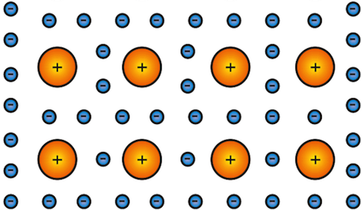
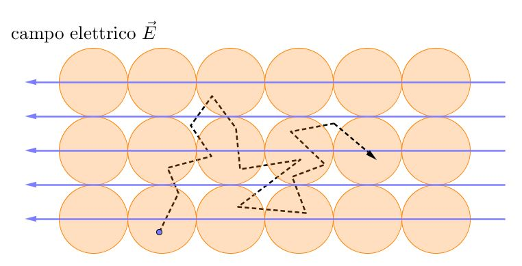

# Richiami di chimica

## Il modello atomico di Bohr

Il modello di Bohr prevede un nucleo centrale, di carica positiva, e degli elettroni con carica negativa con un'orbita attorno al nucleo. La quantità di energia di un elettrone dipende dalla sua distanza dal nucleo, e queste quantità sono quantizzate. Il livello energetico viene identificato dal **numero quantico principale** $n$.
Viene poi introdotto il **numero quantico angolare** $l$ che identifica la forma dell'orbita. Questo numero quantico può assumere valori da 0 a $n-1$ e identifica la forma dell'orbita. Esistono poi il **numero quantico magnetico** e il **numero di spin**: in particolare quest'ultimo identifica lo spin dell'elettrone, che può assumere due valori, $\frac{+1}{2}$ e $\frac{-1}{2}$. Grazie a questi 4 numeri quantici è possibile identificare univocamente ogni orbita elettronica, poichè non possono esistere elettroni facenti parte dello stesso atomo con tutti e 4 i numeri quantici uguali. Questo principio è chiamato **principio di Esclusione di Pauli**.
Con l'introduzione dei primi concetti di meccanica quantistica, alcune ipotesi del modello di Bohr non possono essere considerate valide: in particolare si introduce il concetto di **orbitale** in sostituzione di quello di orbita. L'orbitale infatti è una regione di spazio in cui elettroni ad un determinato livello energetico possono trovarsi con una certa probabilità. Continuano tuttavia ad essere vailidi i 4 numeri quantici, anche se viene data una grande importanza agli **elettroni di valenza**, ovvero gli elettroni presenti nel livello energetico più esterno, poichè sono quelli che andranno effettivamente a formare legami con altri atomi.

## I tre tipi di legami tra atomo

### Legame ionico

Si verifica tra ioni di carica opposta, dovuto alla mutua attrazione elettrostatica che si instaura tra un catione e un anione.

### Legame metallico

Si forma tra ioni metallici, tutti gli elettroni di valenza sono liberi di muoversi nel reticolo metallico di atomi che forma il legame.

### Legame covalente

Legame nel quale ogni atomo mette in compartecipazione gli elettroni dell'ultimo livello energetico. E' quello che verrà utilizzato per gli scopi del corso

## Proprietà di Resistenza dei materiali

Dato un certo materiale di lunghezza $l$ e sezione $s$, definisco **Resistenza** come $R = \rho \cdot \frac{l}{s}$. L'unità di misura di $\rho$ è $\Omega \cdot m$, e quella di $R$ è $\Omega$. Talvolta viene usata anche la **conducibilità**, definita come $\sigma = \frac{1}{\rho}$
Prendendo come riferimento questà proprietà, posso dividere in tre categorie i materiali:

- materiali **isolanti**, nel quale la corrente scorre molto difficilmente; hanno valori di $\rho$ maggiori di $10^{5}  \Omega \cdot cm$;
- materiali **conduttori**, nel quale la corrente scorre facilmente; hanno valori di $\rho$ minori di $10^{-2} \Omega \cdot cm$;
- materiali **semiconduttori**, nei quali abbiamo che $10^{-2} \Omega \cdot cm < \rho < 10^{5} \Omega \cdot cm$.

La differenza di resistenza deriva dal tipo di legami tra gli atomo che compongono il materiale; il vantaggio dei semiconduttori è che è possibile variare facilmente il loro valore di $\rho$ tramite un'operazione di drogaggio. Un esempio è quello del Silicio, che può diventare $Si O_2$ ed essere perfettamente isolante, o invece essere un buon conduttore se drogato con altri elementi.

### La conduzione elettrica nei metalli

Un reticolo metallico si presenta in questa forma (per semplicità rappresentata in due dimensioni).

{width=180px}

Se non applico potenziali, non avrò alcuna corrente; gli elettroni sono comunque liberi di muoversi, con una certa velocità detta _Velocità termica_ pari a $V_{termica} \approx 10{^7}cm/s$ a temperatura ambiente. Questo movimento è però casuale, e non corrisponde alla definizione di **corrente**, che invece è lo spostamento **netto** di carica elettrica in un'unità di tempo; in un movimento casuale ho tante cariche che si spostano in una direzione quante se ne spostano nell'altra. Di conseguenza anche la media della velocità termica sarà **nulla**. Cosa cambia quando si applica un campo elettrico?
Schematicamente, osserviamo che gli elettroni si muovono in direzione **opposta** a quella del campo elettrico.

{width=50%}

Sperimentalmente si osserva che la media tra la velocità termica e la velocità dovuta dall'azione del campo elettrico è **non nulla**.
