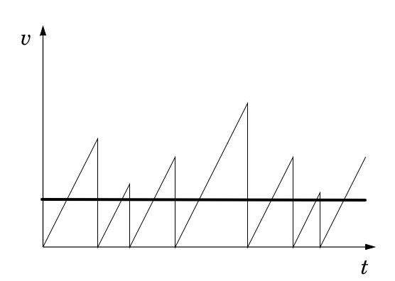

# Modello di Drude

Il modello di Drude è stato introdotto nel 1900 dall'omonimo Paul Drude, e descrive con discreta precisione il comportamento dei materiali conduttori a livello ohmico. Si basa su alcune ipotesi semplificative:

- l'esistenza di un _gas di elettroni_ libero di muoversi, equiparabile ad un gas vero e proprio;
- l'unica forza che agisce tra un urto tra un elettrone e un atomo è la forza del campo elettrico;
- gli urti tra elettroni e atomi sono perfettamente anaelastici;

Vengono altresì considerati seguenti parametri:

- $\vec{E}$, il campo elettrico, è costante;
- $a$, l'accellerazione degli elettroni, è costante;
- $\vec{v}$, la velocità degli elettroni, è lineare.

Prendendo in considerazione un singolo elettrone, posso tracciare il grafico $V_{elettrica}/Tempo$, dove $V_{elettrica}$ è la velocità dovuta dal campo elettrico, posso fare alcune osservazioni.

{width=350px}

Notiamo innanzitutto l'interruzione brusca del movimento degli elettroni: ciò è dovuto agli urti degli elettroni contro gli atomo presenti nel reticolo; essi sono completamente casuali, come è casuale la direzione dell'elettrone dopo di esso. La velocità è lineare a causa dell'azione del campo Elettrico $\vec{E}$ che, come detto, è costante. Ricavando il valor medio della velocità (nel grafico la linea orizzontale) si ottiene la **Velocità di Drift**. Essa avrà direzione **opposta** a quella del campo elettrico e, secondo il modello di Drude, si calcola a partire dal campo elettrico tramite la formula: $V_{d} = \mu \cdot E$. dove $\mu$ è la **mobilità** degli elettroni. Considerando i vettori, otterrò infine: $\vec{V_{d}} = - \mu \cdot \vec{E}$

## Calcolo della corrente
Prendiamo un considerazione un filo di lunghezza $L$ e sezione $A$. Definiamo $N$ il numero di **elettroni liberi** e **T** il tempo impiegato da un elettrone per attraversare il filo. Decidiamo di osservare la sezione $A$ di filo per un tempo $T$. Per definizione abbiamo che la velocità degli elettroni sarà $V_{d} = \frac{L}{T}$, e la corrente sarà $I = \frac{Q}{T}$. La quantità di carica che attraversa la sezione Q è data da $Q = N \cdot q$, dove $q$ è la carica di un elettrone ed è pari a $q = 1.6 \cdot 10 ^{-19}$. Quindi:
$I = \frac{N\cdot q}{T}$.

La _densità di corrente_ sarà pari a $J = \frac{I}{A} = \frac{N\cdot q}{T \cdot A}$, ma essendo $T = \frac{L}{\vec{V_d}}$ otterrò infine:
$J = \frac{N\cdot q \cdot \vec{V_d}}{L \cdot A }$, dove $A\cdot L$ è il volume del filo. Definisco dunque $n = \frac{N}{Volume}$ come _concentrazione degli elettroni nel materiale_. Quindi posso riscrivere la densità di corrente come:

$$J = n \cdot q \cdot \vec{V_d}$$

ottenendo quindi un legame di proporzionalità diretta tra _densità di corrente_ e _campo elettrico_. Questa è anche definita come **Legge microscopica di Ohm**.

Posso ulteriormente riscrivere la legge di Ohm come
$J = \sigma \cdot \vec{E}$, dove $\sigma$ è la **conducibilità** del materiale. Questo valore dipende ovviamente da $n$ e da $\mu _{n}$: per valori tipici avremo
$n = 10^{21} cm^{-3}$, $\mu_{n} = 500 \frac{cm^{2}}{V \cdot s}$ e dunque $\sigma \approx 10^{5} [\Omega \cdot cm]^{-1}$. Prendendo in considerazione il modello di Drude, tale approssimazione è effettivamente corretta.
