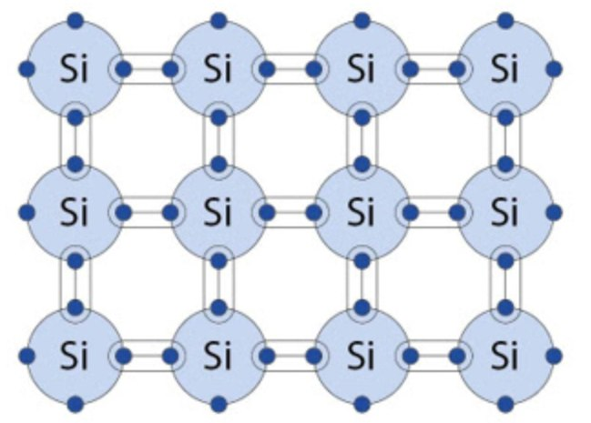
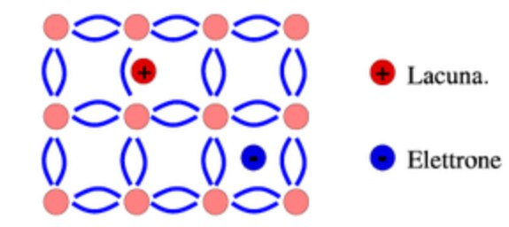
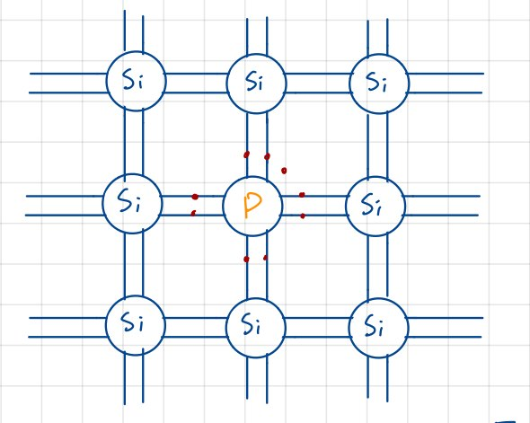
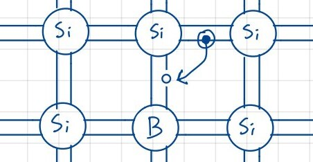

# Il Silicio

## Il Silicio intrinseco

Iniziamo la trattazione introducendo il concetto di materiale **intrinseco**: un materiale è **intrinseco** se è composto unicamente da atomi dello stesso elemento. Di conseguenza quando ci riferiremo al **Silicio intrinseco**, staremo considerando un reticolo cristallino formato unicamente da atomi di silicio, che condividono tutti gli elettroni delll'ultimo livello energetico in legami covalenti, come mostrato in figura:

{width=250px}

Per la trattazione, dovremo fare alcune ipotesi:

- se $T = 0 K$, allora $n = 0$ e $\sigma = 0$, che sono rispettivamente la concentrazione di elettroni e la conducibilità;
- a $T_{ambiente}$ alcuni elettroni hanno energia sufficiente per allontanarsi dai legami, diventando quindi elettroni liberi. 

Chiamerò $n_{i}$ la concentrazione di elettroni liberi, e posso calcolare questo valore come

$$n{_i}{^2} = B \cdot T^{3} \cdot e ^{-\frac{E_{G}}{K_{B} \cdot T}}$$

dove $B$ è una costante dipendente dal materiale: nel Silicio vale $1.08 \cdot 10^{31} K^{-3}cm^{-6}$.
$E_{G}$ è detta *energia di Gap* ed è la quantità di energia necessaria per allontanare un elettrone dal suo legame covalente. Nel Silicio vale $1.12 eV$, mentre $K_{B}$ è la costante di Boltzmann che vale $8.617 \cdot 10^{-5} eV/K$. A $T_{ambiente}$, quindi, $n_{i} \approx 10^{10} cm^{-3}$. Notiamo come il parametro che che fa effettivamente variare questo valore è la Temperatura, che ha andamento esponenziale. In conclusione, sapendo che nel Silicio ci sono $5\cdot10^{22} \frac{atomi}{cm^{3}}$, e dunque un numero di legami covalenti pari a $2\cdot10^{23}$, a temperatura ambiente abbiamo appena un legame rotto ogni $10^{13}$

### Il concetto di lacuna

Per effetto di un campo elettrico, un elettrone impegnato in un legame può *saltare* da un legame all'altro, eventualmente per coprire un buco lasciato da un elettrone che è riuscito a liberarsi dal legame. Posso considerare il buco dovuto al legame interrotto come una **carica positiva**, e la chiamerò **lacuna**: avrà una carica uguale ed opposta rispetto a quella dell'elettrone, e si muoverà in direzione concorde al campo elettrico.

{width=250px}

La loro mobilità sarà diversa: indicando con $\mu_{n}$ la mobilità dell'elettrone, e con $\mu_{p}$ quelle della lacuna, si osserva che $\mu_{n} \approx 2.5 \mu_{p}$. Nel Silicio questi valori sono rispettivamente $\mu_{n} = 1350 \frac{cm^{2}}{V\cdot s}$ e $\mu_{p} = 480 \frac {cm^{2}}{V \cdot s}$. Introduciamo ora la **legge di azione di massa**: essa sarà valida solo all'equilibrio termodinamico, e afferma che $n \cdot p = n{_i}{^2}$. Utilizziamo tutti questi dati per calcolare la conducibilità del Silicio:
$$\sigma = n\cdot q \cdot \mu_{n} + p \cdot q \cdot \mu_{p} = 3 \cdot 10^{-6} \Omega \cdot cm$$
che lo rendenrebbe un cattivo conduttore. Questo ci porta all'introduzione del **Silicio drogato**.

## Il Silicio drogato
Un materiale, in genere, si intende *drogato* quando sostituiamo alcuni suoi atomi dal reticolo intrinseco, inserendo altri atomi appartenenti a gruppi diversi. Con il Silicio è possibile effettuare due tipi di drogaggio: sostituzione con atomi del gruppo $V$, o con atomi del gruppo $III$.

### Drogaggio con atomi del gruppo $V$

Gli elementi più comuni con il quale viene effettuato il drogaggio sono l'Arsenico $As$, e il Fosforo $P$. Essi posseggono 5 elettroni di valenza, dunque uno di essi non verrà coinvolto nei legami covalenti.

{width=250px}

Questo elettrone avrà bisogno di **pochissima** energia per muoversi, e si aggiunge agli elettroni liberi generati termicamente. Non rompendo alcun legame, questi elettroni non danno vita a nuove lacune, sbilanciando quindi il numero di lacune ed elettroni liberi. Gli atomi del gruppo $V$ sono detti *donatori* perchè appunto 'donano' un elettrone nel reticolo, e diventano degli ioni positivi; la loro concentrazione viene indicata con $N_{D}$.

### Drogaggio con atomi del gruppo $III$
L'elemento più comuni con il quale viene effettuato questo tipo di drogaggio è il Boro $B$, che possiede 3 elettroni di valenza; al contrario del drogaggio con atomi del gruppo $V$, qui manca un legame per raggiungere l'ottetto, creando artificialmente una lacuna.

Questa lacuna verrà colmata da un altro elettrone che romperà il suo legame covalente. Gli atomi del gruppo $III$ sono detti *accettatori* perchè appunto 'accettano' un elettrone nel reticolo, e diventano degli ioni negativi; la loro concentrazione viene indicata con $N_{A}$.

## Il drogaggio

I valori tipici per $N_{D}$ e $N_{A}$ sono compresi tra $10^{14} cm^{-3}$ e $10^{19} cm^{-3}$. Dobbiamo però considerare tra questi atomi, quelli che effettivamente donano o ricevono un elettrone, e si indicano con:

- $N_{D}^{+}$: numero di atomi del gruppo $V$ che effettivamente donano un elettrone;
- $N_{A}^{-}$: numero di atomi del gruppo $III$ che effettivamente ricevono un elettrone.

Si noti come entrambi i valori siano delle **concentrazioni**, e in entrambi i casi il numero di elettroni liberi non è più uguale al numero di lacune. Chiameremo quindi i drogaggio, rispettivamente:

- **Drogaggio N**, quando $N_{D} > N_{A}$, nel quale si parlerà di *portatore maggioritario*;
- **Drogaggio P**, quando $N_{D} < N_{A}$, nel quale invece si parlerà di *portatore minoritario*.

## Calcolo di $p$ ed $n$

Questo calcolo è necesssario per determinare la conducibilità del Silicio drogato. Partiamo dal presupposto che la somma delle cariche positive deve essere uguale a quella delle cariche negative, per la neutralità dei carica:
$$ (+q)(p + N_{D}^{+}) = (+q)(n + N_{A}^{-})$$
dove $q$ è la carica dell'elettrone. Ricordiamo inoltre la legge di azione di massa: $n \cdot p = n{_i}{^2}$

### Calcolo nel caso di drogaggio N

Per ipotesi abbiamo $N_{A} = 0$, $N_{D}^{+} = N_{D}$ e $n \approx N_{D}$, dunque il numero di elettroni liberi è circa uguale al numeri di quelli drogati: risulterà dunque che $p = \frac{n{_i}{^2}}{N_{D}}$. Sapendo che $n_{i}^{2} = 10^{20} cm^{-3}$, ottengo che $p = 10^{2} cm^{-3}$ e $n = 10^{18} cm^{-3}$.
Confrontando questo risultato con quello del Silicio intrinseco, notiamo che la generazione termica continua ovviamente ad essere presente, ma viene aiutata in modo significativo dal drogaggio: ci sono molti più elettroni liberi che possono riempire più facilmente le lacune. Gli elettroni che predominano, in questo caso $n$, vengono detto *maggioritari*, mentre in questo caso i $p$ saranno *minoritari*: abbiamo un semiconduttore di tipo $N$ proprio a causa dello sbilanciamento a favore degli elettroni.

### Calcolo nel caso di drogaggio P

In questo caso la situazione è la seguente:
$p \approx N_{A}$, $n \approx \frac{n{_i}{^2}}{N_{A}}$. Tramite un esempio numerico vediamo che $n = 10^{13} cm^{-3}$, $p = 10^{5} cm^{-3}$ e $N_{D} = 10^{15}cm^{-3}$

Inoltre $\mu_{n} = 1320 \frac{cm^{2}}{V \cdot s}$ e $\mu_{p} = 460 \frac{cm^{2}}{V \cdot s}$: sono valori leggermente diversi dai precedenti a causa dell'indebolimento del reticolo dovuto dal drogaggio.
$\sigma = nq\mu_{n} + pq\mu_{p} = 0.2 [\Omega \cdot cm]^{-1}$, e $\rho = \frac{1}{\sigma} = 4.7 \Omega \cdot cm$$

### Considerazioni sul drogaggio

Rispetto al caso intrinseco, la resistività è scesa di 5 ordini di grandezza, ma quali sono le proporzioni tra gli atomi?
Ho inserito $10^{15} \frac {atomi}{cm^{3}}$, il Silicio ha $5 \cdot 10^{22} \frac {atomi}{cm^{3}}$, dunque ho inserito un atomo drogante ogni $10^{7}$ atomi di Silicio.
Ne ricavo che il drogaggio del Silicio ha un effetto molto potente in termini di modifica della proprietà di resistività di un materiale, e che è possibile variare il livello di drogaggio per ottenere caratteristiche e proprietà diverse, adattabili al contesto di utilizzo.

## Calcolo della conducibilità al variare della temperatura

La formula desiderata è la seguente:
$$\sigma = nq\mu_{n} + pq\mu_{p} = f(T)$$
dove $f(T)$ è una funzione che dipende dalla temperatura. Andiamo a considerare ogni parametro in modo separato:

- q: carica dell'elettrone, $q = 1.6 \cdot 10^{-19} C$, e rimane ovviamente identica;
- $\mu_{n}$ e $\mu{_p}$: mobilità degli elettroni, dipende dalla temperatura e dal tipo di drogaggio. Questo perchè a temperature maggiori, le oscillazioni sono più rapide, aumentando la probabilità e la frequenza degli urti tra elettroni e atomi. Nello specifico, la mobilità è inversamente proporzionale alla temperatura con un fattore pari a $T^{-\frac{3}{2}}$
- $p$ ed $n$: dipendono principalmente dal tipo di drogaggio.

### Caso con Silicio intrinseco

Abbiamo che $n = p = n{_i}$,; sappiamo inoltre che l'aumento della temperatura T, e duqnue l'aumento dell'energia temrica, è sufficiente per rompere alcuni legami covalenti. Ciò porta all'incremento esponenziale di $n$ e $p$, che prevale dunque sull'incremento di $\mu_{n}$ e $\mu_{p}$: possiamo duqnue affermare che $\sigma$ **aumenta con la temperatura**.

### Caso con Silicio drogato 

In questo situazione $n \not = p$.Prendendo il Silicio drogato di tipo $P$, avremo:

- $p = N_A = 10^{15} cm^{-3}$, che è un valore costante in quanto dipende solo dal tipo di drogaggio;
- $n = \frac{n{_i}{^2}}{N_A}$, che invece aumenta, dato l'incremento di $n{_i}$ con la temperatura.

Ricordando che nell'ultimo caso stiamo parlando di **portatori minoritari**, essi avranno una concentrazione, e dunque un impatto, **trascurabile** rispetto ai portatori maggioritari $p$. In sostanza, avremo un decremento della mobilità, ovvero $\sigma$ **diminusce con la temperatura**.

### Considerazioni

E' necessario monitorare i cambi di temperatura nel Silicio, in quanto essa influisce sul comportamento dello stesso, portando a conseguenza rilevanti sulle sue stesse proprietà. I cambiamenti di conducibilità, e dunque della conduvibilità, possono essere utilizzati per ottenereinformazioni sulla temperatura del materiale.
