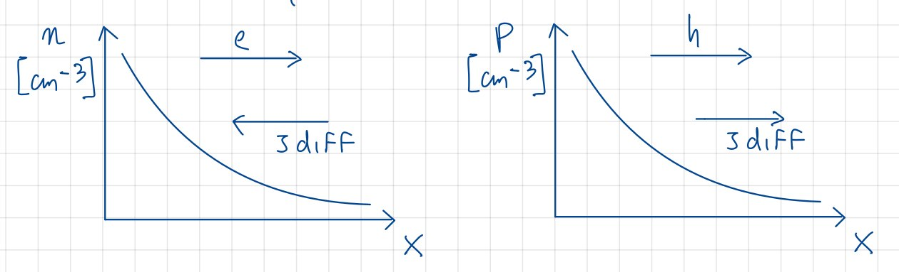

# Corrente di diffusione

Osserviamo che le cariche mobili si spostano da zone a maggior concentrazione a quelle con concentrazione minore per agitazione termica. Questo movimento di cariche causa quella che viene chiamata **corrente di diffusione**, che esiste proprio a causa della presenza di questo gradiente di concentrazione di portatori, ed è complementare a quello della corrente di drift.

## Calcolo della corrente di diffusione

Tracciamo dei grafici con concentrazione come ordinata:

Ricordiamo che $n$ indica la concentrazione di elettroni liberi, e $p$ quella delle lacune, mentre $e$ sono gli elettroni e $h$ le lacune. Il grafico rappresenta lo spostamento di elettroni e lacune lungo in gradiente, e la corrente risultante dal fenomeno.
Ricordando che $D_{N}$ rappresenta la **densità della corrente di diffusione**, calcoliamo la corrente di diffusione per gli elettroni:

$$J_{N Diff} = (-q) D_{N} (-\frac{dn}{dx}) = q \cdot D_{N}\frac{dn}{dx} \to \text{corrente negativa}$$

che implica una $J$ negativa.
Allo stesso modo, calcoliamo la corrente di diffusione delle lacune:

$$J_{P Diff} = (+q) D_{P} (-\frac{dp}{dx}) = - q \cdot D_{P}\frac{dp}{dx} \to \text{corrente positiva}$$

### Legame tra $D_{N}$ e $D_{P}$

Assumiamo $D_{N} = 34 \frac{cm^{2}}{s}$ e $D_{P} =12 \frac{cm^{2}}{s}$, allora vale la **Relazione di Einstein**:

$$\frac{D_{P}}{\mu_{P}} = \frac{D_{N}}{\mu_{N}} = \frac{K_{B}T}{q} = V_{T}$$

$V_{T}$ è **Thermal Voltage**, ovvero la tensione che si genera ad una data temperatura; a 300K, $V_{T} = 0.0259 V$.

## Corrente di diffusione totale

La corrente di diffusione totale è la somma delle correnti di diffusione degli elettroni e delle lacune:

$$J_{Diff} = J_{N Diff} + J_{P Diff} = q \cdot D_{N}\frac{dn}{dx} + q \cdot D_{P}\frac{dp}{dx}$$

### Densità di corrente totale

La densità di corrente totale è la somma delle correnti di drift e di diffusione:

$$J_{Tot} = J_{Drift} + J_{Diff} = q \cdot D_{N}\frac{dn}{dx} - q \cdot D_{P}\frac{dp}{dx} + q\mu_{n}nE + q\mu{P}pE$$
