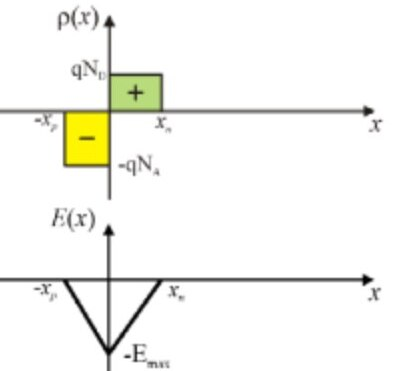
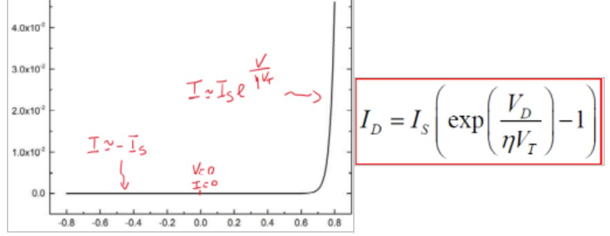

# La Giunzione PN

## Definizione

La Giunzione PN è un dispositivo formato da due parti di Silicio drogato, una di tipo $P$ e l'altra di tipo $N$. Mettendo all'estremo del dispositivo dei contatti andremo a formare un **diodo**

E' un dispositivo di importanza rilevante perchè è *unidirezionale*, ovvero permetto lo scorrere della corrente **solo in una direzione**, da anodo ('lato' $P$) a catodo ('lato' $N$). 

## Analisi senza sollecitazioni esterne

Analizziamo $V_{AK}$ e $I_{AK}$, ovvero la tensione e la corrente che scorrono tra anodo e catodo. Senza sollecitazioni esterne, questo non possono che essere **nulle**. Verifichiamo la correttezza di questa ipotesi: consideriamo di essere a temperatura a ambiente, che $N_{A} = P_{p} = 10^{17} cm^{-3}$, $n_{p} = 10^{3} cm^{-3}$, $n{_N} = 10^{16}cm^{3}$ $P_{n} = 10^{4} cm^{-3}$.

{width=60%}

Per diffusione, le lacune $h$ tenderanno a spostarsi dalla zona P alla zona N, mentre gli elettroni avranno comportamento opposto, risultando comunque in **due correnti con stessa direzione e stesso verso**. Queste correnti sono però entrambe positive, e farebbero risultare una corrente interna al dispositivo senza alcuna sollecitazione esterna, il che è ovviamente **impossibile**. Deve dunque esistere un'altra corrente che si oppone alla corrente di drift: un'ipotesi è che possa esistere all'interno della giunzione un **campo elettrico** che possa causare un'ulteriore corrente che annulli quella di drift. Il campo dovrebbe essere **necessariamente interno**, in virtù dell'ipotesi di equilibrio termodinamico che abbiamo fatto.

### Studio del campo elettrico interno alla Giunzione

Ingrandiamo la zona di congiunzione tra la parte P e la parte N:

{width=50%}

Al momento dell'unione tra le parti P ed N, le lacune come detto si dirigono verso la parte N, e gli elettroni verso la zona P, per diffusione, combinandosi gli uni con le altre. Dopo l'unione, il dispositivo si presenterà in questa forma:

{width=50%}

La zona $W$ sarà detta **zona di svuotamento**, e ha la peculiarità di essere composta unicamente da cariche **fisse**, senza alcuna carica mobile: saranno dunque due zone con **carica netta** positiva e negativa, in una situazione analoga a quella di un condensatore; di conseguenza, esisterà un campo elettrico. La zona di svuotamento **NON** può essere di lunghezza infinita, perchè la stessa forma una barriera energetica che si oppone alla diffusione di cariche libere tra i due semiconduttori: esse inizieranno a diffondersi, ma arrivati ad un equilibrio tra la diffusione e tale barriera, il processo di crescita della zona di svuotamento verrà limitato perchè le cariche non riusciranno ad attraversare tale barriera.

{width=30%}

Passando ai calcoli, troveremo:
$$Q^{+} = (qN_{D}x_{k}) = Q^{-} = (qN_{A}x_{p})$$
e dunque 
$$N_{D}x_{k} = N_{A}x_{p}$$
con $W = x_{k} + x_{p}$, $x_{k}$ e $x_{p}$. In caso di drogaggi differenti, anche le zone appariranno differenti, ma la loro area sarà uguale.

### Il potenziale interno

Dalle equazioni dell'elettrostatica, ricordiamo che $\frac{dE}{dx} = \frac{\rho(x)}{\epsilon}$, quindi l'esistenza del campo elettrico è garantita. 
$E = -\frac{d\phi(x)}{dx}$, con $\epsilon$. Guardando il grafico:

{width=40%}

Si ricava che esiste una **differenza di potenziale** $V_{0}$ ai capi della zona di svuotamento, chiamato **potenziale interno**, o **di built-in**. Questo potenziale è quello che impedisce al processo di diffusione di continuare in modo indefinito: le lacune si spostano da P verso N, e gli elettroni da N verso P, ma entrambi vengono contrastati nel loro movimento dal campo elettrico. Di fatto, **le correnti di diffusione vengono contrastate dalle rispettive correnti di drift**: tramite questa affermazione, dimostriamo il perchè la corrente risulti nulla.
Il potenziale interno è calcolabile tramite la seguente formula:
$$V_{0} = \frac{kT}{q}\cdot ln(\frac{N_{A}N_{D}}{n_{i}^{2}})$$
ed ha un valore generalmente compreso tra 0.6 e 0.8 V.

### La barriera di potenziale

Quando una lacuna vuole passare, per diffusione, dalla zona P alla zona N, deve superare una barriera di potenziale, che è la differenza di potenziale tra la zona P e la zona N.

Tuttavia non tutte le lacune hanno abbastanza energia potenziale per superarla; sono invece favorite in questo processo le cariche minoritarie della zona N, ovverosia le lacune generate termicamente vicino alla zona di svoutamento nella parte N, poichè il campo elettrico è loro favorevole e non le respinge, generando una piccola corrente di drift. Tale corrente di drift deve contrastare una corrente di diffusione anch'essa piccola, perchè la barriera respinge la maggior parte delle lacune che invece vorrebbe passare. In conclusione, avremo una corrente di drift che tende a compensare la corrente di diffusione, e quindi una corrente totale nulla.

Vale invece il discorso opposto per gli elettroni che da N vogliono passare a P: alcuni elettroni hanno sufficiente energia per passare la barriera, e alcuni minoritari generati termicamente. La conclusione è però la medesima: la corrente di drift e quella di diffusione si equivalgono in verso opposto, risultando in una corrente nulla.
Di conseguenza, annullate tra di loro correnti di drift e di diffusione per la parte P e la parte N, la corrente totale sarà nulla come da ipotesi.

### Potenziale ai capi del Diodo

Rimane ancora una domanda al quale rispondere: perchè la tensione ai capi del diodo è nulla nonostante abbiamo dimostrato l'esistenza di un potenziale interno al materiale? 
Essa risulterà compensata dai potenziali che si formano al contatto dei semiconduttori e i diodi metallici esterni, e saranno tali che la somma di questi potenziali sia nulla.

I principi della termodinamica mi dicono che ai capi del diodo non ho una differenza di potenziale perché se così fosse saremmo stati in grado di ottenere una tensione da un oggetto in equilibrio termodinamico, potendo quindi ottenere energia senza applicare un lavoro; ciò è ovviamente impossibile perchè violerebbe il secondo principio della termodinamica. Quindi quello che accade è che il potenziale $V_{0}$ è solo un potenziale interno al materiale che esso stesso si è costruito, da cui il nome *built-in*, che è presente internamente: esso influsice sul comportamento del materiale stesso, non è rilevabile dall'esterno. Questo perché anche provando a misurarlo, avremmo bisogno di contatti, che genererebbero a loro volta zone di svoutamento quando unite al nostro semiconduttore, che avrebbero a loro volta adute di potenziale di segno tale da andare a compensare esattamente $V_{0}$.

## Analisi della Giunzione Polarizzata

Applichiamo una tensione, tramite ad ese mpio un generatore, ai capi dei contatti metallici del diodo: essa non andrà a modificare le zone neutre, ma si limiterà a modificare la barriera di potenziale analizzata in precedenza.

{width=40%}

A seconda del valore della tensione applicata, in particolare al segno della stessa, avremo un comportamento diverso del valore della tensione di *built-in*, come visibile qualitativamente anche dal grafico.

### Potenziale positivo

In questo caso il potenziale tra P ed N **diminuirà**, e con esso anche la barriera di potenziale. Questo farà sì che la corrente di diffusione **aumenterà in modo esponenziale**. Possiamo affermare ciò poichè le lacune che possono andare da P verso N aumenteranno in numero, e così faranno anche gli elettroni che vanno da N verso P; la corrente di drift rimarrà **invariata** perchè anche se l'intensità del campo elettrico aumentasse, i portatori coinvolti resterebbero nello stesso, esiguo, numero, a patto di considerare costante il numero di portatori minoritari generati termicamente e la temperatura stessa. 
Quindi la corrente di diffusione aumenterà, mentre quella di drift rimarrà uguale. Dunque, avremo che la corrente totale **non sarà più nulla**: essa **scorrerà da P verso N** e varierà esponenzialmente in base a $V_{0}$

### Potenziale negativo

La situazione è logicamente inversa rispetto al caso precedente: il potenziale $V_{0}$ andrà ad aumentare, e così farà anche la barriera di potenziale. Troveremo una diminuzione esponenziale della corrente di diffusione, che tenderà a 0, mentre la corrente di drift rimane invariata. La corrente totale risultante avrà un valore compreso tra $10^{-18}$ e $10^{-9}$, con direzione da N verso P.

### La giunzione come oggetto rettificante

Dopo aver considerato il comportamento della giunzione nei casi di tensione positiva e negativa, possiamo affermare che essa è un **oggetto rettificante**, in quanto solo quando viene applicata una tensione positiva avrò una corrente da P ad N dovuta ai portatori maggioritari; nel caso di tensione negativa risulta infatti una corrente piccola che scorre da N verso P, dovuta ai portatori minoritari. 
Un circuito è detto **rettificatore**, o *raddrizzatore* quando trasforma un segnale alternato in uno unidirezionale, sempre positivo o negativo

### La zona di svoutamento

Anche  la zona di svuotamento subisce l'influenza della tensione applicata ai capi del diodo: la sua larghezza **aumenta in polarizzazione inversa**, e **dimunisce in polarizzazione diretta**. Infatti, la barriera di potenziale aumenta perchè il campo elettrico è più intenso, e ciò è dovuto al maggior numero di cariche fisse nella zona di svuotamento, che non sono più compensate dalle cariche mobili che si spostano per l'aumento della zona stessa. In generale l'espressione della larghezza della zona di svuotamento dipende dal drogaggio e dal potenziale di *built-in*, ed è la seguente:

$$ W = \sqrt{\frac{2\epsilon}{q}\cdot (\frac{1}{N_A} + \frac{1}{N_D})\cdot (V_0 - V_D)}$$

Riassumendo:

- $V > 0$ : la barriera di potenziale **diminuscie**, e $W$ diminusce;
- $V < 0$ : la barriera di potenziale **aumenta**, e $W$ aumenta.

### L'equazione di Shockley per la corrente

La corrente che scorre nel diodo è detta $I_{AK}$, viene scelta in verso positivo da P verso N, ed è data dall'equazione del **Modello di Shockley**:

$$I_{AK} = I_S ( e^{\frac{V_D}{\eta V_T}})$$

dove:

- $V_T = \frac{kT}{q} \approx 26mV @300K$, è la tensione termica ai terminali del diodo;
- $I_S \in [10^{-18};10^{-9}]$, è la corrente inversa di saturazione;
- $\eta\in [1;2]$, è il fattore di idealità dipendente dai materiali.

In conclusione,possiamo affermare che la corrente scorre nel dispositivo in quantità non trascurabile solo se viene applicato ad esso un **potenziale positivo** tra Anodo e Catodo, tale da far abbassare la barriera energetica; quando gli viene applicato un potenziale negativo, invece, la corrente è si diversa da zero, ma sarà costante e negativa, in valore trascurabile. Alcuni valori tipici sono riassunti nei seguenti schemi:

## Zone di funzionamento 

Le **zone di funzionamento** individuano valori di tensione e corrente tipici che risultano in comportamenti differenti del dispositivo. 

Nella giunzione PN, le principali zone di funzionamento sono:

- **polarizzazione inversa**: $V_D < 0$, il fattore $-1$ nell'equazione è predominante rispetto all'esponenziale, che risulta in $I_D \approx -I_S$. La corrente che scorre è dovuta solamente alle componenti di drift e dunque ai minoritari, il che ci fa capire che essa sia molto piccola;
- **polarizzazione nulla**: $V_D = 0$, la corrente è nulla. Grazie a ciò ricordiamo che l'equazione del modello di Shockley passa per lo 0;
- **polarizzazione diretta**: $V_D > 0$, la corrente è data dall'esponenziale, che è predominante rispetto al fattore $-1$.

Riassumendo, abbiamo questi comportamenti:

{width=50%}
