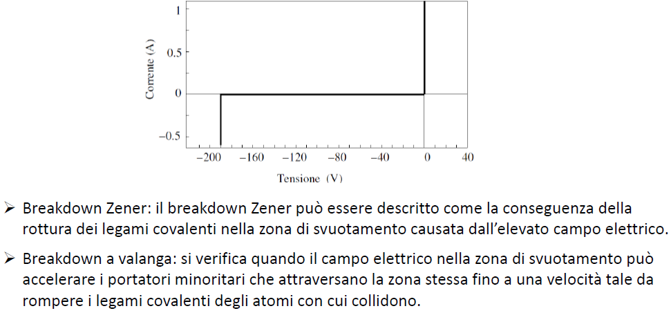
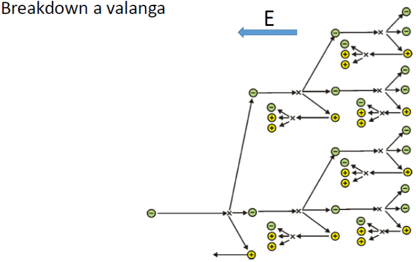

# Il fenomeno del Breakdown

Tra le zone di comportamento elencate precedentemente ne abbiamo escluso una, che è quella della **forte inversione**: si verifica quando $V_D << 0$, e la corrente inversa aumenta in modo repentino; solitamente si verifica per $V_D < 70 V$.
Quando il diodo è polarizzato in inversa, abbiamo già visto come la zona $W$ aumenti, coì come aumenta il campo elettrico ai capi della stessa e la barriera di potenziale: i portatori non possono più passare così facilmente la barriera, mentre le correnti di drift restano piccole. Questo perché solo i portatori minoritari possono passare la giunzione metallurgica, sfruttando il campo elettrico favorevole, ma abbiamo il solito limite che i portatori minoritari sono pochi, e quindi la corrente è piccola. Quindi, per tensioni elevate, deve esistere un fenomeno che **aumenti il passaggio di portatori attraverso la giunzione**. Questo fenomeno è chiamato **breakdown**, e si compone di due fenomeni separati.

## Effetto Zener

In questo caso l'aumento di portatori è legato all'aumento dell'intensità del campo elettrico. Esso infatti diventa tale da **rompere alcuni legami covalenti** all'interno della zona di svuotamento. Si generano dunque nuovi elettroni liberi e lacune che, trovando un campo elettrico favorevole al passaggio, determineranno un aumento della corrente.

### Influenza della temperatura sull'effetto Zener

Una temperatura maggiore implica maggiore energia degli elettroni, per cui è più semplice rompere i legami covalenti. In sostanza, alte temperature amplificano l'effetto Zener. A parità di corrente, dunque, la $V_{Br}$, ovvero la **tensione di Breakdown**, diminuisce.

## Effetto a valanga

Questo effetto implica che alcuni portatori minoritari acquisiscano, tramite l'elevato campo elettrico, un'energia tale da rompere un legame covalente quando essi si scontrano contro un atomo, portando alla formazione di nuove coppie *elettrone-lacuna*. Tale processo si chiama **processo di ionizzazione dell'atomo**. Il nome deriva dal fatto che, dopo un urto e la formazione di una coppia *elettrone-lacuna*, entrambi questi elementi vengono accelerati: essi urteranno altri atomo, formando a loro volta nuove coppie *elettrone-lacune*,e così via; questo fenomeno viene anche alimentato dalla forte intensità del campo elettrico.

{width=50%}

### Influenza della temperatura sull'effetto a valanga

All'aumentare della temperatura, i portatori hanno un'energia minore dopo un urto, per cui diventa più difficile per loro rompere altri legami. Tuttavia, aumentando la temperatura, aumenteranno anche le vibrazioni degli atomi, per cui la frequenza di urti tra elettroni e atomi aumenterà. Quindi a parità di corrente, la $V_{Br}$ deve aumentare.

## Considerazioni in relazione alla generazione termica

I due effetti sopra presentati si vanno a sommare alla generazione termica già presente, la quale diventa trascurabile rispetto ad essi; in generale il breakdown aumenta all'aumentare della tensione, fino al punto in cui le correnti inverse **non sono più trascurabili**. Infine, non è generalmente possibile sapere quale dei due effetti è preponderante in confronto all'altro.
