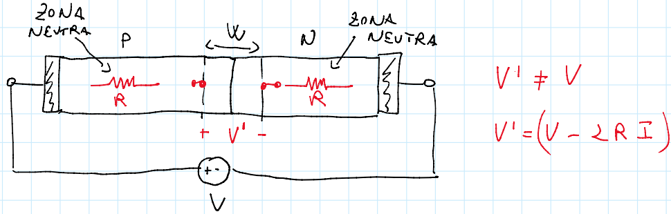
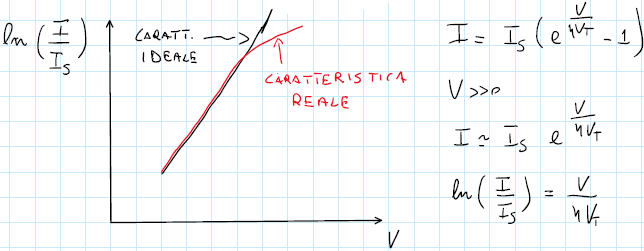
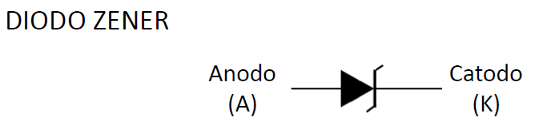

# I diodi Zener

Nei diodi visti fino ad ora, il fenomeno del breakdown si presentava solamente per tensioni inverse particolarmente elevate; esiste tuttavia una categoria specifica di diodi che permette che questo fenomeno si verifichi anche a tensioni con modulo molto basso, nell'ordine di una decina di Volt. Qesti dispositivi sono chiamati **diodi Zener**, e in essi si verificano entrambi i fenomeni del breakdown visti in precedenza, ma a **tensioni diverse**:

- nei diodi con $|V_{Br}| > 7V$, predomina **la moltiplicazione a valanga**;
- nei diodi con $|V_{Br}| < 5V$, predomina **l'effetto Zener**;
- nei diodi in cui $5V < |V_{Br}| < 7V$, **si verificano entrambi i fenomeni**.

## Caso di correnti elevate

C'è un'ulteriore zona di funzionamento che dovremo considerare: quella in cui $V_{D} \gg 0$; in questo caso avremo delle correnti **molto elevate**, tali da non poter più trascurare gli effetti delle resistenze in serie.

Durante la trattazione delle giunzioni PN, abbiamo giustamente ipotizzato che tutta la tensione applicata dall'esterno **cadessi ai capi della zona di svoutamento**, e abbiamo trascurato le cadute di potenziale nelle zone neutre; in realtà esse hanno una certa resistenza, minore di $1\Omega$, che diventa non trascurabile quando in esse scorre una corrente abbastanza elevata. Di conseguenza, la tensione efficace che vediamo applicata alla barriera di potenziale è **più piccola** di quella che abbiamo applicato all'esterno; essa sarà $V_D$ **meno** la caduta di potenziale sulle resistenze delle zone neutre.

{width=60%}

Ciò vuol dire che all'aumentare della tensione, la corrente aumenta ancora meno di quanto ci aspettassimo. Se per valori di tensione trascurabili il modello di Shockley rappresenta correttamente l'andamento della tensione, ciò non è vero per tensioni non più trascurabili:

## Simboli circuitali dei diodi Zener

I diodi Zener sono rappresentati con un simbolo specifico, che è una variante del simbolo dei diodi normali:

{width=50%}
