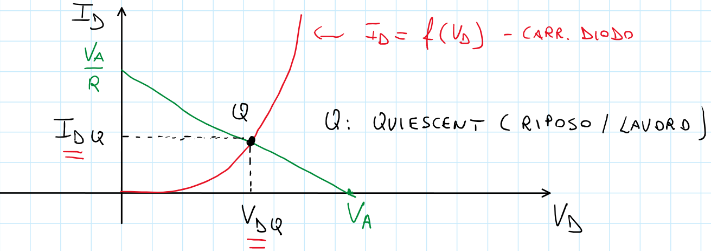

# Metodi risolutivi per circuiti con diodi

Per la risoluzione dei circuiti con diodi dovremmo scegliere dei modelli che presentano delle assunzioni e delle semplificazioni: in questo paragrafo verranno illustrati ed eventualmente dimostrati.

## Assunzione della tensione

La caratteristica che andremo ad utilizzare nelle nostre applicazioni è rappresentata nel seguente grafico:

{width=50%}

Non andremo mai a prendere in considerazione l'effetto delle alte correnti, mentre terremo a mente le tensioni di breakdown: questo perchè non saranno rari i circuiti in cui sono presenti anche **Diodi Zener**.

La caratteristica è **molto verticale**, dunque ne prendenremo una di riferimento pari a $V_{\gamma} = 0.7V$: se la tensione del diodo sarà inferiore a tale valore, assumeremo che non vi passerà alcuna corrente; di contro se dovesse essere superiore allora la corrente vi scorrerà. Ovviamente si tratta di una **ipotesi semplificativa**, in quanto anche per tensioni minori del nostro valore di riferimento ci sarà della corrente che scorre, ma ciò non influisce sulle nostre considerazioni.

Anche considerare la caratteristica come *verticale* è un'approssimazione: durante le considerazioni che faremo sui circuiti questa ipotesi può essere assunta senza ledere la generalità della trattazione, ma è opportuno ricordare come questa sia una convenzione che potrebbe non aderire sempre alla realtà.

## Il modello matematico

E' opportuno notare come il diodo abbia generalmente il legame tra correnti e tensione **non lineare**. Cosa implica ciò? Proviamo a vederlo risolvendo un circuito molto semplice.

### Risoluzione guidata di un circuito

Il circuito preso in considerazione è il seguente:

{width=50%}

Come suggerisce la figura, **le leggi di Kirchoff continuano a valere anche in presenza di elementi non lineari**. Scrivo dunque le equazioni alla maglia costruisco il mio sistema le cui incognite sono $I_D$ e $V_D$. Tuttavia è possibile solo una **risoluzione numerica** dello stesso, perchè mi trovo di fronte ad equazioni trascendenti. Infatti, sostituendo la $f(V_D)$ con l'equazione di Shockley, ottengo:

$$V_{AA} = RI_S \cdot (e^{\frac{V_D}{V_T}} - 1) + V_D$$

L'equazione non è di per sè sbagliata, ma è **trascendente** e quindi non è possibile risolverla analiticamente. Per risolvere il circuito, dovremmo quindi ricorrere a un metodo iterativo.

## Metodo grafico

Posso pensare di risolvere il medesimo circuito utilizzando un metodo grafico. visto che conosco la caratteristica del diodo. Inoltre conosco $V_A$ ed $R$, dunque posso disegnare l'equazione alla maglia sullo stesso grafico. Scrivo $I_D$ in funzione di $V_D$, ottenendo dunque una retta a pendenza negativa che interseca rispettivamente l'asse delle ascisse in $V_A$, e l'asse delle ordinate in $\frac{V_A}{R}$. Questa retta prende il nome di **retta di carico**, perchè dipende dal carico sul diodo, composto da elementi circuitali esterni allo stesso, come ad esempio generatori di tensione o resistenze del circuito. In effetti questa equazione dipende **unicamente** dalla prima equazione di Kirchoff.

{width=80%}

In rosso abbiamo l'equazione trascendente oggetto di studio: l'intersezione tra tale curva e la nostra retta di carico è formata dalle soluzioni del nostro problema, è il **punto Q**, detto anche punto **di lavoro** o **di riposo**, le cui coordinate sono $I_{DQ}$ e $V_{DQ}$. Esse costituiscono rispettivamente la corrente che scorre attraverso il diodo, e la tensione ai suoi capi in quelle specifiche condizioni di lavoro.

Questo metodo **non è approssimato**, ed è molto utile in quanto ci permette di visualizzare come si comporta il diodo al variare di alcuni parametri. Ad esempio, se la resistenza del circuito precedente avesse assunto valori differnti:

{width=55%}

Allo stesso modo, se a variare fosse stata la tensione:

{width=60%}

Questo metodo porta però con sè anche degli svantaggi: come mi comporto in presenza di più diodi? Il metodo diventerebbe inattuabile. Inoltre il metodo funziona solo per quel particolare diodo con quelle specifiche caratteristiche: prendendo due dispositivi nominalmente identici ottengo comunque caratteristiche diverse. 
Giungiamo quindi alla conclusione che il metodo grafico è inutilizzabile dal punto di vista pratico: è sicuramente utile per visualizzare semplici situazioni e dal punto di vista didattico, ma è impraticabile per ottenre funzioni più o meno precise di tensionin e correnti ai capi del diodo.

## I modelli per grandi segnali

Sono metodi di analisi che sfruttano un **modello approssimato** del diodo; rinunciando ad avere un risultato **esatto**, avremo un'analisi veloce e con errori molto piccoli.

### Modello a caduta di tensione costante

Consiste nell'approssimare la caratteristica del diodo con una retta perfettamente verticale, che intercetta l'asse delle ascisse in un punto chiamato $V\gamma$: considererò la corrente come **nulla** per polarizzazioni, anche positive, minori di questo valore $V\gamma$. Posso dunque sostituire il mio diodo, durante lo studio del circuito, con:

- un **generatre di tensione** di valore $V\gamma$, se $V \ge V\gamma$;
- un **circuito aperto**, se $V < V\gamma$.

Il valore di $V\gamma$ è, per convenzione, $0.7 V$. 

{width=50%}

### Modello del diodo ideale

Questo modello riprende parte di quello precedente, ma inserisce un'ulteriore semplificazione: il diodo verrà considerato come un **interruttore**, aperto o chiuso.

{width=70%}

Questo perchè il modello considera come **trascurabile** la tensione del diodo, che per le nostre assunzioni vale $V\gamma = 0.7V$, rispetto a tutte le altre tensioni impiegate nel circuito. L'interruttore, come il diodo, consente lo scorrere della corrente **in un solo verso**, da Anodo verso Catodo.

### Modello lineare a tratti

Questo modello è in realtà il meno approssimato tra quelli per i grandi segnali: innanzitutto la caratteristica non viene più considerata verticale, ma sarà una retta con una certa pendenza. Dal punto di vista circuitale, posso sostituire il diodo con un **circuito aperto**, o come una **resistenza in serie ad un generatore di tensione**.

{width=70%}

Questo modello complica il circuito, anche perchè non è noto il valore di $R_f$ e $V_f$, che vengono approssimati rispettivamente a $20\Omega$ e $0.65V$. In virtù delle difficoltà che inserisce nell'analisi del circuito, questo modello non viene usato poichè altri modelli ottengono risultati molto simili a questo, ma con uno sforzo computazionale sicuramente minore.

## Esempio di analisi di un circuito con diodi

Utilizzeremo uno alla volta tutti i modelli per grandi segnali, in modo da poter apprezzare le differenze tra di essi, seguendo una procedura comune.

### Procedura per la risoluzione di circuiti con il modello per grandi segnali

- Ipotizzo lo stato di ciascun diodo, che può essere in **conduzione** o in **interdizione**;
- Sostituisco ciascun diodo con il modello corrispondente;
- Risolvo il circuito semplificato;
- Veriffico la correttezza delle ipotesi iniziali per **ciascun diodo**:
  - se tutte sono verificate, allora hom ottenuto una soluzione corretta;
  - se anche solo una delle ipotesi è errata, allora bisogna cambiare l'ipotesi, risolvere nuovamente il circuito ne riverificare la correttezza della nuova ipotesi, fino ad ottenre un risultato accettabile

Sto inserendo nel circuito un'importante semplificazione, dunque devo **dimostrare** la sua correttezza ad ogni utilizzo, dopo la risoluzione dello stesso. Una volta dimostrata la correttezza delle ipotesi, allora sarò certo anche della correttezza del risultato ottenuto: il diodo ha un'espressione **non lineare** e **monotona**, e l'Analisi Matematica ci dice che in presenza di un sistema con un'equazione come quella del diodo, allora esiste una soluzione dello stesso, ed è unica. Con *correttezza delle ipotesi* si intende che, se il diodo fosse il conduzione, allora avrei una corrente che scorre su di esso. Di contro, se il diodo fosse interdetto, dovrei verificare che il diodo sia polarizzato in inversa. Può essere utile, per la verificare delle ipotesi, ricordare questo schema:

### Risoluzione con modello a caduta di tensione costante

{width=60%}

E' importante effettuare la **verifica** dell'ipotesi del modello: in questo caso devo verificare che la corrente che scorre sul diodo sia **positiva**. Abbiamo ottenuto un valore di $I_D = 4.3 mA$, che verifica l'ipotesi.

### Risoluzione con modello del diodo ideale

Anche in questo caso l'ipotesi è verificata, anche se il valore ottenuto è differente rispetto a quello ottenuto con il modello precedente: $I_D = 5mA$

{width=60%}

### Risoluzione con modello lineare a tratti

E' opportuno ricordare che la tensione $V_D$ ai capi del diodo sia $V_{AK}$, e non $V_\gamma$ vista la presenza della resistenza.

{width=60%}

Anche in questo caso, l'ipotesi è verificata in quanto ottengo un valore di $I_D = 4.265mA$.

## Considerazioni sull'efficacia sui modelli 

Nella tabella seguente abbiamo un riassunto con tutti i risultati ottenuti dai vari metodi:

Ovviamente consideriamo il metodo esponenziale come **risultato corretto** e di riferimento: 

- il **metodo grafico** produce dei buoni risultati, ma deve necessariamente disporre delle caratteristiche del dispositivo;
- il **modello a caduta costante** presenta una buona approssimazione generale;
- il **modello del diodo ideale** ha un risultato più approssimato, ma comunque accettabile se $V_\gamma$ è effettivamente trascurabile;
- il **modello lineare a tratti** è il più preciso, ma presenta un'analisi più complicata che non compensa il grado di precisione, anche in confronto ad altri metodi.

In conclusione, determiniamo che il **modello a caduta costante** sia il miglior compromesso tra semplicità dello stesso e accuratezza del risultato prodotto.

