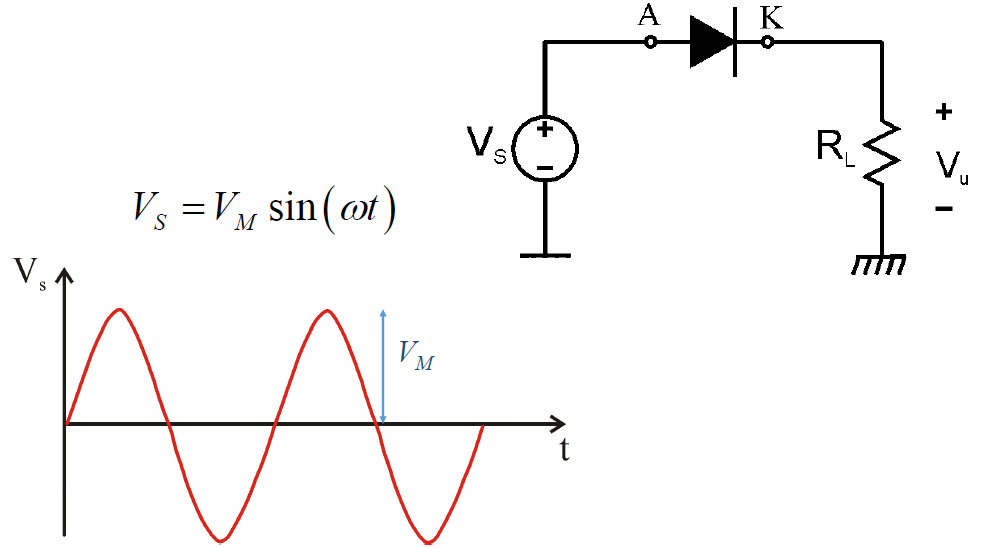

# Circuiti con diodi

Esistono una serie di circuiti che sfruttano i diodi per operazioni particolari, come ad esempio ottenere una tensione continua partendo da quella alternata. Procederemo con l'analisi di q+alcuni di essi tramite i modelli per grandi segnali visti nel capitolo precedente.

## Circuito rettificatore

Viene chiamato anche **circuiti a raddrizzatore di singola semionda**: è un circuito che **blocca** la tensione negativa. 

La tensione di rete ha un valore efficace di circa $230V$, con un valore massimo pari a $V_M = 230\cdot \sqrt{2} \approx 300 V$, rispetto al quale una tensione di $0.7V$ è del tutto trascurabile: possiamo dunque utilizzare anche il modello del diodo ideale.

### Circuito rettificatore con il modello del diodo ideale

{width=90%}

Utilizzando tale modello, verifichiamo il comportamento di $V_{AK}$, ovvero la tensione ai capi del diodo, all'interno di ogni semiperiodo. Nel primo la tensione $V_S$ è positiva, dunque l'anodo è collegato ad una tensione positiva, quindi posso ipotizzare che il diodo sia in conduzione, sostituendolo dunque con un cortocircuito.

In queste condizioni otteniamo che la caduta ai capi della resistenza è $V_S$, e la corrente $I_D$ che scorre tra Anodo e Catodo è positiva. Siamo in grado di dire ciò perchè sia $V_S$ che $R_L$ sono positive, e dunque il loro rapporto non può che essere positivo, dunque la nostra ipotesi iniziale è verificata. Notiamo inoltre che la tensione in ingresso è uguale alla tensione in uscita.

Nel secondo periodo la situazione è molto diversa:

Il periodo considerato va da $t_1$ a $t_2$, nel quale la $V_S$ è negativa: è legittimo pensare che il nostro diodo sia in interdizione, e che possiamo dunque sostituirlo con un circuito aperto.  Verifichiamo la nostra ipotesi verificando che $V_{AK} = V_S - V_U < 0$. La tensione in uscita è quindi nulla: riassumiamo il comportamento per $T_!$ e $T_2$ in questo grafico:

### Circuito rettificatore con il modello a caduta di tensione costante

{width=70%}

C'è una differenza sostanziale tra i due modelli nel primo semiperiodo: vediamo quale.
Ipotizziamo nuovamente che il diodo sia in conduzione, e sostituiamolo con un generatore di tensione: notiamo subito che la tensione in uscita differisce da quella in entrata per una quantità uguale a quella del generatore inserito al posto del diodo. Questa differenza può essere più o meno impatttante a seconda della tensione nella rete: nell'ordine del centinaio di Volt è sicuramente trascurabile, al contrario se ne valesse pochi, l'errore sarebbe enorme. Esiste anche un'altra differenza: l'ipotesi di conduzione è valida se e solo se $V_S \ge V_{\gamma}$. Questo porta ad una differenza anche nella forma d'onda, in quanto ci sarà un **ritardo** tra il momento in cui la tensione in ingresso risulta maggiore di zero e quello in cui il diodo inizierà a condurre: in questo tempo la tensione in ingresso non supera $V_{\gamma}$, non entrando dunque in conduzione. Questo fenomeno si presenta anche alla fine del periodo, cioè se il diodo smette di condurre prima. 

{width=50%}

L'analisi nel secondo semiperiodo è identica a quella del modello precedente, pertanto non verrà discussa. 
In conclusione, affermiamo che con questo modello c'è comunque una rettificazione, ma viene tagliata anche una parte dell'onda positiva. Posso anche calcolare il ritardo con il quale il diodo entra in conduzione con questa formula:

$$t^* = \frac{1}{\omega} \cdot arcsin (\frac{V_{\gamma}}{V_M})$$

Dopo aver calcolato $t^{*}$, in base al valore che ottengo potrò poi dire se è un tempo accettabile: se lo è allora la trattazione con il diodo ideale può andar bene, altrimenti vuol dire che è meglio usare il modello caduta costante; dipende quindi dal tipo di applicazione.

## Il PIV

Questo circuito, come i succssivi che analizzeremo, funzionano correttamente solo se il diodo rimane effettivamente **interdetto** per tutto l'intervallo di non conduzione. Seppur vero che se abbiamo una tensione negativa, allora il diodo è interdeetto, è altrettanto vero che se la tensione inversa supera un certo valore, allora il diodo **può andare in breakdown**, e condurre una corrente non più trascurabile. Devo dunque scegliere diodi che abbiano una tensione di breakdown maggiore della massima tensione inversa al quale il diodo può essere sottoposto. Il parametro che tiene conto di questo fenomeno è il **PIV** (Peak Inverse Voltage), ed è appunto la tensione inversa massima che verrà applicata al diodo.
Nel caso di un circuito rettificatore come quello precedente, $PIV = V_M$.

## Rivelatore di picco ideale

Si basa sul circuito del paragrafo precedente, ma sostituisce la resistenza con un **condensatore**:

{width=80%}

Ipotizziamo che all'istante $t_0$ il condensatore sia scarico e che il diodo sia in conduzione: useremo il modello del **diodo ideale**, quindi il diodo diventerà un cortocircuito, con $V_U = V_S$. 
Notiamo però che, una volta arrivato al valore di picco, il diodo **smette di essere in conduzione**. occorre spiegare questo fenomeno. La corrente che scorre nel diodo deve necessariamente essere positiva, ma essa è la stessa che scorre nel condensatore. Dato che $i_C = C \frac{dV_U}{dt}$ devo verificare che la derivata di $V_U$ per verificare l'ipotesi. Essa però è uguale a $V_S$ poichè al posto del diodo c'è un cortocircuito: essa sale, raggiunge il picco ed inzia a diminuire. Dal momento in cui inizia la discesa, la derivata inizia ad essere negativa, e dunque l'ipotesi non sarebbe più verificata. 
Esiste una spiegazione circuitale a questo avvenimento: il condensatore è un dispositivo che immagazzina carica elettrica, per cui esso inizierà a caricarlo fino a raggiungere il valore di picco. Una volta avvenuto ciò, esso dovrebbe iniziare a scaricarsi 'rilasciando' la carica in **direzione opposta.** Questo non accade a causa del diodo, che **vieta lo scorrere della corrente** in direzione opposta, quindi la carica rimane nel condensatore, facendolo rimanere fino al valore massimo.
Quando raggiungiamo il massimo della carica, il diodo **entra in interdizione**, diventando di fatto un circuito **aperto**; il condensatore non è in grado di scaricarsi perchè non è presente un carico sul quale può farlo, mantenendo quindi la carica fino al valore di picco con una differenza di potenziale pari a $V_S$. Il diodo tornerà in conduzione quando la tensione all'Anodo  sarà maggiore di quella al Catodo: in questo caso ciò non può avvenire perchè la tensione al catodo rimarrà costante a pari proprio a $V_S$. Analizziamo brevemente il **PIV**: il caso peggiore è quando $V_S = - V_M$, dove avremo $V_A = - V_M$, mentre $V_K$ rimarrà fissa grazie al condensatore.

Il dispositivo di fatto è in grado di generare una tensione continua, tuttavia è inutilizzabile nella pratica perchè, nel caso reale, vorrei sfruttare questa tensione su un carico. Un circuito con un carico verrà analizzato nel prossimo paragrafo.

## Circuito rettificatore con filtro RC

Limitiamoci ad aggiungere una resistenza in parallelo al condensatore, per simulare un carico:

Quando è in conduzione, il diodo è in cortocircuito, quindi $V_U$ è pari a $V_S$. Una volta che il picco viene raggiunto, il diodo entrerà in interdizione, ma a differenza del caso precedente, il condensatore è in grado di scaricarsi sulla resistenza: la tensione $V_U$ non rimarrà pari a $V_M$, ma diminuirà **esponenzialmente** in funzione di $e^{-\frac{t}{RC}}$.

Il diodo tornerà in conduzione quando la tensione sull'Anodo tornerà maggiore della tensione sul catodo, che ricordiamo sta diminuendo esponenzialmente: il generatore di tensione riprenderà a caricare il condensatore fino a che, nuovamente, non tornerà al picco quando il diodo entrerà nuovamente in interdizione, e così via. Tolto l’istante iniziale, una volta andato a regime, il diodo condurrà solo in brevissimi intervalli di tempo, in cui il generatore rifornisce il condensatore della carica che ha perso.

Alcune osservazioni: il condensatore è ora in grado di scaricarsi proprio perchè il diodo è spento, se il diodo non si interdicesse la curva blu andrebbe a seguire la curva rossa, quindi in questo circuito è **necessaria** la presenza del diodo; inoltre è vero che la curva non è costante, ma ci si avvicina molto. La sua oscillazione si chiama **ripple**, ed è appunto data dalla differenza tra la tensione di picco e quella minima al condensatore. In questo caso, il **PIV** non è esattamente $2V_M$, ma viene comunque approssimato a quel valore. 

Il circuito ideale è senza dubbio milgiore, ma è inutilizzabile nella pratica proprio a causa dell'assenza di carico. Se il condensatore  è molto grande rispetto a $R$, la scarica risulterà molto lenta e dunque trascurabile. Questo circuito, essendo molto economico, è spesso utilizzato in applicazioni a basso costo dove non è necessario un'alta qualità.
