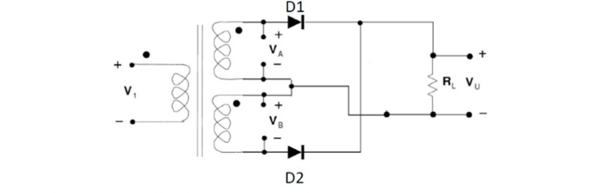
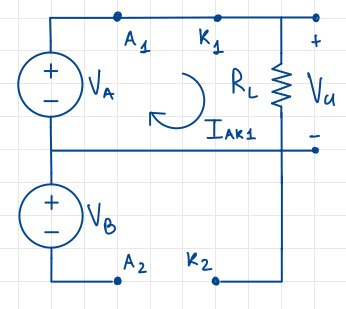
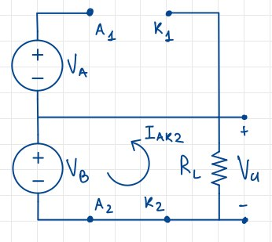
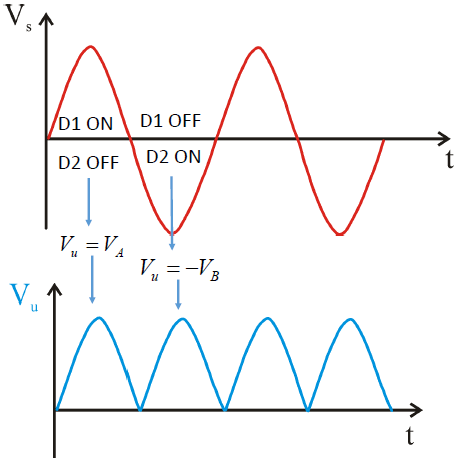
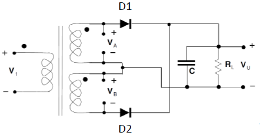
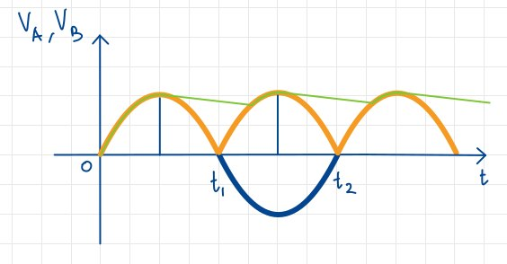
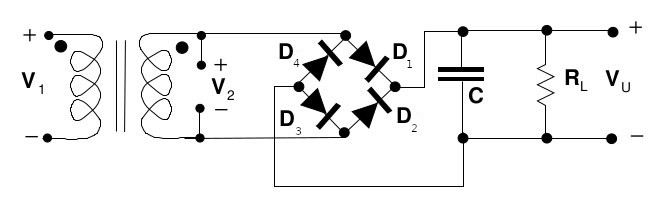
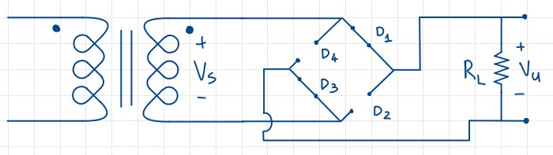
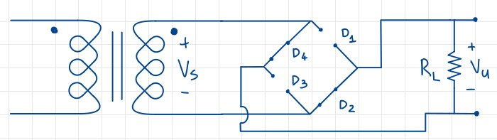
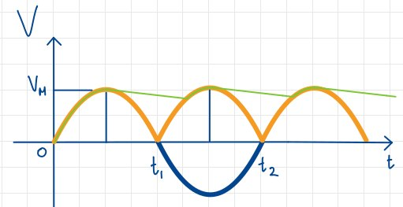

# Circuiti con trasformatori

## Introduzione: il trasformatore

Il trasformatore è il dispositivo che andremo ad utilizzare per collegarci alla rete elettrica; questo collegamento avviene tramite isolamento galvanico per questioni di sicurezza, in modo da non avere il resto del circuito secondario direttamente collegato alla rete elettrica.

Il trasformatore è un dispositivo che permette di trasformare una tensione in un'altra, mantenendo la stessa corrente. Questo è possibile grazie alla legge di Faraday, che ci dice che la variazione di un campo magnetico genera una variazione di tensione elettrica. Per convenzione si considerano le correnti$I_1$ e $I_2$, entranti nel contrassegno, come positive.

Il segno negativo implica che se $I_1$ è entrante, allora la $I_2$ deve essere uscente; Si ha inoltre $\frac{V_2}{V_1} = \frac{N_2}{N_1}$.

## Raddrizzatore a doppia semionda

Il raddrizzatore a doppia semionda è un circuito che permette *invertire* il lobo negativo della tensione sinusoidale, ottenendone uno **positivo**. Il suo circuito varia leggermente a seconda degli elementi circuitali utilizzati, e così farà anche l'andamento della tensione invertita.

### Raddrizzatore a doppia semionda con trasformatore a presa centrale

In questa tipologia il **condensatore è assente**, e si basa sul trasformatore **a presa centrale**: si tratta di un trasformatore con un circuito primario e **due secondari**. Dal punto di vista pratico, sono presenti due avvolgimenti con lo stesso numero di spire, tale che la tensione agli stessi sia uguale tra di loro,; sono inoltri presenti due diodi e una resistenza.

Sappiamo che $V_1$ è una **tensione sinusoidale**, e ciò implica che anche $V_A$ e $V_B$ lo sono.

#### Primo semiperiodo

Nel **primo semiperiodo** le due tensioni $V_A$ e $V_B$ sono **positive**: $D_1$ ha l'Anodo collegato al polo positivo di $V_A$, dunque è ragionevole ipotizzare che $D_1$ sia in **conduzione**. Di contro, $D_2$ ha l'Anodo collegato al polo negativo di $V_B$, dunque sarà **interdetto**.
Sostituiamo $D_1$ e $D_2$ rispettivamente con un cortocircuito e un circuito aperto; la tensione in uscita sarà dunque $V_U = V_A > 0$. 

Verifichiamo brevemente le ipotesi: $I_{AK1} = \frac{V_U}{R_L}$, ma essendo $V_A>0$, allora $I_{D1}>0$.Per quanto riguarda $D_2$, avrò una tensione pari a $-V_B < 0$, che conferma la bontà dell'ipotesi.

#### Secondo semiperiodo

Ora osserviamo che sia $V_A$ che $V_B$ sono **negative**; si presenta una situazione speculare rispetto al primo semiperiodo, in cui $D_1$ è interdetto e $D_2$ è in conduzione. 
Sostituiamo $D_1$ e $D_2$ rispettivamente con un circuito aperto e un cortocircuito; la tensione in uscita sarà dunque $V_U = V_B > 0$. 

La verifica delle ipotesi è analoga a quella del primo semiperiodo: $I_{AK2} = \frac{V_U}{R_L}$, ma essendo $V_B>0$, allora $I_{D2}>0$.Per quanto riguarda $D_1$, avrò una tensione pari a $V_A < 0$, che conferma la bontà dell'ipotesi in quanto $V_A$ è ora negativa.

#### Considerazioni

Sia nel primo che nel secondo semiperiodo abbiamo una $PIV = 2V_M$, poichè somma di due tensioni che al massimo valgono $V_M$; inoltre sulla resistenza scorrerà  una corrente che avrà sempre lo **stesso verso**. 
L'andamento della tensione in uscita è indicato nel grafico:

{ width=40%}

### Raddrizzatore a doppia semionda con condensatore

Stavolta il condensatore è presente, ed è in parallelo con la resistenza di carico. Il circuito è il seguente:

{width=60%}

#### Funzionamento

Il comportamento del circuito è del tutto **identico** a quello del primo semiperiodo del raddrizzatore a doppia semionda con trasformatore a presa centrale, ipotizzando che il comportamento dei diodi rimanga invariato per tutto il semiperiodo. La prima differenza si manifesta subito dopo l'arrivo del picco di tensione, ovvero quando la tensione sul condensatore è maggiore di $V_A$. Questu'ultima inizierà a diminuire, e contemporaneamente il condesatore inizierà a scaricarsi sulla resistenza di carico. Potremo pensare che il processo di scarica sia identico a quello del circuito rettificatore, ma in realtà qualcosa cambia: il periodo di scarica **dura la metà**, perchè il condensatore riprende a caricarsi nel semiperiodo successivo. Questo implica che, a parità di parità di parametri del filtro $RC$, la **tensione di ripple sarà minore**; la tensione avrà dunque questo andaamento:

#### Osservazioni

- La tensione $PIV$ continua a valere $2V_M$, dunque risulta essere indipendente dalla presenza del condensatore o dalla sua capacità;
- questi dispositivi sono genere più cari;
- questa tipologia di dispositivi è molto ingombrante, e quindi non è adatto per applicazioni mobili.

## Raddrizzatore a ponte di Graetz

E' un dispositivo che raddrizzza la tensione alternata senza bisogno del doppio circuito secondario; il suo schema circuitale è il seguente:

### Analisi del circuito senza condensatore

Per semplicità non considereremo il condensatore durante l'analisi, per il fatto che introdurrà lo stesso effetto di **livellamento** della tensione già osservato in precedenza.

Ipotizziamo che durante la semionda positiva di $V_2$ i diodi $D_1$ e $D_3$ siano in conduzione, mentre $D_2$ e $D_4$ siano interdetti, e sostituiamo con corti e aperti dove necessario. Otterremo:

Si noti come sia in $D_1$ che $D_3$ vi scorra corrente positiva, e come la tensione ai capi di $D_2$ e $D_4$ sia pari alla tensione in uscita dal trasformatore, ma cambiata di segno: essendo questa originariamente positiva, allora la tensione ai capi dei diodi sarà negativa, confermando l'ipotesi di interdizione e conduzione. 

Analogalmente, possiamo analizzare e giustificare la situazione per la semionda negativa di $V_2$:

L'ipotesi è che stavolta $D_1$ e $D_3$ siano interdetti, mentre $D_2$ e $D_4$ siano in conduzione: la corrente ai loro capi è esattamente  $V_S$ che in questo frangente è negativa; la corrente in $D_2$ e $D_4$ vale $-\frac{V_S}{R_L}$, e risulterà positiva, confermando l'ipotesi di conduzione. 

In conclusione, abbiamo dimostrato come questo circuito sia effettivamente in grado di raddrizzare la tensione in entrata.

### Analisi del circuito con condensatore

Il condensatore ha lo stesso effetto visto nel raddrizzatore a presa centrale: si carica fino a raggiungere il picco della prima semionda, inizia a scaricarsi fino a che non vedrà nuovamente una tesione maggiore, e così via, come descritto evidenziato nel grafico:

### Pregi e difetti del ponte di Graetz

Il ponte di Graetz ha diversi pregi:

- richiede un condensatore più piccolo rispetto a quello a presa centrale;
- $PIV = V_M$, più basso rispetto al raddrizzatore a presa centrale;
- viene molto spesso fornito come circuito integrato.

Bisogna anche considerare i seguenti difetti:

- sono richiesti 4 diodi invece che 2, anche se ciò viene compensato dal $PIV$ minore;
- ci sono 2 diodi in serie, il che renderebbe l'ipotesi di $V_U = V_D$ non valida, perchè andrebbe tenuta in considerazione la caduta sui diodi. Ciò comporta un ritardo di reazione $\Delta t$, e una tensione in uscita pari a $V_M - 2\cdot V_{\gamma}$.
