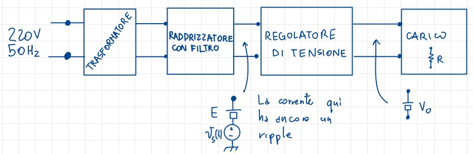
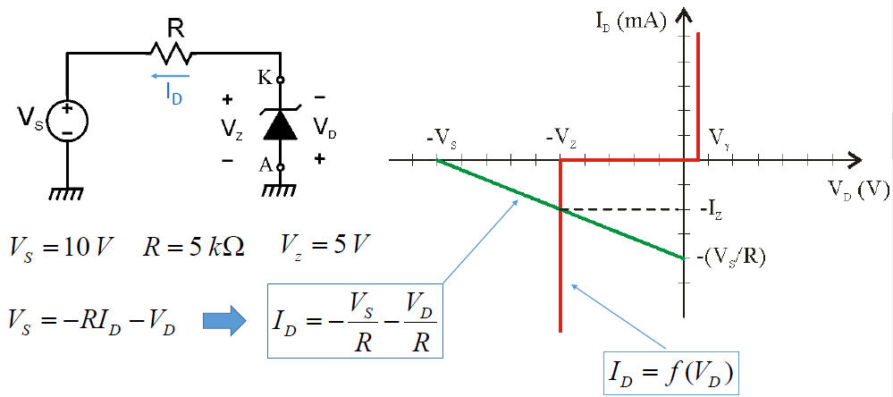
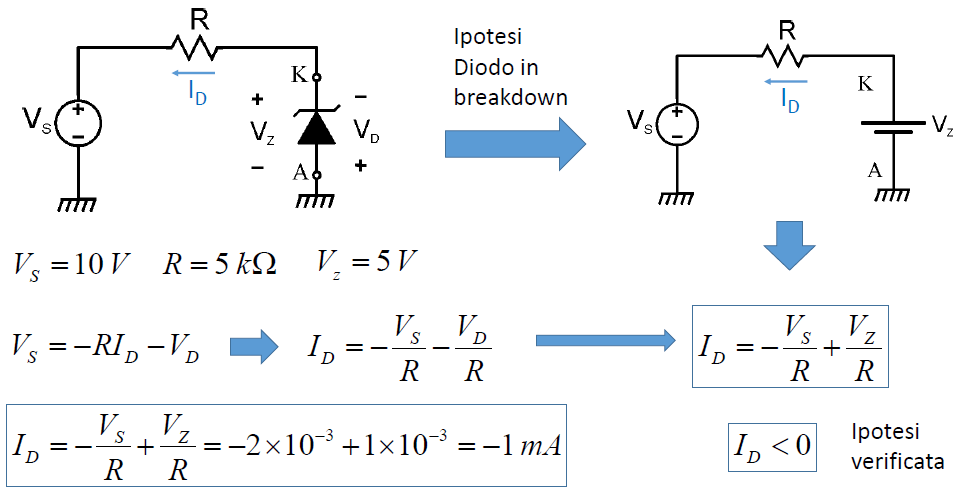
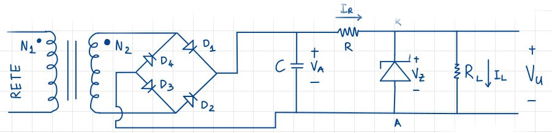

# I regolatori di tensione

Immaginando un percorso che porta la tensione dai valori di rete, dunque $220V @ 50Hz$, a valori costanti, manca un dispositivo fondamentale: il **regolatore di tensione**: 

I regolatori di tensione rendono costante la corrente, eliminano i ripple e permettono di applicare filtri alla tensione.

## Regolatori di tensione Zener

Analizziamo brevemente un circuito che utilizza un diodo Zener per regolare la tensione:

{width=50%}

Notiamo subito come il diodo sia stato montato al contrario: esso potrà quindi essere o spento o in breakdown.

Ipotizziamo che sia in *breakdown*, e andiamo a sostituirlo con un generatore di generatore costante di valore $V_Z$: il $+$ è collegato all'Anodo, e il $-$ è collegato al catodo. Scegliamo $I_D$ in modo che scorra da Anodo a Catodo, in modo che $V_S = I_D R - V_D$. Utilizziamo i dati della figura precedente, e otteniamo:

{width=50%}

Abbiamo verificato l'ipotesi e siamo sicuri che il risultato sia attendibile perchè in linea con quello ottenuto per via grafica, rappresentato nella **figura 10.2**.

In generale, tutti i diodi hanno un limite di funzionamento oltre i quali essi smettono di funzionare; Visto che la tensione non può essere limitata, limiteremo la corrente aggiungendo, per esempio, una resistenza o, ancor meglio, utilizzando generatore di corrente costante.

Dato che la caratteristica di un diodo Zener non mai perfettamente verticale, aggiungeremo in serie una resistenza in serie al generatore $V_Z$ per renderlo un dispositivo reale.

Si potrebbe inoltre definire una $I_{ZK}$ oltre la quale la risposta risulterebbe perfettamente verticale, ma per i nostri scopi la ignoreremo e la porremmo uguale a $0$.

## Circuito regolatore Zener

Questo circuito è molto simile al ponte di Graetz, ma viene aggiunto un diodo Zener e una resistenza:

La peculirità è che se il diodo funziona in breakdown, allora la sua caratteristica è verticale, e dunque la tensione ai suoi estremi è costante.

Un regolatore di tensione è un dispositivo che in ingresso ha una tensione assimilabile ad una costante con qualche variazione, come quella in uscita da un ponte di Graetz, e in uscita ha una tensione costante.

### Analisi del circuito

Ipotizziamo i versi di $I_R, I_Z$ e $I_L$: se verifichiamo che $I_Z > 0$, ovvero se il diodo sta funzionando in breakdown, allora la tensione ai suoi capi è $V_Z$ che è anche uguale a $V_U$, indipendente dal valore di $V_A$ e di $R_L$.

Procediamo con il calcolo dei limiti di funzionamento:

$$I_R = \frac{V_A - V_Z}{R_L}, I_L = \frac{V_Z}{R_L}$$

Le equazioni al nodo ci dicono che $I_Z = I_R - I_L$ e quindi:

$$I_Z = \frac{V_A - V_Z}{R_L} - \frac{V_Z}{R_L} > 0$$

In pratica il diodo Zener **assorbe le variazioni di corrente, per mantenere $I_L$ costante**. Affinchè ciò accada devo fare in modo che $I_Z$ rimanga sempre positiva, il che mi impone limiti sul carico $R_L$, che altrimenti renderebbe $I_L$ troppo grande.

#### Limiti di funzionamento di corrente 

Ipotizziamo $V_A$ costante, allora anche $I_R$ è costante, e andrà in parte sul diodo Zener, e in parte sul carico $R_L$. Se però diminuissi il carico $R_L$, avrei un incremento di $I_L$ e contemporaneamente un decremento di $I_Z$. Diminuendo ulteriormente $R_L$ arriverei al limite per il quale la $I_Z$ si annulla totalmente: questo è il limite oltre il quale il diodo Zener smette di funzionare correttamente. Di conseguenza non potrò diminuire troppo il carico $R_L$, pena il rischio di far smettere di funzionare il diodo Zener. Individuo questo limite anche dal punto di vista matematico:

$$I_Z = 0 \rightarrow I_{LMax} = \frac{V_A - V_Z}{R_L}$$

#### Limiti di funzionamento di Potenza

Il diodo può sopportare un valore massimo di potenza sopportabile, oltre il quale può bruciare e quindi rompersi. Questo valore dipende direttamente dalla corrente che vi scorre:

$$P_{ZMax} = I_{ZMax} V_Z = V_Z\frac{V_A - V_Z}{R_L}$$

Risulta ovvio che il dispositivo non può erogare tensioni troppo elevate altrimenti, quando il carico non è collegato, tutta la corrente passerebbe nel diodo bruciandolo. Di fatto, il limite è proprio la potenza dissipabile dal diodo.
