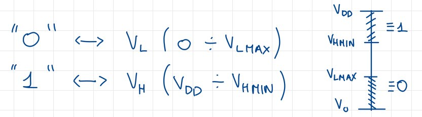
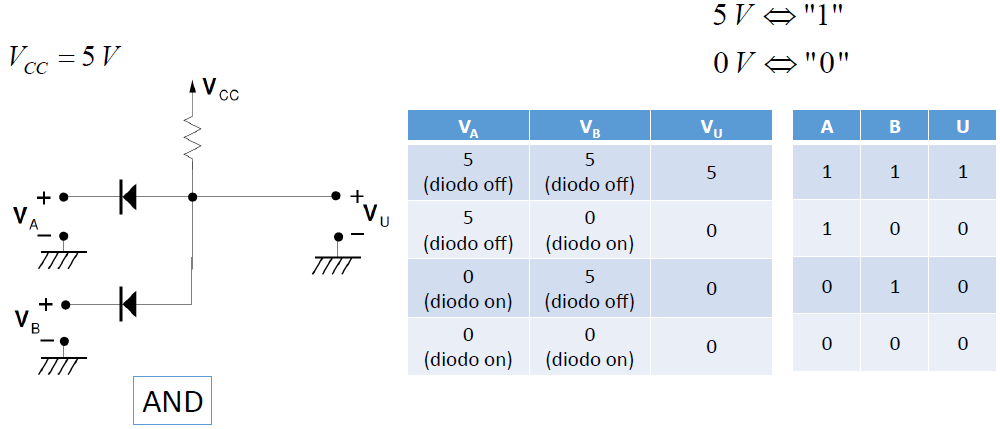
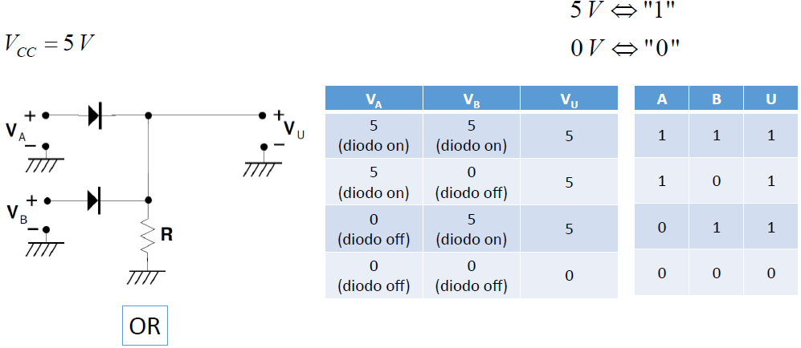

# La logica a diodi

La logica a diodi ha come obbiettivo il realizzare **circuiti digitali** tramite i diodi.
Scegliamo una tensione di riferimento, soltitamente $5V$, e la indichiamo con $V_{DD}$: assegnamo il valore logico $1$ ai valori di tensione pari a $V_{DD}$, con una certa tolleranza pari a $V_{LMin}$, e di assegnare il valore logico $0$ alla tensione 0, più una certa tolleranza $V_{LMax}$.

## Circuiti logici

Utilizziamo ora questa scala di valori per analizzare alcuni circuiti, utilizzando l'ipotesi del diodo ideale.

### Il circuito per la porta AND

{width=55%}

### Il circuito per la porta OR

{width=55%}

## Le problematiche della logica a diodi

Innanzitutto è necessaria molta corrente per alimentare i circuiti quando i diodi sono in conduzione, quando invece andrebbe limitata il più possibile.
L'altro problema è la degradazione dei livelli logici quando vengono messi in cascata più circuiti logici, e ciò è dovuto alla non idealità  dei diodi, ovvero $V_{\gamma}\not = 0$. Potrei addirittura avere dei casi in cui un $1$ diventa un $0$.
L'ultimo problema è che non è possibile costruire la porta NOT con i diodi. Quindi dovremo trovare altre tecnologie per realizzare i circuiti digitali.
