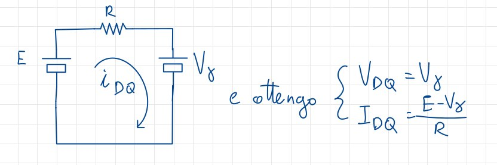
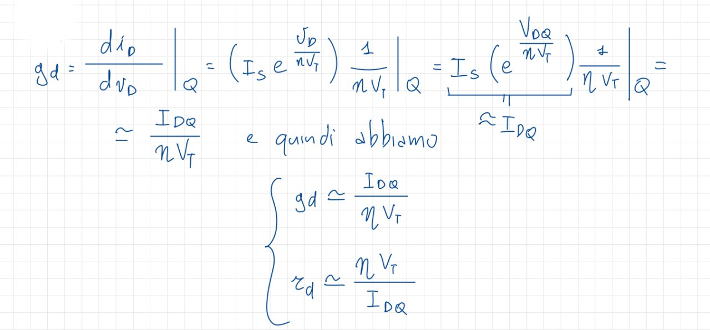

# Il modello per i piccoli segnali

Immaginiamo di trattare un circuito in presenza di due valori di tensione, uno grande e costante e uno piccolo e variabile. In questo caso le sollecitazione sui diodi è fatta attraverso due generatori di tensione, uno grande e costante e uno piccolo e variabile, e il valore complessivo è dato dalla somma dei due segnali. A tal proposito introduciamo una convenzione per indicare e riconoscere questi segnali:

- **Valori costanti**: simbolo **maiuscolo** e pedice **maiuscolo**, ad esempio $V_{CC}$;
- **Valori variabili**: simbolo **minuscolo** e pedice **minuscolo**, ad esempio $v_{be}$;
- **valori istantanei o complessivi**: simbolo **minuscolo** e pedice **Maiuscolo**, ad esempio $v_{BE}$.

Risolvendo graficamente un circuito di questo tipo circuito, otteniamo che il punto di riposo varierà lungo la caratteristica, e anche una piccola variazione del segnale di ingresso può portare a una variazione del punto di riposo. I metodi precedentemente utilizzati per risolvere circuiti non sono più validi, e ovviamente non possiamo utilizzare nemmeno il principio di sovrapposizione degli effetti.
Andrò quindi a cercare valori **nell'intorno** del punto di riposo. Andrò ad approssimare l'esponenziale con una retta: un elemento circuitale con caratteristica uguale ad una retta è la resistenza, quindi posso pensare di utilizzarla per risolvere il circuito. In particolare utilizzerò la **resistenza differenziale**: il nome deriva dal fatto che lo andrò a calcolare come il differenziale nell'interno del punto di riposo. Si indica come $r_d$, quindi per la nostra convenzione è un valore **variabile** e assumerà il valore della pendenza della retta nell'interno di Q.

$$\qquad$$
$$\qquad$$

## Risoluzione del primo circuito

Dovrò di fatto risolvere due circuiti, uno in cui ho solo il generatore di tensione che mi determina il punto di lavoro, e  uno in cui, una volta noto Q, calcolo la resistenza differenziale, sostituendola al posto del diodo, senza il generatore costante.

{width=70%}

Risulterà dunque $i_d = T_D + i_d(t)$

Si noti come con un segnale variabile, le rette varieranno nel tempo ma mantenendo la stessa pendenza. Scrivo ora le equazioni per risolvere il circuito:

$$
\begin{cases}
E + v_s(t) = Ri_d + v_d \\
i_d = f(v_D)
\end{cases}
$$

$$\qquad$$

Posso ora scrivere:
$$
\begin{cases}
i_D = T_{DQ} + i_d \\
v_D = V_{DQ} + v_d
\end{cases}
$$

Inoltre sappiamo che, se $v_D = 0$, allora il circuito si riduce a:

che posso trasformare, grazie al modello a caduta costante, in:

Svolgendo calcoli e semplificazioni ottengo infine:

$$v_s = Ri_d + v_d$$

che equivale ad un circuito con una resistenza, un generatore e un diodo con tensione $v_d$.

In questo circuito ho solo generatori di segnali non costanti, ma ho una sola equazione per due incognite. Ci serve un'equazione che ci fornisca il legame tra $i_d$ e $v_d$.
Non posso utilizzare l'equazione del modello di Shockley perché sto studiando il problema intorno al punto Q e non allo zero. Se $|v_s| \ll |E|$ posso approssimare tramite lo sviluppo in serie attorno al punto di lavoro:

$$i_d = I_{DQ} + i_d = f(v_d) + \frac{d f}{d v_d} |_{Q} + \frac{1}{2}\frac{{d^2 f}}{dv_d^2}|_Q v_d^2$$

In questo caso posso fermarmi al primo ordine e ottenere:

$$i_D = \frac{df}{dv_D}|_Q v_d$$

Abbiamo ottenuto quindi una relazione tra $i_d$ e $v_D$ che stavamo cercando.
Definiamo poi la **conduttanza differenziale** come:

$$g_d = \frac{df}{dv_D}|_Q$$

che ci permette di definire la **resistenza differenziale** come:

$$r_d = \frac{1}{g_d}$$

Notiamo come la derivata vada calcolata nel punto di lavoro Q, e quindi cambierà tra un punto di lavoro e l'altro.

In prima approssimazione avremo un circuito lineare, che sappiamo risolvere:

{width=70%}

Ovviamente tutti i calcoli sono corretti se e solo se possiamo fermarci al primo termine dell'espansione in serie, ovvero se:

$$\frac{d f}{dv_D}|_Q >> \frac{1}{2}\frac{d^2 f}{dv_D^2}|_Q v_D^2$$

$$v_d << 2\eta V_T \approx 52mV$$

In conclusione, per applicar il modello dei piccoli segnali è necessario che la tensione ai capi del diodo sia molto inferiore a $52mV$.
