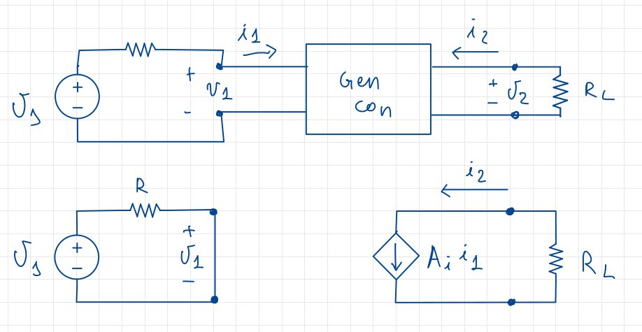
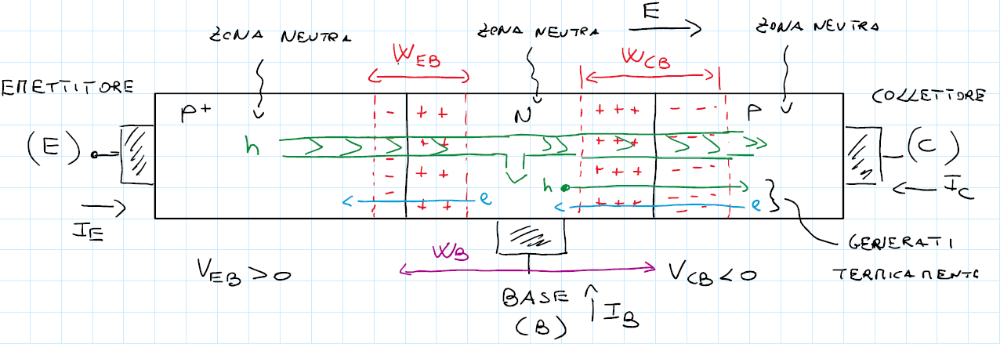
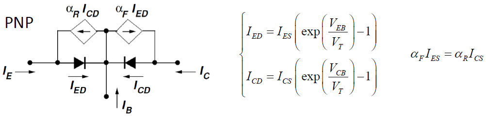
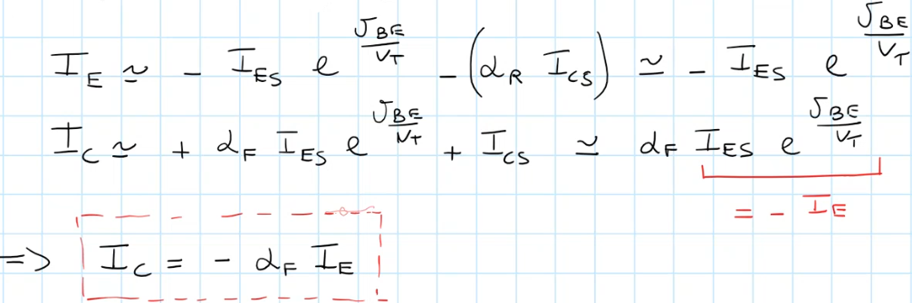
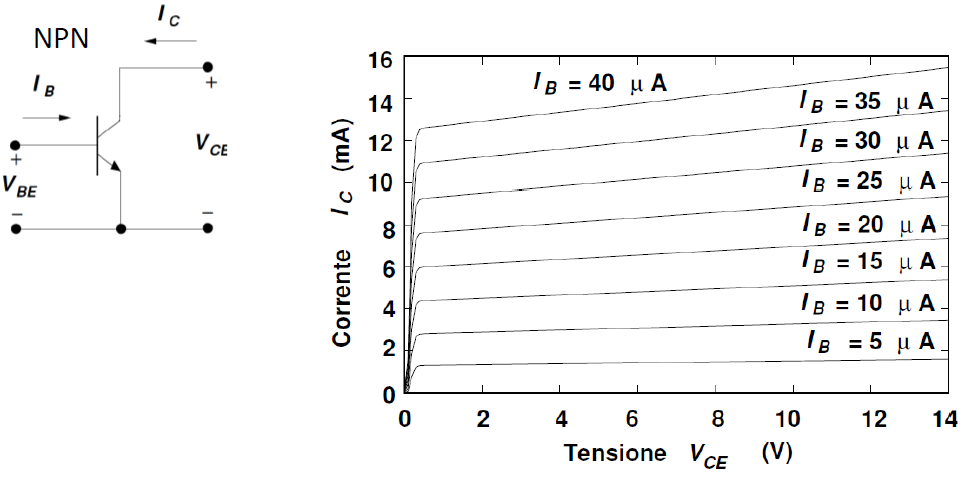
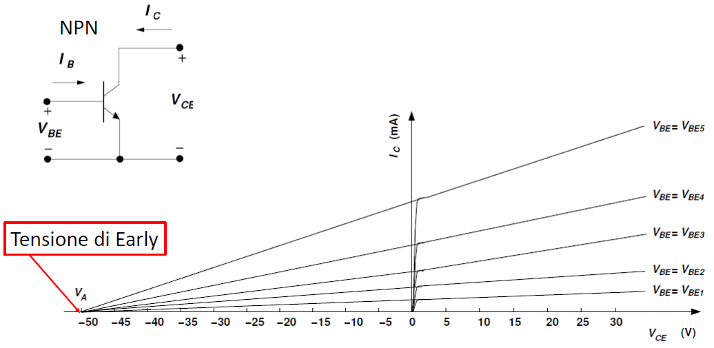

# I BJT - Transistor a giunzione bipolare

Prima di discutere del BJT, è necessario introdurre i generatori di corrente controllati in corrente, che ci saranno utili durante l'analisi dei BJT, essendo loro stessi degli elementi assimilabili a dei generatori di corrente.

## I generatori di corrente controllati in corrente

{width=50%}

Immediatamente ricaviamo che $i_2 = A_i i_1$, e dunque $A_i = \frac{i_2}{i_1}$; $A_i$ è detto **guadagno di corrente** e, in particolare:

- **amplificatore di corrente** se $A_i > 1$
- **attenuatore di corrente** se $A_i < 1$

Ora possiamo ricavare la relazione tra le tensioni e le correnti generate dal generatore. Le equazioni del sistema sono:

$$
\begin{cases}
v_2 = -R_L i_2 = -R_LA_ii_1 \\
i_1 = \frac{v_s}{R}
\end{cases}
\to v_2 = \frac{R_LA_iv_s}{R}
$$

Definiamo quindi $A_v = \frac{v_2}{v_s}$ come il **guadagno di tensione**. Similarmente a quanto fatto per il guadagno di corrente, possiamo dire che:

- **amplificatore di tensione** se $A_v > 1$
- **attenuatore di tensione** se $A_v < 1$

Infine definiamo il **guadagno di potenza** come:

$$A_p = \frac{Potenza sul carico}{Potenza in ingresso} = -\frac{v_2i_2}{v_si_1} = -A_vA_i$$

Sviluppando ulteriormente la relazione, troviamo un risultato interessante:

$$A_p = -(-\frac{R_L}{R}A_i)A_i = A_i^2 \frac{R_L}{R}$$

ovvero che il guadagno di potenza è **sempre positivo**. Anche in questo caso avremo un'ulteriore specificazione:

- **amplificatore di potenza** se $A_p > 1$, il che implica che l'elemento circuitale sia **attivo**;
- **attenuatore di potenza** se $A_p < 1$, che invece implica che l'elemento circuitale sia **passivo**

### Caratteristiche del circuito

Partiamo innanzitutto con le definizioni di **caratteristiche del circuito**:

- **di ingresso**: è la rappresentazione del comportamento del dispositivo sul piano $i_1, v_1$. La corrente in ingresso viene rappresentata solitamente come una funzione di $v_1$ e una delle componenti in uscita (quindi $i_2$ o $v_2$)
- **di uscita**: è la rappresentazione del comportamento del dispositivo sul piano $i_2, v_2$. La corrente in uscita viene rappresentata solitamente come una funzione di $v_2$ e una delle componenti in ingresso (quindi $i_1$ o $v_1$)

Nel circuito presentato precedentemente notiamo come la caratteristica in ingresso non abbia alcuna dipendenza con quella di uscita, e non può dunque essere rappresentata graficamente, mentre invece la corrente in uscita è legata a quella di ingresso, vista la relazione $i_2 = A_i i_1$. Questo ci permette di definire le caratteristiche di uscita come un fascio di rette parallele all'asse delle ascisse.

## Il BTJ

### Introduzione

Il transistore bipolare è, dal punto di vista fisico, un dispositivo con due giunzioni PN poste una di seguito all'altra, ma **orientate in senso opposto**: a seconda di come lo costruiamo, potremo avere dunque due tipi di transitori bipolari: **PNP** e **NPN**.

Il transistor, per funzionare, necessita che una delle due estremità abbia un drogaggio maggiore rispetto all'altra, e questo viene indicato tramite un $^+$ sull'estremità maggiormente drogata.
Il dispositivo ha tre terminali, chiamati:

- **emettitore**, che corrisponde all'estremo maggiormente drogato;
- **collettore**, che corrisponde all'estremo meno drogato;
- **base**, che corrisponde all'estremo intermedio, a comune tra i due dispositivi.

Il simbolo circuitale di un BJT è il seguente:

dove la freccia indica l'emettitore, che cambia tra **PNP** e **NPN**.

### Zona di funzionamento in Zona Attiva Diretta

Abbiamo 2 giunzioni, le quali possono essere polarizzate in diretta o in inversa, e quindi possiamo avere 4 zone di funzionamento. Ci concentreremo maggiormente su quella maggiormente utilizzata in ambito analogico, ovvero quella detta **polarizzazione in zona attiva diretta**:
la giunzione Base-Emettitore è polarizzata in **diretta**, mentre quella Base-Collettore è polarizzata in **inversa**. Gli spostamenti di lacune ed elettroni sono schematizzati di seguito:

La barriera di potenziale tra Base ed Emettitore è stata abbassata dalla polarizzazione diretta, per cui assisterò ad un'iniezione di lacune da $P^+$ verso N, e una diffusione di elettroni da $N$ verso $P^+$. Dato che però il transistore è progettato in modo che il drogaggio dell'Emettitore sia **molto maggiore** di quello della Base, allora la quantità di elettroni che vengono iniettati dalla Base verso l'Emettitore per effetto della polarizzazione è **trascurabile** rispetto all'iniezione di lacune da $P^+$ verso N; questa condizione è **molto importante** per il funzionamento dell'intero dispositivo.

Dobbiamo fare un'ipotesi semplificativa, ovvero assumeremo che **il campo elettrico nelle zone neutre sia piccolo**, e dunque tale che lo spostamento delle cariche nelle zone neutre avvenga solo per **diffusione**.

Tornando alle lacune iniettate da $P^+$ verso N, esse si ritrovano in un semiconduttore drogato N, dunque con una grande disponibilità di elettroni. Questo implica che la **probabilità che queste lacune si ricombinino con gli elettroni è molto alta**; tuttavia la costruzione del dispositivo mi impone che la **larghezza della Base sia piccola**. Questo mi implica che la percentuale di lacune che si ricombinano con gli elettroni è **molto bassa**, e la maggior parte di esse arriverà al bordo della zona di svuotamento della giunzione Base-Collettore, chiamata $W_{CB}$. All'interno della zona di svuotamento esiste un campo elettrico favorevole, grazie al quale le lacune vengono trascinate nel Collettore, ottenendo una transizione di portatori, in questo caso lacune, da Emettitore a Collettore, attraverso la Base.

Le condizioni per far funzionare correttamente il BJT in ZAD sono il **drogaggio** e dimensione della Base, che deve essere **piccola e stretta**, in modo che la percentuale di portatori ricombinati in base sia piccola.

Un'altra ipotesi che viene fatta è che la giunzione inversa Base-Collettore sia tale che la corrente che vi scorre sia **trascurabile**. Considerando l'altra ipotesi preliminare, ovvero che i portatori, nella zona neutra, si muovano solo per diffusione, allora otteniamo una **corrente che scorre dall'Emettitore al Collettore**.
Questa corrente risulta essere costante, perché considerando che la *corrente di ricombinamento* risulta essere costante, in quanto data dalla ricombinazione dei portatori attraverso la zona $LB$ di dimensioni finite, allora la quantità di lacune che arriva alla giunzione Base-Collettore è costante. Siamo in grado di controllare questa corrente tramite quella di Base, che è la grandezza pilota del sistema.

La corrente di base ha l'importante compito di **rifornire la base B di elettroni**. Infatti, abbiamo visto che in essa gli elettroni vengono persi per via del fenomeno della ricombinazione: questi elettroni persi devono essere riforniti, altrimenti questa zona della base non rimarrà neutra. Se la base dovesse iniziare a caricarsi positivamente, l'**iniezione di lacune verrebbe ostacolata**.

Inoltre, dobbiamo compensare anche gli elettroni che dalla base vengono iniettati nell'emettitore (per diffusione), perché anche questi vengono persi, sebbene siano in numero minor: in questo bilancio di cariche, **guadagnamo un po' di elettroni** dal fatto che alcuni vengono iniettati dal collettore verso la base.

In conclusione, se la ricombinazione è piccola, la corrente di base sarà piccola rispetto alla corrente di emettitore e collettore, perché deve solo rifornire i pochi elettroni che vengono persi dalla ricombinazione che avviene in quella zona, che in una situazione stazionaria sono una percentuale fissa.

L'altra cosa da capire è: **perché se aumentiamo la corrente di base, aumenta anche la corrente che transita dall'emettitore al collettore**? Sostanzialmente, se consideriamo il fatto che la percentuale di lacune perse nella ricombinazione è fissa, aumentando la corrente di base, possiamo iniettare un maggior quantitativo di lacune verso la base, che poi transiteranno al collettore. Allo stesso modo, se diminuiamo la corrente di base, la corrente che arriva al collettore diminuirà.

Ciò è dovuto al fatto che il rapporto tra lacune che passano ed elettroni iniettati in base deve rimanere costante. Pertanto, se modifichiamo la quantità di elettroni iniettati, **il passaggio di alcune aumenterà o diminuirà automaticamente**, poiché troveranno una maggiore o minore ricombinazione.

La corrente di base è in grado di controllare il flusso principale. Inoltre, teniamo presente che la corrente di ricombinazione è piccola, quindi siamo nella situazione in cui la corrente di base è molto piccola rispetto a quella controllata, abbiamo quindi le condizioni per affermare che il BJT è un amplificatore di corrente.

### Modello di Ebers-Moll

Per evitare la trattazione matematica, utilizzeremo il **modello di Ebers-Moll per grandi segnali** del transistore. Questo modello è in grado di descrivere tutte le zone di funzionamento del transistore che andremo a trattare.

Analizziamo un BJT in configurazione PNP, iniziando da suo circuito equivalente:

{width=50%}

In polarizzazione diretta le lacune che riesco a passare dall'emettitore al collettore sono date dal generatore controllato $\alpha_FI_{ED}$. Con $\alpha_F$ indichiamo la **frazione di corrente diretta**, ovvero la frazione di portatori iniettati dall'Emettitore in Base che riescono ad arrivare al Collettore. Il valore di $\alpha_F$ è compreso tra $0.98$ e $0.998$: la parte mancante per arrivare ad 1 è dovuta ai portatori che si ricombinano in base e che dunque non riescono ad arrivare al Collettore, Il generatore controllato va inserito quindi alla base del Collettore, perché costituisce la parte di lacune che dalla base arrivano al collettore, in quanto non sono riuscite a ricombinarsi in base; il generatore controllato ha come verso lo stesso della corrente $I_{ED}$, che va dall'Emettitore alla base, da cui deriva la $_F$ che sta per *forward*.

Il transistor può lavorare anche in polarizzazione inversa, vale a dire che posso decidere di polarizzare la giunzione Base-Collettore in diretta, e quella Base-Emettitore in inversa: in questo caso avrei una corrente $I_{CD}$ che va dal Collettore alla Base. Questo comportamento è identificato dall'altro generatore $\alpha_RI_{CD}$, con $\alpha_R$ definito come **frazione di corrente inversa**, la cui $_R$ indica *reverse*. Questo comportamento è meno efficiente del precedente, e infatti si osserva che $\alpha_R$ è molto minore rispetto a $\alpha_F$ ($0.4 \le \alpha_R \le 0.8$); questo funzionamento dipende dai drogaggi, ricordiamo infatti come l'Emettitore è molto più drogato del collettore, oltre a presentare anche differenze geometriche. Il BJT infatti **non è simmetrico**, quindi Emettitore e Collettore **non sono intercambiabili**.
Per convenzione, quando si utilizza il modello di Ebers-Moll, i versi delle correnti esterne, che sono $I_E$, $I_C$ e $I_B$, sono tutti **entranti** nel dispositivo.

#### Equazioni di Ebers-Moll

Scriveremo sia le equazioni interne che quelle esterne, e dunque entranti, nel dispositivo.
Iniziamo con quelle esterne:

Il valore di $I_{ED}$ è quello di una corrente che **attraversa il diodo**, espressa dal modello di Shockley, nel quale $V_{EB}$ è la tensione tra Emettitore e Base.
Il valore di $I_{CD}$ è invece il valore della corrente che passa nell'altro diodo, dato sempre dal modello di Shockley, nel quale $V_{CB}$ è la tensione tra Collettore e Base.
Aggiungiamo a questo punto una **regola di reciprocità**:

$$\alpha_F I_{ES} = \alpha_R I_{CS}$$

che utilizzeremo, assieme alle altre equazioni, per trovare quelle relative alle correnti interne:

{width=60%}

#### Riepilogo

Le quattro zone di funzionamento del BJT sono riassunte in questa tabella:

Nella zona attiva diretta il BJT è utilizzato come **amplificatore**, in quanto la piccola corrente di Base riesce a controllare la corrente di Collettore, che è molto più grande.

Nella **zona attiva inversa** il BJT è ancora utilizzato come amplificatore, ma ho **prestazioni molto degradate** rispetto al funzionamento in attiva diretta (ricordiamo i valori di $\alpha_F$ e $\alpha_R$).

Nella zona di **interdizione**, quindi con entrambe le giunzioni polarizzate in inversa, la corrente che scorre è praticamente nulla e il BJT è assimilabile ad un **interruttore aperto**.

Nella zona di **saturazione** invece abbiamo entrambe le giunzioni in diretta, entrambe iniettano portatori in Base, rendendo di fatto il BJT un **interruttore chiuso**.

### Struttura fisica del BJT PNP

{width=50%}

Come detto, il dispositivo non è simmetrico e riusciamo ad apprezzare meglio questa asimmetria con la figura; inoltre notiamo anche che l’emettitore è più piccolo e molto più drogato del collettore, che è più grande oltre ad avere un drogaggio minore.

## BJT NPN

Abbiamo introdotto dei componenti elettronici chiamati generatori di corrente controllati in corrente, che possono essere descritti come quadripoli. Per rendere il nostro transistor un dispositivo con una porta di ingresso e una porta di uscita, dobbiamo collegare uno dei suoi tre terminali in comune tra ingresso e uscita. Ci sono tre modi per farlo: emettitore comune, base comune e collettore comune. Tuttavia, ci concentreremo solo sulla configurazione a emettitore comune, poiché è quella che ci interessa per i nostri scopi.

Nella configurazione a emettitore comune, il terminale dell'emettitore è collegato in comune tra ingresso e uscita. In questo modo, abbiamo una porta di ingresso tra base ed emettitore e una porta di uscita tra collettore ed emettitore. Per il nostro studio, considereremo solo il transistor NPN, in cui gli elettroni si muovono dall'emettitore al collettore e le lacune si muovono dalla base all'emettitore. In questo modo, avremo una corrente che scorre dal collettore all'emettitore e un flusso di lacune nella base.

{width=50%}

Il nostro dispositivo ha delle specifiche di ingresso che sono rappresentate dalla corrente di base $I_B$ in funzione della tensione $V_{BE}$ e $V_{CE}$. Ciò significa che le specifiche di ingresso saranno tracciate su un grafico bidimensionale che mostra IB in funzione di $V_{BE}$ e $V_{CE}$. D'altra parte, le specifiche di uscita sono rappresentate dalla corrente di collettore IC in funzione di $V_{CE}$ e $I_B$. Queste specifiche di uscita saranno tracciate su un grafico bidimensionale che mostra $I_{C}$ in funzione di $V_{CE}$, con $I_B$ come parametro di ingresso. Solitamente, la corrente di base $I_B$ viene utilizzata come parametro di ingresso per tracciare le caratteristiche di uscita.

### Modello di Ebers-Moll per il transistor NPN

Scriviamo le equazioni del modello per le correnti interne ed esterne, come fatto per il BJT PNP:

Vogliamo confermare che la nostra analisi ci indica che questo dispositivo è un generatore di corrente controllato in corrente, che è il concetto fondamentale che ci ha portato a questo punto.
Se il dispositivo si trova nella regione attiva diretta, possiamo affermare che $V_{BE} >> V_T$ poiché la giunzione base-emettitore è polarizzata in diretta, mentre $V_{BC} << - V_T$ poiché la giunzione base-collettore è polarizzata in inversa con VBC negativo.
Nella polarizzazione diretta del PNP avevamo $V_E > V_B$, ma in questo caso, invece, abbiamo $V_B > V_E$
Se consideriamo il primo termine della corrente di emettitore nell'equazione di Ebers-Moll, poiché $V_{BE} >> V_T$, possiamo trascurare il valore 1 rispetto alla componente esponenziale e quindi eliminarlo. Allo stesso modo, per il secondo termine, siccome $V_{BC} << - V_T$ la componente esponenziale è trascurabile rispetto alla costante 1 poiché è negativa, e quindi può essere eliminata.

{width=50%}

Se andiamo a sostituire queste approssimazioni nelle equazioni che abbiamo ricavato del modello otteniamo:

{width=70%}

Notiamo che $I_{ES}$ e $I_{CS}$ sono dello stesso ordine di grandezza, mentre $\alpha_F$ è un numero minore di 1, moltiplicato per un esponenziale: il secondo termine sarà dunque trascurabile rispetto al primo, dunque procederemo a eliminarlo.
Nel secondo termine invece trascuro $I_{CS}$ rispetto al primo termine.

Troviamo quindi che **la corrente di collettore è uguale a quella di emettitore per il fattore di trasporto**, ovvero l'elemento che tiene conto della frazione di portatori che attraversano la base senza ricombinarsi; il segno negativo è dovuto al fatto che per convenzione tutte le correnti sono **entranti** nel dispositivo, anche se in effetti risulterà $I_C$ entrante nel collettore, mentre $I_E$ uscente dall'emettitore.

Per verificare che siamo davvero in presenza di un generatore di corrente controllato in corrente, dobbiamo verificare che la corrente di collettore sia proporzionale alla corrente di base, come ci aspettiamo da un generatore di corrente controllato in corrente:

{width=50%}

E' necessario ricordare che queste equazioni sono valide solo per la **Zona Attiva Diretta**, e non per altre zone di funzionamento.

I risultati ottenuti sono interessanti: innanzitutto la corrente di uscita **non dipende dalla tensione**, ma da un coefficiente $\beta_F$ detto **guadagno di corrente in cortocircuito a emettitore comune**, i cui valori tipici sono $\in [200;300]$. I valori molto alti suggeriscono che basta una corrente di base molto piccola per controllare la corrente, molto più grande, del collettore.

### Caratteristiche di uscita

Ci aspettiamo che la caratteristica $I_B$ sia proporzionale alla $I_C$ per un fattore $\beta_F$:

{width=50%}

Ciò è vero solo per valori di $V_{CE}$ non troppo piccoli; se abbassassimo troppo tale tensione le caratteristiche collasserebbero, diminuendo infine la corrente del Collettore.
Ma in che modo $V_{CE}$ influenza la caratteristica di uscita? Il dispositivo andrà in **saturazione**:

{width=50%}

Fin quando $V_{CE}$ è maggiore $0.7V$, allora la $V_{BC}$ è negativa, dunque la giunzione Base-Collettore sarà polarizzata in **inversa**; diminuendo invece $V_{CE}$, $V_{BC}$ diventa positiva, e la giunzione Base-Collettore sarà polarizzata in **diretta**.
Dunque entrambe le giunzioni sono polarizzate diretta: siamo in zona di saturazione, che rende il dispositivo assimilabile ad un interruttore chiuso, perdendo il controllo sulla corrente di base. Questo fenomeno avviene per valori di $V_{CE}$ compresi tra $[0.1V \div 0.3V]$

### Caratteristiche di ingresso

In zona attiva diretta, posso scrivere $I_B$ in funzione di $V_{BE}$:

$$I_B =(1-\alpha_F)I_{ES} \cdot e^{\frac{V_{BE}}{V_T}}$$

Vuol dire che **la corrente di base è dipendente dalla tensione in ingresso**, mentre $I_C$ è indipendente dalla tensione di uscita $V_{CE}$.
Ne deduciamo che la caratteristica di uscita avrà un **andamento esponenziale**.

## Effetto Early

Osserviamo un BJT a caratteristiche **reali**:

{width=50%}

Quello che accade nei BJT reali è che le caratteristiche **non sono perfettamente orizzontali**, ma presentano una certa inclinazione, dal quale si deduce che la corrente $I_C$ non è costante e, ancora, che all'aumentare di $V_{CE}$ la corrente di collettore aumenta. Un altro effetto che notiamo è detto **Effetto Early**: rappresentando le caratteristiche in funzione di $V_{BE}$ e prolungando idealmente le caratteristiche secondo la loro inclinazione, vedo che si incontrano tutte ad una tensione negativa $V_A$ detta **tensione di Early**.

{width=40%}

Dei valori tipici di $V_A$ sono compresi tra $-50V$ e $-100V$., ad indicare che le caratteristiche in genere non sono troppo inclinate.

Ma qual è l'origine fisica dell'effetto Early? Esso non è previsto nel modello di Ebers-Moll, quindi dobbiamo andare a cercare la sua origine nel modello fisico nel transistore.

{width=50%}

Abbiamo un BJT **NPN**, con la giunzione Base-Emettitore polarizzata in **diretta**, una zona  di svuotamento $W_{EB}$ più piccola a causa della polarizzazione diretta, e la tensione ai capi della giunzione pari a $V_{\gamma} = 0.7 V$ dunque costante.
La giunzione Base-Collettore è invece polarizzata in **inversa**, una zona di svuotamento $W_{CB}$ più grande rispetto al corrispettivo $W_{EB}$, con un fattore di trasporto $L_{B1}$.

Cosa succede se aumentiamo $V_{CE}$ mantenendo $V_{BE}$ costante? La relazione che dobbiamo guardare è $V_{CE} = V_{CB} + V_{BE}$: aumentando $V_{CE}$ allora aumenterà anche $V_{CB}$, e ciò andrà ad impattare sulla zona di svuotamento $W_{CB}$, che diventerà più grande.
Contemporaneamente avremo un restringimento della zona neutra nella base, che implica una minore possibilità di ricombinazione e dunque un aumento del fattore $\alpha_F$, che a sua volta implica un aumento della corrente di collettore. Questo nuovo comportamento della caratteristica di uscita non è apprezzabile nel modello di Ebers-Moll, che invece prevede $\alpha_F$, e dunque anche a caratteristica di uscita, costanti.

Ragioniamo ora sulla possibilità dell'effetto Early di influenzare anche la caratteristica di ingresso: con una $V_{BE}$ costante, la corrente $I_B$ rimane costante o varia al variare di $V_{CE}$?
All'aumento di quest'ultima, la zona neutra diminuisce e dunque avremo meno ricombinazioni, dunque $I_B$ diminuisce perché dovrà rifornire una quantità minore di elettroni ricombinati. Tracciando un grafico:

{width=50%}

Queste caratteristiche sono molto più vicine tra loro rispetto alla caratteristica di uscita, e potrei anche considerare $I_B$ costante. Dunque ne concludiamo che l'effetto Early è molto più evidente nella caratteristica di uscita rispetto a quella di ingresso.

## Caratteristiche di un BJT PNP

{width=80%}

Il comportamento di un BJT PNP è analogo al transistore PN, con l'unica differenza che i versi delle correnti e delle tensioni sono tutti **invertiti**: la corrente di base è ora uscente, la $V_{CE}$ è negativa e così via. Di conseguenza le caratteristiche saranno identiche, ma espresse nel terzo quadrante (notiamo il segno negativo nell'unità di misura delle ascisse e delle ordinate):

