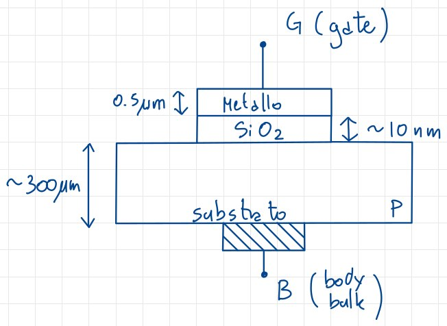
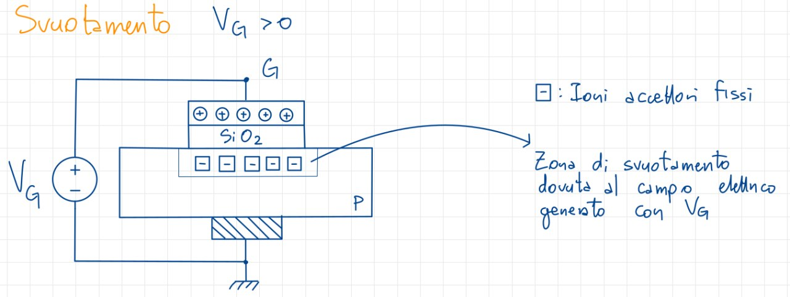
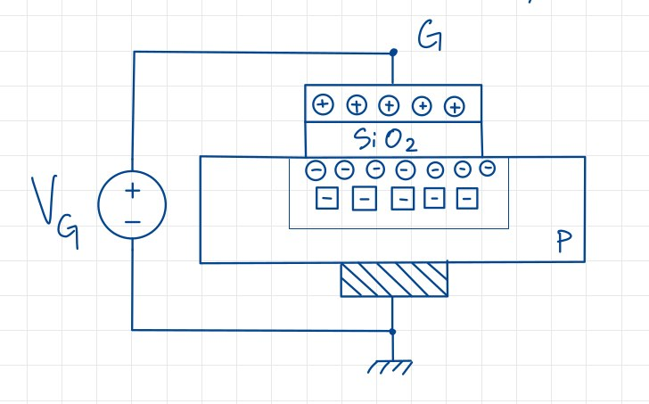
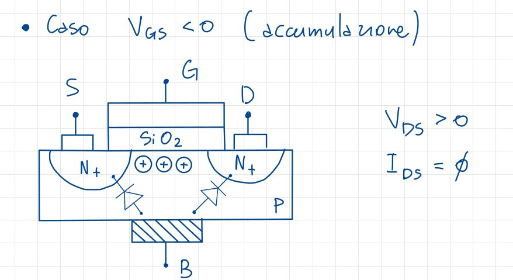
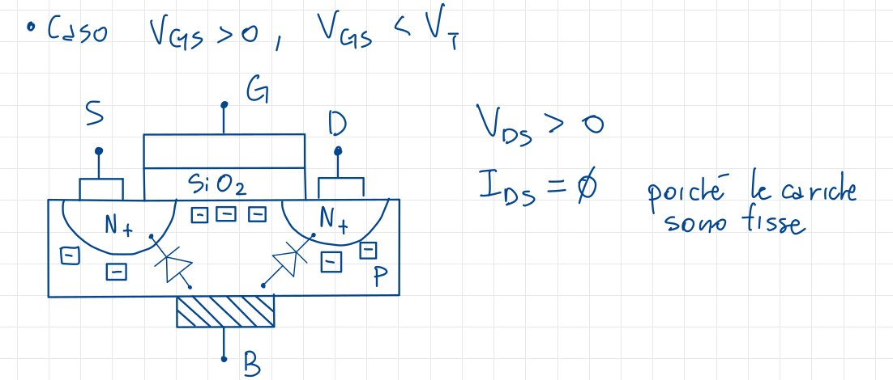
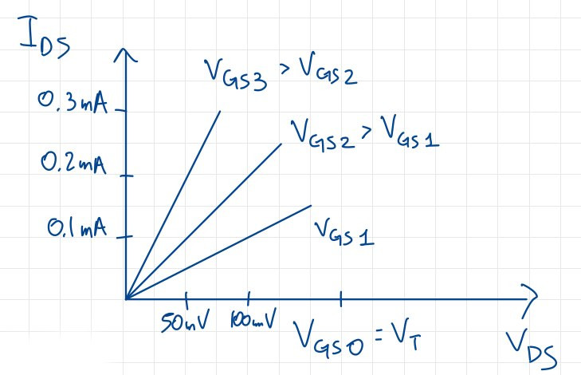
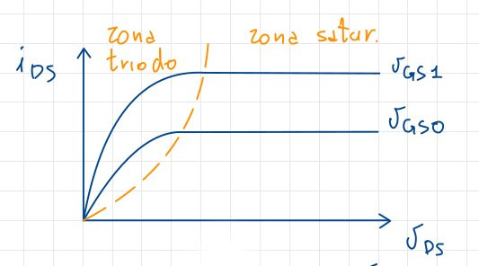

# I MOS - Metal Oxide Semiconductor

## Transistori MOSFET

I **MOSFET** sono della famiglia dei FET [Transistori a Effetto di Campo], ovvero dispositivi il cui funzionamento dipende da un campo elettrico, e sono assimilabili a **generatori di corrente controllati in tensione**.
Una differenza rispetto ai BTJ è che il suo comportamento dipende dai **portatori maggioritari**, a differenza dei BTJ che dipendono dai portatori minoritari immessi in base.

Un possibile schema circuitale è il seguente:

Nella maglia di ingresso c'è, oltre il terminale di controllo ovvero la tensione $V_1$, un'impedenza infinita che viene rappresentata da un circuito aperto, ovvero $I_1 = 0$. Per i nostri scopi infatti la corrente assorbita dal terminale di controllo è nulla. Nell'altro terminale c'è una corrente tale che $I_2 = g_MV_1$, dove $g_M$ è il rapporto tra corrente di uscita e tensione in ingresso; si tratta di una **trans-conduttanza**, in quanto il suo valore è un rapporto tra grandezze appartenenti a maglie diverse

## Condensatore MOS

Possiamo vedere questo dispositivo come una sorta di condensatore con due **armature**, una di metallo e una di substrato, e il dielettrico con formula chimica $SiO_2$.

Le varie parti che compongono il condensatore sono:

- il **substrato**, ovvero del Silicio drogato P;
- uno strato di **Ossido di Silicio**, perfettamente **isolante**;
- un elettrodo di metallo, conduttore perfetto, che viene chiamato **gate**, che sarà il terminale di controllo della corrente in uscita.

Dal punti di vista fisico, è interessante come i millimetri dello strato di Ossido di Silicio vengano ridotti sia per occupare meno spazio, sia per consumare meno corrente; d'altro canto avere uno strato più sottile di $7nm$ porterebbe il Silicio a perdere le sue caratteristiche isolanti.

A seconda della tensione di gate $V_G$ che entra nel diodo avremo differenti comportamenti.

### Dispositivo in accumulazione

Quando applico una tensione $V_G<0$. il gate inizierà a caricarsi **negativamente**, accumulando elettroni liberi sul terminale, e quindi il substrato inizierà a caricarsi positivamente.

Si genera dunque un campo elettrico tale che alcune lacune libere del substrato si accumulino nella zona superficiale, venendo bloccate dall'ossido isolante. La concentrazione di lacune in questa regione è maggiore rispetto alle altre zone del substrato, e da questa osservazione nasce il nome di **accumulazione**.

### Dispositivo in svuotamento

Questo è il caso in cui la tensione applicata al gate è positiva, ma comunque minore di una tensione soglia $V_T$: avrò delle cariche positive sul gate che saranno compensate, nel substrato, dalla carica negativa causata dagli ioni accettori, che a loro volta non sono più compensati dalle rispettive lacune, respinte lontano dalla superficie.

La tensione positiva ha generato un campo elettrico che è andato ad allontanare le lacune di superficie del substrato, facendola diventare una **zona di svuotamento**, nella quale la concentrazione di lacune è minore rispetto al resto del substrato, che sarà formata dagli ioni accettori che precedentemente erano compensati dalle lacune. A conti fatti, la zona di svuotamento avrà una carica complessiva negativa, pari alla carica positiva del gate.

### Dispositivo in inversione

Per valori di $VG \ge V_T$ avremo un comportamento inedito: quando il campo elettrico aumenta di intensità, allontanerà sempre di più le lacune, portando lo stesso ad attirare in superficie gli elettroni liberi del substrato P, in questo caso minoritari, che si sono generati termicamente.
Gli elettroni tendono ad accumularsi in superficie quindi, dopo un certo tempo, esisterà una regione in cui si sono accumulati questi elettroni, tali da compensare, assieme alle cariche fisse, la carica positiva del gate.

{width=50%}

In pratica, avrò un'**inversione locale** della tipologia del semiconduttore, da P ad N, limitatamente alla superficie del substrato.

## MOSFET

Un MOSFET è formato da un condensatore MOS al quale sono affiancate due zone di semiconduttore con drogaggio **opposto** a quello del body. Queste zone avranno dei terminali che saranno chiamati rispettivamente **Source** e **Drain**.

I pozzetti **devono parzialmente essere sovrapposti all'Ossido**, e la zona interposta tra i due pozzetti viene detta **regione di canale**, che avrà una sua larghezza e una sua lunghezza, importanti per alcuni concetti che verranno successivamente trattati.

Il **source** è il terminale che **fornisce i portatori**, mentre **drain** li riceve; la corrente scorrerà da Source a Drain quando vengono rifornite lacune, mentre se vengono riforniti elettroni, la corrente scorrerà in senso opposto, e ciò viene regolato dalla tensione applicata su **gate**, che è il terminale di controllo del dispositivo.

Il terminale di **body** verrà messo a *ground*; schematizziamo inoltre le giunzioni $N^+P$ come dei diodi che, per garantire il corretto funzionamento del dispositivo, devono essere **in inversa**. Per garantire ciò è sufficiente che la tensione in body sia **la più piccola di tutto il circuito**, in modo da poter mettere a ground l'anodo del diodo, avendo come unico risultato una polarizzazione **inversa**. In questo modo tra Source e Drain non può scorrere corrente, analogamente ad un BJT NPN in interdizione.

### MOSFET in accumulazione

Situazione in cui, applicando una $V_{GS}<0$, si accumuleranno delle cariche positive nella superficie del substrato, impedendo il passaggio di corrente tra Source e Drain.

### MOSFET in svuotamento

La situazione è uguale e opposta a quella precedente: ci sono cariche fisse nella superficie del substrato che impediscono lo scorrere della corrente, per $0<V_{GS}<V_T$. Source e Drain sono ancora **isolati**.

### MOSFET in inversione

Applicando una $V_{GS} > V_T$ la situazione cambia, infatti avrò finalmente Source e Drain collegate: vediamo in che modo.

Il fenomeno dell'inversione visto nel condensatore MOS si verifica anche nel MOSFET: si forma una zona di inversione nella quale sono presenti **cariche mobili**, che vengono richiamate in superficie dal campo elettrico creato dalla $V_{GS}$. C'è però una differenza tra il condensatore e il MOSFET: se nel primo queste cariche libere erano gli elettroni generati termicamente, nel secondo questa componente è una **minima parte**, e la maggioranza delle cariche è composta dalle cariche libere richiamate dalle regioni di Source e Drain, che fungono come da **serbatoi di cariche**. Sulla superficie del substrato si forma una zona con concentrazione di cariche libere, in questo caso elettroni, **maggiore o uguale** del drogaggio del substrato. Per effetto dell'inversione avremo che le due regioni $N^+$ sono **unite** da un canale conduttivo di **cariche mobili**, che permettono il **passaggio di corrente**. Essendo Source e Drain simmetrici, sono perfettamente intercambiabili, dando vita in questo caso a un **MOSFET a canale N**.

## Studio del canale di un MOSFET

Ipotizziamo di aver appunto creato il canale tra Source e Drain, e quindi di avere $V_{GS}>V_T$: vediamo ora il suo comportamento quando viene applicata una tensione ai suoi estremi.

### Caso per $V_{DS} > 0$ e piccola

Per ipotesi poniamo che Source sia alla tensione di riferimento, e che a drain venga applicata una tensione positiva:

Applicando questa tensione ci rendiamo conto che il terminale di Drain inizia ad **attrarre elettroni**, risultando in uno **scorrimento** di elettroni tra Source e Drain. Questo perché Source, come suggerisce il nome, fornisce i portatori, mentre Drain li riceve. Se contemporaneamente aumento $V_{GS}$, mantenendo però costante $V_{DS}$, sperimenterò un **aumento dello spessore del canale**, una diminuzione della **resistenza di canale** e un **aumento della corrente**.
La relazione tra corrente e tensione è lineare, in quanto il canale è **uniforme** per tensioni piccole, che era la nostre ipotesi, e segue questo andamento:

Le ipotesi per il quale possiamo applicare questa relazione sono:

- la corrente del terminale di Body è **nulla**;
- la corrente di Gate è **nulla**, ovvero assumiamo che l'ossido sia un isolante perfetto.

Risulta ovvio che, per $V_{DS} = 0$, la corrente sarà **nulla**.

### Caso per $V_{DS} > 0$ e non trascurabile

Quando $V_{DS}$ diventa non trascurabile, il canale non è più uniforme, persino la sua forma cambia, andando ad assottigliarsi vicino al Drain:

Quello che determina la presenza o meno del canale, ed eventualmente quando vale la tensione in quel punto, è la differenza di potenziale tra Source e il punto, che chiamiamo $x$: ho il canale se $V_{Gx} \geq V_T$.
Scrivo $V_{Gx}$ come $V_{Gx} = V_{GS} + V_{Sx}$, che è appunto la caduta di potenziale tra Source e il punto $x$.

### Lo strozzamento del canale

Aumentando ulteriormente $V_{DS}$ tale che $V_{DS} = V_{GS} - V_T$, noto che il canale si **strozza** e si **chiude**. Analiticamente ce ne accorgiamo sostituendo nelle formule:

$$V_{Gx}(x = L) = V_{GS} - V_{DS} = V_{GS} - V_{GS} + V_T = V_T$$

che è la condizione limite per la formazione del canale.

Ricaviamo a questo punto:

$$V_{gS} = V_{GS} - V_T$$

che è la **tensione di strozzamento**, o di **pinch-off**.

Se $V_{DS} > V_{GS} - V_T$ il canale 'si chiude' in un punto **precedente a Drain**.

Il potenziale del punto di pinch-off è così calcolato:

$$V_{xS} = V_{GS} - V_T$$

Si noti infine che per punti di pinch-off tali che la loro distanza da Drain $\Delta L$, con $\Delta L \ll L$, la resistenza del canale rimane sostanzialmente immutata, e vale $R = \rho \frac{L}{W}$. Nonostante però il canale sia strozzato, la corrente **continua a scorrere in maniera costante**: ciò è dovuto alla zona di svuotamento che, assieme al campo elettrico, crea delle condizioni favorevoli al passaggio di elettroni, proprio tra il punto di pinch-off e Drain. Il fatto che sia costante è giustificato dalla resistenza immutata del canale citata precedentemente, che assicura un flusso di cariche costante.

### Conclusioni

Abbiamo individuato due principali zone di funzionamento del MOSFET: una per $V_{DS} < V_{GS} - V_T$, e una per $V_{DS} > V_{GS} - V_T$. La prima zona di funzionamento viene detta **Zona triodo**, e la seconda **Zona di saturazione**.

#### Zona triodo

In questa zona di funzionamento il canale è **sempre aperto**, e la corrente vale:

$$i_{DS} = \mu_n \cdot C_{ox} \cdot \frac{W}{L} \cdot [(V_{GS} - V_T) \cdot V_{DS} - \frac{V_{DS}^2}{2}]$$

dove:

- $\mu_n$ è la mobilità dei portatori negativi;
- $C_{ox}$ è la capacità di ossido, data dal rapporto tra la costante dielettrica e lo spessore dell'ossido;
- $W$ è la larghezza del canale;
- $L$ è la lunghezza del canale.

#### Zona di saturazione

In questa zona di funzionamento il canale è **sempre chiuso**, e la corrente vale:

$$i_{DS} = \mu_n \cdot C_{ox} \cdot \frac{W}{L} \cdot (V_{GS} - V_T)^2$$

Notiamo che le curve della corrente relative alle due zone di funzionamento combaciano perfettamente, e siamo anche in grado di definire una curva che possa discriminare le due zone di funzionamento:

La curva, che è in realtà una parabola, è data dall'equazione:

$$i_{DS} = k\cdot (V_{GS} - V_T)^2$$

dove $k$ è una costante di proporzionalità.

Nella realtà la curva della corrente non è perfettamente orizzontale, questo perché non possiamo considerare $\Delta L$ trascurabile oltre una certa soglia, e ciò da vita ad un fenomeno simile all'effetto Early: prolungando le caratteristiche, esse si incontrano in un punto del secondo quadrante, detto $-\frac{1}{\lambda}$.

Teniamo conto di questo effetto nella formula aggiungendo un fattore dipendente da $\lambda$; così facendo l'equazione diventa:

$$i_{DS} = \mu_n \cdot C_{ox} \cdot \frac{W}{L} \cdot (V_{GS} - V_T)^2 \cdot (1+\lambda v_{ds})$$

#### La trans-caratteristica di un MOSFET

Se $\Delta L$ è sufficientemente piccolo, possiamo rappresentare il MOSFET tramite una **trans-caratteristica** sul piano $I_{DS} / V_{GS}$, tramite una curva che esprime la corrente in uscita dal Drain in funzione della tensione tra il Gate e la Source.

{width=60%}

Questa viene usata quando il MOSFET entra in zona di saturazione perché sappiamo che, considerando un $\lambda$ piccolo, la relazione tra $I_D$ e $V_{GS}$ è quadratica. Questa sarà traslata in $V_T$ e sarà unica, a patto di essere in zona di saturazione.

## Transistore MOSFET a canale P

A differenza degli N-MOSFET, i P-MOSFET sono caratterizzati da un substrato di **tipo N**, mentre le diffusioni di *source* e *drain* sono di tipo **P**. Il trasporto tra queste due zone avviene tramite **corrente di lacune** generata a causa dell'applicazione di una tensione negativa tra *gate* e *body*. Da ciò consegue che le caratteristiche di un P-MOSFET sono le stesse di un N-MOSFET, ma con i segni invertiti.

Nei P-MOSFET la condizione per la presenza del canale è che $V_{GS} \le V_{TP}$, mentre per la saturazione $V_{DS} \le V_{GS} - V_{TP}$.

I transistori MOS a canale P mostrano prestazioni inferiori, a parità di caratteristiche, rispetto ai corrispondenti transistori a canale N, a causa della mobilità ridotta delle lacune rispetto a quella degli elettroni. Tuttavia, è possibile compensare questa ridotta mobilità aumentando la larghezza del canale $W$, pratica comune poiché la disponibilità di transistori MOS complementari è fondamentale nella tecnologia CMOS.

In particolare, le prestazioni inferiori sono dovute principalmente alla mobilità delle lacune, che è circa $\frac{1}{3}$ di quella degli elettroni.

In definitiva, il MOSFET a canale P è più grande di un MOSFET a canale N, a parità di prestazioni.

## Cenni ai MOSFET a svuotamento

I MOSFET visti in precedenza appartengono alla categoria dei **MOSFET ad arricchimento**, poiché il canale viene costruito solo dopo l'applicazione di una certa tensione al Gate.

Esiste tuttavia un'altra categoria di MOSFET, che non verrà trattata nel corso, in cui il canale tra Source e Drain viene **realizzato direttamente dal costruttore**, per cui il canale esiste anche per $V_{GS} = 0$: essi vengono chiamati **MOSFET a svuotamento**.

Se vogliamo interdire il passaggio di corrente è necessario applicare una tensione negativa tra *gate* e *source*, che modifica la trans-caratteristica del MOSFET rendendo $V_T$ negativa:

{width=50%}

## Simboli circuitali di un MOSFET

### MOSFET a canale N

{width=50%}

### MOSFET a canale P

{width=50%}
