# Polarizzazione di transistori BJT

Sappiamo che i transistori BJT hanno varie zone di funzionamento, e ognuna di esse viene determinata dalla polarizzazione del dispositivo; se ad esempio vogliamo utilizzare un BJT come **amplificatore**, dovremo usarlo in zona **attiva diretta**, ovvero quando abbiamo la giunzione **Base-Emettitore in diretta**, e quella **Base-Collettore in inversa**. Dovrò poi utilizzare dei generwatori costanti per determinare il punto di riposo.

## Esempio di circuito BJT

Il circuito più semplice che posso pensare di analizzare è il seguente, con le r4elative equazioni:

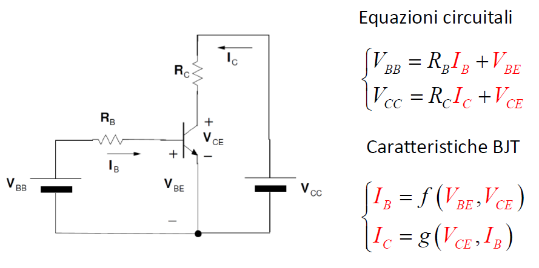

Abbiamo due porte in ingresso e due in uscita: per far funzionare i nostri BJT NPN in zona **attiva diretta**, dovrò aver4e una $V_{BE} > 0$, e una tensione al collettore maggiore della tensione di base, in modo che risulti una polarizzazione **inversa**,  e ciò avviene quando  $V_{CE} > 0$.
Per realizzare quanto descritto utilizzerò dei generatori positivi, $V_{BB}$ e $V_{CC}$, collegati traamite una resistenza rispettivamente a Base e Collettore. A questo punto devo risolvere le equazioni circuitali per trovare le incognite: esse sono 4, ma abbiamo solo 2 equazioni, quindi dovrò trovare un modo alternativo per risolvere il sistema.

### Metodo numerico-matematico

Una possibile soluzione per risolvere il circuito potrebbe essere utilizzare il metodo matematico basato sulle equazioni di Ebers-Moll per caratterizzare il BJT. Tuttavia, è importante notare che queste equazioni sono trascendenti e non consentono una soluzione analitica in forma chiusa. Pertanto, potrebbe essere necessario utilizzare un software di calcolo numerico per ottenere una soluzione approssimata del circuito.

### Metodo grafico

Un'alternativa è utilizzare un approccio grafico per risolvere il circuito. Tuttavia, questo metodo richiede la rappresentazione grafica delle caratteristiche del dispositivo, come ad esempio ignorare l'effetto Early nella caratteristica di ingresso. Traccerò quindi l'equazione relativa alla maglia di ingresso, e troverò il punto di riposo come l'intersezione della di quest'ultima con la caratteristica di ingresso del BJT.

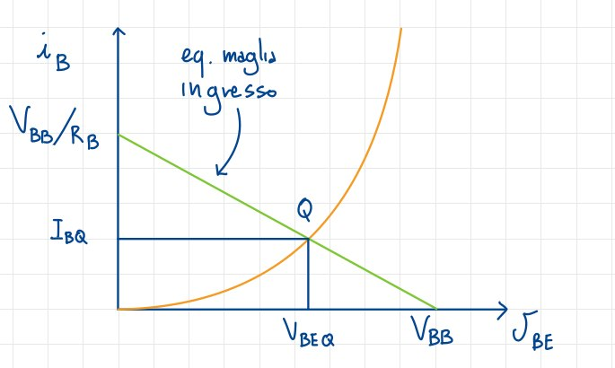

Risulta evidente come questa soluzione dipenda dai valori di $V_{BB}$ e $R_{BB}$ che abbiamo inserito nel circuito: modificandoli, anche la retta di carico varierà; se avessi usato un fascio di rette per rappresentare questi valori, implicando che potessero dunque variare, non avrei potuto trovare i valori di $V_{BEQ}$ e $I_{BQ}$, perchè avrei avuto **più di una intersezione**. In questo caso invece, riesco a trovare due delle quattro incognite del sistema.

Per quanto riguarda la maglia di uscita, userò la caratteristica d'uscita del BJT, assimilabile ad una **famiglia di curve**, e uan retta di carico. Delle curve usate per la carateristica, andrò a scegliera quella tale che $I_B = I_{BQ}$, ovvero la corrente trovata con il precedente grafico:

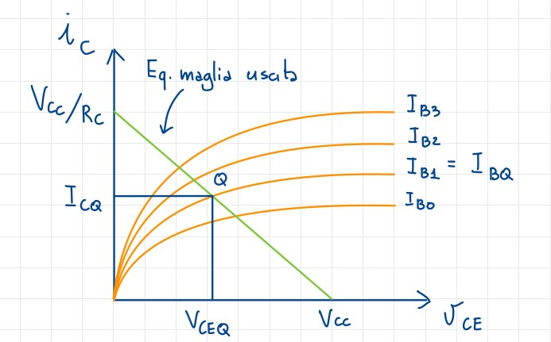

Nella pratica questo metodo non è utilizzabile, ma è utile a livello didattico perchè ci permette di capire visivamente come funziona si comprota il circuito e le grandezze in gioco.

### Metodo semi-grafico

Rappresenta un'alternativa al metodo grafico, introducendo delle semplificazioni: la caratteristica d'ingresso viene considerata come se fosse un diodo, imponendo dunque $V_{BEQ} = V_{\gamma} = 0.7V$, a patto ovviamente che si trovi in zona attiva diretta.

Le equazioni risultanti saranno:

$$V_{BB} = R_{BB}I_{B} + V_{\gamma}$$

$$I_B = \frac{V_{BB} - V_{\gamma}}{R_B} = I_{BQ}$$

Utilizzerò questi valori stimare per la caratteristica di uscita $I_{CQ}$ e $V_{CEQ}$.

## Modello per grandi segnali di BJT

Come fatto per i diodi, dobbiamo abbandonare l'idea di trovare una soluzione precisa per il circuito, e utilizzare un metodo che bilanci velocità di calcolo e accuratezza. Per questo motivo, userò un modello per grandi segnali, che è un modello di primo ordine, e che si basa su un approccio lineare.

### NPN in zona attiva diretta

Ricordiamo come in base alla zona di funzionamento in cui si trova il BJT, posso semplificare le equazioni di Ebers-Moll: in zona **attiva diretta** avevamo trovato che $I_C = \beta_F I_B$.

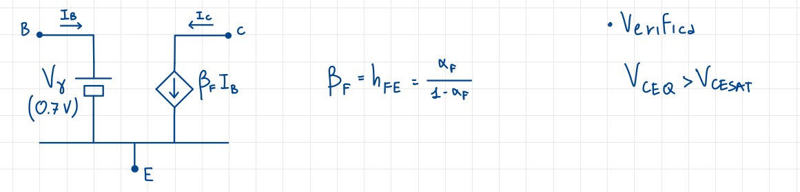

In questa fase inseriremo un generatore costante pari a $V_\gamma$ tra Base ed Emettitore, come già ipotizzato nel metodo semi-grafico, mentre tra Collettore ed Emettitore inseriremo un generatore di corrente controllato in corrente di valore $\beta_F I_B$, con $I_B$ corrente di base.

### NPN in zona di saturazione

La giunzione Base-Emettitore è ancora polarizzata in diretta, per cui avremo ancora il generatore costante $V_\gamma$. Ricordiamo però però che in stiamo lavorando vicino all'origine della caratteristiche, per cui $V_{CE} < V_{CEsat}$: le caratteristiche collassano e sono molto simili ad una retta verticale. L'ipotesi semplificativa è quindi che tra il Collettore e l'Emettitore ci sia un generatore $V_{CEsat}$, che vale $0.1-0.2V$.

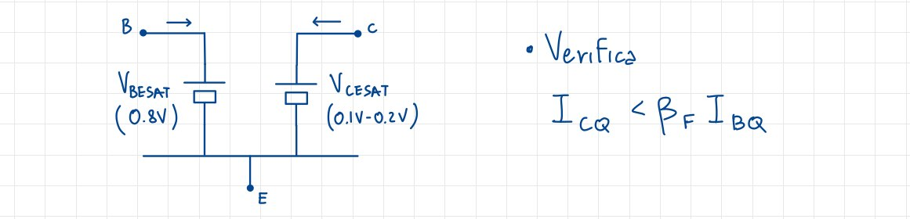

### PNP in zona attiva diretta

Le considerazioni fatte per il BJT NPN si applicano anche al PNP, ma con i segni invertiti.

Schematicamente:

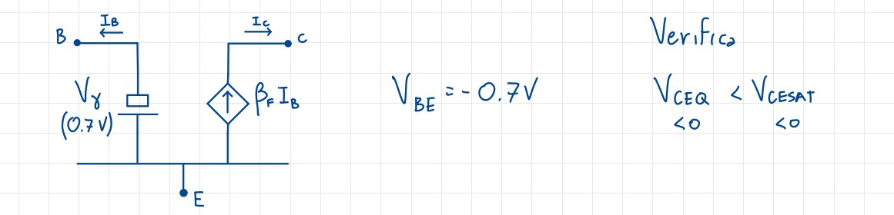

### PNP in zona di saturazione

Anche in questo caso, le considerazioni fatte per il BJT NPN si applicano anche al PNP, ma con i segni invertiti.

Schematicamente:

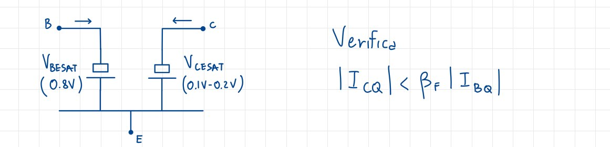

### I valori di $\beta_F$

Ci sono due possibilità:

* $\beta_F$ è un valore noto, ad esempio dal datasheet del dispositivo;
* $\beta_F$ è non è noto, e in questo caso per la Zona attiva diretta dovrò fare delle ipotesi.

Le ipotesi sono le seguenti:

* $V_{BE} = V_\gamma = 0.7V$;
* $I_B << I_C$;

Se sono rispettate, il valore trovato è corretto.

## Polarizzazione di un BJT

Nella trattazione resteremo entro alcuni limiti:

* i componenti sono discreti;
* c'è una singola alimentazione;
* indipedendenza dalla variabilità delle caratteristiche del componente attivo.

Di seguito, alcuni circuiti di esempio.

### Corrente $I_B$ costante

Il circuito polarizzato in questo modo è più semplice, ma non è consigliato: ciò è dovuto proprio al fatto che abbiamo fissato la corrente di base $I_B$. Se assumiamo che il BJT funzioni in zona attiva diretta, quindi con $V_{BE} \approx V_\gamma$, possiamo scrivere direttamente l'equazione per la maglia di ingresso, ottenendo il valore della corrente di base.

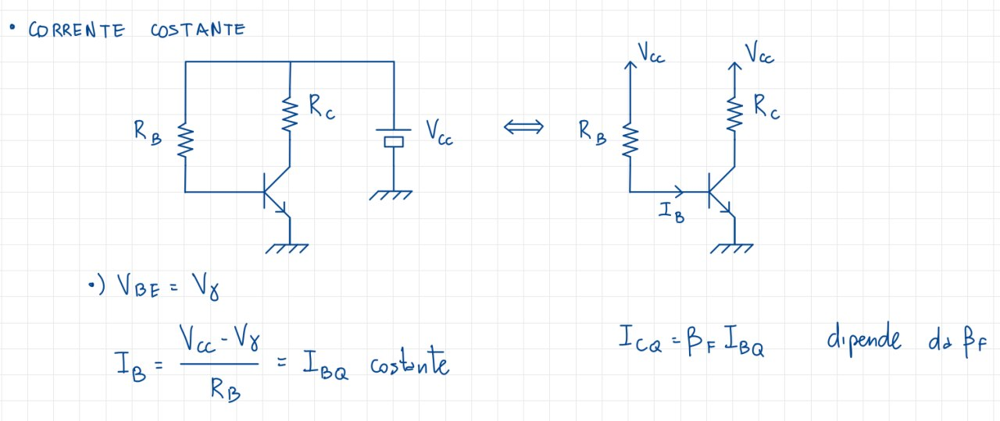

Nel modello semi-grafico avevamo ipotizzato che $V_{BEQ} = V_\gamma$, il che implica che $I_{BQ}$ sia fissata, ma se essa fosse costante allora la corrente di Collettore $I_{CQ}$ dipenderebbe da $\beta_F$, che è una situazione non ideale perchè cadrebbe l'ipotesi di indipendenza dal transistor: se cambiassi il BJT con un altro con caratteristiche diverse, il circuito non funzionerebbe più.

### Tensione $V_{BE}$ costante

Il circuito è analogo al precedente, ma presenta una resistenza in più che collega la Base al Terminale di riferimento.

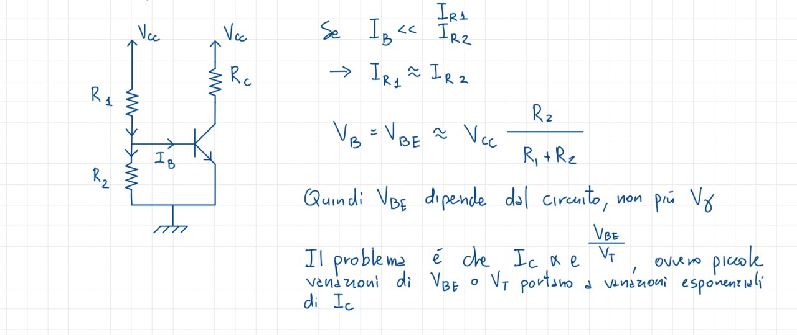

### Circuito di polarizzazione a 4 Resistenze

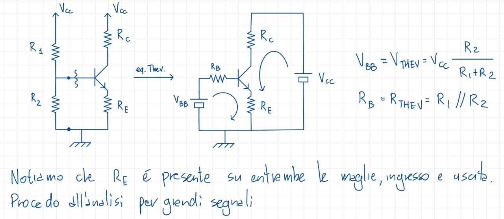{width=50%}

L'utilizzo di un'ulteriore resistenza $R_E$ è necessaria per la **stabilizzazione del punto di riposo**, a prescindere dalle condizioni ambientali e dalle caratteristiche del transistor.

Partiamo dall'equivalente Thevenin per poi passare all'analisi per grandi segnali:

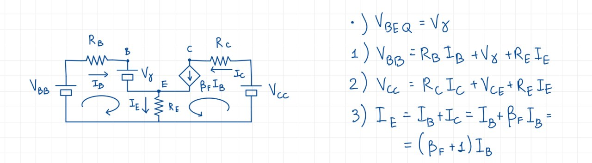

Le equazioni che risultano da questo passaggio sono:

$$I_{BQ} = \frac{V_{BB} - V_\gamma}{R_B + R_E(\beta_F+1)}, I_{CQ} = \beta_FI_{BQ}$$

$$V_{CEQ} = V_{CC} - I_{CQ}R_C - R_E(\beta_F + 1)I_{BQ}$$

Inoltre, se $V_{BB} >> V_\gamma$ e $\frac{R_B}{\beta_F + 1} << R_E$ allora:

$$ I_{EQ} \approx \frac{V_{BB}}{{R_E}}$$

Ma possiamo ottenere queste condizioni? La prima in effetti è facile da ottenere, poichè $V_{BB}$ è nell'ordine delle decine, mentre $V_\gamma \approx 0.7V$. 
Anche la seconda condizione è facilmente ottenibile, poichè $R_B$ è nell'ordine delle centinaia, permettendo di valori delle resistenze tali da rispettare la condizione.

Queste ipotesi implicano la stabilizzazione del punto di riposo:

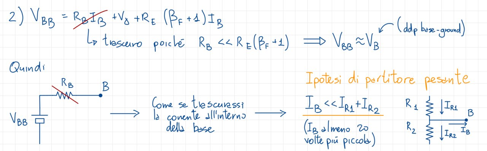{width=92%}

Infatti:

* $V_B \approx V_{CC} \frac{R_2}{R_1 + R_2}$ e $V_B >> V_\gamma$;
* cambiando la temteratura e aumetando $I_{CQ}$, tale che $I_{CQ} -> I_{CQ} + \Delta I_C$, allora $I_E = E_{EQ}+ \Delta I_E$. Così facendo anche $V_E$ aumenta, ma $V_B$ rimane costante; $V_{BE}$ diminuirà, portando a sua volta ad una diminuzone di $I_C$, secondo le equazioni di Ebers-Moll.

In sostanza si innescherà un insieme di reazioni che riporteranno $I_C$ al suo valore iniziale: questo dipende, come già detto, dalla presenza di $R_E$, senza la quale non sarebbe possibile compensare in alcun modo le variazioni di $I_C$.
