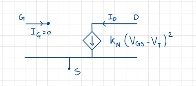

# Polarizzazione di un MOSFET

## Caso per un N-MOSFET

Ricordiamo che un N-MOSFET è detto **ad arricchimento**, e avrà $V_T > 0$; in particolare, per la nostra trattazione, sarà $V_T \ge 1V$. Ipotizziamo che il nostro MOS sia in conduzione, e quindi con $V_{GS} > V_T$, e che l'ossido presente della struttura sia un isolante perfetto, per cui $I_G = 0$. In campo analogico la zona di saturazione è quella più utile, per cui utilizziamo le equazioni della corrente trovate durante l'analisi del MOSFET per disegnare lo schema equivalente del MOS:

{width=70%}

Logicamente, devo ricordami anche delle **ipotesi della zona di saturazione**, ovvero che $\lambda = 0$ e che $I_G = 0$.

## Caso per un P-MOSFET

Dovremo riprendere tutte le ipotesi fatte durante l'analisi del MOSFET, ma è importante ricordare che $V_T < 0$ per poter formare il canale. Anche in questo caso faccio le ipotesi della zona di saturazione, uguali a quelle del N-MOSFET, per ottenere il seguente schema equivalente:

{width=70%}

### Verifica delle ipotesi

Questa tabella riassume e le relative verifiche per le varie zone di funzionamento nei vari tipi di MOSFET:

{width=70%}

## Polarizzazione in circuiti discreti di un MOSFET

### Polarizzazione a $V_{GS}$ fissa

Il nome deriva dal fatto che il valore di $V_{GS}$ è appunto fisso, e ciò deriva dal fatto che, per ipotesi, $I_G = 0$: tale osservazione infatti implica che $V_G = V_{CC}\frac{R_2}{R_1 + R_2} = V_{GS}$. che è appunto costante.

{width=70%}

Questo circuito può essere utilizzato, anche se presenta un problema. Assumiamo di aver polarizzato correttamente in zona di saturazione il nostro MOSFET e di aver posizionato il punto di lavoro al centro delle caratteristiche, come abbiamo fatto per il BJT, consideriamo la transcaratteristica che rappresenta la corrente di Drain in funzione di $V_{GS}$, come mostrato nel grafico. Tuttavia, può accadere che due dispositivi MOSFET nominalmente uguali con la stessa sigla abbiano caratteristiche diverse l'uno dall'altro. Poiché siamo in polarizzazione a $V_{GS}$ fissa ciò implica che, come evidenziato nel grafico, possiamo ottenere due correnti di Drain molto diverse tra loro. Quindi, questo tipo di polarizzazione a $V_{GS}$ fissa può essere utilizzato, ma comporta un punto di lavoro dipendente dal transistore utilizzato: per renderlo indipendente, è possibile inserire una quarta resistenza tra Source e Drain.

### Circuito a 4 resistenze

Facciamo l'ipotesi di essere in saturazione, e di avere $I_G = 0$. Quest'ultima ipotesi impone che $I_S = I_D$. Nella figura vediamo lo schema e le formule risultanti dalle ipotesi:

{width=70%}

Prendiamo ora la transcaratteristica:

{width=70%}

Vediamo che se $I_D$ aumenta, aumenterà anche $V_S$. Essa porterà ad una diminuzione di $V_{GS}$ ed infine, ad una diminuzione di $I_D$. L'aggiunta della resistenza introduce una retroazione negativa che porta alla **stabilizzazione del circuito** tramite la stabilizzazione della corrente di polarizzazione. Questo perchè la retta di carico, non essendo più verticale,avvicina i punti di lavoro in caso di utilizzo di dispositivi differenti, infatti le correnti $I_{D1}$ e $I_{D2}$ saranno si diverse, ma non eccessivamente.

Risolvendo il circuito, otteniamo $V_{GS} = V_G - R_SI_D$. Se $Q$ è saturo, allora:

$$I_D = K(V_{GS} - V_T)^2 = K(V_G -R_SI_D-V_T)^2$$

$$\frac{V_G - V_{GS}}{R_S} = K(V_{GS}-V_T)^2$$
Essendo un'equazione di secondo grado, avrà due soluzioni di cui **solo una accettabile**.
