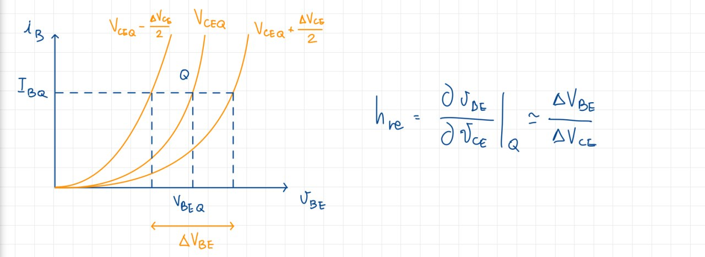
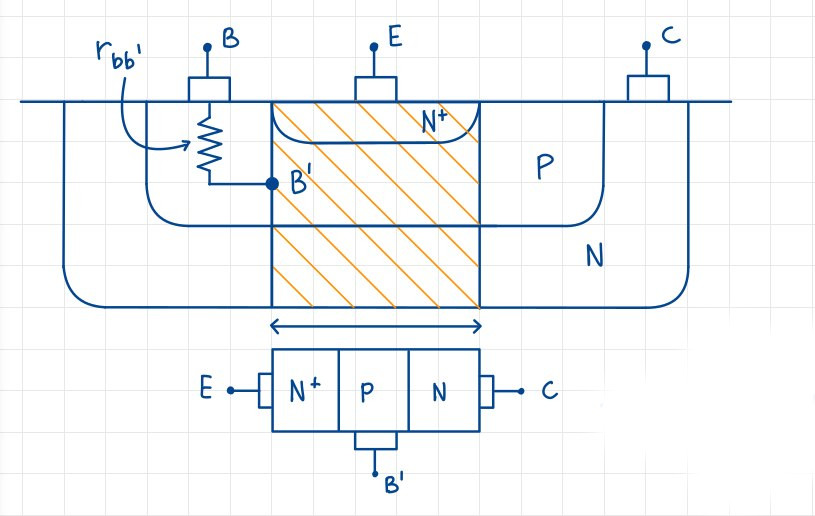

# I dispositivi come quadripoli

## Richiami sui parametri h di un quadripolo

Abbiamo la possibilità di analizzare un BJT come un quadripolo lineare, che può essere definito attraverso i **parametri h**. Le equazioni che definiscono il quadripolo sono le seguenti:

Analizziamo uno alla volta ogni parametro.

### $h_{11}$

Definito come $h_{11}=\frac{v_1}{i_1}|_{v_2=0}$ = h_{ie}, che sta per **e**mettitore comune in **i**nput, ed è l'impedenza d'ingresso in cortocircuito, ovvero con $v_2 = 0$. Essendo un'impedenza, ha come unità di misura $\Omega$.

### $h_{12}$

Definito come $h_{12}=\frac{v_1}{v_2}|_{i_1=0} = h_{re}$, che sta per **e**mettitore comune in **r**everse, ed èil **guadagno di tensione in circuito aperto**. Non ha unità di misura, essendo rapporto di due tensioni.

### $h_{21}$

Definito come $h_{21} = \frac{i_2}{i_1}|_{v_2=0} = h_{fe}$, che sta per **e**mettitore comune in **f**orward, ed è il **guadagno di corrente in cortocircuito**. Non ha unità di misura, essendo rapporto di due correnti. É importante ricordare che $h_{fe} \not ={h_{FE}}$.

### $h_{22}$

Definito come $h_{22} = \frac{i_2}{v_2}|_{i_1=0} = h_{oe}$, che sta per **e**mettitore comune in **o**utput, ed è l'ammettenza di uscita in circuito aperto, ovvero con $i_1 = 0$. Essendo un'ammettenza, ha come unità di misura $\Omega^{-1}$.

### Perché 4 parametri?

I 4 parametri sono, dal punto di vista matematico, le derivate parziali dello sviluppo di Taylor; esse infatti **linearizzano** le caratteristiche del BJT nell'intorno del punto di lavoro Q.

## Configurazione ad emettitore comune di un BJT

Applichiamo quanto visto ad un BJT, partendo dal suo circuito, analizzandolo come un quadripolo e scrivendone tutte le equazioni che lo caratterizzano. L'obiettivo è la **linearizzazione attorno al punto di lavoro Q**.

Le caratteristiche di ingresso ed uscita saranno due funzioni dipendenti dalle grandezze del multipolo. In particolare la caratteristica di ingresso sarà $i_C(t) = f (v_{CE}, i_B)$, mentre la caratteristica di uscita sarà $i_B(t) = g_1 (v_{BE}, v_{CE})$.
Iniziamo la procedura di linearizzazione, svolgendo lo **sviluppo di Taylor** fino al primo membro; per la caratteristica di ingresso avremo:

$$v_{BE} = V_{BEQ} + v_{be} = g(I_{BQ} + i_B, V_{CEQ} + v_{ce}) = g(I_{BQ}, V_{CEQ}) + \frac{\partial g}{\partial i_B}|_Q i_B + \frac{\partial g}{\partial v_{CE}}|_Q v_{CE} + \dots$$

Mentre per la caratteristica di uscita avremo:

$$i_C = I_{CQ} + i_c = f(I_{BQ} + i_B, V_{CEQ} + v_{CE}) = f(I_{BQ}, V_{CEQ}) + \frac{\partial f}{\partial i_B}|Qi_B + \frac{\partial f}{\partial v_{CE}}|Qv_{CE} + \dots$$

Da questi sviluppi ricaviamo un sistema di due equazioni:

$$
\begin{cases}
v_{be} \approx \frac{\partial g}{\partial i_b}|_Qi_b + \frac{\partial g}{\partial v_{CE}}|_Q v_{ce} \\
i_c \approx \frac{\partial f}{\partial i_b}|_Q i_b + \frac{\partial f}{\partial v_{CE}}|_Q v_{ce}
\end{cases}
$$

Riconosciamo i parametri h del quadripolo, che sono:

$$\begin{cases} h_{ie} = \frac{\partial v_{BE}}{{\partial i_B}}|_Q
\\
h_{re} = \frac{\partial v_{BE}}{\partial v_{CE}}|_Q
\\
h_{fe} = \frac{\partial i_C}{\partial i_B}|_Q
\\
h_{oe} = \frac{\partial i_C}{\partial v_{CE}}|_Q
\end{cases}$$

Possiamo, a questo punto, disegnare il circuito equivalente a parametri h:

Per comprendere meglio il concetto di **linearizzazione** attorno a Q, vediamo uno per volta il comportamento grafico di ogni parametro h.

### $h_{ie}$

{width=75%}

### $h_{re}$

{width=75%}

### $h_{fe}$

{width=75%}

### $h_{oe}$

{width=75%}

### Le ipotesi semplificative

La prima ipotesi è che prenderemo $h_{re} \approx 0$ e dunque trascurabile: questa scelta è dettata dal fatto che questo parametro dipende dall'effetto Early, che abbiamo deciso di trascurare, perlomeno all'ingresso.
La seconda è che prenderemo, proprio in virtù dell'effetto Early in uscita, $h_{oe} = \frac{I_{CQ}}{|V_A| + V_{CEQ}}$, e questo perché:

{width=50%}

Proseguendo, prenderemo $h_{fe} \approx \beta_F$: è importante che non ci sia l'uguale perché **non è un'uguaglianza**, ma un'approssimazione valida solo in alcuni casi. Infine prendiamo $h_{ie} = r_{bb'} + r_{b'e}$, dove $r_{bb'}$ è una costante, mentre $r_{b'e}$ dipende dal punto Q, e vale $r_{b'e} = \frac{V_T}{I_{CQ}}h_{fe}$. Questi due valori sono delle resistenze dovute alla costruzione fisica del BJT:

{width=40%}

Il terminale di base infatti non è direttamente collegato alla zona interna, ma c'è una certa distanza occupata dal materiale semiconduttore, che dal punto di vista circuitale è assimilabile ad una resistenza costante, che è la nostra $r_{bb'}$. Inoltre, il terminale di base è collegato all'emettitore tramite un ponte di diodi, che ha una resistenza di uscita $r_{b'e}$.

### Il circuito equivalente dopo le ipotesi semplificative

{width=50%}

Abbiamo due rappresentazioni possibili, del tutto equivalenti tra di loro: la seconda è utile perché è facile trovare il valore di $g_m$, e anche perché il MOSFET ha un modello analogo a questo per il BJT, che permette un confronto più rapido tra i due dispositivi.

### Confronto tra BJT PNP e NPN

Svolgendo la stessa procedura per il BJT PNP, otteniamo che i modelli sono del tutto equivalenti: essi hanno caratteristiche nel I e III quadrante ma, dato che lavoriamo con le derivate, esse saranno uguali a quelle del BJT NPN, senza cambiare segno.

## Modello linearizzato per il MOSFET per piccoli segnali

L'analisi di un MOSFET risulta decisamente più semplice rispetto a quella di un BJT, perché per esso disponiamo di un'espressione analitica indicante la corrente. Ci interessa il solo modello in saturazione, del quale riportiamo lo schema e alcune formule utili nella trattazione:

{width=55%}

### Circuito equivalente

Disegnamo ora il circuito equivalente a parametri h:

{width=55%}

La formula per la corrente $i-D$ deriva dallo sviluppo di Taylor attorno al punto di riposo, approssimato al primo termine:

$$i_D = f(V_{GSQ}, V_{DSQ}) + \frac{\partial f}{\partial v_{GS}}|_Q v_{gs} + \frac{\partial f}{\partial v_{DS}}|_Q v_{ds} + \dots$$

Sostituendo con le equazioni trovate nella figura precedente, otteniamo:

$$i_D = \frac{\partial i_D}{\partial v_{GS}}|_Q v_{gs} + \frac{\partial i_D}{\partial v_{DS}}|_Q v_{ds} -> i_d = g_mv_{gs} + \frac{v_{ds}}{r_d}$$

Una volta trovato il punto di riposo Q, è possibile ottenere il valore di $g_m$ e $r_d$:

$$\begin{cases} g_m = 2k(V_{GS}-V_T)(1+\lambda v_{DS})|_Q = 2\frac{i_D}{(V_{GS}-V_T)}|_Q = 2\frac{I_{DQ}}{V_{GSQ}-V_T}\\r_d^{-1} = k(v{GS}-V_T)^2\lambda|_Q = \frac{i_d}{((1+\lambda v_{DS}))}\lambda|_Q = \frac{I_{DQ}}{(1+\lambda v_{DS})}\lambda = \frac{I_{DQ}}{\frac{1}{\lambda}+V_{DSQ}}
\end{cases}$$

Per i nostri scopi $\lambda = 0$, e così sarà anche per gli esercizi, per cui la resistenza sarà sostituita da un aperto:

$$r_d = \frac{\frac{1}{\lambda}+V_{DSQ}}{I_{DQ}}$$

Se $\frac{1}{\lambda} \gg V_{DSQ}$, allora:

$$r_d = \frac{1}{\lambda I_{DQ}}|_{\lambda\to\infty} \approx 0$$

Le formule per $i_D$ e $g_m$ possono essere riscritte come:

$$\begin{cases} i_D = k(v_{GS}-V_T)^2\\
g_m = 2k(V_{GS}-V_T)|_Q = 2k(V_{GSQ}-V_T)>0\\
\end{cases}$$

Per cui possiamo semplificare ulteriormente il nostro circuito a parametri h:

### Considerazioni per i PMOS

Le formule proposte per l'NMOS sono valide anche per i PMOS, avendo però l'accortezza di definire $g_m = 2k|(V_{GS}-V_T)|_Q$, modificando i sistemi di conseguenza.
