# Gli amplificatori

Sono dispositivi sono dispositivi aventi porta di ingresso e porta di uscita, e sono caratterizzato da alcuni parametri, detti **di merito**. Lo schema generale di un amplificatore è il seguente:

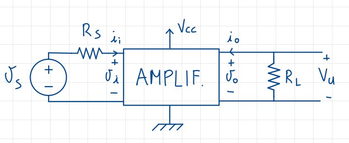{width=50%}

Mentre i parametri di merito sono i seguenti:

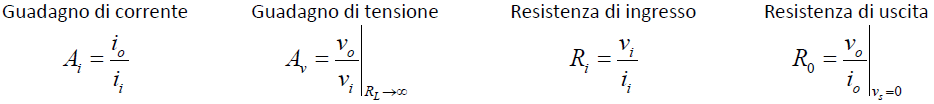{width=50%}

## Circuito equivalente

I parametri di merito sono utili per poter determinare il circuito equivalente di un amplificatore, come nell'esempio in figura:

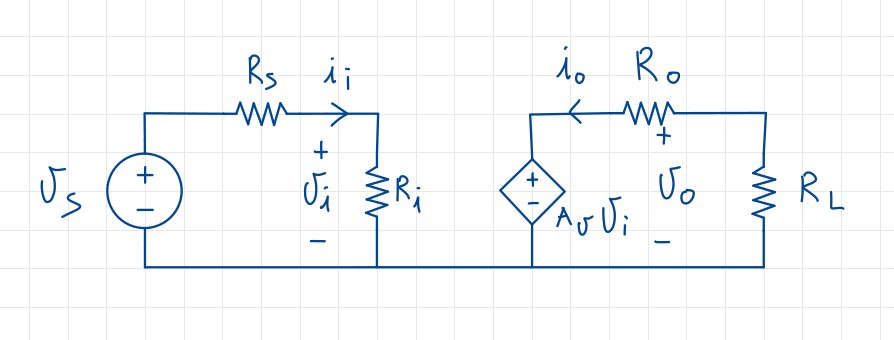{width=50%}

## Analisi del circuito di un amplificatore

L'analisi si compone sostanzialmente di due parti: determinazione del punto di riposo, e analisi del circuito equivalente sottoposto a segnali variabili nel tempo e con frequenza variabile.

La ricerca del punto di riposo è detta anche **Analisi DC**, e si compone delle seguenti fasi:

1. Disattivazione dei generatori del segnale (cortocircuiti per i generatori di tensione, apertura per i generatori di corrente);
2. Sostituzione di condensatori e induttori rispettivamente con circuiti **aperti** e **cortocircuiti**;
3. Sostituzione dei componenti non lineari con il rispettivo modello per grandi segnali.

A questo punto avremo determinato il punto di lavoro Q, e potremo passare all'analisi **a medie frequenze**, detta anche **Analisi AC**. In questa fase, invece, dovremo:

1. Disattivare i generatori di valore costante;
2. sostituire di condensatori e induttori rispettivamente con circuiti **aperti** e **cortocircuiti**;
3. sostituire i componenti non lineari nel rispettivo modello per piccole segnali, **dipendentemente dal punto di riposo Q** trovato;

A questo punto potrò determinare tutti i parametri utili dell'amplificatore in analisi, così come guadagni, etc.
Per l'analisi DC sono fondamentali i manuali delle caratteristiche dei dispositivi, in quanto essi contengono già molti dati utili.

## Amplificatore a Emettitore Comune

La configurazione di base è la seguente:

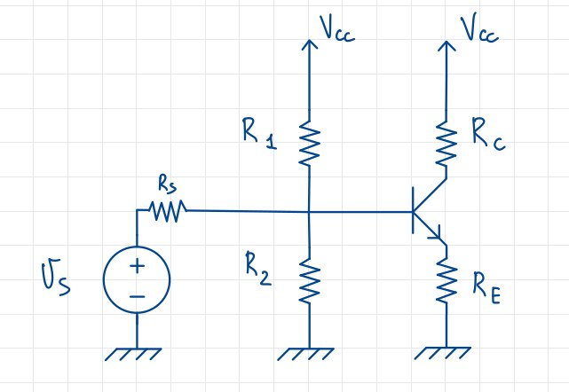{width=50%}

Essa però non è molto utilizzata in quanto il punto di riposo può essere modificato, infatti disattivando il generatore, come da procedura, andrei a cortocircuitare la base, e metterei $R_S$ in parallelo con $R_2$: questo fa in modo che dunque il punto di riposo dipenda direttamente da $R_S$, che è uno scenario da evitare. Posso quindi pensare di modificare leggermente il circuito, aggiungendo due condensatori, come nell'esempio in figura:

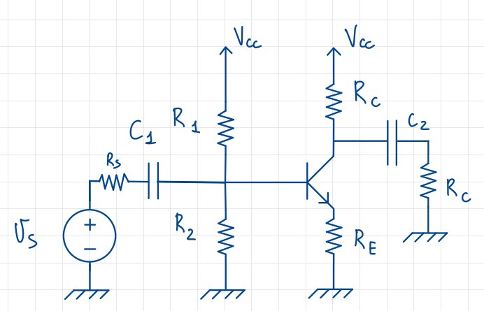{width=50%}

Il condensatore $C_1$ dovrà essere tale da poter essere assimilato ad un cortocircuito in fase di analisi AC (il suo valore dipende dunque direttamente dal segnale in ingresso), mentre in analisi DC verrà normalmente considerato; la sua impedenza avrà valore $Z_C = \frac{1}{\omega C_1}$.
Il condensatore $C_2$ avrà le medesime caratteristiche e la medesima funzione del precedente: questi due condensatori vengono infatti chiamati **condensatori di accoppiamento**, in quanto permettono di collegare altri dispositivi al circuito senza che essi modifichino il punto di lavoro.

### Analisi AC

Passando all'analisi AC del circuito, ipotizzo sempre di essere in zona attiva diretta: se ciò è vero, allora vado a ricavare i parametri h e il circuito equivalente. In questo esempio, avrò $h_{re} = 0$, $h_{oe} = 0$, $R_S = 0$, mentre il circuito equivalente sarà il seguente:

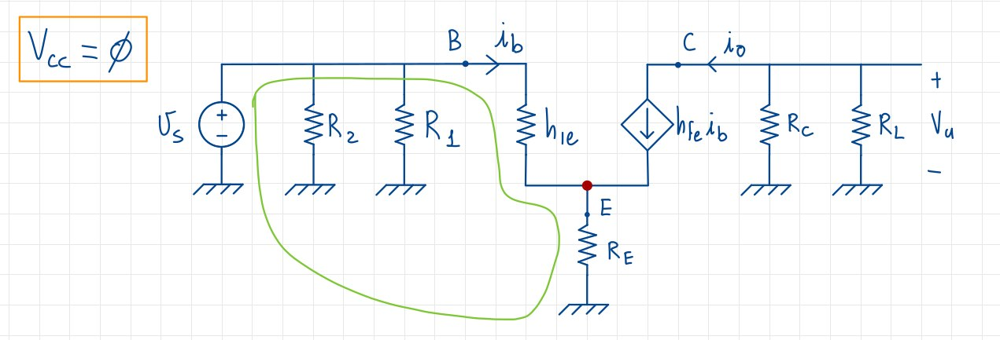{width=70%}

Ricavo immediatamente due parametri: $A_i = \frac{i_o}{i_i} = h_{fe}$, e $A_v = \frac{v_o}{v_i}$. Costruisco il sistema per trovare le correnti:

$$\begin{cases}
i_o = h_{fe} i_b \\
i_b = i_i
\end{cases}
\to i_o = h_{fe}i_i$$

Mentre invece per le tensioni:

$$\begin{cases}
v_u = -(R_C || R_L)(h_{fe}i_b) \\
v_s = h_{ie}i_b + R_Ei_e\\
i_e = i_b + h_{fe}i_b = (h_{fe} + 1) i_b
\end{cases} \to
\begin{cases}
v_u = (R_C || R_L)h_{fe}\frac{v_s}{h_{ie}+R_E(h_{fe}+1)} \\
v_s = h_{ie}i_b + R_E(h_{fe} + 1)i_b\\
i_b = \frac{v_s}{h_{ie} + R_E(h_{fe} + 1)}
\end{cases}$$

Da questi calcoli ricaviamo infine:

$$A_v = \frac{v_u}{v_s} = - \frac{(R_C || R_L)h_{fe}}{h_{ie} + R_E(h_{fe} + 1)}$$

#### Considerazioni

Alcune considerazioni sulle formule ricavate e utilizzate:

1. Per $A_v$ negativo, la configurazione si dirà **invertente**, come ad esempio uno sfasamento di 180° di una sinusoide;
2. Se $R_E = 0$ -> $A_v = \frac{R_C || R_L}{h_{ie}}h_{fe} >> A_v$ con $R_E \not ={0}$;
3. Se $R_E(h_{fe} + 1) >> h_{ie}$, allora $A_v = -\frac{R_C || R_L}{R_E}$;

La considerazione 2 significa in pratica che l'aggiunta della resistenza $R_E$, necessaria per la stabilizzazione del circuito, ha come controindicazione una diminuzione del guadagno. La $R_E$ è definita come **resistenza di degenerazione di emettitore**.
La considerazione 3 invece ci dice che l'amplificazione non dipende più dalle caratteristiche del transistore, ma solo dalle resistenze che posso scegliere a piacimento, rendendo quindi il circuito molto stabile.

### Il condensatore di bypass

Per aumentare ulteriormente il guadagno posso **inserire un condensatore**, di simbolo $C_E$, detto **condensatore di bypass**, che elimina $R_E$ dall'equazione di guadagno, pur mantenendo tutti gli effetti positivi della stabilità che ha introdotto. Il circuito equivalente sarà quindi il seguente:

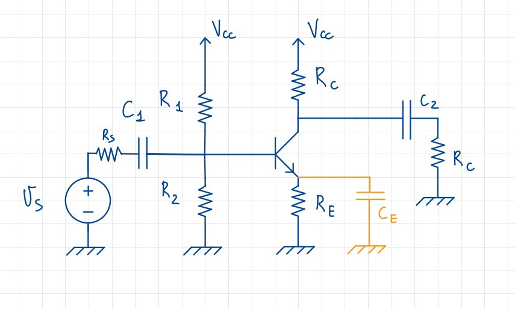{width=70%}

Troverò $R_i  \frac{v_i}{i_i} = \frac{v_s}{i_b}$ dal quale ricavo la **regola della riflessione della resistenza**:

$$R_i = h_{ie} + R_E(h_{fe} + 1)$$

che è la resistenza sull'emettitore vista dalla base.

### La resistenza di uscita

La resistenza di uscita $R_o$ verrà calcolata come il rapporto tra la tensione di uscita e la corrente di uscita, e quindi $R_o = \frac{v_u}{i_o}|_{v_i = 0}$. Dato che però $v_i = 0$ implica $i_b = 0$, e dunque un aperto al posto del generatore di valore $h_{fe}i_b$, allora $R_o = \infty$. Possiamo apprezzare questa osservazione col seguente disegno:

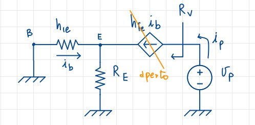{width=50%}

Infatti:

$$\begin{cases}
V_E = R_E(f_{fe} + 1)i_b \\
V_E = -h_{fe}i_b
\end{cases}
\to R_E(h_{fe} + 1) = h_{fe}i_b \to [R_E(h_{fe} + 1) + h_{fe}]i_b = 0$$

Ricavo quindi che, per la legge di annullamento del prodotto, $i_b = 0$, per cui $R_V = \infty$

## Amplificatore a collettore comune

Questa configurazione, e relativo circuito equivalente, vengono così rappresentati:

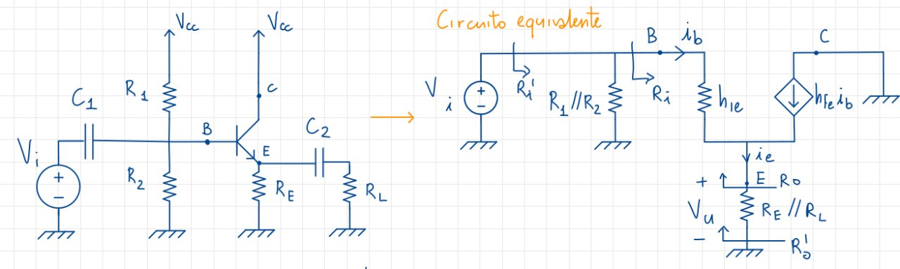{width=60%}

### Resistenze di ingresso e di uscita

Vediamo prima di tutto la resistenza in entrata:

$$R_i = \frac{V_i}{i_i} = h_{ie} + (RE||R_L)(h_{fe} + 1)$$

Inoltre $R_i' = R_1 || R_2 ||R_i$, per cui la resistenza di ingresso è identica a quella nel caso di configurazione ad emettitore comune.

Per quanto riguarda la resistenza in uscita:

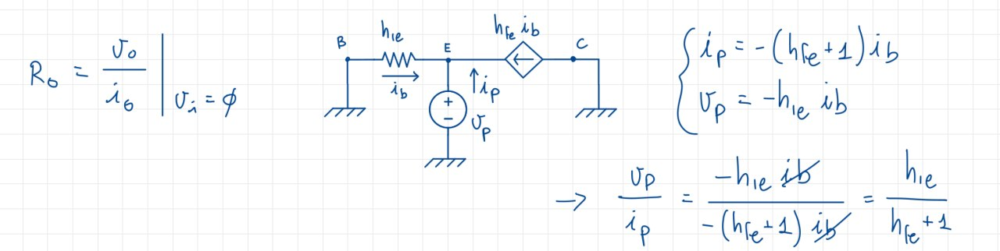{width=60%}

Quindi $R_o = \frac{h_{ie}}{h_{fe} + 1}$, che è differente dal caso ad emettitore comune. Inoltre $R_o' = R_E||R_L||R_O$$.

### Guadagno

Partiamo da $A_i = \frac{i_o}{i_i}$; inoltre sappiamo che $i_o = -(h_{fe} + 1)i_b$, e $i_i = i_b$, per cui $A_i = -(h_{fe} + 1)$.

Proseguiamo con $A_v = \frac{v_u}{v_i}$, e mettiamo a sistema le equazioni del circuito:

$$
\begin{cases}
v_u = (R_E||R_L)i_e \\
i_e = (h_{fe} + 1)i_b
\end{cases}
\to v_u = (R_E||R_L)(h_{fe} + 1)i_b
$$

Scriviamo ora l'equazione per $v_i$:

$$v_i = h_{ie}i_b + (R_E||R_L)(h_{fe} + 1)i_b$$

Dalla quale ricaviamo:

$$i_b = \frac{v_i}{h_{ie} + (R_E||R_L)(h_{fe} + 1)}$$

Per cui, sostituendo il tutto nell'equazione iniziale, otteniamo:

$$A_v = \frac{v_u}{v_i} = \frac{(R_E||R_L)(h_{fe} + 1)}{h_{ie} + (R_E||R_L)(h_{fe} + 1)}$$

Possiamo fare alcune osservazioni:

1. $A_v$ è positiva, per cui i segnali in ingresso ed uscita avranno lo stesso segno, ed è ciò che ci aspettiamo da una configurazione **non invertente**;
2. $A_v < 1$ sempre, per costruzione;
3. Se $h_{ie} << (R_E||R_L)(h_{fe} + 1)$, allora $A_v \approx 1$. Questo caso è chiamato **configurazione a inseguitore di emettitore**, in quanto l'amplificazione è fatta con un fattore quasi unitario, grazie al quale l'uscita *segue* l'ingresso.

## Amplificatore a source comune

Questa configurazione, e relativo circuito equivalente, vengono così rappresentati:

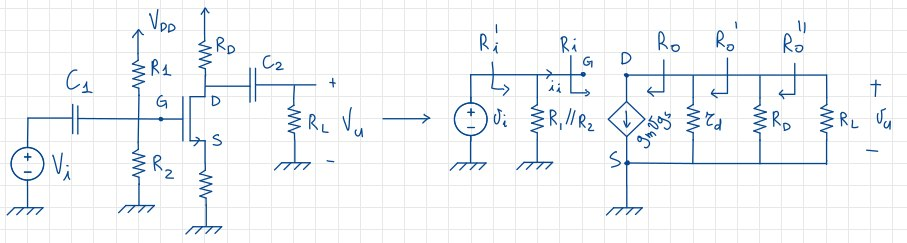{width=60%}

L'analisi in DC è tale a quella fatta per l'amplificatore a emettitore comune, per cui non la ripeteremo. Notiamo comunque una differenza: ora Source non è collegato a Ground, ma al terminale di riferimento, tramite una resistenza $R_S$.

### Parametri di guadagno

Partiamo da $A_i = \frac{i_o}{i_i}$, essendo però $i_i = 0$, allora $A_i \to \infty$, per cui non ha molto senso riportarlo.

Proseguiamo con $A_v = \frac{v_u}{v_i}$, e mettiamo a sistema le equazioni del circuito:

$$\begin{cases}
v_u = -(r_d||R_D||R_L)(g_mv_{gs}) \\
v_{gs} = v_g - v_s = v_i
\end{cases}$$

L'ultima equazione si ricava dal fatto che $v_s = 0$, e che $v_g = v_i$, come ravvisabile dal circuito equivalente.

Mettendo assieme le equazioni del sistema, otteniamo infine:

$$ A_v = \frac{v_u}{v_i} = -(r_d||R_D||R_L)g_m$$

Osserviamo che $A_v$ è negativa: siamo pertanto davanti ad una configurazione **invertente**.

### Parametri di resistenza

Per quanto riguarda la resistenza di ingresso, possiamo scrivere $R_i = \frac{v_i}{i_i} \to \infty$, perché come visto in precedenza $i_i = 0$, e infatti avremo un circuito aperto. Inoltre, $R'_i = R_1||R_2||R_i$.

La resistenza di uscita merita invece un'analisi un po' più approfondita: dalla definizione ricordiamo che $R_o = \frac{v_o}{i_o}|_{v_i = 0} \to \infty$, ma $v_i = 0$ implica $v_{gs} = 0$, per cui $R_o' = \frac{v_o}{i_o}|_{v_{s} = 0} = R_o||R_D = R_D$.

$$\qquad$$

### Un caso particolare: $R_S \not ={0}$ e $r_d \to \infty$

In questo caso, il circuito equivalente diventa:

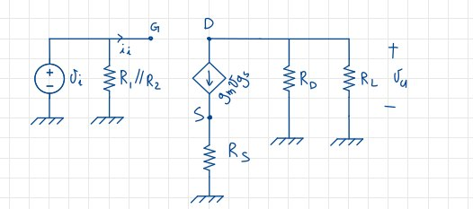{width=60%}

Alcune formule cambiano rispetto al caso base:

$$\begin{cases}
v_u = (R_D||R_L)(-g_mv_{gs}) \\
v_s = R_S(g_m v_{gs} )
\end{cases}$$

Analizziamo e ricaviamoci $v_{gs}$:

$v_{gs} = v_g - v_s = v_g - R_S(g_m v_{gs})$, da cui $v_{gs} = \frac{v_g}{1 + R_Sg_m}$, essendo $v_g = (1 + g_mR_S)v_{gs}$.
Sapendo che $v_g = v_i$, ottengo inoltre $v_{gs} = \frac{v_i}{1 + R_Sg_m}$.

Sostituiamo ora $v_{gs}$ nell'equazione per $v_u$:

$$v_u = (R_D||R_L)(-g_m\frac{v_i}{1 + R_Sg_m})$$

Per cui mi ricavo $A_v$:

$$A_v = \frac{v_u}{v_i} = -(R_D||R_L)g_m\frac{1}{1 + R_Sg_m}$$

La $R_S$, detta anche **resistenza di degenerazione di source**, porta con la sua introduzione sia una **stabilizzazione del punto di riposo**, sia una **riduzione del guadagno**; con essa infatti la $v_{gs}$ non sarà più uguale a $v_i$, ma sarà una sua partizione, per cui il guadagno sarà minore. È importante notare che in presenza di una resistenza di Source, se il guadagno di trans-conduttanza $g_mR_S >> 1$, l'amplificazione di tensione si riduce a circa il rapporto tra la resistenza di Drain e la resistenza di Source. Pertanto, anche in questo caso, l'amplificazione di tensione è approssimativamente pari al rapporto tra la resistenza di Drain e la resistenza di Source, proprio come nel caso dello stadio a emettitore comune, per cui 'giocando' con il valore di $R_S$ è possibile ottenere amplificazioni di tensione differenti. Infine, possiamo pensare di limitare la perdita di guadagno attraverso il condensatore di bypass, già visto nel caso dell'amplificatore a emettitore comune.

## Amplificatore a drain comune

In questa configurazione il Drain è utilizzato come terminale di riferimento, mentre quello di Gate risulterà essere il terminale di entrata; di conseguenza, l'uscita sarà prelevata da Source. Il circuito sarà simile a quello del caso precedente. con la differenza che rimuoveremo la $R_D$:

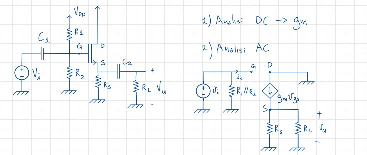{width=75%}

L'analisi in DC viene omessa in quanto analoga a tutte le precedenti, per cui ci concentreremo sui parametri di uscita.

### Parametri di output

Partiamo dal calcolo della resistenza: per definizione $R_o = \frac{v_o}{i_o}|_{v_i = 0}$. Osserviamo la figura per capire meglio:

Scriviamo il sistema:

$$\begin{cases}
i_p = - g_mv_{gs} \\
v_g = 0 \\
v_s = v_p
\end{cases}
\to
\begin{cases}
v_{gs} = v_g - v_s = -v_p\\
i_p = g_mv_p
\end{cases}$$

Sostituendo queste equazioni nella definizione di $R_o$, otteniamo:

$$R_o = \frac{v_o}{i_o}|_{v_i = 0} = \frac{v_p}{i_p} = \frac{v_p}{g_mv_p} = \frac{1}{g_m}$$

Anche per il parametro di guadagno partiremo dalla definizione, che è $A_o = \frac{v_u}{v_i}$. Scriviamo il nostro sistema:

$$\begin{cases}
v_u = (g_mv_{gs})((R_S||R_L))\\
v_g = v_i \\
v_s = v_u
\end{cases}
\to
\begin{cases}
v_{gs} = v_i - v_u \\
v_u = g_m(v_i - v_u)(R_S||R_L)
\end{cases}$$

Esplicitando l'equazione in funzione di $v_u$:

$$v_u = \frac{g_m((R_S||R_L))}{1+g_m((R_S||R_L))}v_i$$

Infine sostituiamo questa equazione nella definizione di $A_o$:

$$A_v = \frac{v_u}{v_i} = \frac{g_m((R_S||R_L))}{1+g_m((R_S||R_L))}$$

Notiamo come la configurazione in esame sia **non invertente**, e ciò è ravvisabile dal segno positivo di $A_v$; sempre osservando la relazione appena trovata ci accorgiamo che $|A_v| < 1$ per costruzione e che, nel caso particolare  in cui $g_m((R_S||R_L)) >> 1$, $A_v \approx 1$, configurazione che prende il nome di **inseguitore di source**.

## Amplificatori multistadio

Riuscire a soddisfare tutti i requisiti di un progetto utilizzando un solo amplificatore può essere difficile, per cui è pratica comune **collegare in cascata** due o più amplificatori, in modo da combinare le loro caratteristiche nel modo più vantaggioso possibile per la rete in oggetto. Abbiamo usato la parola *combinare* e non *moltiplicare* perché solo in specifiche condizioni è possibile moltiplicare tra loro i guadagni dei singoli stadi, mentre in situazioni normali dobbiamo considerare l'interazione tra i singoli stadi, che renderanno il guadagno minore di quanto ci si possa aspettare.

Vedendo gli amplificatori come delle scatole, la struttura di un amplificatore multistadio può essere schematizzata come segue:

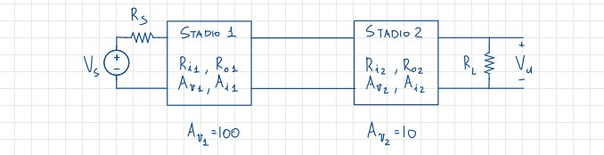{width=60%}

### L'interazione tra stadi

Per capire come si comportano gli stadi in cascata, prendiamo lo schema precedente, esplicitando però i circuiti equivalenti di ogni stadio:

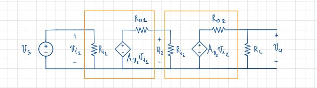{width=60%}

Notiamo visivamente come le interazioni tra i due amplificatori influiscano sulle performance finali, quindi confermiamo queste sensazioni dal punto di vista matematico. Vediamo dunque il guadagno $A_v = \frac{v_u}{v_i}|_{R_L \to \infty}$:

$$\begin{cases}
v_u = A_{v2}v_{i2}\\
v_{i2} = A_{v1}v_{i1} \frac{R_{i2}}{R_{o1}+R_{i2}}\\
v_{i1} = v_s
\end{cases}
\to
A_v = A_{v1}A_{v2}\frac{R_{i2}}{R_{o1}+R_{i2}}
$$

Il valore di $A_v$ è evidentemente diverso dal semplice prodotto di $A_{v1}$ e $A_{v2}$, vista la presenza il fattore moltiplicativo $\frac{R_{i2}}{R_{o1}+R_{i2}}$, che è chiamato **fattore di attenuazione**. Per costruzione non potrà mai essere negativo o maggiore di 1, tuttavia nel caso in cui $R_{i2}\to \infty$ oppure $R_{o1} = 0$, il fattore di attenuazione varrà 1, e quindi il guadagno sarà pari al prodotto dei guadagni dei singoli stadi, e questo è l'unico caso in cui ciò accade. In gergo questa situazione si dice che **lo stadio a valle insegue lo stadio a monte**, proprio perché il guadagno finale è pari al prodotto dei guadagni dei singoli stadi.
