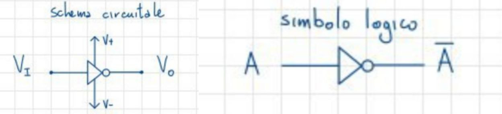
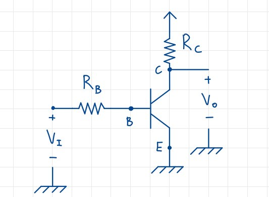
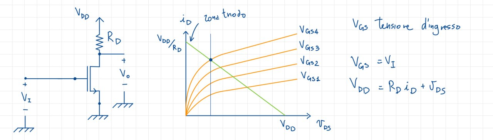
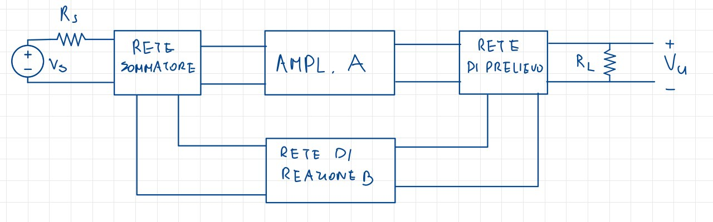

# Risposta in frequenza

In generale, un segnale non è formato da una sola componente sequenziale, ma da più componenti frequenziali, spesso in forma sinusoidale: con un amplificatore è possibile amplificare tutte queste componenti frequenziali, ma bisogna porre attenzione nell'amplificarle tutte allo stesso modo, altrimenti mi troverei davanti ad una **distorsione** del segnale originale, e non ad una sua **replica** come invece mi aspetterei.

## Determinazione della risposta in frequenza

Gli elementi che determinano la risposta in frequenza sono gli **elementi reattivi**, ovvero induttori e condensatori, che rendono il risultato del parametro $A_v$ dipendente dalla frequenza, in quanto essi stessi dipendono dalla frequenza.

Un esempio di $A_v(f)$, utilizzando la trasformata di Laplace, è il seguente:

$$A_v(s) = \frac{v_u(s)}{v_i(s)} = A_k \frac{(s-\omega_{z1})\cdot(s-\omega_{z2}) \dots (s - \omega_{zn})}{(s-w_{p1}) \cdot (s-\omega_{p2}) \dots (s-\omega_{pn})}$$

Dovrei quindi calcolare tutti i poli e gli zeri del circuito, per poi passare effettivamente alla risposta in frequenza. Per far ciò dovrei prima però portare il circuito nel dominio della frequenza:

Ogni condensatore inserisce uno zero nell'origine, perchè a frequenze nulle sono assimilabili a dei circuiti aperti, ed essendo in serie al percorso della corrente, la annulleranno; generalmente, in un circuito, il numero di poli è pari al numero di **elementi reattivi indipendenti**. Ad esempio, un condensatore in serie ad un induttore non è un elemento reattivo indipendente, perchè la i due elementi reattivi dipendono uno dall'altro. 

## Il ruolo dei condensatori

Questi metodi di analisi vengono chiamati **metodi ispettivi**, dei quali daremo alcune convenzioni. Ad esempio, parlando di condensatori, definiremo:

* capacità **grossa** una capacità nell'ordine dei $\mu F$ (microfarad), e sono din solito grandezze che troviamo in condensatori esterni, di accoppiamento o di bypass;
* capacità **piccola** una capacità nell'ordine dei $pF$ (picofarad), e sono din solito grandezze che troviamo in condensatori intrinseci, o in caso di capacità parassite.

L'impedenza di un condensatore è pari a $|z = \frac{1}{\omega C} = \frac{1}{2\pi fC}$: in continua sono dei circuiti aperti, con impedenza infinita, quindi osserviamo il loro comportamento al variare della frequenza.

$$
f = 10Hz \to
\begin{cases}
|Z_{est}| \approx 10^5 \Omega \\
|Z_{int}| \approx 10^11 \Omega
\end{cases}
\qquad
f= 1kHz
\begin{cases}
|Z_{est}| \approx 10^3 \Omega \\
|Z_{int}| \approx 10^9 \Omega
\end{cases}
\qquad
f=1MHz
\begin{cases}
|Z_{est}| \approx 1 \Omega \\
|Z_{int}| \approx 10^6 \Omega
\end{cases}$$

Notiamo che i condensatori interni hanno sempre un'impedenza molto elevata, e comunque sempre molto maggiore rispetto a quella esterna. In generale, durante un'analisi DC, andrò sempre a considerarli come circuiti **aperti**, mentre nella AC a seconda delle frequenze in cui sto operando, posso dunque fare delle assunzioni:

* a **basse frequenze** considero i condensatori interni come circuiti aperti;
* a **medie frequenze** considero i condensatori interni come circuiti aperti, e quelli esterni come cortocircuiti;
* ad **alte frequenze** consdero i condensatori esterni come cortocircuiti.

Confrontando queste assunzioni con le indicazioni che ci eravamoa dati per lo studio in AC, ci rendiamo conto come in effetti tale procedura sia di fatto un'analisi a **medie frequenze**.

## Diagramma di Bode

Comunemente gli amplificatori hanno un andamento nel diagramma di Bode del tipo:

{ width=60%}

La **larghezza di banda** è definita come la distanza tra $f_L$, dove L sta per *lower*, e $f_H$, dove H sta per *higher*, ovvero la distanza tra i due punti che indicano rispettivamente i limiti **inferiori** e **superiori** di banda, e sono di solito separati da circa due ordini di grandezza, per cui posso separare i due tipi di condensatori con una buona approssimazione.
Ad alte frequenze vediamo **un'attenuazione** del segnale: un esempio pratico è il caso in cui il segnale passa dal Gate al Drain **senza amplificazione**.
Infine, chiamiamo la $f_T$ la frequenza di **transizione**, ovvero il valore per il quale il guadagno di corrente in cortocircuito, nella configurazione ad emettitore comune, diventa **unitaria**: il suo valore si può trovare nei datasheet dei vari componenti utilizzati nel circuito.

## Alcuni usi digitali di amplificatori ed elementi attivi

### Inverter

I simboli logici e circuitali sono i seguenti:

{width=70%}

dove $V^+$ e $V^-$ sono definiti in base alla famiglia logica, e sono le tensioni di alimentazione del circuito: l'inverter infatti è un **elemento attivo**, e quindi ha bisogno di alimentazione.
Assegnamo al valore logico *1* il valore della tensione $V_H$, e allo *0* quello di $V_L$, e passiamo allo studio della **caratteristica di trafenferimento**, della quale troviamo il grafico seguente:

{width=50%}

Vediamo subito come le tensioni siano limitate tra i valori di $V^+$ e $V^-$; la caratteristica ideale è sì verticale, ma non è necessario che raggiunga i valori di $V^+$ e $V^-$.
Il valore di tensione per il quale c'è la transizione è $V_{ref}$: in questo caso è posizionato a metà dell'escursione di tensione, ma ciò non è sempre vero e in generale dipende dal dispositivo.
La caratteristica reale ricorda ovviamente quella ideale, ma ovviamente non è verticale e non è nemmeno una retta, ma assume una forma più tondeggiante: più questa curva però si avvicina a quella verticale, migliore sarà la **rigenerazione** di un segnale degradato, ovvero la capacità di ripristinare un segnale che ha perso la sua forma originale.

### Inverter con BJT

Lo schema circuitale prevede, ovviamente, la presenza di un BJT, ed è il seguente:

Il comportamento del circuito dipenderà dai valori di $V_I$, $R_B$ e $R_C$. 

Nella maglia d'ingresso avremo $V_I = R_Bi_B +v_{BE}$, mentre in quella d'uscita $V_I = R_Bi_B + v_{CE}$la quale viene ricavata tramite l'analisi della caratteristica di entrata:

Abbiamo due casi possibili:

1. se $V_I << V_\gamma$, abbiamo sia la giunzione Base-Emettitore che quella Base-Collettore polarizzati in inversa, per cui abbiamo un comportamento assimilabile ad un *interruttore in OFF*;
2. se $V_I >> V_\gamma$, abbiamo invece entrambe le giunzioni polarizzate in diretta, per cui il punto di riposo Q è in saturazione.

Esiste in realtà un altro funzionamento: se $V_I = V_{DD}$ e $V_{BE} \approx V_\gamma$, si ricava $i_B= \frac{V_{DD} - V_\gamma}{R_B}$ che equivale a $I_{B4}$ nel disegno della caratteristica. Risulta evidente come in questo caso il punto di lavoro dipende esplicitamente dal valore delle resistenze $R_B$ e $R_C$, per cui è necessario modificare questi elementi circuitali per ottenere un punto di lavoro desiderato.

#### Verifica della saturazione

Avremo necessità di varie equazioni, alcune delle quali già note per ipotesi: la base $I_B \approx \frac{V_{DD}}{R_B}$, con $V_\gamma << V_{DD}$.
Per il collettore invece $I_C \approx \frac{V_DD}{R_{CC}}$ con $V_{CE} << V_{DD}$.

Ricaviamo dunque che $\frac{V_{DD}}{R_C} << \beta_F \frac{V_{DD}}{R_B}$, e duqnue infine $R_B <<\beta_F R_C$.

#### Esempio implementativo con BJT

Supponiamo di avere $V_{DD} = 5V$, $\beta_F = 50$, $R_C = 1k\Omega$ e $R_B = 10k\Omega$

É possibile notare dal grafico come si tratti di un inverter che presenta una **forte asimmetria**, poichè il suo grafico è molto spostato verso sinistra; è poco immune al rumore prima di arrivare a $V_\gamma$, mentre dopo è molto più immune. Infine vediamo che a interruttore chiuso viene dissipata **molta potenza**, a causa del collegamento tra $V_{DD}$ e *Ground* e della resistenza nel percorso. Questo fenomeno viene chiamato **dissipazione statica di potenza**, poihcè la potenza viene dissipata anche quando il circuito non è effettivamente in funzione; questa problematica verrà risolta con l'uso dei CMOS.

### Inverter con NMOS

Lo schema circuitale e la caratteristica del circuito sono i seguenti:

Riconosciamo le zone di funzionamento:

* per $V_I = V_{GS} < V_T$, allora avremo Q **interdetto** e $V_O = V_{DD}$. Anche se siamo in interdizione, una piccola parte di corrente scorre;
* se $V_I >> V_T$, allora risulta Q **triodo**, e dunque $V_O$ sarà piccola.

#### I parametri regolatori

Per ipotesi ci troviamo in zona triodo, per cui: $i_D \approx (\mu_n C_{OX}) \frac{W}{L}(V_{GS} - V_T )V_{DS}$, ma $v_{DS} << V_{DD}$ che implica $i_D \approx \frac{V_DD}{R_D}$

Unendo le equazioni ricaviamo:

$$V_{DD} = k' \frac{W}{L} (V_I - V_T)V_L \to V_L = \frac{V_{DD}}{R_D k' \frac{W}{L}(V_I - V_T)}$$

Questo vuol dire che, essendo anch'essi parametri dell'equazione, anche $W$ ed $L$ influenzano il punto di lavoro: in particolare potrò modificare le **dimensioni** dei singoli transistori MOSFET.

#### Esempio implementativo con NMOS

Le ipotesi sono che $V_{DD} = 5V$, $V_T = 1V$  e $R_D = 95k\Omega$.

Risulta sicuramente un'implementazione migliore di quella col BJT, anche se è sempre presente l'asimmetria e la dissipazione statica di potenza, seppur minore.

$$\qquad$$
$$\qquad$$
$$\qquad$$

## Teoria della reazione semplificata

### Introduzione

Il principio della reazione consiste nel **riportare all'ingresso di un sistema una porzione del segnale in uscita** dallo stesso, in modo da modificare le proprierà del sistema stesso.
Generalmente, nei casi nei quali è necessario **mantenere una grandezza in uscita costante**, si parla, e si realizza, una reazione **negativa**, ovvero che il segnale riportato in ingresso ha **segno inverso** rispetto al segnale che lo ha prodotto: così facendo ogni variazione determina un effetto in senso opposto, che tende a contrastare la variazione stessa. Questo tipo di reazione è quella che viene maggiormente utilizzata in campo elettronico, visto il bisogno di generare tensioni e correnti stabili.

### Schema generale di un sistema retroazionato

{width=70%}

La reazione vera e propria avviene all'interno del **blocco amplificatore**: essa prende in ingresso il segnale risultante dall'uscita della **rete sommatrice**, e produce in uscita un segnale che passa attraverso la **rete di prelievo**. Quest'ultima recupera quindi il segnale di uscita amplificato, lo manda alla **rete di retroazione** che gli applicherà un **guadagno $\beta$** e lo riporterà all'ingresso della rete sommatrice, e così via.

#### Reti di prelievo

Le reti di prelievo sono reti che **prelevano** una porzione del segnale in uscita dal blocco amplificatore, e lo riportano all'ingresso della rete sommatrice. Esse possono essere di due tipi: a prelievo di **tensione** o di **corrente**.

##### Reti di prelievo di tensione

Queste tipologie di reti vengono **collegate in parallelo** alla rete di reazione, in modo che ques'ultima sia a sua volta collegata in **parallelo al carico**. In questo modo, la tensione in uscita dal blocco amplificatore viene prelevata, moltiplicata per un fattore $|\beta| < 1$ e riportata all'ingresso della rete sommatrice. Dal punto di vista circuitale, avremo un collegamento come quello in figura:

{width=30%}

##### Reti di prelievo di corrente

In questo caso si fa in modo che la rete di reazione sia **collegata in serie** al carico. Nella rete di reazione scorrerà quindi la stessa corrente del carico, alla quale verrà applicata il fattore di guadagnodella reazione $\beta$. Dal punto di vista circuitale, avremo un collegamento come quello in figura:

{width=30%}

### Reti sommatrici

Queste reti sono anche dette *di reinserimento*, e si occupano di **sommare** i segnali in ingresso al blocco amplificatore con il segnale di retroazione. Possono essere **in serie**, dove il segnale viene messo in serie alla sorgente $V_S - R_S$, o **in parallelo**, dove il generatore di segnale viene sostituito dal suo **equivalente Norton**, e la rete di reazione viene collegata in parallelo, ottenendo una sottrazione di correnti tra $I_S$ e la corrente di retroazione.

$$\qquad$$
$$\qquad$$

### Guadagno di reazione

Partiamo da alcune ipotesi semplificative che ci saranno utili nella trattazione semplificata:

* il blocco amplificatore è **unidirezionale**;
* la rete di reazione è **unidirezionale**;
* il fattore di reazione $\beta$ è indipedente dalle resistenze di sorgente e di carico.

La **funzione di trasferimento** del nostro sistema sarà definita come $H = \frac{X_0}{X_S}$, dove $X_0$ è la funzione in uscita dal blocco amplificatore, e $X_S$ è la funzione di sorgente. Conoscendo essa, possiamo calcolare il guadagno della rete di reazione.

Avremo quindi che $A$ è il **guadagno ad anello aperto**, mentre $\beta \cdot A$ è il **guadagno d'anello**, ed infine il **guadagno ad anello chiuso** dato da $A_f = \frac{A}{1 + \beta \cdot A}$.

Parleremo in generale di **reazione negativa** se $|A_f| < |A|$, mentre in caso contrario avremo una **reazione positiva**. Come anticipato, l'elettronica fa uso quasi esclusivamente di reazioni negative, che hanno come effetto quello di portare una diminuzione del guadagno. Sebbene questo possa sembrare un effetto negativo, in realtà è molto utile per **migliorare le prestazioni** del sistema. Guardiamo infatti questo esempio:

Ci troveremo spesso a lavorare in contesti in cui $|\beta A| >> 1$, che porta ad avere $A_f \approx -\frac{1}{\beta}$, per cui il guadagno non dipende più dall'amplificatore ma solo dalle caratteristiche della rete di reazione. Se ad esempio essa fosse composta esclusivamente da resistenze, avremo un **guadagno stabile** in quanto **rapporto di resistenze**.
