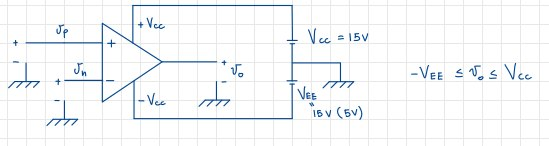

# Amplificatori Differenziali

Un amplificatore differenziale è un tipo di amplificatore che, dati due segnali tramite due porte di ingresso, produce in uscita un segnale che è l'amplificazione della differenza tra i due segnali in ingresso moltiplicata per un fattore di amplificazione.

{ width=50% }

## Definizioni

Il segnale a **modo differenziale** $v_d$ è quel segnale dato dalla **differenza** tra i due segnali in ingresso $v_1$ e $v_2$.

Il segnale a **modo comune** $v_c$ è la **semisomma** dei due segnali in ingresso $v_1$ e $v_2$.

Il **guadagno del modo differenziale** $A_d$ è il rapporto tra il segnale a modo differenziale $v_d$ e il segnale in uscita $v_u$, ovvero: $A_d = \frac{v_d}{v_u}$.

Il **guadagno del modo comune** $A_c$ è il rapporto tra il segnale in uscita $v_u$ e li segnale a modo comune $v_c$, ovvero: $A_c = \frac{v_u}{v_c}$.

## Caso ideale e caso reale

### Caso ideale

Nel caso ideale,abbiamo il **guadagno del modo comune** $A_c = 0$ e il **guadagno del modo differenziale** $A_d \not = 0$.
Ciò vuol dire che in una situazione del genere, l'amplificatore differenziale amplifica solo il segnale a modo differenziale, rendendo l'uscita $v_u$ proporzionale alla differenza tra i due segnali in ingresso $v_1$ e $v_2$. Inoltre, il **CMRR** (Common Mode Rejection Ratio) è infinito.

### Caso reale

Introduciamo una nuova grandezza chiamata **CMRR** (Common Mode Rejection Ratio), ovvero il rapporto tra il guadagno del modo differenziale e il guadagno del modo comune, ovvero: $CMRR = \frac{A_d}{A_c}$. Nel caso reale, il **CMRR** è finito e diverso da zero, e deve essere reso **il più grande possibile**. Dei numeri tipici sono CMRR $= [80 \div 120]$ $dB$.

## Utilità per la riduzione del rumore

Definiamo:

$$A_1 = \frac{v_u}{v_1}|_{v_2 = 0} \qquad A_2 = \frac{v_0}{v_2}_{v_1 = 0}$$

Posso quindi scrivere il sistema:

$$\begin{cases}
\frac{1}{1}v_d = \frac{1}{2}v_1 - \frac{1}{2}v_2 \\
v_c = \frac{1}{2}v_1 + \frac{1}{2}v_2
\end{cases}
\to
\begin{cases}
v_1 = v_c + \frac{v_d}{2} \\
v_2 = v_c - \frac{v_d}{2}
\end{cases}$$

Dal quale posso ricavare:

$$v_0 = A_1v_1 + A_2v_2 = A_1\left(v_c + \frac{v_d}{2}\right) + A_2\left(v_c - \frac{v_d}{2}\right) = \left(A_1 + A_2\right)v_c + \left(\frac{A_1}{2} - \frac{A_2}{2}\right)v_d$$

Avremo infine:

$$v_0 = A_c v_c + A_d v_d$$

Cosa vuol dire questo risultato in termini pratici? Se abbiamo dei **disturbi** sui segnali in ingresso all'amplificatore, essi tenderanno ad eliminarsi se questi sono **uguali**. In caso reale, tuttavia, è impossibile che i due disturbi siano identici.

## Amplificatori operazionali

Si tratta di una tipologia di amplificatori differenziali, devono il loro nome dal al fatto che i primi amplificatori di questo tipo venivano utilizzati per fare delle operazioni, quali somma e sottrazione, tra segnali, all'interno di circuiti più complessi.

### Simbolo circuitale

{ width=50% }

I due ingressi sono caratterizzati dal segno $+$ o $-$, che indicano rispettivamente l'ingresso **non invertente** e quello **invertente**.

### Caratteristiche peculiari

* ha **un ingresso differenziale**, ovvero presenta due ingressi e, nal caso ideale, amplifica solo la **differenza di tensione** tra i due segnali;
* nel caso ideale, ma anche in quello reale, presenta un **guadagno differenziale molto elevato**;
* è **accoppiato in continua**, cioè i segnali in ingresso sono collegati ai circuiti interni **senza condensatori di accoppiamento**. Da ciò ne deriva che non esiste un limite inferiore di banda, per cui la frequenza può estendersi fino ad assumere valori nulli. É invece presente un limite superiore di banda, che è la banda stessa dell'amplificatore.

$$\qquad$$

#### I terminali di alimentazione

Sebbene talvolta non vengano disegnati, sono presenti altri due terminali fondamentali per il funzionamento del dispositivo, e sono ovviamente i terminali di alimentazione. Difatti l'amplificatore operazionale è composto da **MOSFET** e **BJT**, che sono elementi attivi, e quindi necessitano di una tensione di alimentazione per funzionare. Essa funziona prendendo come terminale di riferimento quello a comune dalle due batterie. La tensione di alimentazione è **duale**, dunque se al terminale non invertente avrò una $V_{CC}$, a quello invertente avrò una $V_{EE}$ tale che esse siano uguali in modulo ma opposte in segno. Il valore della tensione di alimentazione determina infine anche i valori massimi e minimo che il segnale in uscita può assumere: se la tensione di alimentazione vale $V_{CC}$, allora l'uscita $v_o$ sarà tale che $-V_{EE} \le v_o \le V_{CC}$.

{ width=70% }

### Circuito equivalente

Tra i due terminali di ingresso è presente una resistenza $R_{IN}$, mentre il circuito di uscita è composto da un generatore di tensione comandato in tensione, che eroga una tensione $A_{VOL}V_{IN}$, dove $V_{IN} = (v_p - v_n)$. La tensione di uscita viene calcolata rispetto al **terminale di alimentazione**.

{ width=70% }

É opportuno ricordare che i **terminali di ingresso non sono connessi a ground**, e dunque non hanno *ground* come tensione di riferimento.

$$\qquad$$

### Caso ideale e reale

Nella seguente tabella sono riportate le differenze tra il caso ideale e quello reale.

| Caso ideale | $\mu$A741 |
|:-----------:|:----------:|
| $A_{OL} = \infty$ | $A_{OL} = 10^5$ (100dB)|
| $R_{IN} = \infty$ | $R_{IN} = 2M\Omega$ |
| $R_{O} = 0$ | $R_{O} = 25\Omega$ |
| Banda = $\infty$ | Banda = 1MHz |
| $CMRR = \infty$ | $CMRR = 90dB$ |
| $PGB =  \infty$ | $PGB = 1MHz$ |

La **banda** è l'unico parametro che si discosta molto tra caso reale e ideale, ed è piccola per motivi di stabilità; il suo valore ci indica che il dispositivo amplificherà tutti i segnali tra 4-8 Hz, mentre per frequenze più alte la sue risposta sarà più debole. Ciò non rappresenta un grande problema, perché il parametro di interesse è il **Prodotto Guadagno Banda**, o PGB: esso indica il massimo guadagno ottenibile dall'amplificatore ad una certa frequenza. Nel caso ideale, il PGB è infinito, mentre nel caso reale è di 1 MHz, che è un valore molto elevato.

### Caratteristica di trasferimento

{width=70%}

Vediamo subito come in questo caso il dispositivo si satura subito, per tensioni di appena 150 $\mu V$, e come i valori di ingresso ed uscita siano limitati, come già detto, dai valori di alimentazione.

### Richiamo alla teoria dei sistemi

L'immediata saturazione del dispositivo rilevata nell'analisi della caratteristica ci suggerisce che un amplificatore operazionale verrà difficilmente usato in loop aperto, vista appunto la saturazione causata dall'elevato guadagno. Verrà invece usato in **loop chiuso** in un sistema di reazione, facendo in modo di mantenere sempre piccola la differenza di potenziale tra i due terminali in ingresso, e dunque mantenere il funzionamento del dispositivo stesso in **zona lineare**.

{width=50%}

Avendo $y = \frac{Ax}{1+\beta A}$, con $|\beta A| >> 1$, ricaviamo che $y \approx \frac{A}{A\beta}x = \frac{1}{\beta}x$. In caso di $\beta$ **attenuatore**, avremo $\beta = \frac{1}{10}$: questo implica l'inserimento di una **forte approssimazione**, ovvero che $w = 0$.

#### Attenuazione della tensione

La strategia usata in questo esempio è quella dell'introduzione di un partitore di tensione resistivo:

{width=50%}

Per cui unendo questo partitore al sistema reazionato otterremo:

{width=40%}

Notiamo come $i_n = 0$ per evitare di perturbare le altre correnti in gioco.

Il nostro sistema reazionato è quindi rappresentato dal seguente schema:

{width=70%}

Si tratta di una **configurazione non invertente**.

Vediamo ora di ricavarci le equazioni dei segnali in gioco. Partiamo da $V_y$:

$$V_y = \frac{1}{\beta}V_x = (1 + \frac{R_2}{R_1})V_x$$

Mentre invece $w$:

$$w = x - \beta y = x - \beta (\frac{1}{\beta}x) = 0$$

Per cui è valida l'approssimazione fatta precedentemente per la quale $w = 0$, o perlomeno nel caso in cui $w$ sia effettivamente molto più piccola rispetto a tutte le altre grandezze in gioco.

$$\frac{y}{x} = \frac{A}{1 + \beta A} = \frac{A}{\beta A} \cdot \frac{1}{1 + \frac{1}{\beta A}}$$

Pongo dunque $\xi = \frac{1}{\beta A}$, e faccio lo sviluppo di Taylor, arrestandomi al primo ordine che varrà circa $\frac{1}{\beta} (1 - \frac{1}{\beta A})$. Sostituendo con $\xi$ otterrò che $\frac{1}{1+\xi} = 1- \xi$. Quindi otterrò infine:

$$w = x - \beta (\frac{1}{\beta} (1 - \frac{1}{\beta A}))x = \frac{x}{\beta A}$$

In realtà quindi $w$ è un segnale **molto piccolo**, trascurabile rispetto ad altre grandezze, ma che non corrisponde esattamente ad una tensione.

#### Il cortocircuito virtuale

Dal punto di vista elettronico avremo che:

$$w = x - \beta y \to V_N = V_x - \beta V_y = V_p - V_A \approx 0$$

{width=40%}

Quindi $w$ rappresenta il **cortocircuito virtuale** tra $V_p$ e $V_A$, attraverso il quale non passa corrente, importante per non perturbare il sistema.

#### Configurazione invertente

Lo schema della configurazione invertente è il seguente:

{width=50%}

I valori delle resistenze sono $R_1 = 10k\Omega$ e $R_2 = 100k\Omega$, mentre le altre caratteristiche della rete sono:

$$
\begin{cases}
I = \frac{V_x}{R_1} \\
R_2I = -V_y \\
v_y = -\frac{R_2}{R_1}V_x
\end{cases}
$$

Si noti il segno negativo, che indica che il segnale in uscita è invertito rispetto a quello in ingresso, caratteristico della configurazione invertente.

#### Valori del circuito

{width=50%}

La resistenza vista dall'uscita della rete è $R_{VO} = \frac{R_O}{1 + \beta A}$. Come troviamo questo valore? Partiamo dal fatto che $R_{VO} = \frac{v_{prova}}{i_{prova}}$, e osserviamo poi il circuito sostituendo con l'equivalente dell'operazionale:

{width=50%}

Mettiamo a sistema le correnti:

$$
\begin{cases}
i_{pr} = i_1 + i_2 \\
i_2 = \frac{v_{prova}}{R_1 + R_2} \\
i_1 = \frac{v_{pr} - A_{VOL}(v_p-v_n)}{R_O} = v_{pr} \frac{1 + \beta A_{VOL}}{R_O}
\end{cases}
$$

A questo punto, conoscendo tensione e corrente di prova, possiamo ricavare la resistenza vista dall'uscita:

$$R_{VO} = \frac{v_{pr}}{i_{pr}} = \frac{v_{pr}}{i_1 + i_2} = \frac{v_{pr}}{v_{pr}\cdot (1 + \beta A_{VOL})+ \frac{v_{pr}}{R_1+R_2}} = \frac{R_O}{1 + \beta A_{VOL}}||(R_1+R_2)$$

## Circuito sommatore

Si tratta di un amplificatore operazionale invertente. Il suo circuito è il seguente:

{width=50%}

Sono presenti due generatori di segnali $V_1$ e $V_2$, collegati al terminale negativo dell'operazionale. Per ricavarci la tensione di uscita dovremo svolgere alcuni calcoli, aiutandoci col metodo del cortocircuito virtuale:

$$v_o = -R_G(i_1 + i_2) = -R_G(\frac{v_1}{R_1} + \frac{v_2}{R_2}) = - (a_1v_1 + a_2v_2)$$

dove i parametri $a_1$ e $a_2$ sono definiti come $a_1 = \frac{R_G}{R_1}$ e $a_2 = \frac{R_G}{R_2}$. Di fatto l'uscita è un'amplificazione della somma dei due segnali in ingresso, con un fattore di amplificazione negativo, essendo questa una configurazione invertente.

## Circuito sottrattore

Questo circuito possiede una novità: ha una configurazione che è un misto tra una invertente e una non invertente. L'obiettivo è quello di amplificare tensioni anche quando esse non sono piccole (ricordiamo il caso reale del differenziale). Vorremo dunque che l'uscita di questo circuito sia uguale, a meno di una costante moltiplicativa, alla differenza tra i due segnali in ingresso.

{width=50%}

Iniziamo scrivendo il sistema:

$$
\begin{cases}
v_p = \frac{R_4}{R_4 + R_3}v_2 \\
I = \frac{v_1 - v_p}{R_1}
\end{cases}
\to
v_o = v_p - R_2 \cdot (\frac{v_1 - v_p}{R_1})
$$

Dato che voglio una forma simile a $v_o = k(v_2 - v_1)$, riscrivo la $v_p$ come $v_p = \frac{1}{1 + \frac{R_3}{R_4}}v_2$ per ottenere:

$$v_o = v_p(1 + \frac{R_2}{R_1}) - \frac{R_2}{R_1}v_1 = \frac{(1 + \frac{R_2}{R_1})}{(1 + \frac{R_3}{R_4})}\cdot v_2 - \frac{R_2}{R_1}v_1$$

Prendo ora $k = \frac{R_2}{R_1}$, per il quale posso scrivere:

$$ k = \frac{(1 + \frac{R_2}{R_1})}{(1 + \frac{R_3}{R_4})} \to \frac{1+k}{k} = \frac{1}{k} + 1 + \frac{R_3}{R_4} \to k = \frac{R_4}{R_3}$$

Per cui nel caso in cui riesca ad ottenere $$\frac{R_4}{R_3} = \frac{R_2}{R_1}$$ allora otterrò l'amplificazione desiderata.

## Integratore di Miller

Questo circuito è un amplificatore operazionale invertente, con un condensatore in retroazione. Il suo circuito è il seguente:

{width=50%}

La configurazione presenta una resistenza tra il generatore di segnale e l'ingresso invertente, e appunto il condensatore. Portando il sistema nel dominio di Laplace, vediamo come la resistenza rimane tale. mentre il condensatore avrà impedenza $Z_C = \frac{1}{sC}$. Calcoliamo dunque ora la tensione di uscita nel dominio di Laplace:

$$v_o(s) = - \frac{1}{sC} \frac{1}{R} \cdot v_i(s) = - \frac{1}{RC} \frac{1}{s} v_i(s)$$

Come sappiamo, in Laplace $\frac{1}{s}$ equivale all'operazione di integrale, per cui, nel dominio temporale, risulterebbe:

$$v_o(t) = - \frac{1}{RC} \int_o^t v_i(\tau) d\tau + v_o(0)$$

Con ciò abbiamo dimostrato che la tensione in uscita è uguale all'integrale negativo della tensione di ingresso. Dobbiamo però fare la stessa analisi anche nel dominio del tempo, in modo da dimostrare la correttezza del circuito anche per tutti i segnali che non ammettono la trasformata di Laplace. Partiamo dal seguente sistema di equazioni:

$$
\begin{cases}
i_c = C \frac{dv_c}{dt} \\
v_o = -v_c
\end{cases}
\to
\frac{v_i}{R} = C \frac{d v_c}{dt} = -C\frac{dv_o}{dt}
$$

Da esso ricavo:

$$\frac{dv_o}{dt} = -\frac{1}{RC} v_i \to v_o(t) = -\frac{1}{RC} \int_0^t v_i(\tau)d\tau + v_o(0)$$

che è il risultato che volevamo dimostrare.
Questo circuito è un po' particolare in quanto presenta un polo nell'origine: dalla teoria dei sistemi sappiamo che **i sistemi con un polo nell'origine non risultano stabili per i criteri BIBO**. Ciò è anche intuibile dal fatto che, mettendo in ingresso una tensione costante $E$, avrò:

$$v_o(t) = -\frac{1}{RC} \int_0^t E d\tau = E \cdot \frac{t}{RC}$$

che produce all'uscita una funzione rampa:

{width=50%}

Ignorando, per un momento, la saturazione e i limiti fisici imposti dalla tensione di alimentazione, l'uscita tenderebbe ad $\infty$, per cui il sistema **non è stabile BIBO**.
Nel caso reale però, le correnti in input dell'operazionale non possono essere nulle, per cui andranno a *cercare il condensatore*, rendendo il sistema stabile.
