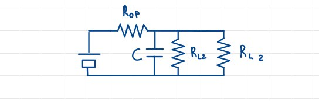
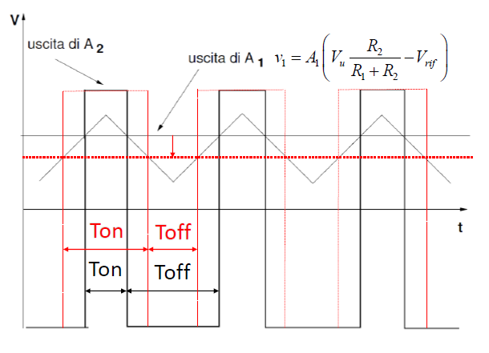

# I regolatori

In questo capitolo riaffronteremo il problema del regolatore di tensione, avvalendoci stavolta dell'utilizzo degli ampllificatori operazionali introdotti nel capitolo precedente. Facciamo un piccolo riassunto: il regolatore di tensione è quel dispositivo che, dato in ingresso una certa tensione sinusoidale (o comunque non costante), restituisce in uscita una tensione costante, indipendente dal carico. Avevamo visto alcuni dispositivi che sfruttavano il **diodo Zener**, trovandone pregi e difetti: oltre al fatto che la corrente in uscita non risultava perfettamente costante, un altro difetto era il **limite di potenza** degli alimentatori realizzati con alimentatori che sfruttano diodi Zener. Inoltre, introdurremo anche i **regolatori di corrente**, e altri tipi di regolatori.

## Un regolatore di tensione ideale

Idealmente, un regolatore di tensione è un circuito elettronico progettato per ottenere una tensione di uscita $V_U$ **continua** e **indipedente** da 3 specifici fattori. Questi fattori sono:

* la **corrente di carico** $I_L$;
* la **tensione di ingresso** $V_{in}$;
* la **temperatura** $T$.

In generale, possiamo dire che la variazione della tensione in uscita è data dalla seguente formula:

$$\Delta V_u = \frac{\partial V_u}{\partial I_L} \Delta I_L + \frac{\partial V_U}{\partial V_{u}}\Delta V_{in} + \frac{\partial V_u}{\partial T}\Delta T$$

Come intuibile, nel caso ideale tutti i  coefficienti dell'equazione sono **uguali a zero**. Ovviamente, nel caso reale, questi parametri saranno non nulli, ma possiamo comunque operare per fare in modo che il regolatore di tensione produca risultati per noi accettabili, nonostante la presenza di questi fattori.

$$\qquad$$
$$\qquad$$
$$\qquad$$

## Regolatore di tensione lineare serie

### Circuito con diodo Zener

Il circuito che andremo a studiare è il seguente:

{width=70%}

Quando il dispositivo è spento, tutta la corrente ricade direttamente sul diodo Zener, per cui vale la seguente equazione:

$$-I_z = \frac{v_s - V_z}{R_S}$$

La caratteristica del diodo Zener è la seguente:

{width=40%}

Collocando il punto di riposo molto in basso c'è un limite massimo di corrente che altrimenti porterebbe alla rottura dello stesso diodo; per questo motivo viene inserita una $R_S$ **molto piccola**.

### Circuito con amplificatore

In questo configurazione abbiamo una **reazione in tensione**, grazie all'amplificatore:

{width=70%}

Usiamo un diodo Zener per la tensione di riferimento, che è indipendente dal carico.
I segnali in ingresso all'operazionale, ci permettoni di ricavare la tensione in uscita:

$$
\begin{cases}
V^+ \approx V^- \\
V^- = V_u\frac{R_2}{R_1 + R_2} \\
V^+ = V_Z
\end{cases}
\to V_u = V_Z\frac{R_1 + R_2}{R_2}
$$

Se tutto funziona correttamente la $V_u$ dipende unicamente dalla resistenza del diodo e **non dal carico**, ed è inoltre indipendente anche dall'alimentazione.

Verifichiamo ora che la reazione operata dall'amplificatore sia **negativa**: $V_u \to V_u + \Delta V_u$ implica l'aumento di $V^-$. La $V^+$ è invece costante, per cui $V_{in} = V^+ - V^-$, per cui anche la $V_{in}$ è **diminuita**. Questo da luogo ad una catena di implicazioni: avremo infatti una diminuzione di $V_{OUT}$, una diminuzione della $i_B$, per cui anche di $i_E$ ed infine anche di $V_U$. Quest'ultima considerazione ci conferma che la reazione è **negativa**, difatti aumentando $V^-$, diminuisce $V_u$.

### Limitazioni in frequenza

Consideriamo la resistenza vista: $R_{OF} = \frac{R_o}{1 - \beta A}$

Per una $f$ bassa abbiamo $|\beta A| >> 1|$, che implica $R_{OF} \to 0$. Quindi effettivamente a basse frequenze il circuito si comporta come un generatore di tensione costante, come si evince dall'equivalente Thevenin:

{width=70%}

Mentre invece ad alte tensioni $R_{OF} \not = 0$, per cui il circuito equivalente sarebbe:

{width=70%}

In realtà il condensatore non è originariamente presente, ma **deve essere aggiunto**: questo perchè se non ci fosse, troveremo correnti ad altre frequenze su $V_{OUT}$. In pratica il condensatore si comporta come un **filtro passa basso**.

Per far quadrare questo ragionamento dobbiamo fare delle considerazioni proprio sul condensatore: esso deve avere una capacità **molto grande**, in modo che possa funzionare già a basse frequenze, e che possa subito comportarsi da cortocircuito.
Tra le opzioni ci sono i **condensatori elettrolitici**, che hanno una capacità molto grande, nell'ordine dei $\mu F$, e sono in grado di eliminare i disturbi a basse e medie frequenze, avendo però il difetto di **comportarsi come induttori** ad alte frequenze, non elimianndo dunque i disturbi a quelle frequenze. Per cui la strategia adottata è quella di inserire in parallelo a questi generatori elettrolitici degli altri condensatori, di **materiale ceramico**, che hanno si una capacità minore (nell'ordine dei $nF$), ma che sono in grado di eliminare i disturbi ad alte frequenze, non perdendo le loro stesse proprietà.

## Regolatori di corrente

### Un componente $78xx$

Iniziamo presentando il circuito di questo componente:

{width=70%}

Abbiamo che $i_R = \frac{V_x}{R}$, e che se $i_R>> i_m$, che è nell'ordine dei $mA$, allora $i_L = i_R = \frac{V_x}{R}$.

Tra i requisiti di funzionamento, abbiamo che $V_A > V_x$, e che $V_{EU} = V_{DROPOUT} \approx 1V$. Infatti, ad esempio, avendo in uscita $5V$, dovrei garantire in ingresso almeno $6V$. Questo ovviamente pone dei limiti sulla scelta di $R_L$. Scrivendo infatti le equazioni alla maglia esterna, abbiamo  $V_A = V_{EU} + V_x + R_L(\frac{V_X}{R})$, per cui $V_{EU} = [V_A - V_x - R_L(\frac{V_X}{R})] \ge V_{DROPOUT}$.

#### Problemi del circuito

Sono principalmente due i problemi che si possono incontrare:

* sono **poco flessibili**, per cui se voglio caambiare alcuni valori o parametri devo **riprogettare tutto il sistema**;
* viene dissipata **molta tensione** sotto forma di calore, che porta ad un **basso rendimento**.

Per questo motivo si preferisce utilizzare un **regolatore switching**.

## Regolatori switching (a commutazione non lineare)

Il problema principale dei regolatori precedenti era la grande dissipazione di energia, per cui partiamo dall'elemento circuitale che per definizione **non dissipa energia**: l'interuttore (o switch). Prendiamo dunque un circuito che ha un generatore di tensione in ingresso, un interuttore e un carico:

{width=70%}

Notiamo, anche dal grafico, che $V_U$ vale esattamente $E$ solo quando l'interruttore è chiuso, mentre quando è aperto vale $0$. Definiamo quindi il **Duty cicle** come il rapporto tra il tempo in cui l'interruttore è chiuso e il periodo di commutazione: $D = \frac{T_{ON}}{T_S}$.

Appare evidente come l'uscita del circuito non sia costante, perciò considero il suo valor medio $\overline{V_U} = \frac{1}{T_S}\int_0^{T_S}V_U(\tau)d\tau = \frac{1}{T_S}\int_0^{T_{ON}}E d\tau = \frac{T_{ON}}{T_S}E = DE$. Possiamo dunque dire che il valore medio dell'uscita è proporzionale al Duty cicle, per cui diventa appetibile l'opzione di un sistema in retroazione che sia **dipendente dal Duty cicle**.

### Regolatore forward

Il circuito è il seguente:

{width=70%}

Il filtro, che sarà un passa basso, è necessario per estrarre il valor medio del segnale **senza dissipare energia**: difatti sappiamo che il valor medio di un segnale periodico (in questo una sinusoide) è **il suo valore calcolato in 0**, per cui avremo una frequenza di taglio pari a $\omega = \frac{1}{\sqrt{LC}}$.

#### Caso $T_{ON} : D_{OFF}$

Il circuito in questa fase di funzionamento, con l'interruttore chiuso, è il seguente:

{width=70%}

$$\qquad$$

#### Caso $T_{OFF} : D_{ON}$

{width=70%}

$$\qquad$$

#### Dimensionamento del filtro

Il funzionamento di tutto il circuito dipende dal corretto funzionamento, e dimensionamento, del filtro. Disegnando il suo diagramma di Bode, otteniamo:

{width=50%}

Il filtro *scende* di 40dB per decade, mentre invece l'interruttore ha frequenza $f_S$, per cui è necessario che $f_O << f_S$.

#### Dimostrazione della correttezza del circuito

Il comportamento della tensione, in relazione all'ingresso, all'interruttore, e la corrente, è il seguente:

{width=70%}

Analizzando dal punto di vista matematico la tensione:

$$v_L = L \frac{di_L}{d_t} \to i_L(t) = i_L(0) + \int_0^t \frac{1}{L}v_L(\tau)d\tau$$

Ovvero dimostriamo che $i_L(t) = i_L(t+T_S)$ che è la definizione di **segnale periodico**. Infatti:

$$i_L(0) + \int_0^t \frac{1}{L}v_L(\tau)d\tau = i_L(0) + \int_0^{t+T_S} \frac{1}{L}v_L(\tau)d\tau = i_L(0) + \int_0^t \frac{1}{L}v_L(\tau)d\tau + \int_t^{t+T_S} \frac{1}{L}v_L(\tau)d\tau $$

$$\to \int_t^{t+T_S} v_L (\tau)d\tau = 0 = \int_0^{T_S} v_L(\tau) d\tau $$

Dal quale ricavo che:

$$(E - V_u) T_{ON} = V_u T_{OFF} \to
(E - V_u) T_{ON} = V_u (T_S-T_{ON}) \to
ET_{ON} - {V_uT_{ON}} = V_uT_S - {V_uT_{ON}}$$

$$\to V_u = \frac{ET_{ON}}{T_S} = DE$$

Che è la formula che avevamo trovato precedentemente, per cui abbiamo dimostrato che il regolatore di forward **fornisce la tensione desiderata secondo il Duty cicle**. Inoltre, risolviamo il problema della dissipazione di energia in quanto l'elemento posto tra ingresso ed uscita è appunto l'interruttore che viene aperto o chiuso: nel caso ideale non è dissipativo, quindi non dissipa energia.

### Regolatore flyback

A differenza del regolatore *forward*, il *flyback* mi permette di ottenere in uscita una tensione che può essere **maggiore, minore o uguale** a quella in ingresso. Concettualmente il circuito è molto simile al precedente, con alcune differenze:

{width=50%}

#### Caso $T_{ON} : D_{1OFF}$

Il circuito in questa fase di funzionamento, con l'interruttore chiuso, è il seguente:

{width=60%}

#### Caso $T_{OFF} : D_{1ON}$

In questo caso l'interruttore è aperto, e il circuito è il seguente:

{width=60%}

Notiamo come la **polarizzazione sia opposta** rispetto al circuito *forward*, per cui la corrente scorre in direzione opposta.

$$\qquad$$

#### Correttezza del circuito

Il valore della tensione in uscita è descritto dal grafico:

{width=50%}

Come nel caso precedente, l'integrale dovrà essere nullo. Ricaveremo dunque:

$$ET_{ON} = V_uT_{OFF} = V_U(T_S - T_{ON}) \to T_{ON} (E+V_u) = V_uT_S \to E = V_u (\frac{1}{D} - 1) = V_u \frac{1-D}{D}$$

Per cui la tensione in uscita è:

$$V_u = E\frac{D}{1-D}$$

In pratica il circuito fornisce tensione con polarità opposta ad $E$ con modulo più grande o più piccolo, dipendentemente da $D$.

#### Isolamento galvanico

Uno schema ideale di un impianto casalingo è il seguente:

{width=70%}

Nei fatti, il trasformatore è un dispositivo molto ingombrante e pesante: potremmo pensare di **rimuoverlo** e di **alimentare direttamente** i dispositivi con la tensione di rete. Tuttavia, questo comporta dei problemi, specialmente a **livello di sicurezza**. Viene infatti realizzato il cosiddetto **isolamento galvanico** , ovvero l'assenza di una connessione diretta tra il nostro circuito, e la rete di alimentazione. Praticamente è ciò che evita la *scossa* in caso guasto.

Per comprendere i pericoli derivanti dal collegamento errato di un'apparecchiatura alla rete elettrica, consideriamo due esempi che mostrano **l'importanza dell'isolamento tra l'apparecchio e la terra**.

{width=70%}

In una configurazione errata, come quella mostrata in figura, il collegamento in basso rappresenta la terra, mentre a sinistra troviamo i collegamenti alla fase e al neutro. Se l'apparecchio viene collegato direttamente alla rete, il potenziale di riferimento (simboleggiato tra $Z_1$ e $Z_2$) avrà un'impedenza $Z_1$ verso la fase e $Z_2$ verso il neutro. In questa maglia, il potenziale di massa raggiungerà un valore diverso da zero e si troverà tra $Z_1$ e $Z_2$. Di conseguenza, la massa dell'apparecchiatura (cioè il suo involucro) si troverà a un potenziale intermedio tra i 230 V efficaci della fase e il neutro.

Immaginiamo ora che una persona, indicata con l'impedenza $Z_P$ e che ha un riferimento verso terra, tocchi l'apparecchiatura. Si creerà **una maglia chiusa** in cui la corrente potrà circolare a partire dalla fase, attraverso $Z_1$ e si richiuderà verso terra. In questo modo, esiste la possibilità che **la corrente attraversi il corpo umano**, provocando una scossa elettrica.

Esaminiamo ora l'effetto che si ha sul collegamento dell'apparecchiatura alla rete se interponiamo un trasformatore tra l'alimentazione elettrica e l'apparecchio stesso. In questo caso, il secondario del trasformatore non ha alcun riferimento rispetto al ground del primario.

{width=50%}

Nonostante la situazione interna dell'apparecchiatura sia identica a quella descritta in precedenza, la presenza del trasformatore fa sì che **il corpo umano abbia il riferimento verso terra**, mentre nel secondario non vi è alcun riferimento verso terra. Di conseguenza, la maglia non può essere chiusa e **non si verifica il passaggio di corrente** attraverso il corpo umano.
Perché si verifichi il passaggio di corrente, è necessario toccare contemporaneamente due punti del circuito che si trovano a potenziali diversi. In assenza di questi punti, non si verifica il pericolo di prendere una scossa elettrica. L'uso del trasformatore, quindi, rappresenta un**'importante misura di sicurezza** nell'utilizzo di apparecchiature elettriche.

## Regolatori di tensione con trasformatore

Chiariti i concetti relativi alla sicurezza con l'isolamento galvanico, passiamo ad analizzare alcuni circuiti che fungono da regolatori di tensione, che al loro interno contengono gli.

### Regolatore forward con trasformatore in alta frequenza

Il caso proposto ha l'interruttore posizionato **prima del trasformatore**. Il circuito è il seguente:

{width=70%}

Quando l'interruttore è chiuso, la corrente fluisce attraverso il primario del trasformatore e, di conseguenza, attraverso il suo secondario, uscendo dal pallino. Il diodo $D_1$ viene polarizzato positivamente, mentre $D_2$ è interdetto, consentendo alla corrente di scorre nell'induttanza e continuare nel forward classico.

Quando invece l'interruttore è aperto, il trasformatore non è percorso da corrente, $D_1$ si interdice e l'inerzialità dell'induttanza consente alla corrente di continuare a fluire attraverso di essa, da sinistra verso destra. In questo caso, il diodo $D_2$ viene polarizzato direttamente e la corrente scorre attraverso il carico e il condensatore.

Per cui, riassumento, avremo:

* $T_{ON}$: $D_1$ ON, $D_2$ OFF;
* $T_{OFF}$: $D_1$ OFF, $D_2$ ON.

### Regolatore flyback con trasformatore in alta frequenza

Questa configurazione ha evidentemente meno componenti, per cui dobbiamo verificare il suo funzionamento da regolatore flyback.

{width=70%}

Notiamo come il trasformatore abbia una configurazione inusuale, in quanto uno dei riferimenti è dalle parte opposta rispetto all'altro; a questo induttore è inoltre collegato il diodo $D_1$.

Per $T_{ON}$ risulta $D_1$ interdetto, poichè la corrente scorre nel primario ma non nel secondario, prchè la diversa disposizione dell'induttore è tale che la corrente **non può entrare** nel diodo. Di fatto, si sta accumulando energia nel primario sotto forma di campo magnetico.

Per $T_{OFF}$, invece, la corrente non scorre nel primario, ma avendo accumulato energia, per inerzialità deve scorrere nel secondario, stavolta con polarizzazione diretta, per cui entrerà nel diodo $D_1$, che andrà in conduzione.

Per cui riesco ad ottenere un regolatore flyback funzionante, utilizzando meno componenti e in forma più compatta: non a caso questa configurazione è quella maggiormente utilizzata.

$$\qquad$$
$$\qquad$$

## Regolatore switching flyback completo con circuito di regolazione

Il seguente schema, seppur semplificato, si avvicina molto a quelli utilizzati nella realtà.

{width=90%}

### Componenti principali

* **Raddrizzatore della tensione di rete**: è un ponte di Graetz, posto in ingresso del circuito, che porta dalla tensione di rete a quella di valore medio, che verrà poi raddrizzata dal condensatore di filtro;
* **Regolatore flyback**: il circuito visto nel paragrafo precedente;
* **Interruttore**: è rappresentato da un MOSFET;
* **Blocco di controllo del duty cycle**: è un circuito che controlla il duty cycle dell'interruttore, composto dai due amplificatori.

### Funzionamento

La tensione di uscita viene prelevata da un **partitore di tensione** formato da $R_1$ e $R_2$, a sua collegato al terminale non invertente del primo Amplificatore, mentre su quello invertente c'è la tensione di riferimento $V_{REF}$: viene infatti amplificata la **differenza** tra questi due segnali. Il segnale ottenuto va nel terminale invertente del secondo amplificatore, che prende in ingresso, nel non invertente, un'onda triangolare $v_2$: esso funzionerà da comparatore in quanto utilizzato in *open loop*, e genera in uscita il segnale $v_3$ che va al MOSFET, e lo comanda tramite i periodi $T_{ON}$ e $T_{OFF}$.

{width=60%}

Nel grafico la retta $A_1$ rappresenta l'uscita del primo amplificatore, che viene confrontato con l'onda triangolare. Quest'ultimo, per un periodo, è maggiore di $A_1$, e per un altro risulterà minore: indichiamo quindi con $T_{ON}$ il primo periodo, e con $T_{OFF}$ il secondo. In realtà siamo anche in grado di regolare la tensione di $A_1$ e, abbassandola, possiamo aumentare la durata di $T_{ON}$, facendo diminuire quella di $T_{OFF}$: questo porterà ad un **aumento del Duty Cycle**.

Devo ora riportare questo segnale di controllo all'interruttore. Per mantenere l'isolamento galvanico, utilizzo un **accoppiatore ottico**, e un circuito di controllo, alimentato dal secondo secondario. L'altra particolarità del circuito è infatti che il regolatore flyback ha **due secondari**.

Il funzionamento è chiaro, ma non privo di alcune criticità che è necessario risolvere.

### Criticità

Indubbiamente il regolatore funziona correttamente a regime, tuttavia raggiungere questo stato e avere il pieno controllo del MOSFET non è immediato.

Nel circuito di controllo è memorizzato un Duty Cycle tale da avere una tensione quasi costante, e leggermente inferiore a quella necessaria, in ingresso all'interruttore, grazie al quale risolviamo parzialmente del ritardo per entrare a regime del circuito.

Un altro problema è che, appena acceso, il circuito di controllo deve essere alimentato, e ciò ovviamente non è possibile perchè nel secondo secondario ancora non potrà fornigli l'alimentazione necessaria. Ciò viene risolto dalla resistenza $R_A$, che collega direttamente il ponte di Graetz al secondario, in modo da alimentarlo nelle primissime fasi di accensione.
