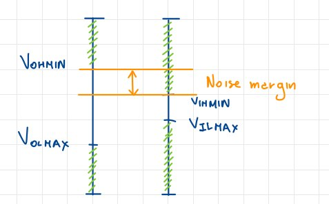
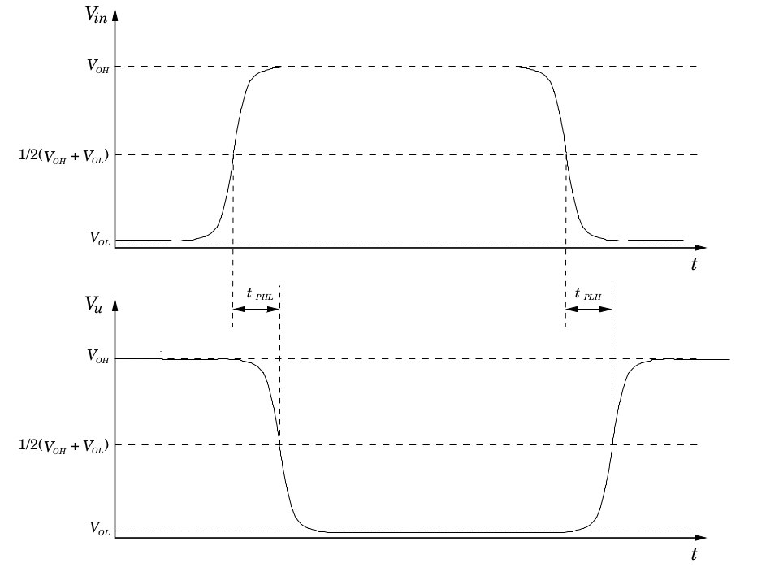
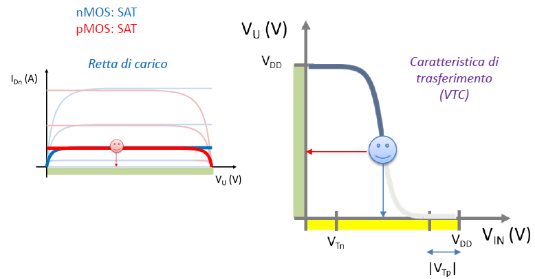
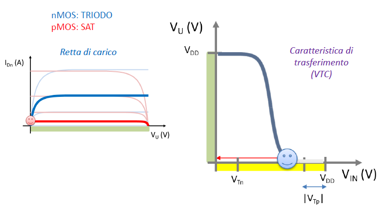
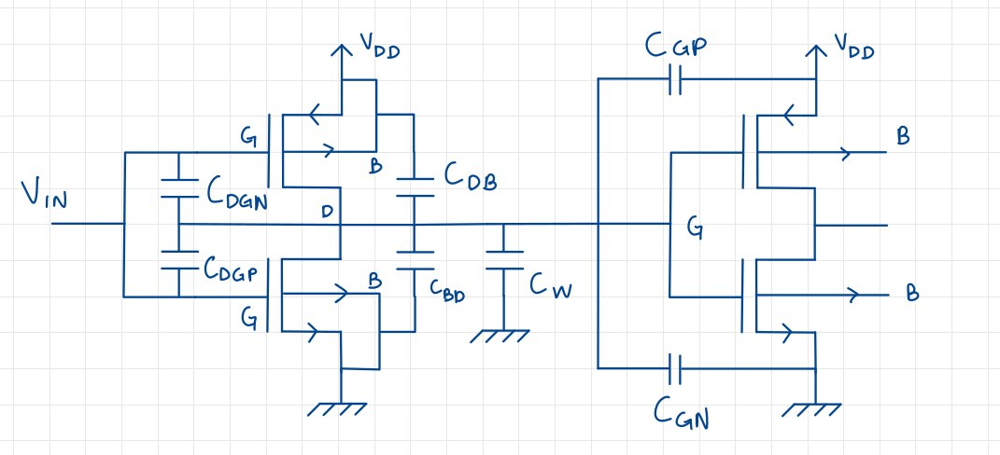
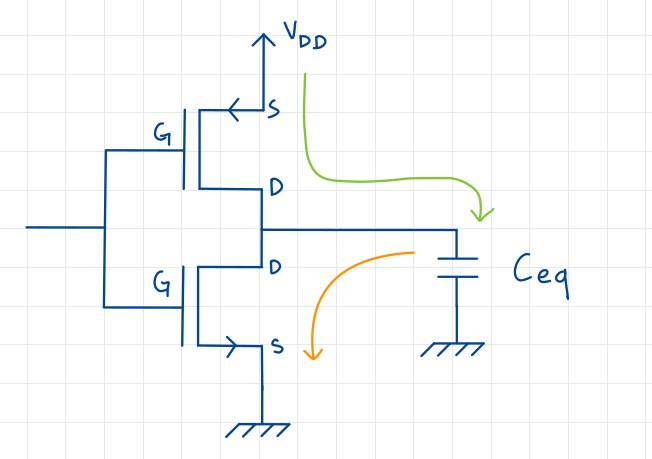

# Circuiti digitali

Introduciamo ora la parte di elettronica digitale, ovvero quella parte di elettronica che si occupa di circuiti che operano con segnali digitali.

## Il segnale digitale

Un segnale digitale è una sequenza finita di numeri, dove ognuno di essi rappresenta l'ampiezza del segnale in un dato istante temporale. É quindi necessario individuare un sistema numerico per rappresentare i valori del segnale: nel caso dei circuiti digitali viene in aiuto in sistema binario, in quanto è possibile rappresentare i valori del segnale con due soli numeri, 0 e 1: associamo al valore 0 il valore di tensione più basso, e al valore 1 il valore di tensione più alto.

In realtà associamo **un insieme di valori**, ovvero più valori si riferiscono al valore logico $0$, e più valori, diversi dai precedenti, si riferiscono al valore logico $1$. Questo è necessario per evitare che il segnale venga interpretato erroneamente a causa di disturbi o rumori. In particolare:

* $0 \equiv [V_{LMAX} \div V_{LMIN}]$
* $1 \equiv [V_{HMAX} \div V_{HMIN}]$

I valori effettivi delle tensioni di riferimento dipendono dalla *famiglia logica* e dalla tecnologia utilizzata.

## Le tecnologie usate

Le principali sono due: la MOS e quella a transistor bipolare, che a loro volta  si suddividono in diverse famiglie logiche.

### Famiglie Logiche MOS

All'interno della tecnologia MOS convivono più **famiglie logiche**, ovvero più insiemi di valori che rappresentano i valori logici $0$ e $1$. Le principali sono:

* **CMOS**, o MOS Complementari;
* **Pseudo NMOS**;
* **logica dinamica**;
* logica **pass transistor**.

### Famiglie logiche a transistor bipolare

Sono solo due, di cui una è ormai obsoleta:

* **TTL**, superata dai CMOS;
* **ECL**, utilizzata solo in particolari contesi.

In ogni caso, utilizzando circuiti costruiti anche con la stessa tecnologia, ma con componenti appartenenti a **famiglie logiche differenti** necessitano dei **circuiti di interfaccia** per poter comunicare tra loro.

### Inverter come esempio di circuito digitale

Riprendiamo brevemente l'inverter e la sua caratteristica:

Prendiamo i punti nei quali $|\frac{\partial v_0}{\partial v_I}| = 1$, ottenendo che:

* $V_{0MIN}$ è il valore minimo per avere in uscita 1;
* $V_{1MAX}$ è il valore massimo per avere in uscita 1.
* $V_{0MAX}$ è il valore massimo per avere in uscita 0;
* $V_{1MIN}$ è il valore minimo per avere in uscita 0.

Che ci permette di definire il **logic swing**, o escursione logica, come la differenza tra $V_{0MIN}$ e $V_{0MAX}$.

#### Inverter in serie

Ciò che succede ai valori logici in uscita a due inverter in serie è osservabile nel seguente grafico:

Valgono quindi le seguenti relazioni:

* $NM_H = (V_{0MIN} - V_{1MIN}) > 0$;
* $NM_L = (V_{1MAX} - V_{0MAX}) > 0$.

Entrambi i margini di rumore devono essere positivi, in modo che eventuali errori, o disturbi nella trasmissione dell segnale, possano essere sostanzialmente ignorati, visto che il range del componente successivo sarà più ampio.

## Caratteristiche dei circuiti digitali

### Rigenerazione del segnale

Prendiamo ad esempio un circuito con tre inverter in serie e, per ognuno di essi, studiamo il comportamento del segnale in uscita in funzione del segnale in ingresso:

{width=90%}

La tensione di uscita $V_{0HMIN}$ viene assunta come la minima tensione per la quale si considera presente in uscita un 1 logico, mentre $V_{0LMAX}$ è la tensione massima per la quale si considera presente in uscita uno 0 logico. Le tensioni $V_{1HMIN}$ e $V_{1LMAX}$ rappresentano le corrispondenti grandezze in ingresso: si considera presente in ingresso un 1 logico se la tensione è superiore a $V_{1HMIN}$ e si considera invece presente uno 0 logico se la tensione è inferiore a $V_{1LMAX}$.

Avere $|\frac{\partial v_o}{v_{in}}| \gg 1$ permette di **rigenerare** il segnale, in quanto permette di stabilire che $V_{0LMAX} < V_{1LMAX}$ e $V_{0HMIN} > V_{1HMIN}$, ovvero che i valori logici in uscita sono sempre più distanti tra loro rispetto a quelli in ingresso, per cui ogni porta riesce a rilevare correttamente il valore logico in ingresso. Per ottenere questo risultato è necessario che il guadagno del circuito utilizzato per realizzare la porta sia maggiore almeno in un intervallo di ampiezza finita di valori della tensione di ingresso.

### Margini di rumore

Legato al discorso della rigenerazione del segnale, abbiamo che i **margini di rumore**, il margine epr il quale un segnale logico in uscita può essere *sbagliato* per essere interpretato correttamente dalla porta successiva. In altre parole, **il massimo rumore accettabile affinche l'interpretazione del segnale in uscita sia corretta**. I margini di rumore sono quindi definiti dai punti nei quali la derivata del segnale in uscita rispetto a quello in ingresso è pari a 1.

### Potenza dissipata

Proviamo a definire quale possa essere la potenza dissipata dal circuito: assumiamo che esso si trovi per la metà del tempo nello stato *attivo alto*, e l'altra metà in quello *attivo basso*. Inoltre, assumiamo che il circuito sia alimentato con una tensione $V_{DD}$ e che la corrente che scorre nel circuito sia $I_{H}$ quando il circuito è in stato *attivo alto* e $I_{L}$ quando è in stato *attivo basso*. La potenza dissipata dal circuito è quindi:

$$P_D = \frac{P_{DH} + P_{DL}}{2} = \frac{V_{DD}I_H + V_{DD}I_L}{2} = V_{DD}\frac{I_H + I_L}{2}$$

Essa è generalmente trascurabile rispetto a quella dissipata dai transistori di commutazioni, nel momento di passaggio da uno stato all'altro.

### Ritardo di propagazione

Nel caso in cui all'interno del nostro circuito digitale siano presenti dei **carichi capacitivi**, che devono essere caricati per passare da uno stato logico all'altro, la commutazione in uscita subisce inevitabilmente un ritardo rispetto all'ingresso: questo ritardo è apprezzabile nel seguente grafico.

Prendendo come riferimento il valor medio tra i due livelli logici, possiamo definire il ritardo tra l'istante in cui la tensione in ingresso attraversa il valore di riferimento, e il momento in cui la tensione risultante è effettivamente in uscita. Generalmente, il ritardo per il passaggio tra il livello alto a quello basso, e quello per il passaggio tra il livello basso e quello alto possono differire, per cui si definisce un ritardo medio come la semisomma dei due ritardi. Questo ritardo viene chiamato **ritardo di propagazione**.

### Dissipazione dinamica di potenza

#### Transizione da 1 a 0

Considerando sempre un carico conduttivo, l'energia immagazzinata è nella capacità è:

$$E_C = \frac{1}{2}C_{out}V_{DD}^2$$

Nella transizione $H \to L$, nella quale c'è la scarica del condensatore, tutta l'energia immagazzinata precedentemente viene dissipata sotto forma di calore, ed è pari a:

$$E_{HL} = \frac{1}{2}C_{out}V_{DD}^2$$

#### Transizione da 0 a 1

Nella transizione $L \to H$, viene erogata energia pari a:

$$E_{PS} = \int_0^T V_{DD} i(t)dt = V_{DD}C V_{DD} = CV_{DD}^2$$

Di questa energia, quella immagazzinata nel $C_{load}$ vale:

$$E_C = \frac{1}{2}C_{out}V_{DD}^2$$

Di conseguenza, l'energia dissipata nel carico nella transizione è:

$$E_{LH} = E_{PS} - E_C = \frac{1}{2}C_{out}V_{DD}^2$$

#### Potenza totale dissipata

L'energia totale dipende dalla potenza delle due transizioni, calcolati con una media:

$$P_{diss,dyn} = \frac{E_{HL} + E_{LH}}{T_{clock}} = f_{clock}C_{out}V_{DD}^2$$

Possiamo calcolare la massima frequenza di clock osservando il ritardo di propagazione: il caso limite è quanto il ritardo è così lento che la risposta dell'uscita avviene un istante prima dell'altra commutazione.

### Prodotto Delay-Potenza

Definito come:

$$PDP = P_{diss} \cdot t_p \approx P_{diss,dyn} \cdot t_p$$

Se si sceglie di operare il circuito alla massima frequenza di clock, che corrisponde ad un periodo di clock tale che $T_{minclock} = t_p$, si ottiene:

$$PDP \approx f_{maxclock} C_{out} V_{DD}^2 = \frac{C_{OUT} V_{DD}^2}{t_p}\cdot t_p = C_{out}V_{DD}^2$$

### Fan in e Fan out

Il **fan-in** è il numero massimo di porte identiche in ingresso ad una porta logica. Il **fan-out** è il numero massimo di porte identiche in uscita ad una porta logica. Il fan-in e il fan-out sono limitati dalla potenza dissipata dal circuito, che è proporzionale al numero di porte in ingresso e in uscita.

## Inverter CMOS

Questa innovativa configurazione prevede l'uso di un PMOS e di un NMOS, utilizzato rispettivamente per gli ingressi alti e bassi. L'idea di base è realizzare un circuito che abbia **due interruttori in confrofase**, ovvero interruttori mai attivi contemporaneamente, in modo da avere una potenza statica dissipata nulla.

### Circuito

Il circuito ideato è il seguente:

Notiamo come non sia mai presente un percorso dalla tensione a *ground*, per cui la potenza statica dissipata è nulla: ciò è possibile se i due MOS sono perfettamente duali.

### Zone di funzionamento

Analizziamo dunque il comportamento del circuito in funzione del valore di tensione in ingresso.

Quando $0< V_{in} < V_{TN}$ l'NMOS risulta **interdetto**, mentre il PMOS è **ON**, e sarà esso a portare in su la tensione di uscita. Quando invece $V_{DD} - |V_{TP}| < V_{in} < V_{DD}$ ad essere interdetto è il PMOS, mentre l'NMOS è ON: ques'ultimo porterà in basso la tensione di uscita. Il valore di tensione $V_{TP}$ è detto **tensione di soglia**.
Esiste una zona intermedia, in cui $V_{TN} < V_{in} < V_{DD} - |V_{TP}|$ in cui sia il PMOS che l'NMOS sono attivi, e si avrà dunque, in uscita, una transizione dei valori di tensione, la cui formula è $V_U = \frac{R_eqNMOS}{R_eqNMOS + R_eqPMOS}V_{DD}$.

### Caratteristiche di PMOS, NMOS e di uscita

Chiamiamo $i_{DP}$ e $i_{DN}$ le correnti che scorrono rispettivamente nel PMOS e nell'NMOS. Essendo però i due MOS in serie, la corrente che scorre in entrambi è la stessa, e vale $i_{DP} = - i_{DN}$.

Riportiamo ora i grafici delle caratteristiche di uscita, di PMOS, sulla destra, e di NMOS, a sinistra. Valgono le seguenti relazioni:

$$VV_{OVn} = V_{GSn} - V_{Tn} \qquad V_{OVp} = V_{GSp} - V_{Tp}$$

{width=60%}

Nei grafici la linea tratteggiata **separa la zona triodo dalla zona di saturazione**. Ricordiamo che il PMOS opera nel terzo quadrante, per cui la sua caratteristica è ribaltata rispetto alle ordinate, ravvisabile dal segno negativo sull'asse delle ordinate.

Possiamo quindi ora scrivere l'equazione alla maglia di uscita, che è $V_{DD} = - V_{DSP} + V_{DSN} \to V_{DSN} = V_{DD} + V_{DSP}$ , con $V_{DSN} = V_u$, che è la tensione in uscita. Si tratta praticamente di una **trasformazione**: stiamo infatti spostando la caratteristica verso destra di una valore pari a $V_{DD}$. Inoltre, per $V_{DSP} = 0 \to V_{DSN} = V_{DD}$.

Il nostro obiettivo è quello di avere una caratteristica nella forma $\frac{V_u}{V_{in}}$, per cui andremo a tracciare i grafici delle caratteristiche di uscita per vari casi di $V_{in}$, e **trovare i punti nei quali le caratteristiche di PMOS ed NMOS si intersecano**.

#### Caso 1: $V_{in} = 0$

Con una tensione nulla in ingresso calcoliamo facilmente che $V_{GSN} = V_{in} = 0$, che implica NMOS OFF, mentre invece $V_{GSP} = V_{in} - V_{DD} = -V{DD}$. La prima caratteristica sarà quindi una retta che coincide con l'asse delle ascisse, mentre la seconda sarà una curva, invertita rispetto all'asse y rispetto all'originale, dipendente da $V_{DD}$. DIsegnandole, otteniamo:

{width=50%}

L'unico punto di intersezione è quello in cui $i_{DN} = 0$, ovvero $V_{DSN} = V_{DD}$, che è il punto di lavoro del circuito. Questa situazione rimane immutata fintanto che $V_{in} < V_{TN}$.

#### Caso 2: $V_{in} = V_{DD}$

Per questa zona risulterà $V_{GS} = V_{in} > V_T$, ovvero NMOS in saturazione, anche se inizia a condurre, e $V_{GSP} = V_{in} - V_{DD} = 0$, per cui PMOS è attivo. Disegnando le caratteristiche, otteniamo:

{width=50%}

L'inizio della conduzione dell'NMOS porta al cambiamento del punto di lavoro.

#### Caso 3: $V_{in} = \frac{V_{DD}}{2}$

Quello preso ora in esame è in realtà un caso particolare, poiché le due caratteristiche saranno perfettamente sovrapposte in un certo intervallo. Infatti per $V_{in} = \frac{V_{DD}}{2}$ avremo $V_{GSP} = V_{in} - V_{DD} = - \frac{V_{DD}}{2}$, e $V_{GSN} = V_{in} = \frac{V_{DD}}{2}$. Disegnando le caratteristiche, otteniamo:

{width=50%}

In questo caso, il punto di intersezione è quello in cui $i_{DP} = i_{DN}$, ovvero $V_{DSP} = V_{DSN} = \frac{V_{DD}}{2}$, che è il punto di lavoro del circuito. Questa situazione rimane immutata fintanto che $V_{in} < V_{DD} - |V_{TP}|$.

#### Caso 4: $\frac{V_{DD}}{2} < V_{in} < V_{DD} - |V_{TP}|$

Il comportamento è speculare a quanto visto nel caso 2: abbiamo NMOS in zona triodo, e PMOS in saturazione. La caratteristica del PMOS continua a diminuire, mentre quella dell'NMOS inizia a salire. Disegnando le caratteristiche, otteniamo:

{width=50%}

$$\qquad$$

#### Caso 5: $V_{in} > V_{DD} - |V_{TP}|$

La situazione è uguale ed opposta al primo caso: una caratteristica è nulla, mentre l'altra è pari a $V_{DD}$. Disegnandole, otteniamo:

{width=50%}

L'unico punto di intersezione è quello in cui $i_{DP} = 0$, ovvero $V_{DSP} = 0$, che è il punto di lavoro del circuito.

### La caratteristica di trasferimento

La caratteristica do uscita si divide quindi in 5 zone, in ognuna delle quali i MOS assumono un comportamento diverso:

Possiamo definire graficamente le zone di funzionamento per ogni MOS, individuando delle regioni per la quale il MOS è in saturazione, e delle regioni per le quali è in zona triodo:

#### Conduzione dei MOS

Quando l'NMOS conduce, abbiamo che:

$$V_{GSN} > V_{TN} \to V_{in} \ge V_{TN}$$

Quando invece è il PMOS a condurre, abbiamo che:

$$V_{GSP} < V_{TP} \to V_{in} - V_{DD} \le + V_{TP} \to V_{in} \le V_{DD} + V_{TP}$$

#### Saturazione dei MOS

Quando l'NMOS è in saturazione, abbiamo che:

$$v_{DSN} > V_{GSN} - V_{TN} \to v_u \ge V_{in} - V_{TN}$$

Quando invece è il PMOS a condurre, abbiamo che:

$$v_{DSP} < V_{GSP} - V_{TD} \to v_u \le V_{in} - V_{TP}$$

### La zona di transizione

Studiamo ora il comportamento della caratteristica nella zona di transizione, ovvero la parte **3** della caratteristica di trasferimento. Il sistema oggetto di studio è:

$$
\begin{cases}
i_{DN} = \mu_n C_{OX} (\frac{W}{L})_N (v_{GSN} - V_{TN})^2 \\
i_{DP} = \mu_p C_{OX} (\frac{W}{L})_P (v_{GSP} - V_{TP})^2
\end{cases}
$$

Sapendo che $i_{DN} = - i_{DP}$, possiamo scrivere:

$$\mu_n C_{OX} (\frac{W}{L})_N (V_{IN} - V_{TN})^2 = - \mu_p C_{OX} (\frac{W}{L})_P (V_{IN} - V_{DD} -  V_{TP})^2$$

Avendo ipotizzato $\lambda = 0$, se ne deriva che $V_{IN}$ è costante e assume effettivamente un andamento verticale. Per risolvere l'equazione pongo $V_{IN} = \frac{V_{DD}}{2}$, e $V_{TN} = - V_{TP}$, ottenendo:

$$\mu_N (\frac{W}{L})_N = \mu_P (\frac{W}{L})_P $$

Quindi il comportamento dipende dalle dimensioni dei due MOS, e non dalla tensione di alimentazione. Sapendo che in genere NMOS ha una mobilità maggiore rispetto al PMOS, esso sarà più piccolo rispetto al PMOS. In conclusione, le dimensioni dei singoli MOSFET mi permettono di regolare la soglia logica e di ottenere una caratteristica simmetrica.

### Potenza dinamica dissipata dal CMOS

Nell'analisi della potenza di due inverter in serie dobbiamo considerare sia il *cortocircuito*, sia la *carica/scarica* del condensatore. Entrambi gli inverter hanno delle capacità intrinseche per cui, per semplicità, sostituiamo gli inverter reali con un unico inverter **ideale** al quale è collegata una $C_{eq}$, che è la capacità equivalente delle due capacità dei due inverter, ottenendo il seguente circuito, perfettamente equivalente a quello reale:

{width=25%}

Per rendere corretti tutti i ragionamenti e i calcoli, dobbiamo prima di tutto **trovare il valore della capacità equivalente**. Considero quindi tutte le caratteristiche intrinseche dei due inverter:

* $C_W$: capacità di collegamento;
* $C_{GN}$, $C_{GP}$: capacità di gate alle porte di uscita;
* $C_{DBN}$, $C_{DBP}$: capacità della zona di svuotamento tra *drain* e *body*;
* $C_{DGN}$, $C_{DGP}$: capacità data dalla sovrapposizione tra *drain* e *gate*.

Tutte le capacità trovate sono rappresentate nel seguente circuito:

{width=50%}

Se per la maggior parte delle capacità, la stima è relativamente semplice, ciò non è vero per $C_{DGN}$ e $C_{DGP}$: sono poste tra $V_{IN}$ e $V_U$, che sono dei valori non fissi. Vengono quindi contate due volte ciascuna perchè sono sottoposte ad una transizione pari a $2\cdot V_{DD}$ (da $-V_{DD}$ a $V_{DD}$, e viceversa). Dunque, la capacità equivalente è:

$$C_{EQ} = C_W + C_{GN} + C_{GP} + C_{DBN} + C_{DBP} + 2\cdot C_{GDN} + 2\cdot C_{GDP}$$

dove la $C_W$ è una capacità variabile, individuabile tramite simulazione.

Calcoliamo ora la potenza dissipata dal circuito, dividendo la procedura in due fasi, corrispondenti alle transizioni da livello basso ad alto, e viceversa:

Per quanto riguarda la transizione $H\to L$, ovvero la fase di scarica del condensatore da $V_{DD}$ a $0$, abbiamo che la potenza dissipata è: $E_{DISS} = \frac{1}{2} C_{EQ}V_{DD}^2$. Dissipando tutta l'energia di un condensatore carico, non è necessario svolgere l'integrale.
Passando alla fase di carica del condensatore da $0$ a $V_{DD}$, per immagazzinare $\frac{1}{2}CV^2$ nel condensatore, dissipo la stessa quantità di energia, nel MOS, per cui calcoliamo la potenza **erogata dalla batteria** $V_{DD}$:

$$E_B \int_0^T v(\tau)i(\tau) d\tau  = V_{DD} \int_0^Ti(\tau)d\tau = V_{DD} \cdot Q = V_{DD}\cdot C \cdot V_{DD} = C\cdot V_{DD}^2$$

Dato che al condensatore abbiamo $E_C = \frac{1}{2}C_{EQ}V_{DD}^2$, la potenza dissipata dal MOS è:

$$E_{DISS} = E_B - E_C = C_{EQ}V_{DD}^2 - \frac{1}{2}C_{EQ}V_{DD}^2 = \frac{1}{2}C_{EQ}V_{DD}^2$$

L'energia in un ciclo completo è quindi:

$$E_{LH,HL} = C V_{DD}^2$$

La potenza dissipata è quindi:

$$P_D = fC V_{DD}^2$$

dove $f$ è la frequenza dei cicli.
