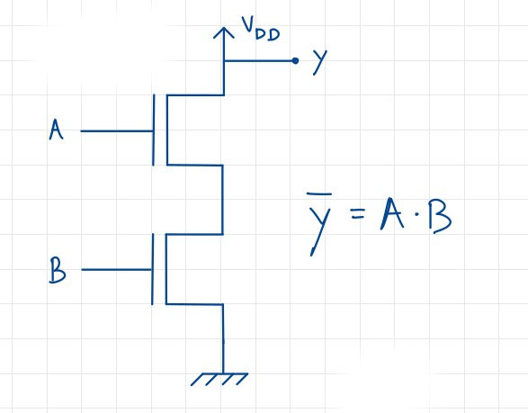

# Circuiti logici

## Inverter logico

Dal punto di vista logico, il circuito dell'inverter CMOS è rappresentato come in figura:

{width=30%}

La tensione in ingresso $V_{IN}$ è rappresentata dalla variabile logica $A$, che va in ingresso al CMOS, mentre la tensione in uscita $V_{OUT}$ è rappresentata dalla variabile logica $y$, che è l'uscita del CMOS.

## Schema generale di una porta logica

Lo schema generale di una porta logica a $n$ ingressi, in figura l'esempio è fatto con 3 variabili di ingresso, è il seguente:

{width=50%}

La *Pull Up Network* è la rete, composta da transistori PMOS, è responsabile del portare l'uscita $y$ al valore logico $1$, mentre la *Pull Down Network* è la rete, formata dai transistori NMOS, che si occupa del portare l'uscita $y$ al valore logico $0$: da questa descrizione è deducibile il fatto che queste reti **non sono mai contemporaneamente attive**.

## Regole di progettazione

La regola fondamentale da seguire nella costruzione delle porte logiche con tecnologia CMOS è che **mettere in serie due CMOS equivale ad un'operazione di AND**, mentre **mettere in parallelo due CMOS equivale ad un'operazione di OR**. Di seguito abbiamo alcuni esempi di porte logiche costruite con tecnologia CMOS.

{width=30%}

{width=30%}

{width=30%}

{width=30%}

## Porte logiche NAND e NOR

Le porte logiche NAND e NOR sono particolari porte logiche che hanno la caratteristica di essere **universali**, ovvero con esse è possibile realizzare qualsiasi altra porta logica.

### Porta logica NAND

Come noto, l'espressione logica di una porta NAND è  $y = \overline{A \cdot B}$. Utilizzando le leggi di De Morgan, possiamo riscrivere l'espressione come $y = \overline{A} + \overline{B}$, con $\overline{y} = A\cdot B$.

{width=50%}

### Porta logica NOR

Come noto, l'espressione logica di una porta NOR è  $y = \overline{A + B}$. Utilizzando le leggi di De Morgan, possiamo riscrivere l'espressione come $y = \overline{A} \cdot \overline{B}$, con $\overline{y} = A + B$.

{width=50%}

$$\qquad$$

## Porte logiche più complesse

Analizziamo l'espressione logica $y = \overline{A \cdot (B + C \cdot D)}$. Riscriviamola utilizzando le leggi di De Morgan:

$$y = \overline{A \cdot (B + C \cdot D)} = \overline{A} + \overline{(B + C \cdot D)} = \overline{A} + (\overline{B} \cdot \overline{C \cdot D}) = \overline{A} + (\overline{B} \cdot (\overline{C} + \overline{D}))$$

Da essa ricaviamo inoltre che $\overline{y} = A \cdot (B + C \cdot D)$.

Abbiamo ricondotto l'espressione in *sottoespressioni* facilmente rappresentabili con porte logiche elementari, che possiamo realizzare con tecnologia CMOS. In particolare, possiamo realizzare la porta logica in figura:

{width=40%}

## Osservazione e regole generali per le reti PUN e PDN

Dagli esempi appena visti, osserviamo come avendo $y = f(\overline{a}, \overline{b}, \overline{c})$ posso implementare direttamente e in modo facile la rete PUN, mentre se ho $\overline{y} = f(a, b, c)$ posso implementare direttamente e in modo facile la rete PDN.

Esiste quindi una dualità tra la PUN e la PDN: se è rispettata l'ipotesi degli ingressi tutti diretti, o tutti negati, allora la rete PUN è la dualità della PDN. Ciò vuol dire che se in una rete ho una serie, nella sua duale avrò un parallelo, e viceversa. É comunque necessario specificare che questa è una **condizione sufficiente**, ma non necessaria, per la dualità tra PUN e PDN.

$$\qquad$$

## La porta logica XOR

In questo contesto possiamo mettere alla prova il principio di dualità appena introdotto, poiché in questa porta non è rispettata la condizione degli ingressi tutti diretti o tutti negati. L'espressione logica è infatti $y = A \oplus B = \overline{A} \cdot B + A \cdot \overline{B}$. Con le leggi di De Morgan possiamo riscrivere l'espressione come $y = \overline{A\cdot B} + A \cdot B$. Per generare le variabili negate faccio uso degli inverter, le cui uscite sono collegate agli ingressi della PUN e della PDN. Il circuito risultante è il seguente:

{width=70%}

I circuiti in alto rappresentano rispettivamente $A\cdot \overline{B}$ e $\overline{A} \cdot B$, mentre quelli in basso $\overline{A} \cdot \overline{B}$ e $A \cdot B$.

Di quanti MOS necessito per costruire questa porta logica? Mi servono 2 MOS per ogni variabile, ed ulteriori due MOS per ogni variabile non negata, che sarebbero gli inverter. In totale avrò $\# \text{MOS} = (2\cdot4) + (2\cdot2) = 12$

## Dualità con variabili non negate o non dirette

Possiamo facilmente costruire due sistemi *duali* che ampliano il discorso precedente:

$$
\begin{cases}
y = f(\overline{a}, \overline{b}, \overline{c}) \to     \text{sintesi diretta PUN} \\
u = f(\overline{a}, b, c) \to     \text{sintesi diretta PUN + inverter $b$, $c$}
\end{cases}
\begin{cases}
\overline{y} = f(a, b, c) \to     \text{sintesi diretta PDN} \\
\overline{y} = f(a, b, c) \to     \text{sintesi diretta PDN + inverter $b$, $c$}
\end{cases}
$$

## Criteri di costo per i circuiti logici

La formula generale per trovare il numero di MOS necessari per costruire una rete è $\# \text{MOS} = 2 \cdot \text{numero di variabili} + \text{numero di variabili non negate}$. Questa formula è valida per entrambe le reti PUN e PDN.

Il costo tuttavia non dipende unicamente dal numero dei MOS, ma anche dalla loro dimensione. Il produttore di MOS fornisce i valori minimi per $W$ ed $L$, ma deve essere il progettista a scegliere i valori ottimali per la sua applicazione. Prendiamo ad esempio un inverter, sfruttando le caratteristiche ricavate nel capitolo precedente.

$$\begin{cases}
i_{DP} \propto (\frac{W}{L})_P \\
i_{DN} \propto (\frac{W}{L})_N \\
\end{cases}
\to
\frac{\mu_N}{\mu_P} = \frac{(\frac{W}{L})_N}{(\frac{W}{L})_P} = 2.5
$$

Il valore $2.5$ sarà l'ipotesi costruttiva che utilizzeremo per il resto del corso, dal quale possiamo ricavare alcuni valori che verranno comunemente utilizzati:

* $(\frac{W}{L})_N = n = 2$
* $(\frac{W}{L})_P = p = 5$

Determinando a priori questi valori abbiamo contemporaneamente stabilito anche la corrente che scorre nei MOS, i tempi di commutazione e l'area occupata dalla rete. In particolare, questi ultimi due criteri saranno utilizzati per la valutazione del costo di una rete.

### Costo in termini di area

Se $W$ ed $L$ sono le dimensioni del MOS, allora l'area occupata da entrambi un CMOS, formato da un PMOS ed un NMOS, è:

$$A = W_P L_P + W_N L_N = pL_P^2 + nL_N^2$$

Ponendo $L_P = L_N = L$, otteniamo:

$$A = (p+n)L^2$$

$$\qquad$$

### Costo in termini di tempo di commutazione

Partiamo dal presupposto che, nel caso peggiore, le nostre porte logiche devono avere tempo di commutazione **pari o inferiore a quello dell'inverter**. Stimiamone i tempi sia in serie che in parallelo.

#### Tempo di commutazione in parallelo

La disposizione è quella mostrata in figura:

{width=50%}

Il tempo da considerare è quello della scarica del condensatore: la corrente che vi scorre è il risultato della somma delle due correnti in parallelo che scorrono in $1$ e $2$. Il *worst case* è quando solo uno dei due MOS conduce, per cui$(\frac{W}{L}) _1= (\frac{W}{L})_2 = n$ dove $n$ fa riferimento all'inverter.

#### Tempo di commutazione in serie

La disposizione è quella mostrata in figura:

{width=25%}

Vediamo la resistenza vista del MOS: essa sarà proporzionale alla sua dimensione, per cui $R_{MOS} \propto \frac{1}{\frac{W}{L}}$. Calcolo la resistenza totale:

$$
R_{TOT} = R_1 + R_2 = k'[\frac{1}{(\frac{W}{L})_1} + \frac{1}{(\frac{W}{L})_2}] = k'\frac{1}{(\frac{W}{L})_{eq}} $$

Devo fare in modo che $(\frac{W}{L})_{eq}$ sia equivalente a quello dell'inverter, per cui impongo $(\frac{W}{L})_1 = (\frac{W}{L})_2 = x$, ottenendo:

$$\frac{1}{x} + \frac{1}{x} = \frac{1}{n} \to x =2n$$

Dunque, fatto $n$ il dimensionamento dell'inverter, i due elementi saranno grandi **il doppio** rispetto ad esso, affinché la loro conduzione sia equivalente a quella dell'inverter.

### Stima dei costi per porte NAND e NOR

Applichiamo i criteri di costo appena visti alle porte NAND e NOR, entrambe con 4 variabili d'ingresso, in modo da capire quale delle due sia più conveniente, fissato un criterio.

#### Porta NOR

Le espressioni logiche, diretta e negata, sono:

$$
\begin{cases}
y = \overline{A + B + C + D} \\
\overline{y} = A + B + C + D
\end{cases}
$$

Lo schema della rete è il seguente:

{width=30%}

Per quanto riguarda la PUN, dove c'è una serie, abbiamo $(\frac{W}{L})_{1,2,3,4} = x$, per cui:

$$\frac{1}{x} + \frac{1}{x} + \frac{1}{x} + \frac{1}{x} = \frac{1}{p} \to x = 4p = 20$$

Per quanto riguarda la PDN, dove c'è un parallelo,  abbiamo $(\frac{W}{L})_{5,6,7,8} = y$, per cui:

$$\frac{1}{y} = \frac{1}{n} \to y = n = 2$$

#### Porta NAND

Le espressioni logiche, diretta e negata, sono:

$$
\begin{cases}
y = \overline{A \cdot B \cdot C \cdot D} \\
\overline{y} = A \cdot B \cdot C \cdot D
\end{cases}
$$

Lo schema della rete è il seguente:

{width=30%}

Per la PUN troviamo facilmente che:

$$(\frac{W}{L})_{1,2,3,4} = p = 5$$

Per la PDN abbiamo $(\frac{W}{L})_{5,6,7,8} = x$, per cui:

$$\frac{1}{x} + \frac{1}{x} + \frac{1}{x} + \frac{1}{x} = \frac{1}{n} \to x = 4n = 8$$

#### Confronto

L'area della porta NOR è:

$$A_{nor} = (4\cdot4p + 4\cdot n)L^2 = (16p + 4n)L^2 = 88L^2$$

L'area della porta NAND è:

$$A_{nand} = (4\cdot p + 4\cdot 4 n)L^2 = (4p + 16n)L^2 = 52L^2$$

Dal quale si deduce che la porta NAND è più conveniente in termini di area. É più conveniente mettere in serie gli NMOS, che hanno una mobilità maggiore, rispetto ai PMOS, che hanno una mobilità minore. Avendo più configurazioni disponibili per una stessa porta logica, **si sceglie sempre quella ad area minore**.

In logica complementare si preferisce **non superare i 4 ingressi** ad una porta logica, per non aumentare troppo le capacità e i tempi di attraversamento. In caso di necessità di più ingressi, si preferisce utilizzare più porte logiche in cascata, utilizzando più livelli di logica.

## Protezione dalle scariche elettrostatiche

Torniamo un attimo ad osservare i nostri circuiti logici dal punto di vista fisico:

{width=30%}

Nel gate ho $R_H \to \infty$, per cui non vi scorre corrente, e la capacità $C_G$ vista dal *gate* è nell'ordine dei $pF$. Sapendo che, in generale, la quantità di carica è il prodotto della tensione per la capacità, possiamo calcolare la tensione al gate come $V_G = \frac{Q_G}{C_G}$. Abbiamo quindi una **tensione $V_G$ elevata** con una quantità di carica $Q_G$ piccola. Ciò porta ad avere un'energia $E_G$ piuttosto elevata, che può essere sufficiente a **danneggiare il MOS**, rompendo l'ossido isolante tra gate e substrato, che è alla base del funzionamento del MOS. É quindi evidente la necessità di proteggere il MOS da queste scariche elettrostatiche (quelle con potenziale elevato e carico ridotto).

$$\qquad$$

### Circuito di sicurezza

Il circuito di sicurezza è formato da una resistenza e due diodi, come mostrato in figura:

{width=50%}

Durante il normale funzionamento del dispositivo, i diodi non entrano in funzione e non modificano il comportamento del circuito. Infatti avremo:

$$
\begin{cases}
0 \le V_G \le V_{DD} \\
D_1 \text{ OFF} \\
D_2 \text{ OFF}
\end{cases}
$$

Vediamo invece l'effetto dei diodi quando entrano in conduzione:

* se $D_1$ è ON, allora $V_G = V_{DD} + V_{\gamma}$, quindi blocca le tensioni elevate;
* se $D_2$ è ON, allora $V_G = -V_{\gamma}$, quindi blocca le tensioni troppo basse.

I diodi hanno assumono la funzione di **limitatori di tensione**, mentre la $R$ serve a limitare le correnti che scorrono nei diodi, per evitare che si danneggino, in caso di effettiva scarica elettrostatica. Logicamente, la $R$ entra in funzione solo in caso di conduzione dei diodi. Prendiamo un caso d'analisi come esempio: poniamo $V_{IN} = V_{DD} \to V_G = V_{DD}$. Nei due diodi avremo:

* $V_{AK1} = 0$ per cui tra Anodo e Catodo c'è $V_{DD}$, e $I_{D1} = - I_{S1} = 0$, dove $I_{S1}$ è la corrente di saturazione del diodo;
* $V_{AK2} = -V_{DD}$ per cui sono entrambi in inversa: $I_{D2} = - I_{S2} \approx 1nA$.

In un diodo in inversa vi scorre la corrente inversa di saturazione, che è appunto nell'ordine dei $nA$. I due diodi sono però polarizzati in punti diversi, tali per cui $|I_{S1}| \not = |I_{S2}|$. La corrente assorbita, quindi, **non è nulla**, perché appunto $I_{S1} \not = 0 \to I_{IN} \not = 0$

### Inconvenienti del circuito di sicurezza

L'utilizzo dei circuiti di protezione causa un decremento del *fan-out*: i due diodi non sono mai identici, e avranno sicuramente diverse correnti inverse di saturazione che, come visto, produce una piccola corrente in ingresso. Questa corrente può **portare alla degradazione del segnale logico**. Infatti, prendendo come esempio un'uscita a livello basso che pilota una porta dotata di un circuito di protezione, vediamo come la corrente $I_K$ proveniente dalla porta stessa va a degradare il livello logico basso, che non varrà più $0V$, ma bensì $V_{out} = V_K$, modificando anche il punto di lavoro.

{width=50%}

Se a valle sono presenti molte porte, le correnti dovute ai circuiti di protezione possono sommarsi, portando ad una degradazione del segnale logico. Otterremmo infatti $I_K > I_{Kmax} \to V_K > V_{OLmax}$, con conseguente perdita del valore logico. Simili considerazioni possono essere fatte anche per la degradazione di un livello logico alto.

Nella realtà questo problema viene risolto in virtù del fatto che i circuiti di sicurezza devono essere inseriti solo tra il *mondo esterno* e le porte logiche, e non tra le porte logiche stesse, per cui non si ha il problema del *fan-out*.

$$\qquad$$

## Logica Pass-transistor

La logica pass-transistor è una logica che sfrutta i MOS come interruttori; immaginiamo di voler realizzare una rete che soddisfi l'espressione logica $y = A \cdot B \cdot C$. Utilizzando la logica pass-transistor, il circuito sarà il seguente:

{width=50%}

Allo stesso modo possiamo realizzare la rete che soddisfa l'espressione logica $y = A \cdot ( B + C)$:

{width=50%}

É importante notare come in circuiti del genere **deve sempre essere presente un collegamento tra *ground* e l'uscita**. Osserviamo com un esempio cosa succederebbe se non fosse presente: immaginiamo un circuito che fa uso di MOS ed interruttori per determinare un'uscita, la cui rappresentazione è la seguente:

{width=50%}

Per $S = 1$ il funzionamento è regolare, mentre per $S = 0$ avremo un caso di **alta impedenza**. Questa condizione deve essere evitata in ogni contesto, per cui viene aggiunto un riferimento a *ground*, comandato dall'interruttore $\overline{S}$.

### L'interruttore ideale

Abbiamo due modalità per arrivare al nostro interruttore ideale: utilizzando NMOS o PMOS. Vedremo i pregi e i difetti di ognuna delle due soluzioni.

#### Interruttore ideale con NMOS

Un possibile circuito è il seguente:

{width=40%}

Vediamo il funzionamento del circuito per diversi istanti temporali.

##### NMOS - caso 1

In questo primo caso abbiamo $t = 0$, $V_{IN} = V_{DD}$, il condensatore scarico e $V_{G} = V_{DD}$, in quanto voglio che il MOS sia in conduzione.
Ipotizzando un corretto funzionamento delle componenti, il MOS effettivamente conduce, perché abbiamo $V_{GS} = V_{DD} > V_T$, che appunto implicano la conduzione del MOS. É vero che $V_{DS} > (V_{GS} - V_T)$? Applicando delle sostituzioni, otteniamo $V_{DD} \ge V_{DD} - V_T$, che è sempre vero, per cui il MOS è saturo.

##### NMOS - caso 2

Nel secondo caso abbiamo $t > 0$, $V_S = V_{OUT}$ che aumenta a causa della carica accumulata nel condensatore. Il MOS rimane in saturazione, perché:

$$
V_{DS} \ge V_{GS} - V_T \to V_D - V_S \ge V_G - V_S - V_T \to $$
$$\to V_D \ge V_G - V_T \to
 V_{DD} - V_{DD} \ge V_T \to 0 > -V_T$$

Dato che per avere il MOS acceso devo avere ancora $V_{GS} > V_T$, trovo che:

$$V_G - V_S = V_{DD} - V_{OUT} \ge V_T \to V_{OUT} \le V_{DD} - V_T$$

Ne deduciamo che **l'NMOS non è in grado di mandare in uscita un valore logico alto pieno**, poiché esso sarà limitato a $V_{DD} - V_T$.

##### NMOS - Analisi del livello alto

Dimostriamo graficamente l'impossibilità di avere un valore logico alto pieno in uscita. La caratteristica del MOS è la seguente:

{width=40%}

All'inizio il punto di riposo sta sulla caratteristica più alta, ma con il passare del tempo abbiamo che $V_G = V_D = V_{DD} \to V_{GS} = V_{DD}$. La corrente si comporta come $i_{DS} = k(V_{GS} - V_T)^2 \to i_{DS} = k(V_{DS} - V_T)^2$.

I punti di lavoro si spostano lungo la parabola formata dall'equazione della corrente, e corrispondono ai punti in cui essa incontra la caratteristica, al variare di V_T, infatti $V_D = V_T \to V_{DD} -V_{OUT} = V_T$. Graficamente, il risultato è il seguente:

{width=40%}

##### NMOS - Analisi del livello basso

Vediamo invece come si comporta l'NMOS in caso di livello basso. Le ipotesi sono che $t = 0$, $V_{IN} = 0$, $V_{OUT} = V_{DD}$, $V_G = V_{DD}$, e il circuito è tale al precedente, salvo il fatto che la corrente scorre in direzione opposta. Lavorando sulle tensioni, abbiamo $V_G = V_{DD} \to V_G - V_S = V_{DD} - 0 = V_{DD} > V_T$, che implica il MOS ON.
La $V_{GS}$ non cambia in funzione della carica del condensatore, poiché esso si trova sul *drain*. Il MOS si trova in saturazione, perché $V_{DS} = V_D - V_S = V_{DD} > V_{GS} - V_T = V_{DD} - V_T$.
Col passare del tempo $V_D$ diminuisce sino ad arrivare a $0$, permettendo una buona trasmissione del segnale logico basso.

{width=50%}

#### Interruttore ideale con PMOS

Intuitivamente, essendo il PMOS il duale dell'NMOS, ci aspettiamo che il suo comportamento sia il duale di quello dell'NMOS. Vediamo se è effettivamente così.

##### PMOS - caso 1

In questa fase abbiamo la carica del condensatore:

{width=50%}

Ci troviamo a $t = 0$, con $V_S = V_{DD}$, $V_G = 0$ e $V_{GS} = -V_{DD} < V_{TP}$. La caratteristica e la tensione in uscita sono rispettivamente:

{width=80%}

Il punto di lavoro si sposta lungo la caratteristica fino allo $0$; $V_{DS} = 0 \to V_D - V_S = 0$, per cui $V_D = V_S = V_{DD}$, per cui **la carica del condensatore avviene fino a $V_{DD}$**.

##### PMOS - caso 2

Studiamo ora la fase di scarica del condensatore: la corrente scorre in verso opposto rispetto alla carica, e abbiamo $t = 0$, $V_G = 0$, $V_D = 0$ e $V_S = V{DD}$.
Ricaviamo che il MOS sia ON dal fatto che $V_{GS} = V_G - V_S = -V_{DD} < V_T$, e che è in saturazione dal fatto che $V_{DS} = - V_{DD} < V_{GS} -V_T$. In realtà il MOS è sempre saturo poiché $V_{DS} = V_{GS}$.
La corrente vale $i_{DS} = -k(V_{GS} - V_T)^2 = -k(V_{DS} - V_T)^2$, per cui i punti di lavoro saranno l'intersezione tra la parabola della corrente e le caratteristiche della tensione:

{width=40%}

Confermiamo dunque l'ipotesi iniziale, ovvero che il PMOS non riesce a condurre un valore logico basso pieno, ma solo fino a $- V_T$.

#### Considerazioni finali

Inizialmente cercavamo un interruttore ideale, che riuscisse a trasmettere correttamente sia i valori logici alti che quelli bassi, ma abbiamo dimostrato che nè il PMOS nè l'NMOS sono in grado di farlo.

### Il Pass-Gate

É il dispositivo che effettivamente si comporta come un interruttore ideale, e che è formato da un NMOS e da un PMOS in parallelo, come mostrato in figura:

{width=40%}

Il dispositivo è comandato sia dal segnale diretto che quello negato, risolvendo la problematica della trasmissione non ottimale dei valori logici, poiché il segnale alto viene trasmesso dal PMOS, mentre il segnale basso dal NMOS.

### Differenze tra circuiti CMOS e con Pass-Transistor

#### $y = A\cdot C + B\cdot \overline{C}$

Utilizzando la formula vista precedentemente, possiamo dire che il numero di MOS necessari per realizzare il circuito è:

$$\#\text{MOS} = (4 \cdot 2) + (3 \cdot 2) = 8 + 6 = 14$$

Vediamo invece come progettare lo stesso circuito utilizzando i Pass-Transistor. Dal punto di vista logico abbiamo il seguente circuito:

{width=50%}

Un'implementazione fisica è la seguente:

{width=70%}

Dal quale ci rendiamo subito conto di come i MOS necessari siano solo 6, rispetto ai 14 necessari per la realizzazione con tecnologia CMOS.

#### $y = A\cdot \overline{B} + \overline{A}\cdot B$

Il numero di MOS necessari per realizzare il circuito, che è quello per la porta logica XOR, è:

$$\#\text{MOS} = (4 \cdot 2) + (2 \cdot 2) = 8 + 4 = 12$$

Passando alla realizzazione con Pass-Transistor, abbiamo il seguente circuito logico:

{width=60%}

Che può essere realizzato con il seguente circuito fisico:

{width=70%}

Anche in questo caso il numero di MOS necessari è inferiore, e vale 8.

### Considerazioni sulle differenze tra CMOS e Pass-Transistor

A seconda del tipo del circuito e dall'applicazione dello stesso, varia il metodo di progettazione, in base al livello di ottimizzazione necessario. Potrei infatti aver bisogno di alcuna personalizzazione, e scegliere di utilizzare reti *standard sell*, o una personalizzazione con logiche differenti, ovvero il caso *full custom*.

$$\qquad$$

## Il dispositivo NE555

É un circuito discreto che si presta a diversi utilizzi, vista la sua versatilità. Tra i possibili usi abbiamo il generare onde quadre, funzione di timer, generatore di impulso.

### Vista esterna

L'aspetto esterno del dispositivo è un circuito integrato a 8 pin, come mostrato in figura:

{width=50%}

I piedini 1 e 8 sono di alimentazione, mentre vedremo la funzione di altri piedini durante la presentazione del circuito,

### Schema interno

{width=90%}

La $V_{CC}$ viene posta a $6V$ per semplicità, in modo da calcolare facilmente il **partitore di tensione** all'inizio dei circuito. Queste tensioni vanno in ingresso a degli operazionali, comandati da $TH$ e $TR$, entranti rispettivamente al pin 6 e 2. L'uscita di questi operazionali va in ingresso ad un **latch S-R**, che ha come ulteriore ingresso anche il $\overline{\text{Reset}}$, variabile attiva bassa entrante nel piedino 4. Questo $\overline{\text{Reset}}$ ha **priorità sulle variabili di comando** S ed R, e la S ha a sua volta priorità sulla R: questo vuol dire che la configurazione $S=1$, $R=1$ è permessa e porta l'uscita a $1$. L'uscita del latch $Q$ è sia diretta, quando passa dal BJT, che negata, quando passa dall'inverter. L'uscita diretta passa prima dal BJT perché abbiamo necessita che essa eroghi almeno $100mA$, e il latch non è in grado di erogarla. Nel caso in cui $\overline{Q} = 1 \to Q = 0$, abbiamo un BJT saturo, che ci restituisce in uscita il valore logico $0$, confermando la correttezza del circuito.

### Simbolo circuitale

Gli ingressi del simbolo circuitale sono $TH$ e $TR$, senza dimenticare ovviamente la tensione di alimentazione $V_{CC}$ e la massa $GND$. Le uscite sono invece $Q$ e $D$, posizionati rispettivamente ai piedini 3 e 7.

### Zona di funzionamento

Il seguente grafico riassume le uscite del dispositivo in funzione delle tensioni di $TH$ e $TR$:

{width=60%}

### Circuito astabile con NE555

#### Introduzione ai multivibratori

I circuiti multivibratori sono circuiti che si dividono in 3 sottofamiglie a seconda della loro funzione. Esse sono:

* **Monostabile**: ha un solo stato stabile, e l'altro è instabile. Il circuito, portato sullo stato instabile, tende a tornare allo stato stabile. Il circuito è utilizzato per generare impulsi di durata variabile, e per questo motivo è utilizzato come timer;
* **Astabile**: ha due stati instabili, e il circuito tende a passare da uno all'altro. Il circuito è utilizzato per generare onde quadre, come **il clock**;
* **Bistabile**: ha due stati stabili, e passa da uno all'altro solo se viene comandato. Il circuito è utilizzato per memorizzare un valore, come **i flip-flop**.

#### Circuito astabile

Un possibile circuito astabile costruito con il NE555 è il seguente:

{width=50%}

Le grandezze di interesse sono $V_u$ e $V_v$, e in particolare la loro variazione nel tempo.

#### Fasi di funzionamento

Dobbiamo dimostrare il fatto che questo sia effettivamente un circuito astabile, per cui studiamo le varie fasi di funzionamento del dispositivo.

##### Fase 1

Abbiamo $Q = 1$, e contemporaneamente $\overline{Q} = 0$, con $D = HI$, ovvero *alta impedenza*, in quanto il BJT è interdetto. Il condensatore inizia una fase di carica esponenziale, e non scorre corrente del ramo con TH e TR: in questo momento il latch all'interno del'N555 si trova in fase di memorizzazione. Quando $V_u$ raggiunge $\frac{2}{3} V_{CC}$, il comparatore $TH$ si attiva, e $Q$ passa a $0$, commuto l'uscita poiché passo ad avere $S = 0$ e $R=1$, passando alla fase successiva.

##### Fase 2

Come anticipato, abbiamo $S=0$ e $R=1$ nel latch, che implica come uscita $Q = 0$ e $D = 0$. Il condensatore inizia una fase di scarica.

##### Andamento grafico

Gli andamenti di $V_u$ e $V_c$, con la stessa ascissa temporale, sono i seguenti:

{width=50%}

#### Calcolo dei tempi di commutazione

L'andamento della carica del condensatore è descritto dalla seguente equazione:

$$v_c(t) = V_f + (V_i - V_f) \cdot e^{-\frac{t}{\tau}}$$

Chiamo $V_{com}$ la **tensione di commutazione**, tale che $V_{com} = v_c(t=T_1) = V_f + (V_i -V_f)\cdot e^{-\frac{T_1}{\tau}}$

Otteniamo quindi:

$$\frac{V_{com}-V_f}{V_i - V_f} = e^{-\frac{T_1}{\tau}} \to \frac{V_i - V_f}{V_{com} - V_f} = e^{+\frac{T_1}{\tau}}$$

Dal quale ricaviamo che:

$$T_1 = \tau \cdot \ln(\frac{V_i - V_f}{V_{com} - V_f})$$

Questa è una formula generale, quindi applichiamola al nostro contesto con le nostre grandezze

##### Calcolo di $T_1$

I dati sono:

* $V_i1 = \frac{1}{3}V_{CC}$
* $V_f1 = V_{CC}$ con $i_c = 0$
* $V_{com1} = \frac{2}{3}V_{CC}$
* $\tau_1 = C\cdot (R_A + R_B)$

Per cui il calcolo diventa:

$$T_1 = C\cdot (R_A + R_B) \cdot \ln(\frac{\frac{1}{3}V_{CC} - V_{CC}}{\frac{2}{3}V_{CC} - V_{CC}}) = C\cdot (R_A + R_B) \cdot \ln(2)$$

##### Calcolo di $T_2$

I dati sono:

* $V_i2 = V_{com1} = \frac{2}{3}V_{CC}$
* $V_{com2} = V_{i1} = \frac{1}{3}V_{CC}$
* $V_f2 = 0$
* $\tau_2 = C\cdot R_B$

Si noti come $R_A$ non sia presente perché $V_{CC}$ è disattivato.

Sostituendo i dati nella formula, otteniamo:

$$T_2 = C\cdot R_B \cdot \ln(\frac{\frac{2}{3}V_{CC} - 0}{\frac{1}{3}V_{CC} - 0}) = C\cdot R_B \cdot \ln(2)$$

$$\qquad$$

#### Il duty cycle

Conoscendo $T_1$ e $T_2$, possiamo calcolare il **duty cycle**, ovvero il rapporto tra il tempo in cui l'uscita è alta e il periodo totale. Il periodo è dato da $T = T_1 + T_2$, per cui il duty-cycle è:

$$\text{Duty cycle} = \frac{T_1}{T} = \frac{T_1}{T_1 + T_2} = \frac{C\cdot (R_A + R_B) \cdot \ln(2)}{C\cdot (R_A + R_B) \cdot \ln(2) + C\cdot R_B \cdot \ln(2)} = \frac{R_A + R_B}{R_A + 2R_B}$$

Notiamo immediatamente come il *duty cycle* non sia del 50%: l'unica possibilità per avere un valore simile ad esso, e che sia accettabile, sarebbe porre $R_B \gg R_A$

$$\qquad$$

## Oscillatore ad anello

L'oscillatore ad anello è un semplice circuito logico, in cui vengono inseriti in cascata un numero dispari di inverter, come mostrato in figura:

{width=80%}

L'ipotesi sul quale si baserà tutta l'analisi è che **il tempo di propagazione $\tau$ sia uguale per tutti gli inverter**.

$$\qquad$$

### Analisi grafica dell'oscillatore ad anello

Studiamo il funzionamento dell'anello per via grafica. Iniziamo trovando il **periodo**: utilizzando $n$ inverter, con $n$ dispari, abbiamo che $T = 2n\tau$, con associata la frequenza $f = \frac{1}{2n\tau}$. In questo caso T = 6$\tau$.

Il grafico dell'andamento del segnale in uscita ad ogni inverter è il seguente:

Ognuna di queste onde ha un *duty cycle* del 50%, e hanno un ritardo di $2\tau$ rispetto all'inverter precedente. L'utilità del circuito è, oltre al generare un'onda quadrata, di poter misurare con precisione il ritardo $\tau$. Esso infatti è molto piccolo, e può essere problematico misurarlo con una sola porta logica, mentre con l'anello possiamo misurare il ritardo di $n$ porte logiche, che è molto più grande, e trovare il valore effettivo di $\tau$.
