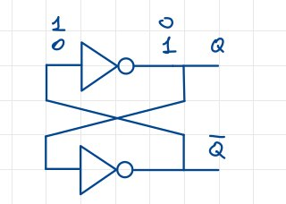
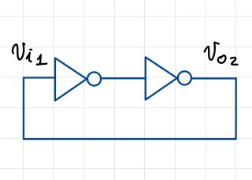
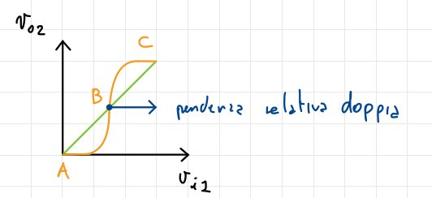
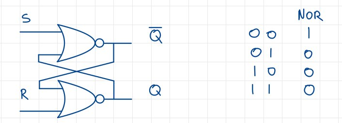
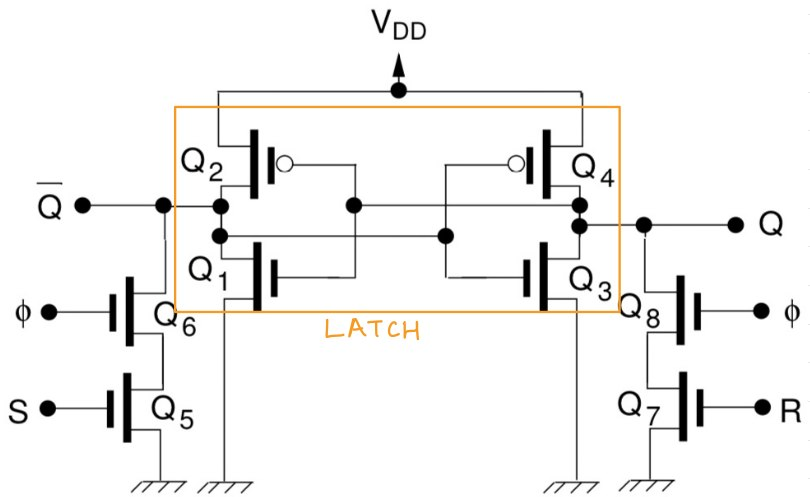
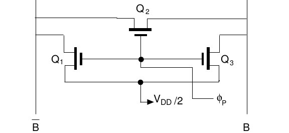

# Logica sequenziale

Un circuito sequenziale è quel circuito la cui uscita **non dipende solamente dagli ingressi**, ma anche dallo **stato interno** del circuito e, in generale, dalla storia degli stati precedenti. Questo implica la presenza di **elementi di memoria** all'interno del circuito. Esistono principalmente due tipi di *memorizzazione*, del quale disquisiremo in modo approfondito fino ad arrivare alle vere e proprie memorie.

## Elementi di memoria statica

La memoria statica viene inmplementata tramite i **circuiti bistabili**. Questi circuiti sono caratterizzati da due stati stabili, detti *stati di memoria*, che vengono mantenuti finché non viene applicato un segnale di *reset* o di *set*. Questi segnali permettono di passare da uno stato all'altro. I circuiti bistabili sono implementati tramite **latch** e **flip-flop**. Ogni circuito bistabile è quindi in grado di memorizzare **un bit** di informazione.

### Latch

Il latch è un **circuito multivibratore bistabile**, che accetta gli stati $0-1$ e $1-0$. Un possibile latch, realizzato con due inverter in reazione, è il seguente:

Per studiare gli stati interni possibili dobbiamo *rompere* la retroazione del circuito, e quindi considerare il circuito seguente:

Imponendo la condizione $V_{02} = V_{i1}$, e facendo intersecare questa retta con la caratteristica, ottenuto applicando due volte quella di un singolo inverter, otteniamo i punti di lavoro del circuito:

Essi sono 3: A e C corrispondono agli stati stabili già noti, mentre B viene considerato come uno stato **metastabile**: teoricamente può essere raggiunto avendo esattamente $V_{02} = V_{i1} = \frac{V_{DD}}{2}$, ma in pratica questo stato collasserà sempre in uno stabile. In particolare, avremmo un guadagno a cascata dell'inverter molto superiore ad 1: questo implica un'amplificazione delle perturbazioni che, con la retroazione positiva, fa evolvere il sistema verso uno degli stati stabili. Nei punti A e C il guadagno è invece inferiore ad 1, e quindi le perturbazioni vengono smorzate, mantenendo lo stato stabile. Per poter memorizzare l'informazione è però necessario agire dall'esterno, utilizzando il latch e i sistemi di controllo: l'insieme di questi dispositivi prende il nome di **flip flop**.

$$\qquad$$
$$\qquad$$
$$\qquad$$

### Flip flop S-R

Esistono diversi tipi di Flip-Flop, ma noi vedremo la tipologia **S-R**, ovvero Set-Reset. Una sua realizzazione a porte NOR, con la tabella di verità della porta NOR, è la segeunte:

#### Stati del circuito

Osservando il circuito osservando le entrate e relative uscite, ricaviamo la seguente tabella di verità:

| S | R | Q | $\overline{Q}$ |
|---|---|---|----------------|
| 0 | 0 | $Q(N-1)$ | $\overline{Q}(N_1)$ |
| 1 | 0 | 1 | 0 |
| 0 | 1 | 0 | 1 |
| 1 | 1 | 0 | 0 |

Il primo stato, ovvero $S=0$ e $R=0$, è quello di memorizzazione, mentre gli altri due sono gli stati di set e reset. L'ultimo stato, quello per cui $S=1$ e $R=1$, è invece **proibito**, in quanto non è possibile avere entrambe le uscite a 0. Questo circuito è quindi in grado di memorizzare un bit di informazione, e di modificarlo tramite i segnali di set e reset.

$$\qquad$$

#### Realizzazione fisica del circuito

Una possibile implementazione è quella vista in precedenza, con le porte NOR, ma è possibile anche utilizzare un'ulteriore versione che utilizza meno transistori:

Il cuore del circuito è rappresentato dai due inverter, composti dai MOS $Q_1$, $Q_2$, $Q_3$ e $Q_4$. Abbiamo poi collegati i MOS $Q_6$ e $Q_8$, che svolgono la funzione di **enable**, indicata con $\not0$, ed ad essi collegati in serie rispettivamente $Q_5$ e $Q_7$, che svolgono la funzione di **set** e **reset**. Il circuito è in grado di memorizzare un bit di informazione, e di modificarlo tramite i segnali di set e reset.

#### Fasi di funzionamento

La prima fase è quella di memorizzazione, in cui gli enabler sono spenti: qui i valori di S ed R sono ininfluenti, perchè essendo collegati al latch tramite gli enabler, che sono OFF, non possono influenzare il circuito.
La seconda fase è ovviamente quella in cui tutti gli enabler sono ON, per cui S ed R hanno un impatto sul funzionamento del circuito. Scriviamo due sistemi che riassumono il funzionamento del circuito:

$$
\begin{cases}
S = 0 \\
R = 1
\end{cases}
\to Q_5 \text{ on, } Q_7 \text{ off} \to v_{\overline{Q}} = 0, v_Q = V_{DD}
$$

$$
\begin{cases}
S = 1 \\
R = 0
\end{cases}
\to Q_5 \text{ off, } Q_7 \text{ on} \to v_{\overline{Q}} = V_{DD}, v_Q = 0
$$

#### Ipotesi di funzionamento

Per garantire il correttamento funzionamento del circuito sono necessarie due ipotesi:

* S ed R devono **essere attivi** per un tempo sufficientemente lungo da permettere la commutazione del latch. Nello specifico, è sufficiente che si raggiunga $\frac{V_{DD}}{2}$ poichè la reazione positiva del latch spingerà lo stesso a collassare in uno stato stabile;
* $\frac{W}{L}$ dei MOS $Q_5$, $Q_6$, $Q_7$ e $Q_8$ deve essere **adeguato**. Ad esempio, attivando $Q_2$, avrei $Q_2$, $Q_5$ e $Q_6$ in serie, per cui scorrerà in essi la stessa corrente. Devo quindi trovare un fattore $frac{W}{L}$ tale che la tensione sia pari a $\frac{V_{DD}}{2}$.

#### Flip Flop semplificato

Un'altra versione del Flip Flop S-R è quella semplificata, ottenuta dalla precedente, ha il seguente schema:

Abbiamo utilizzato dei **pass-transistor** per l'enabler, sfruttando direttamente i valori delle variabili S ed R. In questo caso, però, abbiamo l'indeterminazione anche quando S ed R sono entrambi 0.

### Flip Flop D

Questo dispositivo viene utilizzato per caricare e mantenere l'informazione in un registro.

#### Implementazione circuitale

Esistono due implementazioni: una usa il Flip Flop S-R con inverter, mentre l'altra, più efficiente, è originale e usa meno transistori. Le realizzazioni sono le seguenti:

I segnali $\phi$ e $\overline{\phi}$ sono **distinti**, e **mai contemporaneamente ad 1**. Esiste dunque un $\Delta t$, di solito minore di $\frac{1}{10}T$, in cui essi sono entrambi a 0. In questi momenti c'è una **completa trasparenza** tra D e Q, che è una condizione da evitare. Infatti con la sovrapposizione di valori tra Q e Q entriamo in uno stato *metastabile* in cui $Q_1$ e $Q_2$ sono entrambi attivi, formando due possibili percorsi tra D e Q.

#### Funzionamento

Ciò che comanda le varie fasi di funzionamento del circuito è il segnale $\phi$, per cui abbiamo due possibili casi:

* $\phi = 1 \to \overline{\phi} = 0$: interrompiamo l'anello di reazione del circuito. Il dato entra nel circuito, lo attraversa e ne esce inalterato;
* $\phi = 0 \to \overline{\phi} = 1$: si va a formare un latch che mantiene il dato in uscita.

La capacità di ingresso degli inverter è ciò che rende possibile mantenere il dato in uscita quando si verifica la sovrappositizione di valori tra $\phi$ e $\overline{\phi}$: da ciò deriva il bisogno di avere un $\Delta t$ sufficientemente piccolo.

$$\qquad$$

### Flip Flop D edge-triggered

Questo flip-flop memorizzail valore in ingresso **solo durante una specifica transizione del clock**. Può essere realizzato tramite una struttura *master-slave*, usando due FF-D in cascata, come mostrato in figura:

I segnali $\phi_1$ e $\phi_2$ sono due fasi del clock **non sovrapposte**, per le quali valgono i seguenti funzionamenti:

* $\phi_1$ scende e $\phi_2$ sale: il master memorizza il valore di D subito prima della transizione, e lo slave, che è in trasparenza, lo lo riporta in uscita;
* $\phi_1$ sale e $\phi_2$ scende: il master è in trasparenza e torna a seguire l'ingresso, mentre lo slave memorizza il dato che aveva in uscita prima della transizione.

In pratica viene *fotografato* l'ingresso al frontw di discesa di $\phi_1$, che viene mandato in uscita durante il fronte di salita di $\phi_2$, e mantenuto fino al clock successivo.

## La memoria RAM

Le **R**andom **A**ccess **M**memory sono memorie con consentono **non sequenziale** ai dati, per cui il tempo di accesso è indipendente dalla posizione del dato; sono realizzate tramite **matrici di celle di memoria**.

Le due famiglie principali sono le RAM **non volatili** e **volatili**: le prime conservano i dati anche in assenza di alimentazione, mentre le seconde li perdono. Tra le non volatili abbiamo poi le **ROM**, ovvero le **R**ead **O**nly **M**emory, che contengono dati non modificabili scritti dal produttore in fabbrica, e le **PROM**, ovvero le **P**rogrammable **R**ead **O**nly **M**emory, che possono essere programmate dall'utente. Per quanto riguarda le memorie volatili, esse si dividono in ulteriori due categorie: le **SRAM**, ovvero le **S**tatic **R**andom **A**ccess **M**emory, e le **DRAM**, ovvero le **D**ynamic **R**andom **A**ccess **M**emory. le prime necessitano di una semplice alimentazione costante, mentre le seconde hanno bisogno di un **refresh** periodico per mantenere i dati.

### Architettura delle RAM

Laa loro struttura è **bidimensionale**, ed ogni bit è caratterizzato da una sorta di *coordinata*, come mostrato in figura:

Molto spesso abbiamo $M=N$, per cui la matrice è quadrata, ed ogni cella è individuata dall'incrocio di una *word line* con una *bit line*.

Nel decodificatore vanno in input i primi $M$ bit di indirizzo, che selezionano la *word line*; il circuito $2$ si comporta come **multiplexer** in caso di **lettura** dei dati, e da **demultiplexer** in caso di scrittura, portando il dato alla *bit line* di interesse. Il circuito $3$ è invece un **amplificatore** in caso di lettura, mentre si comporta come un **driver** in caso di scrittura.

$$\qquad$$

### SRAM

La cella di memoria di una SRAM è composta da un Flip Flop SR a 6 transistor, esattamente come quello mostrato in precedenza, i cui ingressi sono collegati opportunamente alle *bit line*, diretta e complementare, alle *word line* e agli enabler. Il circuito è il seguente:

$$\qquad$$

#### Fase di scrittura di una SRAM

Ipotizziamo di voler scrivere un 1 nella cella di memoria. Le fasi sono le seguenti:

1. Prepariamo $B$ a $V_{DD}$ e $\overline{B}$ a 0, connettendole a delle sorgenti di tensione;
2. Portiamo a $1$ la *word line* di interesse, che determina la connessione tra la *bit line* e il latch interno;
3. Il Flip Flop così pilotato viene forzato nello stato corrispondente al valore che vogliamo scrivere, ovvero 1.

Per scrivere un 0, invece, si inverte la fase 1, ovvero si porta $B$ a 0 e $\overline{B}$ a $V_{DD}$. Ovviamente, sia in caso di scrittura di $1$ che di $0$, la *word line* deve essere portata a 1 per il tempo necessario ad innescare la commutazione del latch.

$$\qquad$$
$$\qquad$$

#### Fase di lettura di una SRAM

La lettura deve essere **non distruttiva**, ovvero non deve modificare il valore contenuto nella cella di memoria. Il circuito si mostra come segue:

Le fasi sono le seguenti:

1. Precarichiamo le capacità di entrambe le *bit line*, ovvero $B$ e $\overline{B}$, a $\frac{V_{DD}}{2}$. Si tratta di capacità parassite intrinseche del circuito, indicate nella figura precedente con $C_B$:
2. Portiamo a 1 la *word line* di interesse, collegando le uscite del Flip Flop a $B$ e $\overline{B}$. Essa deve rimanere ad $1$ per un tempo sufficiente a creare una differenza di tensione $\Delta V$, nell'ordine del centinaio di $mV$ tra $B$ e $\overline{B}$, in modo da discriminare il valore logico letto ed effettuare quindi una **lettura non distruttiva**.

Un caso di esempio è il seguente: supponiamo di avere $Q = 1$ e $\overline{Q} = 0$. Con $Q = 1$, dopo un certo tempo, osserviamo che $v_{BL} = \frac{V_{DD}}{2} + \Delta V$, quindi trasferisco la carica della cella di memoria sulla *bit line* $B$, facendo aumentare la tensione. Contemporaneamente, $\overline{Q} = 0$ implica $v_{\overline{BL}} = \frac{V_{DD}}{2} - \Delta V$. $\overline{BL}$ infatti è collegata a *ground*, quindi la tensione diminuisce. In questo caso la lettura ha come risultato $1$. Nel caso opposto, in cui $Q = 0$ e $\overline{Q} = 1$, avremmo $v_{BL} = \frac{V_{DD}}{2} - \Delta V$ e $v_{\overline{BL}} = \frac{V_{DD}}{2} + \Delta V$, per cui la lettura avrebbe come risultato $0$. Il *sense amplifier* legge dunque la differenza di tensione nelle due *bit line*, pari a $2\Delta V$, e la trasforma in segnale elettrico a livello logico alto o basso, a seconda della lettura, che viene poi trasferito all'uscita nel multiplexer.

### Il *sense amplifier*

Il circuito di *sense amplifier* è essenziale nella SRAM per amplificare e discriminare segnali deboli che rappresentano dati nelle celle di memoria. Svolge un ruolo cruciale nella lettura dei dati, garantendo alta velocità e tolleranza al rumore, operando in modalità differenziale tra la bit line e la sua complementare. Il circuito è il seguente:

{width=30%}

I due terminali di ingresso sono appunto collegati alla bit line diretta e la complementare. La particolarità è che il *sense amplifier* viene alimentato **solo all'occorrenza**, in quanto potrebbe creare malfunzionamenti durante la lettura, e anche per una questione di risparmio energetico: per far ciò si utilizza un NMOS per il collegamento a *ground*, e un PMOS per il collegamento a $V_{DD}$.

#### Funzionamento in lettura

Vediamo il funzionamento del sense amplifier con un esempio: supponiamo che nella cella che vogliamo leggere ci sia un valore $1$: sulla Bit line avremo una tensione di $\frac{V_{DD}}{2}+\Delta V$, mentre sulla sua complementare avremo una tensione di $\frac{V_{DD}}{2}-\Delta V$. Sfruttiamo il **punto metastabile del latch** per discriminare il valore letto: leggendo il segnale, è in grado di spostarsi in uno stato stabile proprio grazie al $\Delta V$. In questo caso abbiamo un'evoluzione verso $V_{DD}$ sulla bit line, mentre sulla complementare abbiamo un'evoluzione verso $0$. Di seguito un grafico che mostra l'evoluzione dei segnali:

{width=50%}

L'istante $W$ indica il momento nel quale viene attivata la word line, che rimane alta solo per il tempo necessario affinché la tensione sulla bit line si modifichi di $\Delta V$, mentre $\phi_S$ indica l'istante di attivazione del sense amplifier. Il segnale $\phi_S$ è generato solo quando la word line è alta, in modo da risparmiare energia. Il segnale $\phi_S$ è inoltre ritardato rispetto a $W$ per evitare che il sense amplifier venga attivato prima che la tensione sulla bit line sia cambiata di $\Delta V$.

Il circuito è in grado di discriminare il valore letto, e di amplificarlo per poterlo trasferire all'uscita. Grazie a questa operazione possiamo effettuare una rigenerazione del valore logico letto, in quanto il segnale letto è molto debole e potrebbe essere soggetto a rumore.
L'alimentazione del sense amplifier è data dal segnale $\phi_S$ e il corrispettivo negato $\overline{\phi_S}$, che vengono generati solo una volta che la word line è stata portata a 1. Questo permette di risparmiare energia, in quanto il circuito è alimentato solo quando serve.

#### Funzionamento in scrittura

Un’operazione di scrittura è più semplice, dato che consiste nel fornire il dato e il suo complemento rispettivamente sulla bit line e sulla bit line complementata, attraverso il multiplexer di uscita che opera in questo caso in senso inverso, come un
demultiplexer, dopodiché è sufficiente attivare la word line e il dato viene immagazzinato nella cella di memoria

### Circuito di pre carica

Il circuito di pre carica è un circuito ausiliario che serve per **preparare** le bit line e le word line prima di effettuare una lettura o una scrittura. Il circuito è il seguente:

È formato da tre MOS, dove $Q_1$ e $Q_3$ hanno il *gate* a comune. Il segnale di enable è $\phi_P$: quando esso viene attivato, $Q_1$ e $Q_3$ vengono portati in conduzione, applicando una tensione di $\frac{V_{DD}}{2}$ alle bit line. $Q_2$ entra anch'esso in conduzione, e viene utilizzato come elemento di *sicurezza*, nel senso che si assicura che entrambe le bit line si trovino alla stessa tensione.Finché il circuito di pre carica non viene attivato, la cella di memoria è isolata dalla bit line, e quindi non può essere letta o scritta. Dopo un certo intervallo spengo il circuito di pre carica, e attivo il circuito di *sense amplifier* con il segnale $\phi_S$. Dal punto di vista temporale, il funzionamento è il seguente:

È essenziale che il circuito di pre carica venga spento prima di attivare $\phi_S$: se così non fosse leggerei una tensione di $\frac{V_{DD}}{2}$ sulla bit line, perdendo quindi il valore logico.

### DRAM

La DRAM si basa sul concetto di **memoria dinamica**, ovvero una memoria che perde il contenuto se non viene rinfrescata periodicamente. Questo è dovuto al fatto che la cella di memoria è formata da un condensatore, che perde carica nel tempo. LA lettura è inoltre distruttiva, per cui è necessario un meccanismo di riscrittura del dato letto.

#### La cella di memoria

La cella di memoria è più semplice rispetto a quella della SRAM, ed è formata da un condensatore e da un MOS, che viene utilizzato per leggere e scrivere il valore logico. Il condensatore è poi collegato alla bit line tramite un NMOS, secondo il seguente schema:

Si noti come non sia presente la bit line complementare, assenza atta a minimizzare lo spazio occupato, che collima con la minore aria occupata dalla cella di memoria rispetto alla SRA. Infine, la bit line ha inoltre una capacità parassita, indicata con $C_B$.

#### Scrittura in DRAM

Il condensatore può essere caricato fino alla tensione $V_{DD} - V_T$ e scaricato completamente dal NMOS: supponendo di voler scrivere $1$, poniamo la bit line a $V_{DD}$ e la word line a $1$. Carico $C_S$ fino a $V_{DD} - V_T$, limite già visto nella logica pass-transistor negli NMOS. La scelta è fatta in termini di risparmio: è più accettato avere un valore logico *non pieno* piuttosto che inserire un PMOS che lo garantirebbe. La scrittura avviene per semplice carica del condensatore, per cui bisogna tenere la word line attiva per un tempo sufficiente affinché il condensatore si carichi.
Nel caso di scrittura di $0$ il concetto è simile: si porta la bit line ad una tensione nulla, e si attiva la word line: anche qui è necessario attendere un tempo sufficiente affinché il condensatore si scarichi completamente.

#### Lettura in DRAM

La lettura è concettualmente simile a quella della SRAM, con la differenza che in questo contesto la lettura è **distruttiva**, per cui è necessario riscrivere il dato letto. Il primo passo è sempre quello di pre caricare la bit line a $\frac{V_{DD}}{2}$, per poi attivare la word line. Il condensatore $C_S$ viene messo a contatto con il condensatore della bit line: avverrà un trasferimento di carica tra questi condensatore, che spiega il fatto che la lettura sia distruttiva. Si noti la differenza tra le due capacità: la $C_B$ è molto più grande, nell'ordine dei $pF$, rispetto a $C_S$, che è pari a qualche decina di $fF$. È quindi necessario riscriere il dato letto, per evitare che tale dato venga perso. 
Il valore letto viene discriminato dallo spostmento della tensione sulla bit line, dovuto dalla lettura di un valore logico nella cella. Dato che la carica totale prima e dopo il trasferimento deve essere la stessa, si ha che:

$$
C_SV_{CS} + C_b \frac{V_{DD}}{2} = (C_S + C_B) (\frac{V_{DD}}{2} + \Delta V)
$$

dove $\Delta V$ è la tensione di spostamento. Si ha quindi che:

$$
\Delta V = \frac{C_S}{C_S + C_B} (V_{CS} - \frac{V_{DD}}{2}) \approx \frac{C_S}{C_B} (V_{CS} - \frac{V_{DD}}{2})
$$

dove l'ultima approssimazione è giustificata dai diversi ordini di grandezza delle due capacità. Dato che dobbiamo considerare sia il caso di un condensatore pieno, quindi valore logico $1$, sia il caso di un condensatore scarico, quindi valore logico $0$, possiamo costruire il sistema:

$$
\begin{cases}
\Delta V(1) \approx \frac{C_S}{C_B} (V_{DD} - \frac{V_{DD}}{2})  \\
\Delta V(0) \approx \frac{C_S}{C_B} (-\frac{V_{DD}}{2})
\end{cases}
$$

#### La procedura di *rinfresco*

Essa viene effettuata ponendo la bit line a $V_{DD}$, nel caso in cui sia stato letto $1$, oppure a *potenziale di massa* nel caso in cui sia stato letto $0$. Viene quindi riattivata la word line, permettendo al condensatore di ricaricarsi al valore opportuno. Dato che viene letta una riga alla volta, la procedura di rinfresco viene effettuata per ogni riga della matrice. Visto è necessario effettuare un rinfresco ogni pochi millisecondi, durante il tempo di rinfresco, pari a circa il $2\%$ del tempo totale, non è possibile effettuare operazioni di lettura o scrittura.

#### Sense amplifier e pre carica per DRAM

I circuiti di pre carica e di sense amplifier sono del tutto analoghi a quelli visti per la SRAM, con la differenza dell'assenza della bit line complementare: per ovviare a questo fatto, si divide ciascuna bit line in due parti, e si pone il sense amplifier al centro, con gli ingressi connessi a ciascuna delle estremità *esterne* della bit line. Viene inoltre inserita una *dummy cell* a ciascuna di queste estremità esterne, come visibile in figura:

I condensatori delle dummy cell vengono caricati a $\frac{V_{DD}}{2}$: al momento dell'attivazione della word line della cella target, viene attivata la dummy cell di destra nel caso in cui la cella da leggere si trovi a sinistra nella bit line, e viceversa. In questo modo agli ingressi del sense amplifier viene presentato un segnale differenziale, che consiste nella differenza tra la tensione determinata in lettura sulla bit line e la tensione di pre carica, che è pari a $\frac{V_{DD}}{2}$: questa differenza è pari a $\Delta V$, come visto in precedenza. Il sense amplifier è quindi in grado di discriminare il valore letto, e di amplificarlo per poterlo utilizzare.

### Decoder e multiplexer

#### Decoder

Il decoder è un circuito realizzato ad hoc per la decodifica di un indirizzo, per il semplice fatto che una rete combinatoria sarebbe troppo ingombrante rispetto alla grandezza della memoria. Per capire come viene costruito questo circuito, consideriamo un esempio in cui la word line è indirizzabile con 3 bit, quindi 8 word line. Le prime tre word line possono essere indirizzate utilizzando queste tre espressioni logiche:

$$
\begin{cases}
W_0 = \overline{A_0} \cdot \overline{A_1} \cdot \overline{A_2} = \overline{A_0 +  A_1 + A_2} \\
W_1 = \overline{A_0} \cdot \overline{A_1} \cdot A_2 = \overline{\overline{A_0} + A_1 + A_2} \\
W_2 = \overline{A_0} \cdot A_1 \cdot \overline{A_2} = \overline{\overline{A_0} + \overline{A_1} + A_2}
\end{cases}
$$

L'obiettivo è quello di realizzare il circuito in forma **wired NOR**, mostrato in figura:

Il PMOS viene messo in conduzione dal segnale $\overline{\phi_P}$ del circuito di pre carica, in modo da caricare tutte le word line; successivamente tutte, meno quella di interesse, verranno scaricate, evitando significative dissipazioni di potenza.

#### Multiplexer

Il circuito utilizzato è analogo a quello già visto: esso piloterà i **transistori di passo**, che mettono in connessione il terminale di I/O con la bit line prescelta. Il circuito è mostrato in figura:

