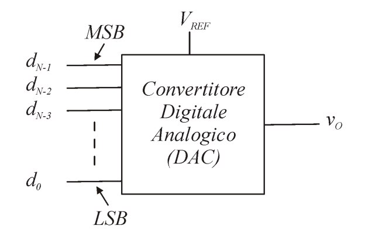
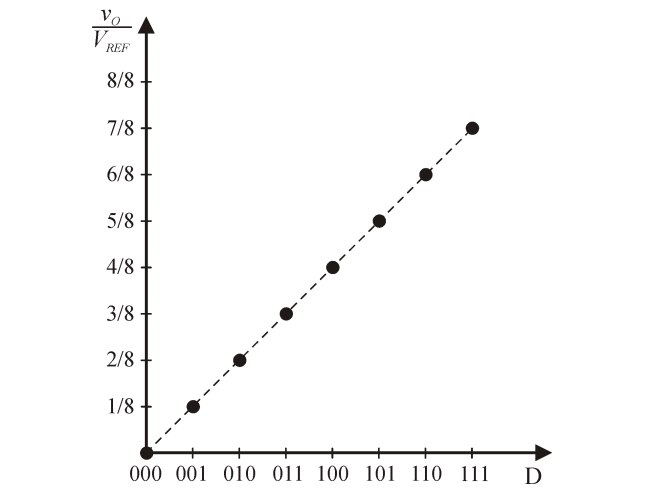
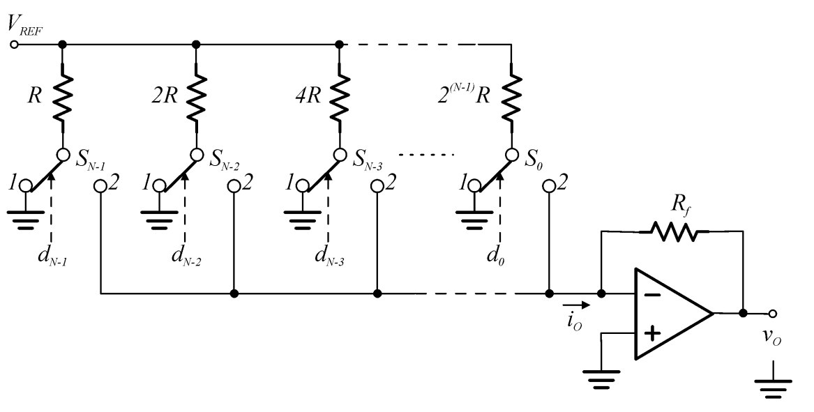
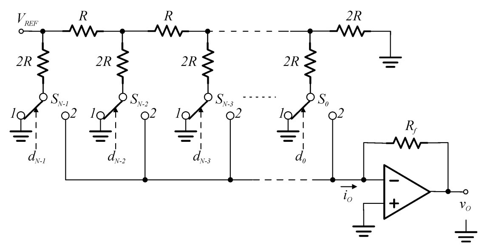
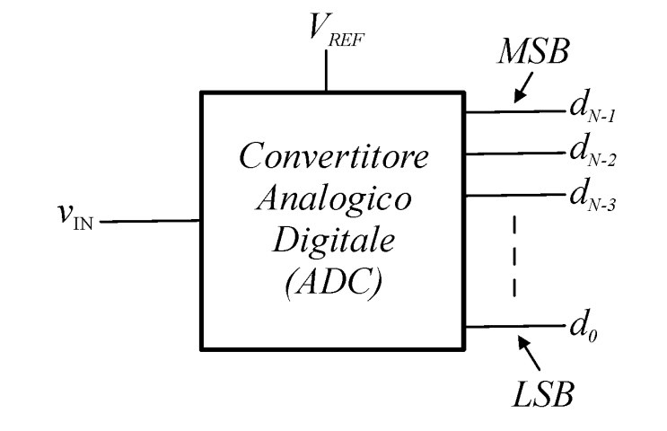
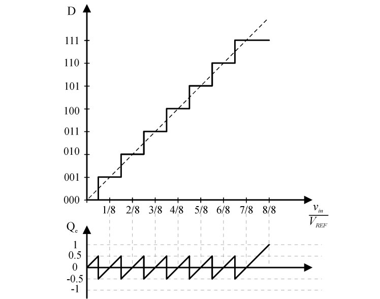
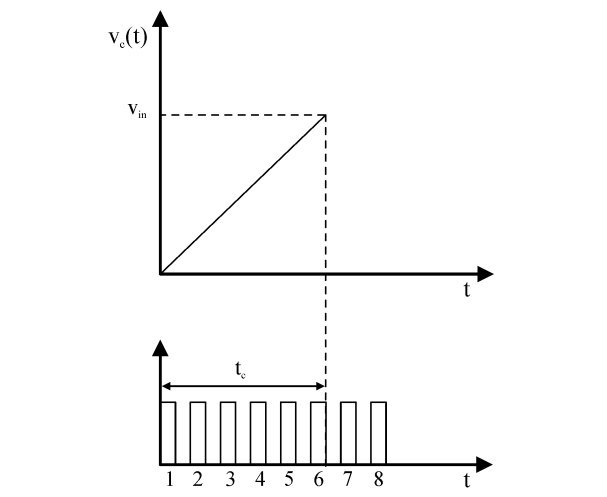
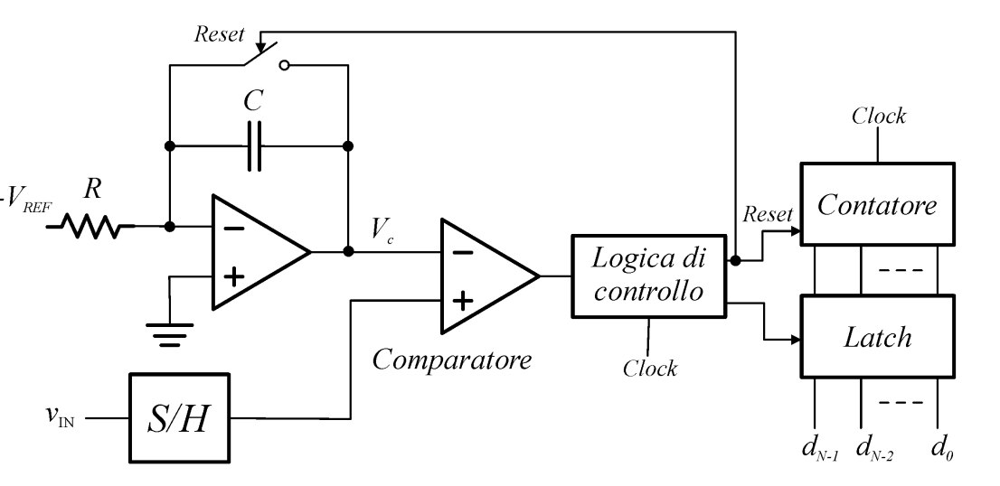
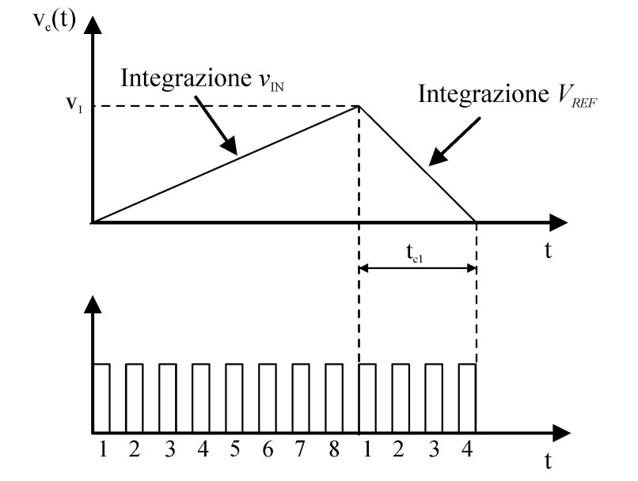

# falla dagli appunti di piotto

avevo iniziato a scrivere questo

## Convertitore Digitale-Analogico

Dal punto di vista funzionale, un convertitore DA, o un DAC, a N bit è un circuito che, dato un numero binario di N bit, genera in uscita una tensione analogica proporzionale al numero stesso.  Tipicamente, la tensione analogica in uscita è una tensione $v_o$ frazione della tensione di riferimento $V_{ref}$, e vale, in generale $v_o = F\cdot V_{ref}$, dove $F$ è una funzione del numero binario in ingresso. In particolare, varrà:

$$F = \frac{D}{2^N} = \frac{d_{N-1}2^{N-1} + d_{N-2}2^{N-2} + \dots + d_0 2^0}{2^N}$$

dove $N$ è la *parola* composta dai bit $d_{N-1}, d_{N-2}, \dots, d_0$.

Dal punto di vista funzionale, un DAC è così rappresentabile:

{width=50%}

### Caratteristica di trasferimento

Prendiamo come esempio un DAC a 3 bit, e disegnamo la sua caratteristica di trasferimento:

{width=50%}

Sull'asse delle ascisse sono riportate le $2^N$ combinazioni possibile della parola, mentre sulle ordinate i possibili $2^N$ valori che la tensione in uscita può assumere in uscita. Notiamo come la caratteristica di un convertitore DA sia un insieme di punti discreti, e non una funzione continua. Questo perchè essendo l'insieme di ingressi è **discretizzato**, anche l'uscita è **discretizzata**. Inoltre, notiamo come la caratteristica sia una funzione lineare, e questo è dovuto al fatto che la funzione $F$ è una funzione lineare.

### Convertitore DA con resistori a pesi biari

Un primo circuito per realizzare un convertitore DA è il seguente:

{width=50%}

La tensione $V_{ref}$ viene collegata a N resistenze, i cui valori dipendono dalla loro posizione, e sono $R, 2R, 4R, \dots, 2^{N-1}R$. Ciascuna resistenza è collegata ad un deviatore, la cui posizione è determinata dal bit in ingresso: se $d_i = 1$, il deviatore è collegato a ground, posizione 1, altrimenti è in posizione 2. In quest'ultimo caso il collegamento è unito a tutti gli altri, per poi andare in ingresso ad un amplificatore operazionale retroazionato tramite $R_f$, e con il terminale non invertente collegato a ground; potendo utilizzare il corto circuito virtuale, si ha che il terminale invertente può essere considerato a *ground virtuale*; ne consegue che ogni deviatore è collegato a *ground* o a *ground virtuale*. Calcoliamo la corrente $i_0$ che, secondo Kircchoff, è uguale alla somma delle correnti che passano per le resistenze:

$$i_o = \frac{V_{ref}}{R}d_0 + \frac{V_{ref}}{2R}d_1 + \frac{V_{ref}}{4R}d_2 + \dots + \frac{V_{ref}}{2^{N-1}R}d_{N-1} = \frac{V_{ref}}{2^{N-1}R}D$$

Per cui la tensione di uscita sarà data da:

$$v_o = -R_f\cdot i_0 = -\frac{R_fV_{ref}}{2^{N-1}R}D$$

L'accuratezza del convertiore dipende direttamente dall'accuratezza di $V_{ref}$, dalla precisione dei resistori e dall'idealità dei deviatori. Uno svantaggio di questo circuito è che, per aumentare la risoluzione, bisogna aumentare il numero di bit, e quindi il numero di resistenze e deviatori, con un conseguente aumento di costo, perchè le resistenze seguono un andamento esponenziale.

### Circuito con rete a scala R-2R

Un secondo circuito per realizzare un convertitore DA è il seguente:

{width=50%}

In questo caso abbiamo delle resistenze $R$ e $2R$ che sono collegate in modo particolare: nel ramo collegato al deviatore, abbiamo una resistenza $2R$ uguale per tutti i rami, e una $R$ collegata come in figura, anche qui uguale per tutte le sezioni. Una proprietà importante del circuito è che utilizzando questa disposizione, la resistenza vista alla destra di $R$ è sempre $R$: chiamiamo la resistenza vista $R_v$, e giustifichiamo questa proprietà. Alla prima resistenza abbiamo $R' = 2R || 2R = R$, mentre alla seconda avremo $R'' = 2R || (R+R') = R$ e così via. Passiamo adesso alla corrente: chiamiamo $I_{ref}$ la corrente erogata dal generatore di riferimento. Essa vede un raamo verticale di valore $2R$, ed un ramo orizzontale anch'esso di valore $2R$, per cui nei due rami passerà la stessa corrente, che varrà la metà di quella erogata. Questo ragionamento si può applicare anche per tutti gli altri ramificazioni, per cui sarà ulteriormente divisa a metà fino all'ultimo ramo.

Vista la corrente che scorre in ogni ramo, posso ora calcolare $i_o = \frac{V_{ref}}{2^NR}D$, dal quale ricavo la tensione di uscita:

$$v_o = -R_f\cdot i_0 = -\frac{R_fV_{ref}}{2^NR}D$$

Anche in questo caso, l’accuratezza del convertitore dipende in maniera critica dall’accuratezza di $V_{ref}$, dalla precisione dei resistori e dall’idealità degli interruttori.

## Convertitore A/D

Un convertitore A/D, detto anche ADC, a N bit è, dal punto di vista funzionale, un dispositivo che accetta in ingresso i campioni di un segnale analogico e restituisce in uscita una parola digitale di N bit che rappresenta il valore del campione. La visaa funzionale è la seguente:

{width=50%}

A differenza del DAC, l'ADC ha in ingresso un segnale continuo che dovrà essere **quantizzato** in un numero finito di valori digitali. Questa conversione introduce l'**errore di quantizzazione**, dovuto proprio al fatto che sto quantizzando un segnale continuo in un numero finito di valori. La caratteristica di trasferimento di un ADC è la seguente:

{width=50%}

dalla quale riusciamo ad apprezzare la differenza di uscita quantizzata dell'ADC e quella continua in uscita dal DAC.
L'errore di quantizzazione è definito come la differenza tra il valoe attuale dell'ingresso e il valore di uscita dell'ADC, e può essere espresso come:

$$Q_e = v_{in} - D\frac{V_{ref}}{2^N} = v_{in} - DV_{LSB}$$

dove $V_{LSB}$ è il valore del bit meno significativo, e rappresenta la risoluzione del convertitore. L
Molto spesso si preferisce avere l'errore di quantizzazione centrato in zero, così da avere una variazione complessiva di $|\frac{1}{2}LSB|$. Dal punto di vista grafico, l'errore di quantizzazione è rappresentato come segue:

{width=50%}

Notiamo però come l'ultimo gradino dia un errore fino a $V_{LSB}$, che può essere evitato imponendo una tensione massima in ingresso pari a $\frac{15}{16}V_{ref}$

### Convertitore ADC a singola rampa

Il convertitore a singola rampa appartiene, assieme a quello a doppia rampa che vedremo in seguito, alla categoria dei convertitori ad integrazione, la cui conversione avviene misurando con un contatore il tempo necessario per un'operazione di integrazione. La conversione in questo caso è una misura temporale, misuro cioè un intervallo di tempo espresso in multipli di cicli di clock. Questo intervallo deve essere ovviamente correlato alla tensione che voglio convertire: più è alta la tensione in ingressi, più alto deve essere il conteggio dell'intervallo del tempo in uscita. Viene scelta una tensione di riferimento $V_{ref}$ che viene integrata, con un circuito integratore, in un tempo costante di una rampa, e proseguo con l'integrazione fino a quanto la tensione in uscita non risulta uguale a quella in ingresso. Il diagramma temporale del funzionamento è il seguente:

{width=50%}

In questo modo, la conversione avviene contando quanti impulsi di clock mi occorrono per arrivare fino a $V_{in}$, ed appare evidente come sia necessario più tempo per convertire tensioni più alte. 

Lo schema a blocchi di un convertitore ADC a singola rampa è il seguente:

{width=50%}

Il tempo di conversione $t_c$ è proporzionale alla tensione $v_{in}$, per cui il segnale in uscita dall'integratore al termine del conteggio sarà:

$$V_C = -\frac{1}{RC} \int_0^{t_c} -V_{ref} (\tau)d\tau = \frac{V_{ref}}{RC}t_c = v_{in} $$

dal quale si ricava che

$$t_c = \frac{v_{in}}{V_{ref}}RC$$

Se il numero di impulsi conteggiati è pari a $D$, ovvero che $t_c = D T_{clk}$, allora

$$D = \frac{v_{in}}{V_{ref}}\frac{RC}{T_{clk}}$$

dove $T_{clk}$ è il periodo di clock. $D$ è però proporzionale anche a $R$, $C$ e al periodo di clock: se anche solo uno di questi parametri non è perfettamente calibrato, allora la conversione non sarà precisa.

### Convertitore ADC a doppia rampa

Questo nuovo convertitore risolve i problemi del precedente, introducendo una seconda rampa di integrazione. Vengono quindi fatte due integrazioni: una prima in fase di ingresso per un tempo noto, corrispondente a $2^NT_{clk}$, mentre la seconda viene fatta su uan tensione nota $V_{ref}$ nota, di segno opposto, fino ad avere un risultato pari a 0. Il diagramma temporale del funzionamento è il seguente:

{width=50%}

La misura della seconda fase è il risultato della conversione, che è ovviamente proporzionale alla tensione in ingresso. Lo schema a blocchi è il seguente:

{width=50%}
